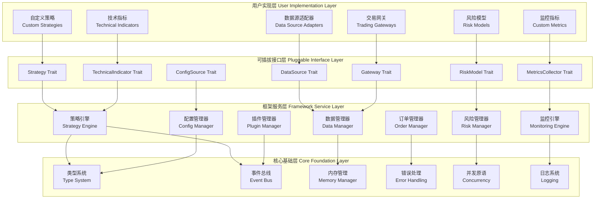
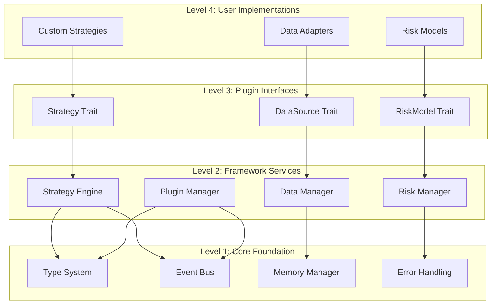

# MosesQuant 整体架构概览

> **文档版本**: v2.0  
> **更新日期**: 2025-07-18  
> **架构理念**: 四层分离，精准可插拔，零成本抽象

## 1. 架构总览

### 1.1 四层架构模型



### 1.2 层次职责定义

| 层次 | 职责 | 可插拔程度 | 设计原则 |
|-----|------|-----------|---------|
| **用户实现层** | 具体业务逻辑实现 | ✅ 完全可插拔 | 最大灵活性，用户完全控制 |
| **可插拔接口层** | 标准化插件接口 | ⚠️ 接口稳定，实现可插拔 | 接口向后兼容，实现自由创新 |
| **框架服务层** | 核心业务服务 | ❌ 相对固定，集成多插件 | 稳定可靠，高度优化 |
| **核心基础层** | 系统基础设施 | ❌ 绝对固定 | 零成本抽象，性能优先 |

## 2. 设计原则和理念

### 2.1 核心设计原则

#### 原则1：选择性可插拔
```rust
// ✅ 应该可插拔：业务差异化需求大
#[async_trait]
pub trait Strategy: Plugin {
    async fn on_data(&mut self, context: &StrategyContext, data: &MarketData) -> Result<Vec<Order>>;
}

// ❌ 不应该可插拔：系统基础，性能关键
pub type Price = rust_decimal::Decimal;  // 统一的价格类型
pub type Quantity = rust_decimal::Decimal;  // 统一的数量类型
```

#### 原则2：零成本抽象
```rust
// 编译时多态，运行时零开销
impl<S: Strategy> StrategyEngine<S> {
    #[inline(always)]
    pub async fn execute(&self, data: &MarketData) -> Result<Vec<Order>> {
        // 编译时确定具体类型，完全内联
        self.strategy.on_data(&self.context, data).await
    }
}
```

#### 原则3：类型安全保障
```rust
// 编译时检查插件兼容性
pub struct PluginRegistry {
    strategies: HashMap<PluginId, Box<dyn Strategy>>,
    data_sources: HashMap<PluginId, Box<dyn DataSource>>,
    // 类型系统确保只能注册正确类型的插件
}
```

#### 原则4：优雅降级
```rust
// 插件失败不影响系统稳定性
impl StrategyEngine {
    async fn execute_with_fallback(&self, data: &MarketData) -> Result<Vec<Order>> {
        match self.strategy.on_data(&self.context, data).await {
            Ok(orders) => Ok(orders),
            Err(e) => {
                warn!("Strategy execution failed: {}, using fallback", e);
                self.fallback_strategy.on_data(&self.context, data).await
            }
        }
    }
}
```

### 2.2 架构质量属性

| 质量属性 | 目标 | 实现方式 | 度量标准 |
|---------|------|---------|---------|
| **性能** | 微秒级延迟 | 零成本抽象 + SIMD | 订单处理 < 10μs |
| **可靠性** | 99.99% 可用性 | 错误隔离 + 故障恢复 | MTBF > 8760h |
| **可扩展性** | 水平扩展 | 无状态设计 + 异步架构 | 支持1000+并发策略 |
| **可维护性** | 模块化 | 清晰分层 + 接口标准化 | 代码耦合度 < 0.3 |
| **安全性** | 内存安全 | Rust类型系统 + 插件隔离 | 零内存泄漏 |

## 3. 核心组件设计

### 3.1 插件系统核心

```rust
/// 统一的插件基础接口
#[async_trait]
pub trait Plugin: Send + Sync {
    // 元信息
    fn metadata(&self) -> &PluginMetadata;
    fn plugin_id(&self) -> &PluginId { &self.metadata().id }
    
    // 生命周期
    async fn initialize(&mut self, context: &PluginContext) -> Result<()>;
    async fn start(&mut self, context: &PluginContext) -> Result<()>;
    async fn stop(&mut self, context: &PluginContext) -> Result<()>;
    async fn destroy(&mut self, context: &PluginContext) -> Result<()>;
    
    // 健康检查
    async fn health_check(&self) -> PluginHealth;
    fn get_statistics(&self) -> PluginStatistics;
}

/// 插件元信息
#[derive(Debug, Clone)]
pub struct PluginMetadata {
    pub id: PluginId,
    pub name: String,
    pub version: semver::Version,
    pub plugin_type: PluginType,
    pub dependencies: Vec<PluginDependency>,
    pub api_version: u32,
    pub performance_profile: PerformanceProfile,
}

/// 插件上下文 - 框架服务的访问接口
pub struct PluginContext {
    pub plugin_id: PluginId,
    pub event_bus: Arc<EventBus>,
    pub config_manager: Arc<ConfigManager>,
    pub metrics_collector: Arc<MetricsCollector>,
    pub dependency_container: Arc<DependencyContainer>,
}
```

### 3.2 事件驱动架构

```rust
/// 高性能事件总线
pub struct EventBus {
    // 多优先级队列
    event_queues: [Arc<AsyncQueue<BoxedEvent>>; 4],  // Critical, High, Normal, Low
    
    // 类型安全的订阅者管理
    subscribers: Arc<RwLock<HashMap<TypeId, Vec<BoxedEventHandler>>>>,
    
    // 性能监控
    stats: Arc<RwLock<EventBusStatistics>>,
}

impl EventBus {
    /// 发布事件 - 零拷贝优化
    pub async fn publish<T: Event + 'static>(&self, event: T) -> Result<()> {
        let priority = event.priority();
        let queue_index = match priority {
            EventPriority::Critical => 0,
            EventPriority::High => 1,
            EventPriority::Normal => 2,
            EventPriority::Low => 3,
        };
        
        self.event_queues[queue_index].push(Box::new(event)).await?;
        self.stats.write().await.events_published += 1;
        Ok(())
    }
    
    /// 订阅事件 - 编译时类型安全
    pub async fn subscribe<T: Event + 'static>(
        &self,
        handler: Box<dyn TypedEventHandler<T>>
    ) -> Result<SubscriptionHandle> {
        let type_id = TypeId::of::<T>();
        let wrapped_handler = Box::new(EventHandlerWrapper { handler });
        
        self.subscribers.write().await
            .entry(type_id)
            .or_insert_with(Vec::new)
            .push(wrapped_handler);
        
        Ok(SubscriptionHandle::new(type_id))
    }
}
```

### 3.3 内存管理优化

```rust
/// 高性能内存管理器
pub struct MemoryManager {
    // 对象池 - 减少内存分配
    order_pool: Arc<ObjectPool<Order>>,
    bar_pool: Arc<ObjectPool<Bar>>,
    position_pool: Arc<ObjectPool<Position>>,
    
    // 内存统计
    memory_stats: Arc<RwLock<MemoryStatistics>>,
    
    // 垃圾回收触发器
    gc_trigger: Arc<GCTrigger>,
}

/// 高效对象池实现
pub struct ObjectPool<T> {
    pool: Arc<Mutex<Vec<T>>>,
    factory: fn() -> T,
    max_size: usize,
    current_size: AtomicUsize,
}

impl<T> ObjectPool<T> {
    /// 获取对象 - 复用已有对象
    pub fn acquire(&self) -> PooledObject<T> {
        let mut pool = self.pool.lock().unwrap();
        
        let object = if let Some(obj) = pool.pop() {
            // 复用对象
            obj
        } else {
            // 创建新对象
            (self.factory)()
        };
        
        PooledObject::new(object, Arc::clone(&self.pool))
    }
}

/// 自动归还的池化对象
pub struct PooledObject<T> {
    object: Option<T>,
    pool: Arc<Mutex<Vec<T>>>,
}

impl<T> Drop for PooledObject<T> {
    fn drop(&mut self) {
        if let Some(obj) = self.object.take() {
            let mut pool = self.pool.lock().unwrap();
            pool.push(obj);  // 自动归还到池中
        }
    }
}
```

## 4. 性能优化策略

### 4.1 编译时优化

```rust
/// 编译时插件特化
#[inline(always)]
pub fn execute_specialized_strategy<S: Strategy + 'static>(
    engine: &StrategyEngine<S>,
    data: &MarketData
) -> Result<Vec<Order>> {
    // 编译器会为每个具体策略类型生成特化版本
    // 消除虚函数调用开销
    engine.strategy.on_data(&engine.context, data)
}

/// 常量传播优化
const SIMD_ALIGNMENT: usize = 32;
const MAX_ORDERS_PER_BATCH: usize = 1000;

#[repr(align(32))]  // SIMD对齐
pub struct AlignedPriceArray {
    prices: [f64; MAX_ORDERS_PER_BATCH],
}
```

### 4.2 运行时优化

```rust
/// SIMD加速的批量计算
pub fn calculate_moving_average_simd(prices: &[f64], window: usize) -> Vec<f64> {
    use std::arch::x86_64::*;
    
    let mut result = Vec::with_capacity(prices.len());
    
    // 使用AVX指令集进行并行计算
    unsafe {
        for chunk in prices.windows(window).step_by(4) {
            let sum = _mm256_loadu_pd(chunk.as_ptr());
            let avg = _mm256_div_pd(sum, _mm256_set1_pd(window as f64));
            
            let mut output = [0.0; 4];
            _mm256_storeu_pd(output.as_mut_ptr(), avg);
            result.extend_from_slice(&output);
        }
    }
    
    result
}

/// 无锁数据结构
pub struct LockFreeQueue<T> {
    head: AtomicPtr<Node<T>>,
    tail: AtomicPtr<Node<T>>,
}

impl<T> LockFreeQueue<T> {
    pub fn push(&self, value: T) {
        // 使用CAS操作实现无锁推入
        let new_node = Box::into_raw(Box::new(Node::new(value)));
        
        loop {
            let tail = self.tail.load(Ordering::Acquire);
            let next = unsafe { (*tail).next.load(Ordering::Acquire) };
            
            if next.is_null() {
                if unsafe { (*tail).next.compare_exchange_weak(
                    next, new_node, Ordering::Release, Ordering::Relaxed
                ).is_ok() } {
                    break;
                }
            } else {
                let _ = self.tail.compare_exchange_weak(
                    tail, next, Ordering::Release, Ordering::Relaxed
                );
            }
        }
    }
}
```

## 5. 模块依赖关系

### 5.1 依赖层次图



### 5.2 模块间通信

| 通信方式 | 适用场景 | 性能特征 | 类型安全 |
|---------|---------|---------|---------|
| **直接调用** | 同步操作，性能关键 | 最高 | ✅ 编译时 |
| **事件发布订阅** | 异步通知，解耦 | 高 | ✅ 编译时 |
| **消息传递** | 跨时间协调 | 中等 | ⚠️ 运行时 |
| **共享状态** | 频繁读取 | 读优化 | ✅ 编译时 |

## 6. 错误处理策略

### 6.1 分层错误处理

```rust
/// 统一错误类型
#[derive(Debug, thiserror::Error)]
pub enum MosesQuantError {
    #[error("Plugin error: {0}")]
    Plugin(#[from] PluginError),
    
    #[error("Strategy error: {0}")]
    Strategy(#[from] StrategyError),
    
    #[error("Data error: {0}")]
    Data(#[from] DataError),
    
    #[error("System error: {0}")]
    System(#[from] SystemError),
}

/// 错误恢复策略
pub enum ErrorRecoveryStrategy {
    Retry { max_attempts: u32, backoff: Duration },
    Fallback { fallback_action: Box<dyn FnOnce() -> Result<()>> },
    Isolate { isolate_plugin: PluginId },
    Shutdown { graceful: bool },
}

/// 错误处理器
#[async_trait]
pub trait ErrorHandler: Send + Sync {
    async fn handle_error(&self, error: &MosesQuantError) -> ErrorRecoveryStrategy;
    async fn report_error(&self, error: &MosesQuantError, context: &ErrorContext);
}
```

### 6.2 故障隔离机制

```rust
/// 插件沙箱
pub struct PluginSandbox {
    plugin_id: PluginId,
    memory_limit: usize,
    cpu_time_limit: Duration,
    network_access: NetworkAccess,
    file_system_access: FileSystemAccess,
}

impl PluginSandbox {
    /// 在受限环境中执行插件
    pub async fn execute_plugin<T>(&self, plugin: &dyn Plugin, operation: T) -> Result<T::Output>
    where
        T: PluginOperation,
    {
        // 设置资源限制
        self.set_memory_limit().await?;
        self.set_cpu_limit().await?;
        
        // 执行操作并监控
        let result = tokio::time::timeout(
            self.cpu_time_limit,
            operation.execute(plugin)
        ).await;
        
        // 清理资源
        self.cleanup_resources().await?;
        
        result?
    }
}
```

## 7. 测试和验证策略

### 7.1 测试金字塔

```
     ┌─────────────────┐
     │   E2E Tests     │  ← 端到端测试
     │   (Performance) │
     └─────────────────┘
          ┌─────────────────────┐
          │  Integration Tests  │  ← 集成测试
          │  (Plugin System)    │
          └─────────────────────┘
               ┌─────────────────────────┐
               │     Unit Tests          │  ← 单元测试
               │  (Individual Modules)   │
               └─────────────────────────┘
```

### 7.2 性能基准测试

```rust
/// 性能基准测试
#[cfg(test)]
mod benchmarks {
    use criterion::{criterion_group, criterion_main, Criterion};
    
    fn benchmark_strategy_execution(c: &mut Criterion) {
        let mut group = c.benchmark_group("strategy_execution");
        
        group.bench_function("simple_ma_cross", |b| {
            let strategy = SimpleMovingAverageCross::new(10, 20);
            let data = generate_test_data(1000);
            
            b.iter(|| {
                strategy.on_data(&context, &data)
            });
        });
        
        group.finish();
    }
    
    criterion_group!(benches, benchmark_strategy_execution);
    criterion_main!(benches);
}
```

## 8. 总结

MosesQuant的整体架构通过四层分离和精准可插拔设计，实现了以下核心优势：

1. **高性能**: 基于Rust零成本抽象，性能接近手写C++代码
2. **高可靠**: 类型安全、内存安全、故障隔离，确保系统稳定性
3. **高扩展**: 在正确的地方提供可插拔能力，支持用户定制需求
4. **易维护**: 清晰的分层架构和模块化设计，降低维护成本

这种架构设计为量化交易系统提供了一个坚实的基础，既满足了高频交易对性能的苛刻要求，又为不同用户的定制需求提供了充分的灵活性。