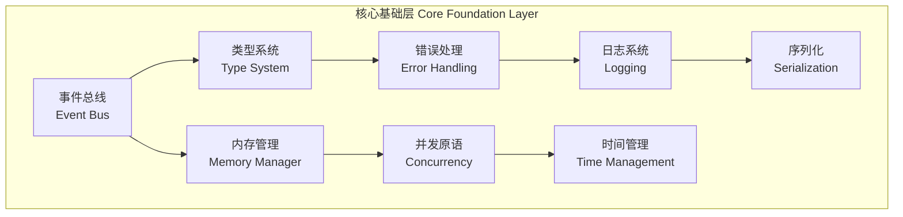

# 核心基础层设计

> **文档版本**: v2.0  
> **更新日期**: 2025-07-18  
> **设计理念**: 绝对稳定，零成本抽象，性能优先

## 1. 核心基础层概述

### 1.1 设计原则

核心基础层是整个MosesQuant框架的基石，必须满足以下原则：

1. **绝对稳定** - 一旦确定，基本不会变更
2. **零成本抽象** - 编译时优化，运行时无额外开销
3. **类型安全** - 编译时检查，防止运行时错误
4. **高性能** - 针对量化交易场景的性能优化
5. **内存安全** - 基于Rust的内存管理，无内存泄漏

### 1.2 组件构成



## 2. 类型系统设计

### 2.1 核心数据类型

```rust
// src/types/mod.rs

use rust_decimal::Decimal;
use serde::{Deserialize, Serialize};
use std::fmt::{self, Display};

/// 统一的价格类型 - 使用高精度Decimal避免浮点误差
pub type Price = Decimal;

/// 统一的数量类型
pub type Quantity = Decimal;

/// 纳秒时间戳 - 支持高精度时间
pub type TimestampNs = i64;

/// 符号标识符
#[derive(Debug, Clone, PartialEq, Eq, Hash, Serialize, Deserialize)]
pub struct Symbol {
    pub code: String,           // 代码，如 "BTCUSDT"
    pub exchange: String,       // 交易所，如 "binance"
    pub asset_type: AssetType,  // 资产类型
}

impl Symbol {
    pub fn new(code: &str, exchange: &str, asset_type: AssetType) -> Self {
        Self {
            code: code.to_uppercase(),
            exchange: exchange.to_lowercase(),
            asset_type,
        }
    }
    
    /// 生成唯一标识符
    pub fn unique_id(&self) -> String {
        format!("{}:{}:{:?}", self.exchange, self.code, self.asset_type)
    }
}

impl Display for Symbol {
    fn fmt(&self, f: &mut fmt::Formatter<'_>) -> fmt::Result {
        write!(f, "{}", self.unique_id())
    }
}

/// 资产类型枚举
#[derive(Debug, Clone, PartialEq, Eq, Hash, Serialize, Deserialize)]
pub enum AssetType {
    Spot,           // 现货
    Future,         // 期货
    Option,         // 期权
    Swap,           // 掉期
    Bond,           // 债券
    Index,          // 指数
    Commodity,      // 大宗商品
    Crypto,         // 加密货币
    Forex,          // 外汇
}

/// 方向枚举
#[derive(Debug, Clone, Copy, PartialEq, Eq, Hash, Serialize, Deserialize)]
pub enum Direction {
    Buy,
    Sell,
}

impl Direction {
    pub fn opposite(self) -> Self {
        match self {
            Direction::Buy => Direction::Sell,
            Direction::Sell => Direction::Buy,
        }
    }
    
    pub fn sign(self) -> i8 {
        match self {
            Direction::Buy => 1,
            Direction::Sell => -1,
        }
    }
}

/// 订单类型
#[derive(Debug, Clone, PartialEq, Eq, Hash, Serialize, Deserialize)]
pub enum OrderType {
    Market,                     // 市价单
    Limit,                      // 限价单
    Stop,                       // 止损单
    StopLimit,                  // 止损限价单
    TrailingStop,               // 跟踪止损
    FillOrKill,                 // 全部成交或撤销
    ImmediateOrCancel,          // 立即成交或撤销
}

/// 订单状态
#[derive(Debug, Clone, Copy, PartialEq, Eq, Hash, Serialize, Deserialize)]
pub enum OrderStatus {
    Pending,        // 等待中
    Submitted,      // 已提交
    PartiallyFilled,// 部分成交
    Filled,         // 完全成交
    Cancelled,      // 已撤销
    Rejected,       // 已拒绝
    Expired,        // 已过期
}

/// 唯一标识符类型
pub type OrderId = String;
pub type TradeId = String;
pub type PluginId = String;
pub type StrategyId = String;
pub type PositionId = String;
```

### 2.2 市场数据结构

```rust
// src/types/market_data.rs

use super::*;

/// K线数据 (OHLCV)
#[derive(Debug, Clone, PartialEq, Serialize, Deserialize)]
#[repr(C, align(32))]  // SIMD对齐优化
pub struct Bar {
    pub symbol: Symbol,
    pub timestamp: TimestampNs,
    pub timeframe: TimeFrame,
    pub open: Price,
    pub high: Price,
    pub low: Price,
    pub close: Price,
    pub volume: Quantity,
    pub turnover: Option<Price>,    // 成交额
    pub open_interest: Option<Quantity>, // 持仓量
}

impl Bar {
    /// 计算典型价格 (HLC/3)
    #[inline]
    pub fn typical_price(&self) -> Price {
        (self.high + self.low + self.close) / Decimal::from(3)
    }
    
    /// 计算加权价格 (HLCC/4)
    #[inline]
    pub fn weighted_price(&self) -> Price {
        (self.high + self.low + self.close * Decimal::from(2)) / Decimal::from(4)
    }
    
    /// 是否为看涨K线
    #[inline]
    pub fn is_bullish(&self) -> bool {
        self.close > self.open
    }
    
    /// 是否为看跌K线
    #[inline]
    pub fn is_bearish(&self) -> bool {
        self.close < self.open
    }
    
    /// 计算实体大小
    #[inline]
    pub fn body_size(&self) -> Price {
        (self.close - self.open).abs()
    }
    
    /// 计算上影线长度
    #[inline]
    pub fn upper_shadow(&self) -> Price {
        self.high - self.open.max(self.close)
    }
    
    /// 计算下影线长度
    #[inline]
    pub fn lower_shadow(&self) -> Price {
        self.open.min(self.close) - self.low
    }
}

/// 时间周期
#[derive(Debug, Clone, Copy, PartialEq, Eq, Hash, Serialize, Deserialize)]
pub enum TimeFrame {
    Tick,       // 逐笔
    Second1,    // 1秒
    Second5,    // 5秒
    Second15,   // 15秒
    Second30,   // 30秒
    Minute1,    // 1分钟
    Minute5,    // 5分钟
    Minute15,   // 15分钟
    Minute30,   // 30分钟
    Hour1,      // 1小时
    Hour4,      // 4小时
    Hour12,     // 12小时
    Day1,       // 1天
    Week1,      // 1周
    Month1,     // 1月
}

impl TimeFrame {
    /// 获取时间周期的秒数
    pub fn to_seconds(self) -> Option<i64> {
        match self {
            TimeFrame::Tick => None,
            TimeFrame::Second1 => Some(1),
            TimeFrame::Second5 => Some(5),
            TimeFrame::Second15 => Some(15),
            TimeFrame::Second30 => Some(30),
            TimeFrame::Minute1 => Some(60),
            TimeFrame::Minute5 => Some(300),
            TimeFrame::Minute15 => Some(900),
            TimeFrame::Minute30 => Some(1800),
            TimeFrame::Hour1 => Some(3600),
            TimeFrame::Hour4 => Some(14400),
            TimeFrame::Hour12 => Some(43200),
            TimeFrame::Day1 => Some(86400),
            TimeFrame::Week1 => Some(604800),
            TimeFrame::Month1 => Some(2592000), // 30天近似
        }
    }
}

/// Tick数据
#[derive(Debug, Clone, PartialEq, Serialize, Deserialize)]
pub struct Tick {
    pub symbol: Symbol,
    pub timestamp: TimestampNs,
    pub bid_price: Price,
    pub ask_price: Price,
    pub bid_size: Quantity,
    pub ask_size: Quantity,
    pub last_price: Option<Price>,
    pub last_size: Option<Quantity>,
}

impl Tick {
    /// 计算买卖价差
    #[inline]
    pub fn spread(&self) -> Price {
        self.ask_price - self.bid_price
    }
    
    /// 计算中间价
    #[inline]
    pub fn mid_price(&self) -> Price {
        (self.bid_price + self.ask_price) / Decimal::from(2)
    }
    
    /// 计算买卖不平衡度
    #[inline]
    pub fn imbalance(&self) -> Decimal {
        if self.bid_size + self.ask_size == Decimal::ZERO {
            Decimal::ZERO
        } else {
            (self.bid_size - self.ask_size) / (self.bid_size + self.ask_size)
        }
    }
}

/// 深度数据
#[derive(Debug, Clone, PartialEq, Serialize, Deserialize)]
pub struct OrderBook {
    pub symbol: Symbol,
    pub timestamp: TimestampNs,
    pub bids: Vec<PriceLevel>,  // 买盘，按价格降序
    pub asks: Vec<PriceLevel>,  // 卖盘，按价格升序
}

#[derive(Debug, Clone, PartialEq, Serialize, Deserialize)]
pub struct PriceLevel {
    pub price: Price,
    pub size: Quantity,
}

impl OrderBook {
    /// 获取最佳买价
    pub fn best_bid(&self) -> Option<&PriceLevel> {
        self.bids.first()
    }
    
    /// 获取最佳卖价
    pub fn best_ask(&self) -> Option<&PriceLevel> {
        self.asks.first()
    }
    
    /// 计算买卖价差
    pub fn spread(&self) -> Option<Price> {
        match (self.best_bid(), self.best_ask()) {
            (Some(bid), Some(ask)) => Some(ask.price - bid.price),
            _ => None,
        }
    }
    
    /// 计算中间价
    pub fn mid_price(&self) -> Option<Price> {
        match (self.best_bid(), self.best_ask()) {
            (Some(bid), Some(ask)) => Some((bid.price + ask.price) / Decimal::from(2)),
            _ => None,
        }
    }
}
```

### 2.3 交易相关结构

```rust
// src/types/trading.rs

use super::*;

/// 订单结构
#[derive(Debug, Clone, PartialEq, Serialize, Deserialize)]
pub struct Order {
    pub id: OrderId,
    pub symbol: Symbol,
    pub direction: Direction,
    pub order_type: OrderType,
    pub quantity: Quantity,
    pub price: Option<Price>,       // 限价单需要价格
    pub stop_price: Option<Price>,  // 止损价格
    pub time_in_force: TimeInForce,
    pub status: OrderStatus,
    pub filled_quantity: Quantity,
    pub average_fill_price: Option<Price>,
    pub created_at: TimestampNs,
    pub updated_at: TimestampNs,
    pub strategy_id: Option<StrategyId>,
    pub client_order_id: Option<String>,
    pub metadata: OrderMetadata,
}

impl Order {
    /// 创建市价买单
    pub fn market_buy(symbol: Symbol, quantity: Quantity) -> Self {
        Self {
            id: uuid::Uuid::new_v4().to_string(),
            symbol,
            direction: Direction::Buy,
            order_type: OrderType::Market,
            quantity,
            price: None,
            stop_price: None,
            time_in_force: TimeInForce::IOC,
            status: OrderStatus::Pending,
            filled_quantity: Decimal::ZERO,
            average_fill_price: None,
            created_at: chrono::Utc::now().timestamp_nanos_opt().unwrap_or(0),
            updated_at: chrono::Utc::now().timestamp_nanos_opt().unwrap_or(0),
            strategy_id: None,
            client_order_id: None,
            metadata: OrderMetadata::default(),
        }
    }
    /// 限价买单 和 市价卖单呢？？？
    /// 创建限价卖单
    pub fn limit_sell(symbol: Symbol, quantity: Quantity, price: Price) -> Self {
        Self {
            id: uuid::Uuid::new_v4().to_string(),
            symbol,
            direction: Direction::Sell,
            order_type: OrderType::Limit,
            quantity,
            price: Some(price),
            stop_price: None,
            time_in_force: TimeInForce::GTC,
            status: OrderStatus::Pending,
            filled_quantity: Decimal::ZERO,
            average_fill_price: None,
            created_at: chrono::Utc::now().timestamp_nanos_opt().unwrap_or(0),
            updated_at: chrono::Utc::now().timestamp_nanos_opt().unwrap_or(0),
            strategy_id: None,
            client_order_id: None,
            metadata: OrderMetadata::default(),
        }
    }
    
    /// 是否完全成交
    #[inline]
    pub fn is_filled(&self) -> bool {
        self.status == OrderStatus::Filled
    }
    
    /// 是否活跃订单
    #[inline]
    pub fn is_active(&self) -> bool {
        matches!(self.status, OrderStatus::Pending | OrderStatus::Submitted | OrderStatus::PartiallyFilled)
    }
    
    /// 剩余数量
    #[inline]
    pub fn remaining_quantity(&self) -> Quantity {
        self.quantity - self.filled_quantity
    }
}

/// 订单有效期
#[derive(Debug, Clone, Copy, PartialEq, Eq, Hash, Serialize, Deserialize)]
pub enum TimeInForce {
    GTC,    // Good Till Cancelled - 撤销前有效
    IOC,    // Immediate or Cancel - 立即成交或撤销
    FOK,    // Fill or Kill - 全部成交或撤销
    GTD,    // Good Till Date - 指定日期前有效
}

/// 订单元数据
#[derive(Debug, Clone, Default, PartialEq, Serialize, Deserialize)]
pub struct OrderMetadata {
    pub tags: Vec<String>,
    pub notes: Option<String>,
    pub risk_params: Option<RiskParameters>,
    pub execution_params: Option<ExecutionParameters>,
}

/// 成交记录
#[derive(Debug, Clone, PartialEq, Serialize, Deserialize)]
pub struct Trade {
    pub id: TradeId,
    pub order_id: OrderId,
    pub symbol: Symbol,
    pub direction: Direction,
    pub quantity: Quantity,
    pub price: Price,
    pub commission: Price,
    pub timestamp: TimestampNs,
    pub strategy_id: Option<StrategyId>,
}

impl Trade {
    /// 计算成交金额
    #[inline]
    pub fn notional(&self) -> Price {
        self.quantity * self.price
    }
    
    /// 计算净金额 (扣除手续费)
    #[inline]
    pub fn net_amount(&self) -> Price {
        match self.direction {
            Direction::Buy => self.notional() + self.commission,
            Direction::Sell => self.notional() - self.commission,
        }
    }
}

/// 持仓信息
#[derive(Debug, Clone, PartialEq, Serialize, Deserialize)]
pub struct Position {
    pub id: PositionId,
    pub symbol: Symbol,
    pub direction: Direction,
    pub quantity: Quantity,
    pub average_price: Price,
    pub market_price: Price,
    pub unrealized_pnl: Price,
    pub realized_pnl: Price,
    pub created_at: TimestampNs,
    pub updated_at: TimestampNs,
    pub strategy_id: Option<StrategyId>,
}

impl Position {
    /// 计算市值
    #[inline]
    pub fn market_value(&self) -> Price {
        self.quantity * self.market_price
    }
    
    /// 计算成本
    #[inline]
    pub fn cost_basis(&self) -> Price {
        self.quantity * self.average_price
    }
    
    /// 更新市场价格并重算未实现盈亏
    pub fn update_market_price(&mut self, new_price: Price) {
        self.market_price = new_price;
        self.unrealized_pnl = match self.direction {
            Direction::Buy => (new_price - self.average_price) * self.quantity,
            Direction::Sell => (self.average_price - new_price) * self.quantity,
        };
        self.updated_at = chrono::Utc::now().timestamp_nanos_opt().unwrap_or(0);
    }
}

/// 风险参数
#[derive(Debug, Clone, PartialEq, Serialize, Deserialize)]
pub struct RiskParameters {
    pub max_position_size: Option<Quantity>,
    pub max_order_size: Option<Quantity>,
    pub stop_loss: Option<Price>,
    pub take_profit: Option<Price>,
    pub max_daily_loss: Option<Price>,
}

/// 执行参数
#[derive(Debug, Clone, PartialEq, Serialize, Deserialize)]
pub struct ExecutionParameters {
    pub urgency: ExecutionUrgency,
    pub slice_size: Option<Quantity>,
    pub time_limit: Option<TimestampNs>,
    pub min_fill_size: Option<Quantity>,
}

#[derive(Debug, Clone, Copy, PartialEq, Eq, Hash, Serialize, Deserialize)]
pub enum ExecutionUrgency {
    Low,        // 低紧急度，优先考虑成本
    Medium,     // 中等紧急度，平衡成本和速度
    High,       // 高紧急度，优先考虑速度
    Critical,   // 关键紧急度，立即执行
}
```

## 3. 事件总线核心

### 3.1 事件系统设计

```rust
// src/core/event_bus.rs

use std::any::{Any, TypeId};
use std::collections::HashMap;
use std::sync::{Arc, RwLock};
use async_trait::async_trait;
use tokio::sync::mpsc;
use dashmap::DashMap;

/// 事件基础特征
pub trait Event: Send + Sync + Any {
    fn event_type(&self) -> &'static str;
    fn timestamp(&self) -> TimestampNs;
    fn priority(&self) -> EventPriority { EventPriority::Normal }
    fn source(&self) -> &str;
    
    /// 类型擦除转换
    fn as_any(&self) -> &dyn Any;
}

/// 事件优先级
#[derive(Debug, Clone, Copy, PartialEq, Eq, PartialOrd, Ord)]
pub enum EventPriority {
    Critical = 0,   // 关键事件，最高优先级
    High = 1,       // 高优先级
    Normal = 2,     // 普通优先级
    Low = 3,        // 低优先级
}

/// 类型安全的事件处理器
#[async_trait]
pub trait TypedEventHandler<T: Event>: Send + Sync {
    async fn handle(&self, event: &T) -> Result<(), EventHandlerError>;
    fn handler_id(&self) -> &str;
    fn can_handle_parallel(&self) -> bool { true }
}

/// 事件处理器错误
#[derive(Debug, thiserror::Error)]
pub enum EventHandlerError {
    #[error("Handler execution failed: {0}")]
    ExecutionFailed(String),
    #[error("Handler timeout")]
    Timeout,
    #[error("Handler panic: {0}")]
    Panic(String),
}

/// 高性能事件总线
pub struct EventBus {
    // 多优先级队列
    event_queues: [Arc<AsyncQueue<BoxedEvent>>; 4],
    
    // 类型安全的订阅者管理
    subscribers: Arc<RwLock<HashMap<TypeId, Vec<BoxedEventHandler>>>>,
    
    // 事件处理统计
    stats: Arc<RwLock<EventBusStatistics>>,
    
    // 配置
    config: EventBusConfig,
    
    // 停止信号
    shutdown_tx: Option<tokio::sync::broadcast::Sender<()>>,
}

type BoxedEvent = Box<dyn Event>;
type BoxedEventHandler = Box<dyn EventHandler>;

/// 事件处理器包装器 - 实现类型擦除
#[async_trait]
trait EventHandler: Send + Sync {
    async fn handle(&self, event: &dyn Event) -> Result<(), EventHandlerError>;
    fn handler_id(&self) -> &str;
    fn can_handle_parallel(&self) -> bool;
}

struct EventHandlerWrapper<T: Event> {
    handler: Box<dyn TypedEventHandler<T>>,
}

#[async_trait]
impl<T: Event + 'static> EventHandler for EventHandlerWrapper<T> {
    async fn handle(&self, event: &dyn Event) -> Result<(), EventHandlerError> {
        if let Some(typed_event) = event.as_any().downcast_ref::<T>() {
            self.handler.handle(typed_event).await
        } else {
            Err(EventHandlerError::ExecutionFailed(
                "Type mismatch in event handler".to_string()
            ))
        }
    }
    
    fn handler_id(&self) -> &str {
        self.handler.handler_id()
    }
    
    fn can_handle_parallel(&self) -> bool {
        self.handler.can_handle_parallel()
    }
}

impl EventBus {
    /// 创建新的事件总线
    pub fn new(config: EventBusConfig) -> Self {
        let event_queues = [
            Arc::new(AsyncQueue::new(config.queue_size)),  // Critical
            Arc::new(AsyncQueue::new(config.queue_size)),  // High
            Arc::new(AsyncQueue::new(config.queue_size)),  // Normal
            Arc::new(AsyncQueue::new(config.queue_size)),  // Low
        ];
        
        Self {
            event_queues,
            subscribers: Arc::new(RwLock::new(HashMap::new())),
            stats: Arc::new(RwLock::new(EventBusStatistics::default())),
            config,
            shutdown_tx: None,
        }
    }
    
    /// 启动事件总线
    pub async fn start(&mut self) -> Result<(), EventBusError> {
        let (shutdown_tx, _) = tokio::sync::broadcast::channel(1);
        self.shutdown_tx = Some(shutdown_tx.clone());
        
        // 为每个优先级启动事件处理任务
        for (priority_index, queue) in self.event_queues.iter().enumerate() {
            let queue_clone = Arc::clone(queue);
            let subscribers_clone = Arc::clone(&self.subscribers);
            let stats_clone = Arc::clone(&self.stats);
            let mut shutdown_rx = shutdown_tx.subscribe();
            
            tokio::spawn(async move {
                Self::event_processing_loop(
                    queue_clone,
                    subscribers_clone,
                    stats_clone,
                    shutdown_rx,
                    priority_index,
                ).await;
            });
        }
        
        Ok(())
    }
    
    /// 发布事件 - 零拷贝优化
    pub async fn publish<T: Event + 'static>(&self, event: T) -> Result<(), EventBusError> {
        let priority = event.priority();
        let queue_index = priority as usize;
        
        // 更新统计
        {
            let mut stats = self.stats.write().unwrap();
            stats.events_published += 1;
            stats.events_by_priority[queue_index] += 1;
        }
        
        // 推送到对应优先级队列
        self.event_queues[queue_index]
            .push(Box::new(event))
            .await
            .map_err(|_| EventBusError::QueueFull)?;
        
        Ok(())
    }
    
    /// 批量发布事件
    pub async fn publish_batch<T: Event + 'static>(&self, events: Vec<T>) -> Result<(), EventBusError> {
        if events.is_empty() {
            return Ok(());
        }
        
        // 按优先级分组
        let mut grouped_events: [Vec<BoxedEvent>; 4] = [Vec::new(), Vec::new(), Vec::new(), Vec::new()];
        
        for event in events {
            let priority_index = event.priority() as usize;
            grouped_events[priority_index].push(Box::new(event));
        }
        
        // 批量推送到对应队列
        for (priority_index, events) in grouped_events.into_iter().enumerate() {
            if !events.is_empty() {
                self.event_queues[priority_index]
                    .push_batch(events)
                    .await
                    .map_err(|_| EventBusError::QueueFull)?;
                
                // 更新统计
                let mut stats = self.stats.write().unwrap();
                stats.events_published += events.len() as u64;
                stats.events_by_priority[priority_index] += events.len() as u64;
            }
        }
        
        Ok(())
    }
    
    /// 订阅事件 - 编译时类型安全
    pub async fn subscribe<T: Event + 'static>(
        &self,
        handler: Box<dyn TypedEventHandler<T>>
    ) -> Result<SubscriptionHandle, EventBusError> {
        let type_id = TypeId::of::<T>();
        let wrapped_handler = Box::new(EventHandlerWrapper { handler });
        
        let mut subscribers = self.subscribers.write().unwrap();
        subscribers
            .entry(type_id)
            .or_insert_with(Vec::new)
            .push(wrapped_handler);
        
        let handle = SubscriptionHandle::new(type_id);
        Ok(handle)
    }
    
    /// 事件处理循环
    async fn event_processing_loop(
        queue: Arc<AsyncQueue<BoxedEvent>>,
        subscribers: Arc<RwLock<HashMap<TypeId, Vec<BoxedEventHandler>>>>,
        stats: Arc<RwLock<EventBusStatistics>>,
        mut shutdown_rx: tokio::sync::broadcast::Receiver<()>,
        priority_index: usize,
    ) {
        loop {
            tokio::select! {
                // 处理事件
                event_result = queue.pop() => {
                    if let Ok(event) = event_result {
                        Self::handle_event(event, &subscribers, &stats).await;
                    }
                }
                
                // 检查停止信号
                _ = shutdown_rx.recv() => {
                    break;
                }
            }
        }
    }
    
    /// 处理单个事件
    async fn handle_event(
        event: BoxedEvent,
        subscribers: &Arc<RwLock<HashMap<TypeId, Vec<BoxedEventHandler>>>>,
        stats: &Arc<RwLock<EventBusStatistics>>,
    ) {
        let event_type_id = (*event).type_id();
        let start_time = std::time::Instant::now();
        
        // 获取对应的处理器
        let handlers = {
            let subscribers_guard = subscribers.read().unwrap();
            subscribers_guard.get(&event_type_id).cloned()
        };
        
        if let Some(handlers) = handlers {
            // 并行或串行执行处理器
            let parallel_handlers: Vec<_> = handlers.iter()
                .filter(|h| h.can_handle_parallel())
                .collect();
                
            let serial_handlers: Vec<_> = handlers.iter()
                .filter(|h| !h.can_handle_parallel())
                .collect();
            
            // 并行执行可并行的处理器
            if !parallel_handlers.is_empty() {
                let parallel_futures: Vec<_> = parallel_handlers.into_iter()
                    .map(|handler| handler.handle(event.as_ref()))
                    .collect();
                
                let _ = futures::future::join_all(parallel_futures).await;
            }
            
            // 串行执行不可并行的处理器
            for handler in serial_handlers {
                let _ = handler.handle(event.as_ref()).await;
            }
        }
        
        // 更新统计
        let processing_time = start_time.elapsed();
        let mut stats_guard = stats.write().unwrap();
        stats_guard.events_processed += 1;
        stats_guard.total_processing_time += processing_time;
        stats_guard.average_processing_time = stats_guard.total_processing_time / stats_guard.events_processed as u32;
    }
}

/// 事件总线配置
#[derive(Debug, Clone)]
pub struct EventBusConfig {
    pub queue_size: usize,
    pub enable_metrics: bool,
    pub handler_timeout: std::time::Duration,
    pub max_concurrent_handlers: usize,
}

impl Default for EventBusConfig {
    fn default() -> Self {
        Self {
            queue_size: 10000,
            enable_metrics: true,
            handler_timeout: std::time::Duration::from_secs(30),
            max_concurrent_handlers: 100,
        }
    }
}

/// 事件总线统计
#[derive(Debug, Default)]
pub struct EventBusStatistics {
    pub events_published: u64,
    pub events_processed: u64,
    pub events_by_priority: [u64; 4],
    pub total_processing_time: std::time::Duration,
    pub average_processing_time: std::time::Duration,
    pub handler_errors: u64,
    pub queue_overflows: u64,
}

/// 订阅句柄
pub struct SubscriptionHandle {
    type_id: TypeId,
    subscription_id: String,
}

impl SubscriptionHandle {
    fn new(type_id: TypeId) -> Self {
        Self {
            type_id,
            subscription_id: uuid::Uuid::new_v4().to_string(),
        }
    }
}

/// 事件总线错误
#[derive(Debug, thiserror::Error)]
pub enum EventBusError {
    #[error("Event queue is full")]
    QueueFull,
    #[error("Handler execution failed: {0}")]
    HandlerError(String),
    #[error("Subscription failed: {0}")]
    SubscriptionFailed(String),
}

/// 高性能异步队列
pub struct AsyncQueue<T> {
    sender: mpsc::UnboundedSender<T>,
    receiver: Arc<tokio::sync::Mutex<mpsc::UnboundedReceiver<T>>>,
}

impl<T> AsyncQueue<T> {
    pub fn new(_capacity: usize) -> Self {
        let (sender, receiver) = mpsc::unbounded_channel();
        Self {
            sender,
            receiver: Arc::new(tokio::sync::Mutex::new(receiver)),
        }
    }
    
    pub async fn push(&self, item: T) -> Result<(), T> {
        self.sender.send(item).map_err(|e| e.0)
    }
    
    pub async fn push_batch(&self, items: Vec<T>) -> Result<(), Vec<T>> {
        for item in items {
            if let Err(e) = self.sender.send(item) {
                return Err(vec![e.0]);
            }
        }
        Ok(())
    }
    
    pub async fn pop(&self) -> Result<T, ()> {
        let mut receiver = self.receiver.lock().await;
        receiver.recv().await.ok_or(())
    }
}
```

### 3.2 常用事件定义

```rust
// src/core/events.rs

use super::*;

/// 市场数据事件
#[derive(Debug, Clone)]
pub struct MarketDataEvent {
    pub symbol: Symbol,
    pub data: MarketDataPayload,
    pub timestamp: TimestampNs,
    pub source: String,
}

#[derive(Debug, Clone)]
pub enum MarketDataPayload {
    Bar(Box<Bar>),
    Tick(Box<Tick>),
    OrderBook(Box<OrderBook>),
    Trade(Box<Trade>),
}

impl Event for MarketDataEvent {
    fn event_type(&self) -> &'static str { "MarketData" }
    fn timestamp(&self) -> TimestampNs { self.timestamp }
    fn priority(&self) -> EventPriority { EventPriority::High }
    fn source(&self) -> &str { &self.source }
    fn as_any(&self) -> &dyn Any { self }
}

/// 交易事件
#[derive(Debug, Clone)]
pub struct TradeEvent {
    pub trade: Trade,
    pub timestamp: TimestampNs,
    pub source: String,
}

impl Event for TradeEvent {
    fn event_type(&self) -> &'static str { "Trade" }
    fn timestamp(&self) -> TimestampNs { self.timestamp }
    fn priority(&self) -> EventPriority { EventPriority::Critical }
    fn source(&self) -> &str { &self.source }
    fn as_any(&self) -> &dyn Any { self }
}

/// 订单状态变更事件
#[derive(Debug, Clone)]
pub struct OrderStatusEvent {
    pub order: Order,
    pub old_status: OrderStatus,
    pub new_status: OrderStatus,
    pub timestamp: TimestampNs,
    pub source: String,
}

impl Event for OrderStatusEvent {
    fn event_type(&self) -> &'static str { "OrderStatus" }
    fn timestamp(&self) -> TimestampNs { self.timestamp }
    fn priority(&self) -> EventPriority { EventPriority::High }
    fn source(&self) -> &str { &self.source }
    fn as_any(&self) -> &dyn Any { self }
}

/// 风险事件
#[derive(Debug, Clone)]
pub struct RiskEvent {
    pub risk_type: RiskType,
    pub severity: RiskSeverity,
    pub message: String,
    pub affected_positions: Vec<PositionId>,
    pub timestamp: TimestampNs,
    pub source: String,
}

#[derive(Debug, Clone)]
pub enum RiskType {
    PositionLimit,
    DailyLoss,
    Drawdown,
    Volatility,
    Liquidity,
    Concentration,
}

#[derive(Debug, Clone, PartialEq, Eq, PartialOrd, Ord)]
pub enum RiskSeverity {
    Info,
    Warning,
    Critical,
    Emergency,
}

impl Event for RiskEvent {
    fn event_type(&self) -> &'static str { "Risk" }
    fn timestamp(&self) -> TimestampNs { self.timestamp }
    fn priority(&self) -> EventPriority { 
        match self.severity {
            RiskSeverity::Emergency => EventPriority::Critical,
            RiskSeverity::Critical => EventPriority::High,
            RiskSeverity::Warning => EventPriority::Normal,
            RiskSeverity::Info => EventPriority::Low,
        }
    }
    fn source(&self) -> &str { &self.source }
    fn as_any(&self) -> &dyn Any { self }
}

/// 系统事件
#[derive(Debug, Clone)]
pub struct SystemEvent {
    pub event_type: SystemEventType,
    pub message: String,
    pub timestamp: TimestampNs,
    pub source: String,
}

#[derive(Debug, Clone)]
pub enum SystemEventType {
    Startup,
    Shutdown,
    PluginLoaded,
    PluginUnloaded,
    ConfigChanged,
    HealthCheck,
    PerformanceAlert,
}

impl Event for SystemEvent {
    fn event_type(&self) -> &'static str { "System" }
    fn timestamp(&self) -> TimestampNs { self.timestamp }
    fn priority(&self) -> EventPriority { EventPriority::Normal }
    fn source(&self) -> &str { &self.source }
    fn as_any(&self) -> &dyn Any { self }
}
```

这个核心基础层的设计确保了整个框架的稳定性和高性能，为上层的可插拔组件提供了坚实的基础。所有的类型都经过精心设计，既保证了类型安全，又针对量化交易场景进行了性能优化。