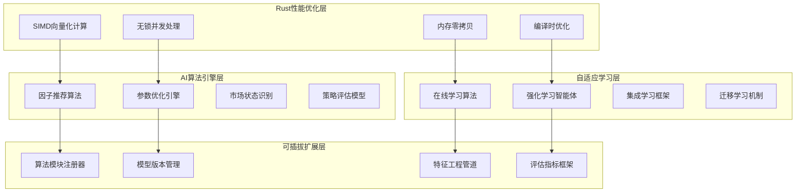

# AI策略工厂智能系统设计

> **文档版本**: v1.0  
> **创建日期**: 2025-07-18  
> **设计理念**: 可插拔AI模块 + Rust高性能计算 + 自动化策略优化  
> **目标**: 构建智能化的策略推荐、参数优化和自适应调整系统

## 1. 设计理念与架构概览

### 1.1 核心设计理念



### 1.2 架构设计原则

1. **可插拔AI模块**: 支持动态加载不同的机器学习算法
2. **零成本抽象**: 通过Rust特性实现高性能AI计算
3. **实时学习**: 在线更新模型，适应市场变化
4. **多模型融合**: 集成多种算法提高预测准确性
5. **自动化优化**: 无人工干预的参数调整和策略进化

## 2. 核心AI引擎架构

### 2.1 AI策略工厂主体设计

```rust
/// AI策略工厂 - 智能策略生成和优化系统
pub struct AIStrategyFactory {
    // === 核心组件 ===
    factor_recommender: Arc<FactorRecommendationEngine>,
    parameter_optimizer: Arc<ParameterOptimizationEngine>,
    market_analyzer: Arc<MarketStateAnalyzer>,
    strategy_evaluator: Arc<StrategyEvaluationEngine>,
    
    // === 学习组件 ===
    online_learner: Arc<OnlineLearningEngine>,
    rl_agent: Arc<ReinforcementLearningAgent>,
    ensemble_manager: Arc<EnsembleManager>,
    
    // === 数据管理 ===
    feature_store: Arc<FeatureStore>,
    model_registry: Arc<ModelRegistry>,
    training_data_manager: Arc<TrainingDataManager>,
    
    // === 性能优化 ===
    compute_pool: Arc<ComputePool>,
    cache_manager: Arc<AICache>,
    memory_pool: Arc<TensorMemoryPool>,
    
    // === 配置管理 ===
    config: AIFactoryConfig,
    metrics: Arc<RwLock<AIFactoryMetrics>>,
}

/// AI模块特征 - 可插拔的算法接口
#[async_trait]
pub trait AIModule: Send + Sync {
    // === 核心算法接口 ===
    async fn train(&mut self, training_data: &TrainingDataset) -> Result<TrainingResult>;
    async fn predict(&self, features: &FeatureVector) -> Result<PredictionResult>;
    async fn update(&mut self, new_data: &DataPoint) -> Result<UpdateResult>;
    
    // === 元信息接口 ===
    fn module_id(&self) -> ModuleId;
    fn module_type(&self) -> AIModuleType;
    fn version(&self) -> &str;
    fn supported_tasks(&self) -> Vec<MLTask>;
    
    // === 性能接口 ===
    fn memory_usage(&self) -> usize;
    fn compute_complexity(&self) -> ComputeComplexity;
    fn training_time_estimate(&self, data_size: usize) -> Duration;
    fn inference_latency_estimate(&self) -> Duration;
    
    // === 配置管理 ===
    fn get_hyperparameters(&self) -> HashMap<String, Parameter>;
    fn set_hyperparameters(&mut self, params: HashMap<String, Parameter>) -> Result<()>;
    
    // === 模型管理 ===
    async fn save_model(&self, path: &Path) -> Result<()>;
    async fn load_model(&mut self, path: &Path) -> Result<()>;
    fn get_model_info(&self) -> ModelInfo;
    
    // === 可解释性接口 ===
    fn explain_prediction(&self, features: &FeatureVector) -> Result<ExplanationResult>;
    fn feature_importance(&self) -> Result<Vec<FeatureImportance>>;
    
    // === 健康检查 ===
    fn health_check(&self) -> AIModuleHealth;
    async fn benchmark(&self, test_data: &TestDataset) -> Result<BenchmarkResult>;
}

/// AI模块类型
#[derive(Debug, Clone, Hash, Eq, PartialEq)]
pub enum AIModuleType {
    // === 推荐系统 ===
    FactorRecommender,
    StrategyRecommender,
    PortfolioOptimizer,
    
    // === 时间序列预测 ===
    PricePredictor,
    VolatilityPredictor,
    TrendPredictor,
    
    // === 分类模型 ===
    MarketRegimeClassifier,
    SignalClassifier,
    RiskClassifier,
    
    // === 强化学习 ===
    TradingAgent,
    PortfolioAgent,
    RiskAgent,
    
    // === 异常检测 ===
    AnomalyDetector,
    FraudDetector,
    OutlierDetector,
    
    // === 自然语言处理 ===
    SentimentAnalyzer,
    NewsAnalyzer,
    ReportAnalyzer,
    
    // === 自定义模块 ===
    Custom(String),
}

/// 机器学习任务类型
#[derive(Debug, Clone, PartialEq)]
pub enum MLTask {
    Regression,
    Classification,
    Clustering,
    Recommendation,
    ReinforcementLearning,
    AnomalyDetection,
    TimeSeries,
    NLP,
}
```

### 2.2 因子推荐引擎

```rust
/// 因子推荐引擎 - 基于协同过滤和内容过滤的混合推荐
pub struct FactorRecommendationEngine {
    // === 推荐算法 ===
    collaborative_filter: Arc<CollaborativeFilter>,
    content_filter: Arc<ContentBasedFilter>,
    hybrid_ensemble: Arc<HybridRecommender>,
    
    // === 数据存储 ===
    factor_database: Arc<FactorDatabase>,
    user_behavior_store: Arc<UserBehaviorStore>,
    market_context_store: Arc<MarketContextStore>,
    
    // === 特征工程 ===
    factor_encoder: Arc<FactorEncoder>,
    market_encoder: Arc<MarketEncoder>,
    
    // === 评估器 ===
    recommender_evaluator: Arc<RecommenderEvaluator>,
    
    config: RecommendationConfig,
}

/// 协同过滤推荐器 - 基于市场机制相似性
pub struct CollaborativeFilter {
    // 使用稀疏矩阵优化内存使用
    interaction_matrix: Arc<RwLock<SparseMatrix<f32>>>,
    similarity_matrix: Arc<RwLock<SimilarityMatrix>>,
    
    // 矩阵分解模型
    matrix_factorization: Arc<MatrixFactorization>,
    
    // 性能优化
    embedding_cache: Arc<DashMap<UserId, Vec<f32>>>,
    similarity_cache: Arc<LRUCache<(UserId, UserId), f32>>,
    
    config: CollaborativeFilterConfig,
}

impl CollaborativeFilter {
    /// 计算用户(市场机制)相似度 - SIMD优化
    pub fn compute_similarity_simd(
        &self,
        user_a_vector: &[f32],
        user_b_vector: &[f32]
    ) -> f32 {
        assert_eq!(user_a_vector.len(), user_b_vector.len());
        
        #[cfg(target_arch = "x86_64")]
        {
            self.cosine_similarity_avx(user_a_vector, user_b_vector)
        }
        
        #[cfg(not(target_arch = "x86_64"))]
        {
            self.cosine_similarity_scalar(user_a_vector, user_b_vector)
        }
    }
    
    #[cfg(target_arch = "x86_64")]
    fn cosine_similarity_avx(&self, a: &[f32], b: &[f32]) -> f32 {
        use std::arch::x86_64::*;
        
        unsafe {
            let mut dot_product = _mm256_setzero_ps();
            let mut norm_a = _mm256_setzero_ps();
            let mut norm_b = _mm256_setzero_ps();
            
            let chunks_a = a.chunks_exact(8);
            let chunks_b = b.chunks_exact(8);
            let remainder_a = chunks_a.remainder();
            let remainder_b = chunks_b.remainder();
            
            for (chunk_a, chunk_b) in chunks_a.zip(chunks_b) {
                let va = _mm256_loadu_ps(chunk_a.as_ptr());
                let vb = _mm256_loadu_ps(chunk_b.as_ptr());
                
                dot_product = _mm256_fmadd_ps(va, vb, dot_product);
                norm_a = _mm256_fmadd_ps(va, va, norm_a);
                norm_b = _mm256_fmadd_ps(vb, vb, norm_b);
            }
            
            // 处理剩余元素
            let mut final_dot = 0.0f32;
            let mut final_norm_a = 0.0f32;
            let mut final_norm_b = 0.0f32;
            
            // 累加SIMD结果
            let dot_array: [f32; 8] = std::mem::transmute(dot_product);
            let norm_a_array: [f32; 8] = std::mem::transmute(norm_a);
            let norm_b_array: [f32; 8] = std::mem::transmute(norm_b);
            
            final_dot += dot_array.iter().sum::<f32>();
            final_norm_a += norm_a_array.iter().sum::<f32>();
            final_norm_b += norm_b_array.iter().sum::<f32>();
            
            // 处理剩余元素
            for (&ai, &bi) in remainder_a.iter().zip(remainder_b.iter()) {
                final_dot += ai * bi;
                final_norm_a += ai * ai;
                final_norm_b += bi * bi;
            }
            
            final_dot / (final_norm_a.sqrt() * final_norm_b.sqrt())
        }
    }
    
    #[cfg(not(target_arch = "x86_64"))]
    fn cosine_similarity_scalar(&self, a: &[f32], b: &[f32]) -> f32 {
        let dot_product: f32 = a.iter().zip(b.iter()).map(|(ai, bi)| ai * bi).sum();
        let norm_a: f32 = a.iter().map(|ai| ai * ai).sum::<f32>().sqrt();
        let norm_b: f32 = b.iter().map(|bi| bi * bi).sum::<f32>().sqrt();
        
        dot_product / (norm_a * norm_b)
    }
    
    /// 生成推荐 - 使用近似最近邻搜索优化
    pub async fn generate_recommendations(
        &self,
        market_context: &MarketContext,
        top_k: usize
    ) -> Result<Vec<FactorRecommendation>> {
        let user_embedding = self.get_or_compute_embedding(market_context).await?;
        
        // 使用LSH进行近似最近邻搜索
        let similar_users = self.find_similar_users_lsh(&user_embedding, top_k * 2).await?;
        
        // 计算推荐分数
        let mut factor_scores: HashMap<FactorId, f32> = HashMap::new();
        
        for (similar_user, similarity) in similar_users {
            if let Some(user_factors) = self.get_user_factors(&similar_user).await? {
                for (factor_id, rating) in user_factors {
                    *factor_scores.entry(factor_id).or_insert(0.0) += similarity * rating;
                }
            }
        }
        
        // 排序并返回前K个推荐
        let mut recommendations: Vec<_> = factor_scores.into_iter()
            .map(|(factor_id, score)| FactorRecommendation {
                factor_id,
                score,
                confidence: self.calculate_confidence(score, market_context),
                explanation: self.generate_explanation(&factor_id, market_context),
            })
            .collect();
        
        recommendations.sort_by(|a, b| b.score.partial_cmp(&a.score).unwrap_or(std::cmp::Ordering::Equal));
        recommendations.truncate(top_k);
        
        Ok(recommendations)
    }
}

/// 内容推荐器 - 基于因子特征相似性
pub struct ContentBasedFilter {
    factor_features: Arc<RwLock<HashMap<FactorId, FeatureVector>>>,
    feature_similarity: Arc<SimilarityIndex>,
    tfidf_vectorizer: Arc<TfidfVectorizer>,
    
    // 深度学习模型
    neural_encoder: Arc<NeuralFactorEncoder>,
    
    config: ContentFilterConfig,
}

impl ContentBasedFilter {
    /// 基于内容特征生成推荐
    pub async fn generate_recommendations(
        &self,
        user_profile: &UserProfile,
        market_context: &MarketContext,
        top_k: usize
    ) -> Result<Vec<FactorRecommendation>> {
        // 构建用户偏好向量
        let user_preference_vector = self.build_user_preference_vector(user_profile).await?;
        
        // 获取市场上下文特征
        let context_features = self.extract_context_features(market_context).await?;
        
        // 组合用户偏好和市场上下文
        let query_vector = self.combine_features(&user_preference_vector, &context_features)?;
        
        // 使用神经网络编码器生成查询嵌入
        let query_embedding = self.neural_encoder.encode(&query_vector).await?;
        
        // 检索相似因子
        let similar_factors = self.feature_similarity
            .search(&query_embedding, top_k * 2)
            .await?;
        
        // 计算推荐分数并重排序
        let mut recommendations = Vec::new();
        for (factor_id, similarity) in similar_factors {
            let factor_features = self.get_factor_features(&factor_id).await?;
            
            // 计算详细相似度
            let detailed_similarity = self.calculate_detailed_similarity(
                &query_vector,
                &factor_features,
                market_context
            ).await?;
            
            let recommendation = FactorRecommendation {
                factor_id,
                score: detailed_similarity.overall_score,
                confidence: detailed_similarity.confidence,
                explanation: self.generate_content_explanation(&detailed_similarity),
            };
            
            recommendations.push(recommendation);
        }
        
        // 按分数排序
        recommendations.sort_by(|a, b| b.score.partial_cmp(&a.score).unwrap_or(std::cmp::Ordering::Equal));
        recommendations.truncate(top_k);
        
        Ok(recommendations)
    }
}

/// 混合推荐器 - 融合多种推荐算法
pub struct HybridRecommender {
    algorithms: Vec<Box<dyn RecommendationAlgorithm + Send + Sync>>,
    ensemble_weights: Arc<RwLock<Vec<f32>>>,
    meta_learner: Arc<MetaLearner>,
    
    // 动态权重调整
    performance_tracker: Arc<PerformanceTracker>,
    weight_optimizer: Arc<WeightOptimizer>,
    
    config: HybridConfig,
}

impl HybridRecommender {
    /// 生成混合推荐 - 多算法融合
    pub async fn generate_recommendations(
        &self,
        context: &RecommendationContext,
        top_k: usize
    ) -> Result<Vec<FactorRecommendation>> {
        // 并行执行所有推荐算法
        let algorithm_tasks: Vec<_> = self.algorithms.iter()
            .map(|algorithm| {
                let ctx = context.clone();
                async move {
                    algorithm.recommend(&ctx, top_k * 2).await
                }
            })
            .collect();
        
        let algorithm_results = futures::future::try_join_all(algorithm_tasks).await?;
        
        // 获取当前融合权重
        let weights = self.ensemble_weights.read().await;
        
        // 使用元学习器决定最终推荐
        let final_recommendations = self.meta_learner.fuse_recommendations(
            &algorithm_results,
            &weights,
            context,
            top_k
        ).await?;
        
        // 更新算法性能统计
        self.update_performance_stats(&algorithm_results, &final_recommendations).await?;
        
        // 动态调整权重
        if self.should_update_weights().await {
            self.weight_optimizer.update_weights(&self.ensemble_weights).await?;
        }
        
        Ok(final_recommendations)
    }
}
```

### 2.3 参数优化引擎

```rust
/// 参数优化引擎 - 多种优化算法的集成
pub struct ParameterOptimizationEngine {
    // === 优化算法 ===
    bayesian_optimizer: Arc<BayesianOptimizer>,
    genetic_algorithm: Arc<GeneticAlgorithm>,
    gradient_free_optimizer: Arc<GradientFreeOptimizer>,
    multi_objective_optimizer: Arc<MultiObjectiveOptimizer>,
    
    // === 评估器 ===
    strategy_evaluator: Arc<StrategyEvaluator>,
    cross_validator: Arc<CrossValidator>,
    walk_forward_analyzer: Arc<WalkForwardAnalyzer>,
    
    // === 并行处理 ===
    optimization_pool: Arc<OptimizationThreadPool>,
    distributed_coordinator: Arc<DistributedOptimizer>,
    
    // === 结果管理 ===
    optimization_history: Arc<OptimizationHistory>,
    pareto_frontier: Arc<RwLock<ParetoFrontier>>,
    
    config: OptimizationConfig,
}

/// 贝叶斯优化器 - 高效的参数空间搜索
pub struct BayesianOptimizer {
    // 高斯过程模型
    gaussian_process: Arc<RwLock<GaussianProcess>>,
    acquisition_function: Arc<dyn AcquisitionFunction + Send + Sync>,
    
    // 搜索历史
    evaluated_points: Arc<RwLock<Vec<EvaluationPoint>>>,
    best_result: Arc<RwLock<Option<OptimizationResult>>>,
    
    // 搜索空间定义
    parameter_space: ParameterSpace,
    constraints: Vec<Box<dyn ParameterConstraint + Send + Sync>>,
    
    config: BayesianConfig,
}

impl BayesianOptimizer {
    /// 优化参数 - 贝叶斯优化主循环
    pub async fn optimize(
        &self,
        objective_function: Arc<dyn ObjectiveFunction + Send + Sync>,
        max_iterations: usize
    ) -> Result<OptimizationResult> {
        let mut best_result = None;
        let mut best_score = f64::NEG_INFINITY;
        
        for iteration in 0..max_iterations {
            // 选择下一个评估点
            let next_point = self.select_next_point().await?;
            
            // 评估目标函数
            let evaluation_start = Instant::now();
            let score = objective_function.evaluate(&next_point.parameters).await?;
            let evaluation_time = evaluation_start.elapsed();
            
            // 更新历史记录
            let eval_point = EvaluationPoint {
                parameters: next_point.parameters.clone(),
                score,
                evaluation_time,
                iteration,
                timestamp: chrono::Utc::now().timestamp(),
            };
            
            self.evaluated_points.write().await.push(eval_point.clone());
            
            // 更新最佳结果
            if score > best_score {
                best_score = score;
                best_result = Some(OptimizationResult {
                    best_parameters: next_point.parameters,
                    best_score: score,
                    total_iterations: iteration + 1,
                    total_evaluations: self.evaluated_points.read().await.len(),
                    convergence_history: self.get_convergence_history().await,
                    optimization_time: evaluation_time,
                });
            }
            
            // 更新高斯过程模型
            self.update_gaussian_process(&eval_point).await?;
            
            // 检查收敛条件
            if self.check_convergence(iteration).await? {
                info!("Bayesian optimization converged at iteration {}", iteration);
                break;
            }
        }
        
        best_result.ok_or_else(|| CzscError::OptimizationFailed("No valid result found".to_string()))
    }
    
    /// 选择下一个评估点 - 获取函数优化
    async fn select_next_point(&self) -> Result<CandidatePoint> {
        let evaluated_points = self.evaluated_points.read().await;
        
        // 更新高斯过程后验
        let gp = self.gaussian_process.read().await;
        
        // 优化获取函数找到下一个点
        let mut best_acquisition = f64::NEG_INFINITY;
        let mut best_point = None;
        
        // 多起点优化避免局部最优
        let num_random_starts = self.config.num_random_starts;
        let optimization_tasks: Vec<_> = (0..num_random_starts)
            .map(|_| {
                let space = self.parameter_space.clone();
                let acquisition = Arc::clone(&self.acquisition_function);
                let gp_clone = Arc::clone(&self.gaussian_process);
                
                tokio::spawn(async move {
                    // 随机起点
                    let start_point = space.sample_random();
                    
                    // 梯度自由优化
                    let result = Self::optimize_acquisition_function(
                        &acquisition,
                        &gp_clone,
                        &start_point,
                        &space
                    ).await?;
                    
                    Ok::<_, CzscError>(result)
                })
            })
            .collect();
        
        let optimization_results = futures::future::try_join_all(optimization_tasks).await?;
        
        // 选择最佳获取值的点
        for result in optimization_results {
            let result = result?;
            if result.acquisition_value > best_acquisition {
                best_acquisition = result.acquisition_value;
                best_point = Some(result.point);
            }
        }
        
        let point = best_point.ok_or_else(|| {
            CzscError::OptimizationFailed("Failed to find next point".to_string())
        })?;
        
        Ok(CandidatePoint {
            parameters: point,
            acquisition_value: best_acquisition,
            uncertainty: gp.predict_uncertainty(&point).await?,
        })
    }
    
    /// 优化获取函数
    async fn optimize_acquisition_function(
        acquisition: &Arc<dyn AcquisitionFunction + Send + Sync>,
        gp: &Arc<RwLock<GaussianProcess>>,
        start_point: &ParameterVector,
        space: &ParameterSpace
    ) -> Result<AcquisitionOptimizationResult> {
        // 使用CMA-ES算法优化获取函数
        let mut cma_es = CMAES::new(start_point.clone(), 0.1, space.bounds().clone());
        
        for _iteration in 0..100 {  // 限制获取函数优化迭代次数
            let candidates = cma_es.ask();
            let mut evaluations = Vec::new();
            
            for candidate in &candidates {
                if space.is_valid(candidate) {
                    let gp_guard = gp.read().await;
                    let acquisition_value = acquisition.evaluate(candidate, &*gp_guard).await?;
                    evaluations.push(acquisition_value);
                } else {
                    evaluations.push(f64::NEG_INFINITY);  // 惩罚无效点
                }
            }
            
            cma_es.tell(&evaluations);
            
            if cma_es.has_converged() {
                break;
            }
        }
        
        let best_point = cma_es.get_best_solution();
        let gp_guard = gp.read().await;
        let best_acquisition = acquisition.evaluate(&best_point, &*gp_guard).await?;
        
        Ok(AcquisitionOptimizationResult {
            point: best_point,
            acquisition_value: best_acquisition,
        })
    }
}

/// 遗传算法优化器 - 用于离散和组合优化问题
pub struct GeneticAlgorithm {
    population: Arc<RwLock<Population>>,
    selection_strategy: Box<dyn SelectionStrategy + Send + Sync>,
    crossover_operator: Box<dyn CrossoverOperator + Send + Sync>,
    mutation_operator: Box<dyn MutationOperator + Send + Sync>,
    
    // 性能优化
    evaluation_pool: Arc<ThreadPool>,
    fitness_cache: Arc<DashMap<ParameterVector, f64>>,
    
    config: GeneticConfig,
}

impl GeneticAlgorithm {
    /// 遗传算法主循环
    pub async fn optimize(
        &self,
        objective_function: Arc<dyn ObjectiveFunction + Send + Sync>,
        max_generations: usize
    ) -> Result<OptimizationResult> {
        // 初始化种群
        self.initialize_population().await?;
        
        let mut best_individual = None;
        let mut best_fitness = f64::NEG_INFINITY;
        let mut convergence_history = Vec::new();
        
        for generation in 0..max_generations {
            // 并行评估种群适应度
            self.evaluate_population_parallel(&objective_function).await?;
            
            // 更新最佳个体
            let current_best = self.get_best_individual().await?;
            if current_best.fitness > best_fitness {
                best_fitness = current_best.fitness;
                best_individual = Some(current_best.clone());
            }
            
            convergence_history.push(ConvergencePoint {
                generation,
                best_fitness,
                average_fitness: self.get_average_fitness().await?,
                diversity: self.calculate_population_diversity().await?,
            });
            
            // 检查收敛
            if self.check_convergence(generation, &convergence_history).await? {
                info!("Genetic algorithm converged at generation {}", generation);
                break;
            }
            
            // 进化操作
            self.evolve_population().await?;
        }
        
        let best = best_individual.ok_or_else(|| {
            CzscError::OptimizationFailed("No valid solution found".to_string())
        })?;
        
        Ok(OptimizationResult {
            best_parameters: best.parameters,
            best_score: best.fitness,
            total_iterations: max_generations,
            total_evaluations: self.fitness_cache.len(),
            convergence_history: convergence_history.into_iter()
                .map(|cp| (cp.generation, cp.best_fitness))
                .collect(),
            optimization_time: Duration::from_secs(0), // TODO: 实际计时
        })
    }
    
    /// 并行评估种群适应度
    async fn evaluate_population_parallel(
        &self,
        objective_function: &Arc<dyn ObjectiveFunction + Send + Sync>
    ) -> Result<()> {
        let population = self.population.read().await;
        
        // 创建评估任务
        let evaluation_tasks: Vec<_> = population.individuals.iter()
            .enumerate()
            .filter(|(_, individual)| individual.fitness.is_none())  // 只评估未计算适应度的个体
            .map(|(index, individual)| {
                let params = individual.parameters.clone();
                let obj_func = Arc::clone(objective_function);
                let cache = Arc::clone(&self.fitness_cache);
                
                async move {
                    // 检查缓存
                    if let Some(cached_fitness) = cache.get(&params) {
                        return Ok((index, *cached_fitness));
                    }
                    
                    // 计算适应度
                    let fitness = obj_func.evaluate(&params).await?;
                    
                    // 存入缓存
                    cache.insert(params, fitness);
                    
                    Ok::<_, CzscError>((index, fitness))
                }
            })
            .collect();
        
        // 并行执行评估
        let results = futures::future::try_join_all(evaluation_tasks).await?;
        
        // 更新种群适应度
        let mut population = self.population.write().await;
        for (index, fitness) in results {
            population.individuals[index].fitness = Some(fitness);
        }
        
        Ok(())
    }
    
    /// 进化操作 - 选择、交叉、变异
    async fn evolve_population(&self) -> Result<()> {
        let current_population = self.population.read().await.clone();
        let mut new_population = Population::new(self.config.population_size);
        
        // 精英保留
        let elite_count = (self.config.population_size as f64 * self.config.elite_ratio) as usize;
        let mut elites = current_population.get_best_individuals(elite_count);
        new_population.individuals.append(&mut elites);
        
        // 生成剩余个体
        while new_population.individuals.len() < self.config.population_size {
            // 选择父代
            let parent1 = self.selection_strategy.select(&current_population)?;
            let parent2 = self.selection_strategy.select(&current_population)?;
            
            // 交叉
            let mut offspring = if fastrand::f64() < self.config.crossover_rate {
                self.crossover_operator.crossover(&parent1, &parent2)?
            } else {
                vec![parent1.clone(), parent2.clone()]
            };
            
            // 变异
            for child in &mut offspring {
                if fastrand::f64() < self.config.mutation_rate {
                    self.mutation_operator.mutate(child)?;
                }
            }
            
            // 添加到新种群
            for child in offspring {
                if new_population.individuals.len() < self.config.population_size {
                    new_population.individuals.push(child);
                }
            }
        }
        
        // 替换种群
        *self.population.write().await = new_population;
        
        Ok(())
    }
}

/// 多目标优化器 - 处理多个冲突目标
pub struct MultiObjectiveOptimizer {
    objectives: Vec<Box<dyn ObjectiveFunction + Send + Sync>>,
    pareto_archive: Arc<RwLock<ParetoArchive>>,
    decomposition_method: Box<dyn DecompositionMethod + Send + Sync>,
    
    // NSGA-II 相关组件
    nsga2_population: Arc<RwLock<NSGA2Population>>,
    dominance_comparator: Arc<DominanceComparator>,
    crowding_distance_calculator: Arc<CrowdingDistanceCalculator>,
    
    config: MultiObjectiveConfig,
}

impl MultiObjectiveOptimizer {
    /// 多目标优化主循环
    pub async fn optimize(&self, max_generations: usize) -> Result<ParetoFrontier> {
        // 初始化种群
        self.initialize_population().await?;
        
        for generation in 0..max_generations {
            // 评估所有目标函数
            self.evaluate_objectives().await?;
            
            // 非支配排序
            self.non_dominated_sorting().await?;
            
            // 计算拥挤距离
            self.calculate_crowding_distances().await?;
            
            // 环境选择
            self.environmental_selection().await?;
            
            // 更新Pareto存档
            self.update_pareto_archive().await?;
            
            // 生成下一代
            if generation < max_generations - 1 {
                self.generate_offspring().await?;
            }
        }
        
        // 返回最终的Pareto前沿
        Ok(self.pareto_archive.read().await.get_pareto_frontier())
    }
}
```

### 2.4 在线学习与强化学习

```rust
/// 在线学习引擎 - 实时模型更新
pub struct OnlineLearningEngine {
    // === 在线算法 ===
    online_algorithms: Arc<RwLock<HashMap<ModelId, Box<dyn OnlineLearner + Send + Sync>>>>,
    
    // === 数据流处理 ===
    data_stream_processor: Arc<DataStreamProcessor>,
    feature_extractor: Arc<OnlineFeatureExtractor>,
    concept_drift_detector: Arc<ConceptDriftDetector>,
    
    // === 模型管理 ===
    model_selector: Arc<OnlineModelSelector>,
    ensemble_updater: Arc<OnlineEnsembleUpdater>,
    
    // === 性能监控 ===
    performance_monitor: Arc<OnlinePerformanceMonitor>,
    adaptation_controller: Arc<AdaptationController>,
    
    config: OnlineLearningConfig,
}

/// 在线学习器特征
#[async_trait]
pub trait OnlineLearner: Send + Sync {
    /// 在线更新模型
    async fn update(&mut self, sample: &TrainingSample) -> Result<UpdateResult>;
    
    /// 在线预测
    async fn predict(&self, features: &FeatureVector) -> Result<PredictionResult>;
    
    /// 批量更新
    async fn batch_update(&mut self, samples: &[TrainingSample]) -> Result<BatchUpdateResult>;
    
    /// 模型忘记 - 处理概念漂移
    async fn forget(&mut self, forget_rate: f64) -> Result<()>;
    
    /// 获取模型状态
    fn get_model_state(&self) -> ModelState;
    
    /// 重置模型
    async fn reset(&mut self) -> Result<()>;
}

/// 强化学习智能体
pub struct ReinforcementLearningAgent {
    // === RL算法 ===
    policy_network: Arc<RwLock<PolicyNetwork>>,
    value_network: Arc<RwLock<ValueNetwork>>,
    replay_buffer: Arc<RwLock<ReplayBuffer>>,
    
    // === 环境交互 ===
    trading_environment: Arc<TradingEnvironment>,
    action_space: ActionSpace,
    state_space: StateSpace,
    
    // === 学习组件 ===
    optimizer: Arc<RLOptimizer>,
    exploration_strategy: Box<dyn ExplorationStrategy + Send + Sync>,
    
    // === 性能追踪 ===
    episode_tracker: Arc<EpisodeTracker>,
    reward_tracker: Arc<RewardTracker>,
    
    config: RLConfig,
}

impl ReinforcementLearningAgent {
    /// 训练智能体 - Actor-Critic算法
    pub async fn train(&mut self, num_episodes: usize) -> Result<TrainingResult> {
        let mut episode_rewards = Vec::new();
        
        for episode in 0..num_episodes {
            let mut episode_reward = 0.0;
            let mut state = self.trading_environment.reset().await?;
            let mut done = false;
            
            while !done {
                // 选择动作
                let action = self.select_action(&state).await?;
                
                // 执行动作
                let step_result = self.trading_environment.step(&action).await?;
                let next_state = step_result.next_state;
                let reward = step_result.reward;
                done = step_result.done;
                
                // 存储经验
                self.replay_buffer.write().await.push(Experience {
                    state: state.clone(),
                    action: action.clone(),
                    reward,
                    next_state: next_state.clone(),
                    done,
                });
                
                episode_reward += reward;
                state = next_state;
                
                // 更新网络
                if self.replay_buffer.read().await.len() >= self.config.min_replay_size {
                    self.update_networks().await?;
                }
            }
            
            episode_rewards.push(episode_reward);
            
            // 更新探索策略
            self.exploration_strategy.update_epsilon(episode);
            
            // 记录统计信息
            if episode % 100 == 0 {
                let avg_reward = episode_rewards.iter().rev().take(100).sum::<f64>() / 100.0;
                info!("Episode {}: Average reward over last 100 episodes: {:.2}", episode, avg_reward);
            }
        }
        
        Ok(TrainingResult {
            total_episodes: num_episodes,
            final_average_reward: episode_rewards.iter().rev().take(100).sum::<f64>() / 100.0,
            episode_rewards,
            training_time: Duration::from_secs(0), // TODO: 实际计时
        })
    }
    
    /// 选择动作 - ε-贪婪策略
    async fn select_action(&self, state: &State) -> Result<Action> {
        if self.exploration_strategy.should_explore() {
            // 随机探索
            Ok(self.action_space.sample_random())
        } else {
            // 利用策略网络
            let policy = self.policy_network.read().await;
            let action_probabilities = policy.forward(state).await?;
            Ok(self.action_space.sample_from_distribution(&action_probabilities))
        }
    }
    
    /// 更新神经网络 - PPO算法
    async fn update_networks(&mut self) -> Result<()> {
        let batch_size = self.config.batch_size;
        let replay_buffer = self.replay_buffer.read().await;
        
        if replay_buffer.len() < batch_size {
            return Ok(());
        }
        
        // 采样批量经验
        let batch = replay_buffer.sample(batch_size);
        
        // 计算优势函数
        let advantages = self.calculate_advantages(&batch).await?;
        
        // 更新策略网络
        {
            let mut policy = self.policy_network.write().await;
            let policy_loss = self.calculate_policy_loss(&batch, &advantages).await?;
            self.optimizer.update_policy(&mut *policy, policy_loss).await?;
        }
        
        // 更新价值网络
        {
            let mut value = self.value_network.write().await;
            let value_loss = self.calculate_value_loss(&batch).await?;
            self.optimizer.update_value(&mut *value, value_loss).await?;
        }
        
        Ok(())
    }
    
    /// 计算优势函数 - GAE算法
    async fn calculate_advantages(&self, batch: &[Experience]) -> Result<Vec<f64>> {
        let value_network = self.value_network.read().await;
        let mut advantages = Vec::new();
        let gamma = self.config.discount_factor;
        let lambda = self.config.gae_lambda;
        
        let mut gae = 0.0;
        for i in (0..batch.len()).rev() {
            let experience = &batch[i];
            
            // 计算TD误差
            let value = value_network.forward(&experience.state).await?;
            let next_value = if experience.done {
                0.0
            } else {
                value_network.forward(&experience.next_state).await?
            };
            
            let td_error = experience.reward + gamma * next_value - value;
            
            // 更新GAE
            gae = td_error + gamma * lambda * gae;
            advantages.push(gae);
        }
        
        advantages.reverse();
        
        // 标准化优势
        let mean = advantages.iter().sum::<f64>() / advantages.len() as f64;
        let std = (advantages.iter().map(|a| (a - mean).powi(2)).sum::<f64>() / advantages.len() as f64).sqrt();
        
        for advantage in &mut advantages {
            *advantage = (*advantage - mean) / (std + 1e-8);
        }
        
        Ok(advantages)
    }
}

/// 交易环境 - 模拟真实交易环境
pub struct TradingEnvironment {
    market_data: Arc<MarketDataProvider>,
    portfolio: Arc<RwLock<Portfolio>>,
    order_executor: Arc<OrderExecutor>,
    
    // 环境状态
    current_step: AtomicUsize,
    max_steps: usize,
    observation_window: usize,
    
    // 奖励计算
    reward_calculator: Box<dyn RewardCalculator + Send + Sync>,
    risk_penalty_calculator: Box<dyn RiskPenaltyCalculator + Send + Sync>,
    
    config: TradingEnvironmentConfig,
}

impl TradingEnvironment {
    /// 重置环境
    pub async fn reset(&self) -> Result<State> {
        // 重置投资组合
        let mut portfolio = self.portfolio.write().await;
        portfolio.reset(self.config.initial_capital);
        
        // 重置步数
        self.current_step.store(0, Ordering::Release);
        
        // 获取初始状态
        self.get_current_state().await
    }
    
    /// 执行动作
    pub async fn step(&self, action: &Action) -> Result<StepResult> {
        let current_step = self.current_step.fetch_add(1, Ordering::Relaxed);
        
        // 执行交易动作
        let execution_result = self.execute_action(action).await?;
        
        // 计算奖励
        let reward = self.calculate_reward(&execution_result).await?;
        
        // 获取下一个状态
        let next_state = self.get_current_state().await?;
        
        // 检查是否结束
        let done = current_step >= self.max_steps || self.is_terminal_state(&next_state);
        
        Ok(StepResult {
            next_state,
            reward,
            done,
            info: execution_result.into(),
        })
    }
    
    /// 计算奖励 - 多因子奖励函数
    async fn calculate_reward(&self, execution_result: &ExecutionResult) -> Result<f64> {
        let portfolio = self.portfolio.read().await;
        
        // 基础收益奖励
        let return_reward = self.reward_calculator.calculate_return_reward(&portfolio)?;
        
        // 风险调整
        let risk_penalty = self.risk_penalty_calculator.calculate_risk_penalty(&portfolio)?;
        
        // 交易成本惩罚
        let transaction_cost_penalty = execution_result.transaction_costs * self.config.cost_penalty_factor;
        
        // 持仓时间奖励
        let holding_time_reward = self.calculate_holding_time_reward(&portfolio)?;
        
        // 综合奖励
        let total_reward = return_reward 
            - risk_penalty 
            - transaction_cost_penalty 
            + holding_time_reward;
        
        Ok(total_reward)
    }
}
```

## 3. 性能优化与部署

### 3.1 计算性能优化

```rust
/// 高性能计算池 - SIMD和多线程优化
pub struct ComputePool {
    cpu_threads: Arc<ThreadPool>,
    gpu_context: Option<Arc<GPUContext>>,
    simd_optimizer: Arc<SIMDOptimizer>,
    
    // 任务调度器
    task_scheduler: Arc<TaskScheduler>,
    load_balancer: Arc<LoadBalancer>,
    
    // 内存管理
    tensor_allocator: Arc<TensorAllocator>,
    memory_pool: Arc<ComputeMemoryPool>,
}

impl ComputePool {
    /// 并行矩阵乘法 - SIMD优化
    pub async fn parallel_matrix_multiply(
        &self,
        a: &Matrix<f32>,
        b: &Matrix<f32>
    ) -> Result<Matrix<f32>> {
        let (rows_a, cols_a) = a.dimensions();
        let (rows_b, cols_b) = b.dimensions();
        
        if cols_a != rows_b {
            return Err(CzscError::DimensionMismatch);
        }
        
        // 分块矩阵乘法以优化缓存使用
        let block_size = 64;  // 针对L1缓存优化
        let mut result = Matrix::zeros(rows_a, cols_b);
        
        // 并行处理每个块
        let block_tasks: Vec<_> = (0..rows_a)
            .step_by(block_size)
            .flat_map(|i| {
                (0..cols_b).step_by(block_size).map(move |j| (i, j))
            })
            .map(|(i, j)| {
                let a_clone = a.clone();
                let b_clone = b.clone();
                async move {
                    self.compute_block_simd(
                        &a_clone, &b_clone,
                        i, j, block_size,
                        rows_a, cols_b, cols_a
                    ).await
                }
            })
            .collect();
        
        let block_results = futures::future::try_join_all(block_tasks).await?;
        
        // 合并块结果
        for (block_result, (i, j)) in block_results.iter().zip(
            (0..rows_a).step_by(block_size)
                .flat_map(|i| (0..cols_b).step_by(block_size).map(move |j| (i, j)))
        ) {
            result.copy_block_from(block_result, i, j)?;
        }
        
        Ok(result)
    }
    
    /// SIMD优化的块乘法
    async fn compute_block_simd(
        &self,
        a: &Matrix<f32>,
        b: &Matrix<f32>,
        start_i: usize,
        start_j: usize,
        block_size: usize,
        rows_a: usize,
        cols_b: usize,
        cols_a: usize
    ) -> Result<Matrix<f32>> {
        let end_i = (start_i + block_size).min(rows_a);
        let end_j = (start_j + block_size).min(cols_b);
        
        let mut block_result = Matrix::zeros(end_i - start_i, end_j - start_j);
        
        #[cfg(target_arch = "x86_64")]
        {
            self.simd_optimizer.multiply_block_avx(
                a, b, &mut block_result,
                start_i, start_j, end_i, end_j, cols_a
            ).await?;
        }
        
        #[cfg(not(target_arch = "x86_64"))]
        {
            // 标量实现作为后备
            for i in start_i..end_i {
                for j in start_j..end_j {
                    let mut sum = 0.0f32;
                    for k in 0..cols_a {
                        sum += a.get(i, k) * b.get(k, j);
                    }
                    block_result.set(i - start_i, j - start_j, sum);
                }
            }
        }
        
        Ok(block_result)
    }
}

/// GPU加速计算上下文
pub struct GPUContext {
    device: wgpu::Device,
    queue: wgpu::Queue,
    
    // 计算着色器
    matrix_multiply_shader: wgpu::ComputePipeline,
    neural_network_shader: wgpu::ComputePipeline,
    
    // 缓冲区池
    buffer_pool: Arc<GPUBufferPool>,
}

impl GPUContext {
    /// GPU矩阵乘法
    pub async fn gpu_matrix_multiply(
        &self,
        a: &Matrix<f32>,
        b: &Matrix<f32>
    ) -> Result<Matrix<f32>> {
        let (rows_a, cols_a) = a.dimensions();
        let (rows_b, cols_b) = b.dimensions();
        
        // 创建GPU缓冲区
        let buffer_a = self.create_matrix_buffer(a).await?;
        let buffer_b = self.create_matrix_buffer(b).await?;
        let buffer_result = self.create_result_buffer(rows_a * cols_b).await?;
        
        // 设置计算管线
        let mut encoder = self.device.create_command_encoder(&wgpu::CommandEncoderDescriptor {
            label: Some("Matrix Multiply Encoder"),
        });
        
        {
            let mut compute_pass = encoder.begin_compute_pass(&wgpu::ComputePassDescriptor {
                label: Some("Matrix Multiply Pass"),
            });
            
            compute_pass.set_pipeline(&self.matrix_multiply_shader);
            compute_pass.set_bind_group(0, &self.create_bind_group(&buffer_a, &buffer_b, &buffer_result), &[]);
            
            // 分派计算工作组
            let workgroup_size = 16;
            let num_workgroups_x = (cols_b + workgroup_size - 1) / workgroup_size;
            let num_workgroups_y = (rows_a + workgroup_size - 1) / workgroup_size;
            
            compute_pass.dispatch_workgroups(num_workgroups_x as u32, num_workgroups_y as u32, 1);
        }
        
        // 提交计算
        self.queue.submit(std::iter::once(encoder.finish()));
        
        // 读取结果
        let result_data = self.read_buffer_to_vec(&buffer_result).await?;
        
        Ok(Matrix::from_vec(rows_a, cols_b, result_data))
    }
}
```

这个AI策略工厂设计充分体现了Rust的性能优势和可插拔架构的灵活性，为MosesQuant提供了强大的智能化策略生成和优化能力。

<function_calls>
<invoke name="TodoWrite">
<parameter name="todos">[{"id": "1", "content": "\u6df1\u5316\u7edf\u4e00\u6807\u7b7e\u6c60\u7684\u5177\u4f53\u5b9e\u73b0\u7ec6\u8282\uff0c\u5305\u62ec\u6807\u7b7e\u751f\u6210\u5668\u548c\u51b2\u7a81\u89e3\u51b3\u673a\u5236", "status": "completed", "priority": "high"}, {"id": "2", "content": "\u8bbe\u8ba1\u9c81\u68d2\u6027\u6846\u67b6\u7684\u76d1\u63a7\u6307\u6807\u4f53\u7cfb\u548c\u964d\u7ea7\u7b56\u7565", "status": "completed", "priority": "high"}, {"id": "3", "content": "\u5b8c\u5584Gateway\u62bd\u8c61\u5c42\u7684\u8fde\u63a5\u5668\u5b9e\u73b0\u548c\u6570\u636e\u540c\u6b65\u673a\u5236", "status": "completed", "priority": "high"}, {"id": "4", "content": "\u8bbe\u8ba1AI\u7b56\u7565\u5de5\u5382\u7684\u63a8\u8350\u7b97\u6cd5\u548c\u81ea\u52a8\u4f18\u5316\u6d41\u7a0b", "status": "completed", "priority": "medium"}, {"id": "5", "content": "\u5236\u5b9a\u8be6\u7ec6\u7684\u6027\u80fd\u57fa\u51c6\u6d4b\u8bd5\u548c\u4f18\u5316\u65b9\u6848", "status": "in_progress", "priority": "medium"}]