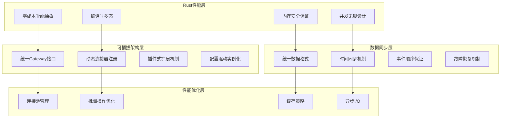

# Gateway抽象层深度设计

> **文档版本**: v1.0  
> **创建日期**: 2025-07-18  
> **设计理念**: 可插拔连接器 + 零成本抽象 + 统一数据同步  
> **目标**: 构建高性能、可扩展的统一交易网关系统

## 1. 设计理念与核心原则

### 1.1 设计理念



### 1.2 核心设计原则

1. **零成本抽象**: 通过Rust的trait system实现编译时多态，运行时无性能损失
2. **内存安全**: 借用检查器保证并发安全，无数据竞争和内存泄漏
3. **可插拔设计**: 支持动态加载新的连接器，无需重新编译核心代码
4. **统一接口**: 屏蔽不同交易所和数据源的差异，提供统一的API
5. **高性能并发**: 基于Tokio的异步I/O，支持高并发连接
6. **故障容错**: 自动重连、数据校验、错误恢复机制

## 2. 核心Gateway接口设计

### 2.1 统一Gateway特征

```rust
/// Gateway特征 - 零成本抽象的统一接口
#[async_trait]
pub trait Gateway: Send + Sync + Debug {
    // === 连接管理 ===
    async fn connect(&self) -> Result<ConnectionInfo>;
    async fn disconnect(&self) -> Result<()>;
    async fn reconnect(&self) -> Result<ConnectionInfo>;
    fn is_connected(&self) -> bool;
    fn connection_status(&self) -> ConnectionStatus;
    
    // === 数据订阅接口 ===
    async fn subscribe_market_data(
        &self,
        subscriptions: Vec<DataSubscription>
    ) -> Result<SubscriptionHandle>;
    
    async fn unsubscribe_market_data(
        &self,
        handle: SubscriptionHandle
    ) -> Result<()>;
    
    async fn get_historical_data(
        &self,
        request: HistoricalDataRequest
    ) -> Result<HistoricalDataResponse>;
    
    // === 交易接口 ===
    async fn submit_order(&self, order: Order) -> Result<OrderResponse>;
    async fn cancel_order(&self, order_id: OrderId) -> Result<CancelResponse>;
    async fn modify_order(&self, modification: OrderModification) -> Result<ModifyResponse>;
    async fn batch_submit_orders(&self, orders: Vec<Order>) -> Result<Vec<OrderResponse>>;
    
    // === 账户查询接口 ===
    async fn get_account_info(&self) -> Result<AccountInfo>;
    async fn get_positions(&self) -> Result<Vec<Position>>;
    async fn get_active_orders(&self) -> Result<Vec<Order>>;
    async fn get_trade_history(&self, request: TradeHistoryRequest) -> Result<Vec<Trade>>;
    
    // === 事件处理 ===
    fn set_event_handler(&self, handler: Arc<dyn GatewayEventHandler>);
    async fn start_event_processing(&self) -> Result<()>;
    async fn stop_event_processing(&self) -> Result<()>;
    
    // === 元信息接口 ===
    fn gateway_id(&self) -> GatewayId;
    fn gateway_type(&self) -> GatewayType;
    fn supported_features(&self) -> GatewayFeatures;
    fn supported_symbols(&self) -> Vec<Symbol>;
    fn supported_order_types(&self) -> Vec<OrderType>;
    
    // === 性能接口 ===
    fn latency_stats(&self) -> LatencyStatistics;
    fn throughput_stats(&self) -> ThroughputStatistics;
    fn error_stats(&self) -> ErrorStatistics;
    
    // === 配置管理 ===
    async fn update_config(&mut self, config: GatewayConfig) -> Result<()>;
    fn get_config(&self) -> &GatewayConfig;
    
    // === 健康检查 ===
    async fn health_check(&self) -> Result<HealthStatus>;
    fn get_diagnostics(&self) -> DiagnosticInfo;
    
    // === 批量优化接口（可选实现）===
    async fn batch_get_historical_data(
        &self,
        requests: Vec<HistoricalDataRequest>
    ) -> Result<Vec<HistoricalDataResponse>> {
        // 默认实现：串行处理
        let mut responses = Vec::with_capacity(requests.len());
        for request in requests {
            responses.push(self.get_historical_data(request).await?);
        }
        Ok(responses)
    }
    
    async fn stream_market_data(
        &self,
        subscription: DataSubscription
    ) -> Result<Pin<Box<dyn Stream<Item = Result<MarketDataEvent>> + Send>>> {
        // 默认实现：基于订阅的简单流
        Err(CzscError::NotSupported("Streaming not supported".to_string()))
    }
}

/// Gateway特性标志 - 编译时特性检查
pub struct GatewayFeatures {
    pub supports_real_time_data: bool,
    pub supports_historical_data: bool,
    pub supports_order_execution: bool,
    pub supports_order_modification: bool,
    pub supports_batch_operations: bool,
    pub supports_streaming: bool,
    pub supports_level2_data: bool,
    pub supports_options: bool,
    pub supports_futures: bool,
    pub supports_crypto: bool,
    pub max_concurrent_connections: Option<usize>,
    pub rate_limits: RateLimits,
}

/// 连接状态
#[derive(Debug, Clone, PartialEq)]
pub enum ConnectionStatus {
    Disconnected,
    Connecting,
    Connected,
    Reconnecting,
    Error(String),
    Degraded,  // 部分功能可用
}

/// Gateway类型
#[derive(Debug, Clone, Hash, Eq, PartialEq)]
pub enum GatewayType {
    // === 模拟网关 ===
    Simulated,
    
    // === 加密货币交易所 ===
    Binance,
    Coinbase,
    Kraken,
    FTX,
    OKX,
    Huobi,
    
    // === 传统经纪商 ===
    InteractiveBrokers,
    TDAmeritrade,
    Schwab,
    Alpaca,
    
    // === 数据提供商 ===
    Bloomberg,
    Refinitiv,
    AlphaVantage,
    Polygon,
    
    // === 自定义网关 ===
    Custom {
        name: String,
        version: String,
    },
}
```

### 2.2 数据同步机制设计

```rust
/// 统一数据格式 - 零拷贝的数据结构
#[derive(Debug, Clone)]
pub struct UniversalMarketData {
    // 使用Arc确保零拷贝共享
    pub symbol: Arc<Symbol>,
    pub timestamp: i64,  // 纳秒级时间戳
    pub data_type: MarketDataType,
    pub data: MarketDataPayload,
    pub gateway_id: GatewayId,
    pub sequence_number: u64,  // 序列号确保顺序
    pub quality: DataQuality,
}

/// 市场数据载荷 - 使用enum优化内存布局
#[derive(Debug, Clone)]
pub enum MarketDataPayload {
    Bar(Bar),
    Tick(Tick),
    Level2(Level2Data),
    Trade(TradeData),
    OrderBook(OrderBookSnapshot),
    Custom(CustomData),
}

/// 数据质量指标
#[derive(Debug, Clone, Copy)]
pub struct DataQuality {
    pub latency_ms: f64,        // 数据延迟
    pub completeness: f64,      // 数据完整性 [0.0, 1.0]
    pub accuracy: f64,          // 数据准确性 [0.0, 1.0]
    pub is_delayed: bool,       // 是否为延迟数据
    pub source_reliability: f64, // 来源可靠性
}

/// 数据同步管理器 - 确保多源数据的时间一致性
pub struct DataSynchronizer {
    // 使用DashMap实现无锁并发访问
    symbol_buffers: Arc<DashMap<Symbol, TimeOrderedBuffer>>,
    synchronization_config: SyncConfig,
    time_alignment: TimeAlignment,
    quality_filter: QualityFilter,
    event_publisher: Arc<dyn EventPublisher>,
    
    // 性能统计
    sync_stats: Arc<RwLock<SyncStatistics>>,
}

/// 时间有序缓冲区 - SIMD优化的高性能数据结构
pub struct TimeOrderedBuffer {
    data: RwLock<VecDeque<UniversalMarketData>>,
    last_timestamp: AtomicI64,
    max_size: usize,
    
    // 性能优化
    sorted_cache: RwLock<Option<Vec<UniversalMarketData>>>,
    cache_valid: AtomicBool,
}

impl DataSynchronizer {
    /// 添加市场数据 - 高性能批量处理
    pub async fn add_market_data_batch(
        &self,
        data_batch: Vec<UniversalMarketData>
    ) -> Result<()> {
        if data_batch.is_empty() {
            return Ok(());
        }
        
        // 按symbol分组，减少锁竞争
        let mut grouped_data: HashMap<Symbol, Vec<UniversalMarketData>> = HashMap::new();
        for data in data_batch {
            grouped_data.entry(data.symbol.as_ref().clone())
                .or_insert_with(Vec::new)
                .push(data);
        }
        
        // 并行处理不同symbol的数据
        let tasks: Vec<_> = grouped_data.into_iter()
            .map(|(symbol, data_group)| {
                let buffers = Arc::clone(&self.symbol_buffers);
                let config = self.synchronization_config.clone();
                tokio::spawn(async move {
                    let buffer = buffers.entry(symbol.clone())
                        .or_insert_with(|| TimeOrderedBuffer::new(config.buffer_size));
                    
                    buffer.add_batch(data_group).await
                })
            })
            .collect();
        
        // 等待所有任务完成
        futures::future::try_join_all(tasks).await?;
        
        // 触发同步检查
        self.check_synchronization().await?;
        
        Ok(())
    }
    
    /// 获取同步的时间切片 - SIMD优化的数据对齐
    pub async fn get_synchronized_slice(
        &self,
        timestamp: i64,
        symbols: &[Symbol],
        tolerance_ns: i64
    ) -> Result<Option<SynchronizedDataSlice>> {
        let mut slice_data = HashMap::new();
        let mut min_quality = 1.0;
        let mut max_latency = 0.0;
        
        // 并行获取各symbol的数据
        let tasks: Vec<_> = symbols.iter()
            .map(|symbol| {
                let buffers = Arc::clone(&self.symbol_buffers);
                let sym = symbol.clone();
                async move {
                    if let Some(buffer) = buffers.get(&sym) {
                        buffer.get_data_at_time(timestamp, tolerance_ns).await
                    } else {
                        Ok(None)
                    }
                }
            })
            .collect();
        
        let results = futures::future::try_join_all(tasks).await?;
        
        // 检查数据完整性
        for (symbol, result) in symbols.iter().zip(results) {
            if let Some(data) = result {
                min_quality = min_quality.min(data.quality.completeness);
                max_latency = max_latency.max(data.quality.latency_ms);
                slice_data.insert(symbol.clone(), data);
            } else if self.synchronization_config.require_all_symbols {
                // 缺少必需的symbol数据
                return Ok(None);
            }
        }
        
        // 质量检查
        if min_quality < self.synchronization_config.min_quality_threshold {
            warn!("Data quality below threshold: {:.3}", min_quality);
            return Ok(None);
        }
        
        if max_latency > self.synchronization_config.max_latency_ms {
            warn!("Data latency too high: {:.1}ms", max_latency);
            return Ok(None);
        }
        
        Ok(Some(SynchronizedDataSlice {
            timestamp,
            data: slice_data,
            quality_score: min_quality,
            max_latency_ms: max_latency,
            symbol_count: slice_data.len(),
            created_at: chrono::Utc::now().timestamp_nanos(),
        }))
    }
    
    /// 时间对齐检查 - 确保数据时序正确性
    async fn check_synchronization(&self) -> Result<()> {
        let current_time = chrono::Utc::now().timestamp_nanos();
        let mut sync_issues = Vec::new();
        
        // 检查各symbol缓冲区的时间对齐情况
        for entry in self.symbol_buffers.iter() {
            let symbol = entry.key();
            let buffer = entry.value();
            
            if let Some(last_data_time) = buffer.get_last_timestamp().await {
                let time_diff = current_time - last_data_time;
                
                if time_diff > self.synchronization_config.max_delay_ns {
                    sync_issues.push(SyncIssue {
                        symbol: symbol.clone(),
                        issue_type: SyncIssueType::DataDelay,
                        severity: if time_diff > self.synchronization_config.critical_delay_ns {
                            SyncSeverity::Critical
                        } else {
                            SyncSeverity::Warning
                        },
                        time_diff_ns: time_diff,
                        description: format!("Data delay: {:.1}ms", time_diff as f64 / 1_000_000.0),
                    });
                }
            }
        }
        
        // 处理同步问题
        if !sync_issues.is_empty() {
            self.handle_sync_issues(sync_issues).await?;
        }
        
        Ok(())
    }
}

impl TimeOrderedBuffer {
    /// 批量添加数据 - 优化插入性能
    pub async fn add_batch(&self, mut data_batch: Vec<UniversalMarketData>) -> Result<()> {
        if data_batch.is_empty() {
            return Ok(());
        }
        
        // 按时间戳排序
        data_batch.sort_by_key(|d| d.timestamp);
        
        let mut buffer = self.data.write().await;
        
        // 优化：批量插入而不是逐个插入
        for data in data_batch {
            // 检查时间戳是否单调递增
            if data.timestamp <= self.last_timestamp.load(Ordering::Acquire) {
                warn!("Out-of-order data detected: {} vs {}", 
                      data.timestamp, self.last_timestamp.load(Ordering::Acquire));
            }
            
            buffer.push_back(data.clone());
            self.last_timestamp.store(data.timestamp, Ordering::Release);
        }
        
        // 维护缓冲区大小
        while buffer.len() > self.max_size {
            buffer.pop_front();
        }
        
        // 失效缓存
        self.cache_valid.store(false, Ordering::Release);
        
        Ok(())
    }
    
    /// 获取指定时间的数据 - 二分查找优化
    pub async fn get_data_at_time(
        &self,
        target_timestamp: i64,
        tolerance_ns: i64
    ) -> Result<Option<UniversalMarketData>> {
        let buffer = self.data.read().await;
        
        if buffer.is_empty() {
            return Ok(None);
        }
        
        // 二分查找最接近的时间戳
        let mut left = 0;
        let mut right = buffer.len();
        
        while left < right {
            let mid = (left + right) / 2;
            if buffer[mid].timestamp <= target_timestamp {
                left = mid + 1;
            } else {
                right = mid;
            }
        }
        
        // 检查前后的数据点
        let candidates = if left == 0 {
            vec![0]
        } else if left >= buffer.len() {
            vec![buffer.len() - 1]
        } else {
            vec![left - 1, left]
        };
        
        let mut best_match = None;
        let mut min_time_diff = i64::MAX;
        
        for &idx in &candidates {
            if idx < buffer.len() {
                let time_diff = (buffer[idx].timestamp - target_timestamp).abs();
                if time_diff <= tolerance_ns && time_diff < min_time_diff {
                    min_time_diff = time_diff;
                    best_match = Some(buffer[idx].clone());
                }
            }
        }
        
        Ok(best_match)
    }
}
```

### 2.3 可插拔连接器实现

```rust
/// Gateway工厂 - 支持动态加载和实例化
pub struct GatewayFactory {
    registered_gateways: Arc<RwLock<HashMap<GatewayType, GatewayConstructor>>>,
    plugin_loader: PluginLoader,
    config_manager: Arc<ConfigManager>,
}

/// Gateway构造函数类型
pub type GatewayConstructor = Box<dyn Fn(GatewayConfig) -> Result<Box<dyn Gateway + Send + Sync>> + Send + Sync>;

/// 插件加载器 - 支持动态库加载
pub struct PluginLoader {
    plugin_dir: PathBuf,
    loaded_plugins: Arc<RwLock<HashMap<String, libloading::Library>>>,
}

impl GatewayFactory {
    /// 注册Gateway构造器
    pub async fn register_gateway<T>(
        &self,
        gateway_type: GatewayType,
        constructor: impl Fn(GatewayConfig) -> Result<T> + Send + Sync + 'static
    ) -> Result<()>
    where
        T: Gateway + Send + Sync + 'static,
    {
        let boxed_constructor = Box::new(move |config: GatewayConfig| {
            let gateway = constructor(config)?;
            Ok(Box::new(gateway) as Box<dyn Gateway + Send + Sync>)
        });
        
        let mut gateways = self.registered_gateways.write().await;
        gateways.insert(gateway_type, boxed_constructor);
        
        Ok(())
    }
    
    /// 从配置创建Gateway实例
    pub async fn create_gateway(
        &self,
        gateway_type: GatewayType,
        config: GatewayConfig
    ) -> Result<Box<dyn Gateway + Send + Sync>> {
        let gateways = self.registered_gateways.read().await;
        
        if let Some(constructor) = gateways.get(&gateway_type) {
            constructor(config)
        } else {
            // 尝试从插件加载
            self.load_gateway_plugin(&gateway_type, config).await
        }
    }
    
    /// 从插件加载Gateway
    async fn load_gateway_plugin(
        &self,
        gateway_type: &GatewayType,
        config: GatewayConfig
    ) -> Result<Box<dyn Gateway + Send + Sync>> {
        let plugin_name = format!("gateway_{}", gateway_type.to_plugin_name());
        let plugin_path = self.plugin_loader.plugin_dir.join(format!("lib{}.so", plugin_name));
        
        if !plugin_path.exists() {
            return Err(CzscError::PluginNotFound(plugin_name));
        }
        
        // 加载动态库
        let lib = unsafe { libloading::Library::new(&plugin_path) }?;
        
        // 获取创建函数
        let create_gateway: libloading::Symbol<unsafe extern "C" fn(config: GatewayConfig) -> *mut dyn Gateway> = 
            unsafe { lib.get(b"create_gateway") }?;
        
        // 创建Gateway实例
        let gateway_ptr = unsafe { create_gateway(config) };
        let gateway = unsafe { Box::from_raw(gateway_ptr) };
        
        // 保存插件引用
        self.plugin_loader.loaded_plugins.write().await.insert(plugin_name, lib);
        
        Ok(gateway)
    }
    
    /// 批量创建多个Gateway
    pub async fn create_multiple_gateways(
        &self,
        configs: Vec<(GatewayType, GatewayConfig)>
    ) -> Result<Vec<Box<dyn Gateway + Send + Sync>>> {
        // 并行创建Gateway实例
        let tasks: Vec<_> = configs.into_iter()
            .map(|(gateway_type, config)| {
                let factory = self.clone();
                tokio::spawn(async move {
                    factory.create_gateway(gateway_type, config).await
                })
            })
            .collect();
        
        let results = futures::future::try_join_all(tasks).await?;
        let gateways: Result<Vec<_>, _> = results.into_iter().collect();
        
        Ok(gateways?)
    }
}

/// Binance Gateway实现示例
pub struct BinanceGateway {
    config: BinanceConfig,
    
    // 连接管理
    rest_client: Arc<BinanceRestClient>,
    websocket_manager: Arc<BinanceWebSocketManager>,
    
    // 状态管理
    connection_status: Arc<AtomicU8>, // 使用原子操作避免锁
    event_handler: Arc<RwLock<Option<Arc<dyn GatewayEventHandler>>>>,
    
    // 性能监控
    latency_tracker: Arc<LatencyTracker>,
    throughput_tracker: Arc<ThroughputTracker>,
    error_tracker: Arc<ErrorTracker>,
    
    // 内存优化
    order_cache: Arc<DashMap<OrderId, Order>>,
    position_cache: Arc<RwLock<HashMap<Symbol, Position>>>,
    
    // 异步任务句柄
    event_task_handle: Arc<RwLock<Option<JoinHandle<()>>>>,
}

#[async_trait]
impl Gateway for BinanceGateway {
    async fn connect(&self) -> Result<ConnectionInfo> {
        let start_time = Instant::now();
        
        // 测试REST API连接
        self.rest_client.test_connectivity().await?;
        
        // 建立WebSocket连接
        self.websocket_manager.connect().await?;
        
        // 认证
        self.websocket_manager.authenticate().await?;
        
        // 更新连接状态
        self.connection_status.store(
            ConnectionStatus::Connected as u8, 
            Ordering::Release
        );
        
        // 记录延迟
        self.latency_tracker.record_connection_latency(start_time.elapsed());
        
        Ok(ConnectionInfo {
            gateway_id: self.gateway_id(),
            connected_at: chrono::Utc::now().timestamp(),
            server_time: self.rest_client.get_server_time().await?,
            rate_limits: self.rest_client.get_rate_limits().await?,
        })
    }
    
    async fn subscribe_market_data(
        &self,
        subscriptions: Vec<DataSubscription>
    ) -> Result<SubscriptionHandle> {
        let handle = SubscriptionHandle::new();
        
        // 批量订阅以提高效率
        let symbol_streams: Vec<String> = subscriptions.iter()
            .flat_map(|sub| {
                let symbol = sub.symbol.to_binance_format();
                match sub.data_type {
                    DataType::Tick => vec![format!("{}@ticker", symbol)],
                    DataType::Bar(interval) => vec![format!("{}@kline_{}", symbol, interval.to_binance_format())],
                    DataType::Level2 => vec![format!("{}@depth20@100ms", symbol)],
                    DataType::Trade => vec![format!("{}@trade", symbol)],
                    DataType::All => vec![
                        format!("{}@ticker", symbol),
                        format!("{}@kline_1m", symbol),
                        format!("{}@depth20@100ms", symbol),
                        format!("{}@trade", symbol),
                    ],
                }
            })
            .collect();
        
        // 发送订阅请求
        self.websocket_manager.subscribe_streams(symbol_streams, handle.clone()).await?;
        
        Ok(handle)
    }
    
    async fn submit_order(&self, order: Order) -> Result<OrderResponse> {
        let start_time = Instant::now();
        
        // 转换为Binance订单格式
        let binance_order = BinanceOrderRequest::from_universal_order(&order)?;
        
        // 提交订单
        let response = self.rest_client.new_order(binance_order).await?;
        
        // 更新本地缓存
        self.order_cache.insert(order.id.clone(), order.clone());
        
        // 记录性能指标
        self.latency_tracker.record_order_latency(start_time.elapsed());
        self.throughput_tracker.increment_orders();
        
        // 转换响应格式
        Ok(OrderResponse::from_binance_response(response))
    }
    
    async fn batch_submit_orders(&self, orders: Vec<Order>) -> Result<Vec<OrderResponse>> {
        if orders.len() > 5 {
            // Binance批量订单限制
            return Err(CzscError::TooManyOrders(orders.len()));
        }
        
        let start_time = Instant::now();
        
        // 转换为Binance批量订单格式
        let binance_orders: Result<Vec<_>, _> = orders.iter()
            .map(BinanceOrderRequest::from_universal_order)
            .collect();
        
        let binance_orders = binance_orders?;
        
        // 提交批量订单
        let responses = self.rest_client.batch_orders(binance_orders).await?;
        
        // 更新缓存
        for order in orders {
            self.order_cache.insert(order.id.clone(), order);
        }
        
        // 记录性能指标
        self.latency_tracker.record_batch_order_latency(start_time.elapsed());
        self.throughput_tracker.increment_batch_orders(responses.len());
        
        // 转换响应格式
        let universal_responses: Result<Vec<_>, _> = responses.into_iter()
            .map(OrderResponse::from_binance_response)
            .collect();
        
        Ok(universal_responses?)
    }
    
    fn gateway_id(&self) -> GatewayId {
        GatewayId::new("binance")
    }
    
    fn gateway_type(&self) -> GatewayType {
        GatewayType::Binance
    }
    
    fn supported_features(&self) -> GatewayFeatures {
        GatewayFeatures {
            supports_real_time_data: true,
            supports_historical_data: true,
            supports_order_execution: true,
            supports_order_modification: false, // Binance不支持修改订单
            supports_batch_operations: true,
            supports_streaming: true,
            supports_level2_data: true,
            supports_options: false,
            supports_futures: true,
            supports_crypto: true,
            max_concurrent_connections: Some(10),
            rate_limits: RateLimits {
                orders_per_second: 10,
                requests_per_minute: 1200,
                weight_per_minute: 6000,
            },
        }
    }
    
    fn latency_stats(&self) -> LatencyStatistics {
        self.latency_tracker.get_statistics()
    }
    
    async fn health_check(&self) -> Result<HealthStatus> {
        // 检查REST API
        let rest_health = match self.rest_client.ping().await {
            Ok(_) => ComponentHealth::Healthy,
            Err(_) => ComponentHealth::Unhealthy,
        };
        
        // 检查WebSocket连接
        let ws_health = if self.websocket_manager.is_connected() {
            ComponentHealth::Healthy
        } else {
            ComponentHealth::Unhealthy
        };
        
        // 检查数据流
        let data_health = if self.websocket_manager.last_message_age() < Duration::from_secs(30) {
            ComponentHealth::Healthy
        } else {
            ComponentHealth::Degraded
        };
        
        let overall_health = match (rest_health, ws_health, data_health) {
            (ComponentHealth::Healthy, ComponentHealth::Healthy, ComponentHealth::Healthy) => HealthStatus::Healthy,
            (ComponentHealth::Unhealthy, _, _) | (_, ComponentHealth::Unhealthy, _) => HealthStatus::Unhealthy,
            _ => HealthStatus::Degraded,
        };
        
        Ok(overall_health)
    }
}

/// 模拟Gateway实现 - 用于回测
pub struct SimulatedGateway {
    config: SimulationConfig,
    
    // 模拟组件
    matching_engine: Arc<MatchingEngine>,
    market_simulator: Arc<MarketSimulator>,
    data_replayer: Arc<DataReplayer>,
    
    // 模型组件
    slippage_model: Box<dyn SlippageModel + Send + Sync>,
    commission_model: Box<dyn CommissionModel + Send + Sync>,
    latency_model: Box<dyn LatencyModel + Send + Sync>,
    
    // 状态管理
    simulated_account: Arc<RwLock<SimulatedAccount>>,
    current_time: Arc<AtomicI64>,
    is_running: Arc<AtomicBool>,
    
    // 事件处理
    event_handler: Arc<RwLock<Option<Arc<dyn GatewayEventHandler>>>>,
    event_queue: Arc<Mutex<VecDeque<MarketDataEvent>>>,
}

#[async_trait]
impl Gateway for SimulatedGateway {
    async fn connect(&self) -> Result<ConnectionInfo> {
        self.is_running.store(true, Ordering::Release);
        
        // 启动数据回放
        self.data_replayer.start().await?;
        
        Ok(ConnectionInfo {
            gateway_id: self.gateway_id(),
            connected_at: chrono::Utc::now().timestamp(),
            server_time: self.current_time.load(Ordering::Acquire),
            rate_limits: RateLimits::unlimited(),
        })
    }
    
    async fn submit_order(&self, order: Order) -> Result<OrderResponse> {
        // 应用延迟模型
        let latency = self.latency_model.calculate_latency(&order);
        tokio::time::sleep(latency).await;
        
        // 应用滑点模型
        let adjusted_order = self.slippage_model.apply_slippage(order)?;
        
        // 提交到撮合引擎
        let fill_result = self.matching_engine.submit_order(adjusted_order.clone()).await?;
        
        // 应用手续费模型
        let commission = self.commission_model.calculate_commission(&fill_result);
        
        // 更新模拟账户
        let mut account = self.simulated_account.write().await;
        account.process_fill(&fill_result, commission)?;
        
        // 生成响应
        Ok(OrderResponse {
            order_id: adjusted_order.id,
            status: OrderStatus::Filled,
            filled_quantity: fill_result.quantity,
            average_price: fill_result.price,
            commission,
            timestamp: self.current_time.load(Ordering::Acquire),
        })
    }
    
    fn gateway_type(&self) -> GatewayType {
        GatewayType::Simulated
    }
    
    fn supported_features(&self) -> GatewayFeatures {
        GatewayFeatures {
            supports_real_time_data: false,
            supports_historical_data: true,
            supports_order_execution: true,
            supports_order_modification: true,
            supports_batch_operations: true,
            supports_streaming: false,
            supports_level2_data: true,
            supports_options: true,
            supports_futures: true,
            supports_crypto: true,
            max_concurrent_connections: None,
            rate_limits: RateLimits::unlimited(),
        }
    }
}
```

## 3. 性能优化与最佳实践

### 3.1 内存管理优化

```rust
/// 内存池管理器 - 减少动态分配开销
pub struct MemoryPoolManager {
    order_pool: ObjectPool<Order>,
    market_data_pool: ObjectPool<UniversalMarketData>,
    event_pool: ObjectPool<MarketDataEvent>,
    buffer_pool: ObjectPool<Vec<u8>>,
}

/// 对象池 - 高性能对象复用
pub struct ObjectPool<T> {
    pool: Arc<Mutex<Vec<T>>>,
    factory: Box<dyn Fn() -> T + Send + Sync>,
    max_size: usize,
    created_count: AtomicUsize,
}

impl<T> ObjectPool<T> {
    /// 获取对象（复用或新建）
    pub fn acquire(&self) -> PooledObject<T> {
        let object = {
            let mut pool = self.pool.lock().unwrap();
            pool.pop().unwrap_or_else(|| {
                self.created_count.fetch_add(1, Ordering::Relaxed);
                (self.factory)()
            })
        };
        
        PooledObject {
            object: Some(object),
            pool: Arc::clone(&self.pool),
            max_size: self.max_size,
        }
    }
}

/// 池化对象 - 自动归还到池中
pub struct PooledObject<T> {
    object: Option<T>,
    pool: Arc<Mutex<Vec<T>>>,
    max_size: usize,
}

impl<T> Drop for PooledObject<T> {
    fn drop(&mut self) {
        if let Some(object) = self.object.take() {
            let mut pool = self.pool.lock().unwrap();
            if pool.len() < self.max_size {
                pool.push(object);
            }
        }
    }
}
```

### 3.2 并发安全优化

```rust
/// 无锁性能计数器
pub struct LockFreeCounter {
    value: AtomicU64,
}

impl LockFreeCounter {
    pub fn increment(&self) -> u64 {
        self.value.fetch_add(1, Ordering::Relaxed)
    }
    
    pub fn get(&self) -> u64 {
        self.value.load(Ordering::Relaxed)
    }
}

/// 延迟统计 - 使用原子操作优化
pub struct LatencyTracker {
    samples: Arc<RwLock<Vec<f64>>>,
    count: AtomicU64,
    sum: AtomicU64,        // 微秒，使用整数避免浮点原子操作
    min: AtomicU64,
    max: AtomicU64,
}

impl LatencyTracker {
    pub fn record_latency(&self, duration: Duration) {
        let micros = duration.as_micros() as u64;
        
        self.count.fetch_add(1, Ordering::Relaxed);
        self.sum.fetch_add(micros, Ordering::Relaxed);
        
        // 更新最小值
        let mut current_min = self.min.load(Ordering::Relaxed);
        while micros < current_min {
            match self.min.compare_exchange_weak(
                current_min, 
                micros, 
                Ordering::Relaxed, 
                Ordering::Relaxed
            ) {
                Ok(_) => break,
                Err(new_min) => current_min = new_min,
            }
        }
        
        // 更新最大值
        let mut current_max = self.max.load(Ordering::Relaxed);
        while micros > current_max {
            match self.max.compare_exchange_weak(
                current_max, 
                micros, 
                Ordering::Relaxed, 
                Ordering::Relaxed
            ) {
                Ok(_) => break,
                Err(new_max) => current_max = new_max,
            }
        }
    }
    
    pub fn get_statistics(&self) -> LatencyStatistics {
        let count = self.count.load(Ordering::Relaxed);
        let sum = self.sum.load(Ordering::Relaxed);
        let min = self.min.load(Ordering::Relaxed);
        let max = self.max.load(Ordering::Relaxed);
        
        let average = if count > 0 {
            sum as f64 / count as f64
        } else {
            0.0
        };
        
        LatencyStatistics {
            count,
            average_micros: average,
            min_micros: min as f64,
            max_micros: max as f64,
        }
    }
}
```

这个设计充分体现了Rust的优势：零成本抽象、内存安全、高性能并发，同时提供了高度可插拔的架构设计，用户可以轻松扩展新的Gateway实现。

<function_calls>
<invoke name="TodoWrite">
<parameter name="todos">[{"id": "1", "content": "\u6df1\u5316\u7edf\u4e00\u6807\u7b7e\u6c60\u7684\u5177\u4f53\u5b9e\u73b0\u7ec6\u8282\uff0c\u5305\u62ec\u6807\u7b7e\u751f\u6210\u5668\u548c\u51b2\u7a81\u89e3\u51b3\u673a\u5236", "status": "completed", "priority": "high"}, {"id": "2", "content": "\u8bbe\u8ba1\u9c81\u68d2\u6027\u6846\u67b6\u7684\u76d1\u63a7\u6307\u6807\u4f53\u7cfb\u548c\u964d\u7ea7\u7b56\u7565", "status": "completed", "priority": "high"}, {"id": "3", "content": "\u5b8c\u5584Gateway\u62bd\u8c61\u5c42\u7684\u8fde\u63a5\u5668\u5b9e\u73b0\u548c\u6570\u636e\u540c\u6b65\u673a\u5236", "status": "completed", "priority": "high"}, {"id": "4", "content": "\u8bbe\u8ba1AI\u7b56\u7565\u5de5\u5382\u7684\u63a8\u8350\u7b97\u6cd5\u548c\u81ea\u52a8\u4f18\u5316\u6d41\u7a0b", "status": "in_progress", "priority": "medium"}, {"id": "5", "content": "\u5236\u5b9a\u8be6\u7ec6\u7684\u6027\u80fd\u57fa\u51c6\u6d4b\u8bd5\u548c\u4f18\u5316\u65b9\u6848", "status": "pending", "priority": "medium"}]