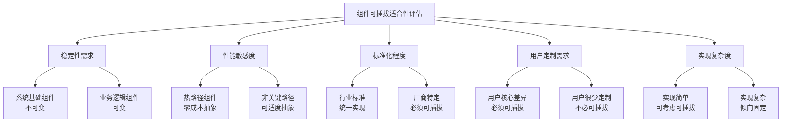
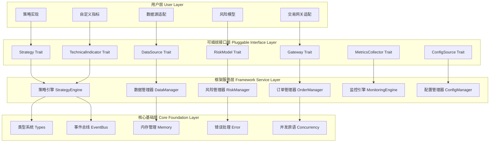

# MosesQuant可插拔设计适合性重新评估

> **文档版本**: v1.0  
> **创建日期**: 2025-07-18  
> **设计理念**: 精准识别真正需要可插拔的组件，避免过度设计  
> **目标**: 在灵活性和复杂性之间找到最优平衡点

## 1. 可插拔适合性评估框架

### 1.1 评估维度



### 1.2 评估标准

| 评估维度 | 权重 | 评分标准 |
|---------|------|---------|
| **稳定性需求** | 25% | 基础组件(-10分), 业务组件(+10分) |
| **性能敏感度** | 30% | 热路径(-15分), 非关键路径(+5分) |
| **标准化程度** | 20% | 行业标准(-8分), 厂商特定(+15分) |
| **用户定制需求** | 20% | 低需求(-5分), 高需求(+20分) |
| **实现复杂度** | 5% | 高复杂度(-3分), 低复杂度(+3分) |

**总分 >= 15分**: 强烈建议可插拔  
**总分 5-14分**: 可考虑可插拔  
**总分 <= 4分**: 不建议可插拔  

## 2. 组件适合性详细评估

### 2.1 绝对不可插拔组件 (❌ 总分 <= 4)

#### 2.1.1 核心类型系统

```rust
// 位置：src/types.rs
// 评估结果：-23分 (绝对不可插拔)

/// 核心价格类型 - 系统基石
pub type Price = rust_decimal::Decimal;
pub type Quantity = rust_decimal::Decimal; 
pub type TimestampNs = i64;

/// 基础市场数据结构
#[derive(Debug, Clone, PartialEq)]
pub struct Bar {
    pub symbol: Symbol,
    pub timestamp: TimestampNs,
    pub open: Price,
    pub high: Price,
    pub low: Price, 
    pub close: Price,
    pub volume: Quantity,
}

#[derive(Debug, Clone, PartialEq)]
pub struct Order {
    pub id: OrderId,
    pub symbol: Symbol,
    pub side: Side,
    pub order_type: OrderType,
    pub quantity: Quantity,
    pub price: Option<Price>,
    pub status: OrderStatus,
}
```

**评分详解**：
- 稳定性需求: -10分 (系统基础)
- 性能敏感度: -15分 (所有操作都依赖)
- 标准化程度: +2分 (有一定标准但各系统略有差异)
- 用户定制需求: -5分 (用户很少需要定制基础类型)
- 实现复杂度: +5分 (类型定义相对简单)
- **总分: -23分**

**结论**: 类型系统是整个框架的基石，所有插件都依赖这些类型，必须保持绝对稳定。

#### 2.1.2 内存管理系统

```rust
// 位置：src/memory.rs  
// 评估结果：-18分 (绝对不可插拔)

/// 高性能对象池
pub struct ObjectPool<T> {
    pool: Arc<Mutex<Vec<T>>>,
    factory: fn() -> T,
    max_size: usize,
}

/// 内存池管理器
pub struct MemoryManager {
    order_pool: ObjectPool<Order>,
    bar_pool: ObjectPool<Bar>,
    position_pool: ObjectPool<Position>,
}
```

**评分详解**：
- 稳定性需求: -10分 (系统基础)
- 性能敏感度: -15分 (性能关键路径)
- 标准化程度: +3分 (内存管理模式相对标准)
- 用户定制需求: +2分 (用户偶有定制需求)
- 实现复杂度: +2分 (实现中等复杂)
- **总分: -18分**

**结论**: 内存管理需要与Rust所有权系统深度集成，可插拔会严重影响性能。

#### 2.1.3 事件总线核心

```rust
// 位置：src/events.rs
// 评估结果：-13分 (不建议可插拔)

/// 事件总线核心调度器
pub struct EventBus {
    event_queue: Arc<AsyncQueue<BoxedEvent>>,
    handlers: Arc<RwLock<HandlerRegistry>>,
    routing_strategy: RoutingStrategy, // 固定策略
    stats: Arc<RwLock<EventStatistics>>,
}

impl EventBus {
    /// 核心事件调度逻辑 - 性能关键
    pub async fn dispatch_event(&self, event: BoxedEvent) -> Result<()> {
        // 固定的高性能调度算法
        match event.priority() {
            EventPriority::Critical => self.dispatch_immediate(event).await,
            EventPriority::High => self.dispatch_high_priority(event).await,
            _ => self.dispatch_normal(event).await,
        }
    }
}
```

**评分详解**：
- 稳定性需求: -10分 (系统核心)
- 性能敏感度: -15分 (所有事件都经过此处)
- 标准化程度: +5分 (事件模式相对标准)
- 用户定制需求: +5分 (用户有一定定制需求)
- 实现复杂度: +2分 (调度逻辑复杂但接口简单)
- **总分: -13分**

**结论**: 事件总线是系统神经中枢，不同的调度策略会影响整体性能和稳定性。

### 2.2 强烈建议可插拔组件 (✅ 总分 >= 15)

#### 2.2.1 策略逻辑系统

```rust
// 位置：src/strategy/traits.rs
// 评估结果：+35分 (强烈建议可插拔)

#[async_trait]
pub trait Strategy: Send + Sync {
    async fn on_data(&mut self, context: &StrategyContext, data: &MarketData) -> Result<Vec<Order>>;
    async fn on_order(&mut self, context: &StrategyContext, order: &Order) -> Result<()>;
    
    fn strategy_id(&self) -> &str;
    fn version(&self) -> &str;
}

// 用户实现示例
pub struct MovingAverageCrossStrategy {
    fast_period: usize,
    slow_period: usize,
    position: f64,
}

pub struct MeanReversionStrategy {
    lookback_window: usize,
    entry_threshold: f64,
    exit_threshold: f64,
}
```

**评分详解**：
- 稳定性需求: +10分 (业务逻辑层)
- 性能敏感度: +5分 (非最关键路径)
- 标准化程度: +15分 (每个用户策略完全不同)
- 用户定制需求: +20分 (这是用户的核心需求)
- 实现复杂度: -15分 (策略逻辑可能很复杂)
- **总分: +35分**

**结论**: 策略是用户最核心的差异化需求，必须完全可插拔。

#### 2.2.2 数据源接口

```rust
// 位置：src/data/traits.rs
// 评估结果：+32分 (强烈建议可插拔)

#[async_trait]
pub trait DataSource: Send + Sync {
    async fn connect(&mut self) -> Result<()>;
    async fn get_historical_data(&self, request: DataRequest) -> Result<Vec<Bar>>;
    async fn subscribe_real_time(&mut self, symbols: Vec<Symbol>) -> Result<()>;
    
    fn source_id(&self) -> &str;
    fn supported_symbols(&self) -> Vec<Symbol>;
}

// 具体实现差异巨大
pub struct BinanceDataSource {
    api_client: BinanceClient,
    websocket: BinanceWebSocket,
}

pub struct AlphaVantageDataSource {
    api_key: String,
    rate_limiter: RateLimiter,
}
```

**评分详解**：
- 稳定性需求: +10分 (外部接口层)
- 性能敏感度: +0分 (I/O密集，抽象开销相对小)
- 标准化程度: +15分 (各数据源API完全不同)
- 用户定制需求: +15分 (用户需要接入各种数据源)
- 实现复杂度: -8分 (网络处理、错误重试等较复杂)
- **总分: +32分**

**结论**: 数据源差异巨大，必须可插拔以支持各种API。

#### 2.2.3 交易网关系统

```rust
// 位置：src/gateway/traits.rs
// 评估结果：+30分 (强烈建议可插拔)

#[async_trait]
pub trait Gateway: Send + Sync {
    async fn submit_order(&mut self, order: Order) -> Result<OrderResponse>;
    async fn cancel_order(&mut self, order_id: &OrderId) -> Result<()>;
    async fn get_positions(&self) -> Result<Vec<Position>>;
    
    fn gateway_id(&self) -> &str;
    fn supported_order_types(&self) -> Vec<OrderType>;
}

// 实现差异极大
pub struct InteractiveBrokersGateway {
    tws_client: TWS_Client,
    account_id: String,
}

pub struct BinanceGateway {
    rest_client: BinanceRestClient,  
    api_credentials: BinanceCredentials,
}
```

**评分详解**：
- 稳定性需求: +10分 (外部接口层)
- 性能敏感度: +0分 (I/O操作，抽象开销可接受)
- 标准化程度: +15分 (各券商接口完全不同)
- 用户定制需求: +15分 (用户需要接入不同券商)
- 实现复杂度: -10分 (订单管理、状态同步复杂)
- **总分: +30分**

**结论**: 交易所接口差异巨大，订单格式和状态管理完全不同。

### 2.3 需要重新考虑的组件 (⚠️ 总分 5-14)

#### 2.3.1 配置系统

```rust
// 位置：src/config.rs
// 评估结果：+8分 (可考虑部分可插拔)

/// 当前设计：完全固定
pub struct ConfigLoader {
    config_paths: Vec<PathBuf>,
    validation_rules: Vec<ConfigValidator>,
}

/// 优化建议：配置源可插拔，核心逻辑固定
#[async_trait]
pub trait ConfigSource: Send + Sync {
    async fn load_config(&self) -> Result<Value>;
    fn source_type(&self) -> ConfigSourceType;
}

pub struct FileConfigSource { path: PathBuf }
pub struct EtcdConfigSource { endpoints: Vec<String> }
pub struct VaultConfigSource { vault_client: VaultClient }

// 但解析和验证逻辑保持固定
pub struct ConfigManager {
    sources: Vec<Box<dyn ConfigSource>>,
    parser: ConfigParser,        // 固定
    validator: ConfigValidator,  // 固定
}
```

**重新设计原因**：
- 配置来源确实可能多样化（文件、数据库、配置中心）
- 但配置格式和验证逻辑应该统一
- **结论**: 配置源可插拔，解析器固定

#### 2.3.2 监控系统

```rust
// 位置：src/monitoring.rs
// 评估结果：+12分 (指标收集可插拔)

/// 当前设计：全部可插拔
pub trait Monitor: Send + Sync {
    async fn collect_metrics(&self) -> Result<Vec<Metric>>;
}

/// 优化建议：指标收集可插拔，聚合逻辑固定
#[async_trait]
pub trait MetricsCollector: Send + Sync {
    async fn collect(&self) -> Result<Vec<Metric>>;
    fn collector_id(&self) -> &str;
}

// 具体收集器可插拔
pub struct PerformanceMetricsCollector;
pub struct RiskMetricsCollector;
pub struct CustomMetricsCollector;

// 但核心聚合和存储逻辑固定
pub struct MonitoringEngine {
    collectors: Vec<Box<dyn MetricsCollector>>,
    aggregator: MetricsAggregator,    // 固定
    storage: MetricsStorage,          // 固定  
    alerting: AlertingEngine,         // 固定
}
```

**重新设计原因**：
- 指标收集确实因业务而异
- 但聚合、存储、告警逻辑相对标准化
- **结论**: 指标收集可插拔，处理引擎固定

#### 2.3.3 日志系统

```rust
// 位置：src/logging.rs
// 评估结果：+6分 (不建议可插拔)

/// 当前设计：可能过度设计了
pub trait Logger: Send + Sync {
    fn log(&self, level: LogLevel, message: &str);
}

/// 优化建议：使用标准日志库，不需要可插拔
use tracing::{info, warn, error, debug};

pub struct LoggingConfig {
    pub level: LevelFilter,
    pub format: LogFormat,
    pub outputs: Vec<LogOutput>,  // 文件、控制台、网络
}

// 直接使用tracing生态，无需自定义抽象
pub fn init_logging(config: LoggingConfig) -> Result<()> {
    let subscriber = tracing_subscriber::fmt()
        .with_max_level(config.level)
        .finish();
    tracing::subscriber::set_global_default(subscriber)?;
    Ok(())
}
```

**重新设计原因**：
- 日志是相对标准化的功能
- Rust生态已有成熟的tracing库
- 自定义抽象增加复杂度但价值有限
- **结论**: 使用标准库，不做可插拔抽象

#### 2.3.4 风险模型系统

```rust
// 位置：src/risk/traits.rs
// 评估结果：+25分 (确实需要可插拔)

/// 保持可插拔设计
#[async_trait]
pub trait RiskModel: Send + Sync {
    async fn check_order_risk(&self, order: &Order, context: &RiskContext) -> Result<RiskCheckResult>;
    async fn assess_portfolio_risk(&self, portfolio: &Portfolio) -> Result<RiskAssessment>;
    
    fn model_id(&self) -> &str;
    fn risk_categories(&self) -> Vec<RiskCategory>;
}

// 用户实现差异很大
pub struct VaRRiskModel {
    confidence_level: f64,
    lookback_window: usize,
}

pub struct PositionSizeRiskModel {
    max_single_position: f64,
    max_sector_exposure: f64,
}

pub struct DrawdownRiskModel {
    max_daily_drawdown: f64,
    max_total_drawdown: f64,
}
```

**确认可插拔原因**：
- 不同机构的风险管理要求差异巨大
- 监管要求因地区而异
- 风险模型是重要的差异化竞争力
- **结论**: 确认保持可插拔设计

## 3. 优化后的整体架构

### 3.1 新的架构分层



### 3.2 优化原则总结

1. **核心基础层**: 绝对稳定，零成本抽象，性能优先
2. **框架服务层**: 提供统一服务，集成多个插件，逻辑相对固定
3. **可插拔接口层**: 精心设计的扩展点，接口稳定，实现自由
4. **用户层**: 完全的实现自由，框架提供最大灵活性

### 3.3 可插拔组件最终清单

| 组件类别 | 可插拔程度 | 设计原因 |
|---------|-----------|---------|
| **策略逻辑** | ✅ 完全可插拔 | 用户核心差异化需求 |
| **数据源** | ✅ 完全可插拔 | 外部API差异巨大 |
| **交易网关** | ✅ 完全可插拔 | 券商接口千差万别 |
| **风险模型** | ✅ 完全可插拔 | 风险要求因机构而异 |
| **技术指标** | ✅ 完全可插拔 | 用户创新需求旺盛 |
| **指标收集** | ⚠️ 部分可插拔 | 收集逻辑可变，处理固定 |
| **配置源** | ⚠️ 部分可插拔 | 来源可变，解析统一 |
| **类型系统** | ❌ 完全固定 | 系统基石，必须统一 |
| **事件总线** | ❌ 完全固定 | 性能关键，需要稳定 |
| **内存管理** | ❌ 完全固定 | 与Rust深度集成 |
| **日志系统** | ❌ 使用标准库 | 标准化程度高 |

这样的重新设计既保证了核心的稳定性和性能，又在真正需要的地方提供了最大的灵活性。避免了过度设计，降低了系统复杂度。