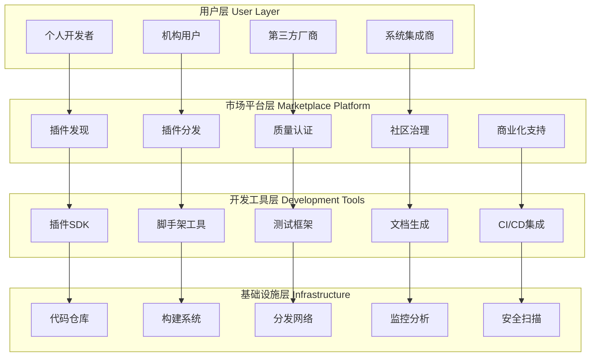

# 插件市场和生态系统设计

> **文档版本**: v1.0  
> **创建日期**: 2025-07-18  
> **设计理念**: 构建健康、可持续的插件生态系统  
> **目标**: 促进社区创新，提供高质量插件，支持商业可持续发展

## 1. 生态系统架构概览

### 1.1 生态系统分层架构



### 1.2 生态系统关键组件

```rust
/// 生态系统管理器 - 统筹整个插件生态
pub struct EcosystemManager {
    // 市场平台
    marketplace: Arc<MarketplacePlatform>,
    
    // 质量保证系统
    quality_assurance: Arc<QualityAssuranceSystem>,
    
    // 社区管理
    community_manager: Arc<CommunityManager>,
    
    // 开发者工具
    developer_tools: Arc<DeveloperToolsuite>,
    
    // 商业化支持
    monetization_engine: Arc<MonetizationEngine>,
    
    // 生态分析
    ecosystem_analytics: Arc<EcosystemAnalytics>,
}

/// 生态系统统计
#[derive(Debug, Clone)]
pub struct EcosystemMetrics {
    pub total_plugins: u64,
    pub active_developers: u64,
    pub plugin_downloads: u64,
    pub community_contributions: u64,
    pub quality_score: f64,
    pub ecosystem_health: EcosystemHealth,
}

#[derive(Debug, Clone)]
pub enum EcosystemHealth {
    Thriving,    // 蓬勃发展
    Growing,     // 稳步增长
    Stable,      // 稳定运行
    Declining,   // 逐渐衰落
    Stagnant,    // 停滞不前
}
```

## 2. 插件市场平台设计

### 2.1 插件发现和搜索系统

```rust
/// 插件市场平台核心
pub struct MarketplacePlatform {
    // 插件注册表
    plugin_registry: Arc<PluginRegistry>,
    
    // 搜索引擎
    search_engine: Arc<PluginSearchEngine>,
    
    // 推荐系统
    recommendation_engine: Arc<RecommendationEngine>,
    
    // 下载管理
    download_manager: Arc<DownloadManager>,
    
    // 评价系统
    rating_system: Arc<RatingSystem>,
}

/// 插件注册表条目
#[derive(Debug, Clone, Serialize, Deserialize)]
pub struct PluginRegistryEntry {
    // 基本信息
    pub plugin_id: PluginId,
    pub name: String,
    pub description: String,
    pub version: semver::Version,
    pub author: Author,
    
    // 分类信息
    pub category: PluginCategory,
    pub tags: Vec<String>,
    pub supported_platforms: Vec<Platform>,
    
    // 质量信息
    pub quality_score: f64,
    pub certification_level: CertificationLevel,
    pub security_scan_result: SecurityScanResult,
    
    // 统计信息
    pub download_count: u64,
    pub rating: f64,
    pub review_count: u32,
    
    // 商业信息
    pub pricing_model: PricingModel,
    pub license: LicenseType,
    
    // 技术信息
    pub dependencies: Vec<PluginDependency>,
    pub compatibility: CompatibilityInfo,
    pub performance_metrics: PerformanceMetrics,
    
    // 时间信息
    pub created_at: i64,
    pub updated_at: i64,
    pub last_verified_at: i64,
}

#[derive(Debug, Clone)]
pub enum PluginCategory {
    Strategy,              // 交易策略
    DataSource,           // 数据源
    Gateway,              // 交易网关  
    RiskModel,            // 风险模型
    TechnicalIndicator,   // 技术指标
    Analytics,            // 分析工具
    Visualization,        // 可视化
    Infrastructure,       // 基础设施
    Utility,              // 实用工具
}

#[derive(Debug, Clone)]
pub enum CertificationLevel {
    Community,        // 社区认证
    Verified,         // 官方验证
    Premium,          // 高级认证
    Enterprise,       // 企业级认证
}

/// 插件搜索引擎
pub struct PluginSearchEngine {
    // 搜索索引
    search_index: Arc<SearchIndex>,
    
    // 查询解析器
    query_parser: Arc<QueryParser>,
    
    // 排序算法
    ranking_algorithm: Arc<RankingAlgorithm>,
    
    // 过滤器
    filters: Vec<Box<dyn SearchFilter>>,
}

impl PluginSearchEngine {
    /// 搜索插件
    pub async fn search_plugins(&self, query: &SearchQuery) -> Result<SearchResults> {
        // 1. 解析查询
        let parsed_query = self.query_parser.parse(query)?;
        
        // 2. 执行搜索
        let initial_results = self.search_index.search(&parsed_query).await?;
        
        // 3. 应用过滤器
        let filtered_results = self.apply_filters(initial_results, &query.filters).await?;
        
        // 4. 排序
        let ranked_results = self.ranking_algorithm.rank(filtered_results, &parsed_query).await?;
        
        // 5. 分页
        let paginated_results = self.paginate(ranked_results, query.page, query.page_size)?;
        
        Ok(SearchResults {
            plugins: paginated_results,
            total_count: filtered_results.len(),
            search_time: std::time::Duration::from_millis(50), // 实际测量
            suggestions: self.generate_suggestions(&parsed_query).await?,
        })
    }
    
    /// 自动完成建议
    pub async fn auto_complete(&self, partial_query: &str) -> Result<Vec<String>> {
        let suggestions = self.search_index.suggest(partial_query, 10).await?;
        Ok(suggestions)
    }
}

/// 搜索查询
#[derive(Debug, Clone)]
pub struct SearchQuery {
    pub query: String,
    pub filters: SearchFilters,
    pub sort_by: SortOption,
    pub page: u32,
    pub page_size: u32,
}

#[derive(Debug, Clone)]
pub struct SearchFilters {
    pub categories: Vec<PluginCategory>,
    pub certification_levels: Vec<CertificationLevel>,
    pub pricing_models: Vec<PricingModel>,
    pub platforms: Vec<Platform>,
    pub min_rating: Option<f64>,
    pub max_price: Option<f64>,
    pub updated_since: Option<i64>,
}

#[derive(Debug, Clone)]
pub enum SortOption {
    Relevance,           // 相关性
    Downloads,           // 下载量
    Rating,              // 评分
    UpdateDate,          // 更新时间
    Price,               // 价格
    Name,                // 名称
}
```

### 2.2 推荐系统

```rust
/// 智能推荐引擎
pub struct RecommendationEngine {
    // 协同过滤
    collaborative_filter: Arc<CollaborativeFilter>,
    
    // 内容推荐
    content_filter: Arc<ContentBasedFilter>,
    
    // 上下文感知
    context_analyzer: Arc<ContextAnalyzer>,
    
    // 推荐缓存
    recommendation_cache: Arc<DashMap<UserId, Vec<PluginRecommendation>>>,
}

impl RecommendationEngine {
    /// 生成个性化推荐
    pub async fn generate_recommendations(
        &self,
        user_id: &UserId,
        context: &UserContext
    ) -> Result<Vec<PluginRecommendation>> {
        // 检查缓存
        if let Some(cached_recommendations) = self.recommendation_cache.get(user_id) {
            if !self.is_cache_expired(&cached_recommendations) {
                return Ok(cached_recommendations.clone());
            }
        }
        
        // 1. 协同过滤推荐
        let collaborative_recs = self.collaborative_filter
            .recommend(user_id, 20).await?;
        
        // 2. 基于内容的推荐
        let content_recs = self.content_filter
            .recommend_by_preferences(user_id, 20).await?;
        
        // 3. 上下文感知推荐
        let context_recs = self.context_analyzer
            .recommend_by_context(user_id, context, 20).await?;
        
        // 4. 融合推荐结果
        let combined_recs = self.combine_recommendations(
            collaborative_recs,
            content_recs,
            context_recs
        ).await?;
        
        // 5. 多样性优化
        let diversified_recs = self.diversify_recommendations(combined_recs).await?;
        
        // 6. 缓存结果
        self.recommendation_cache.insert(user_id.clone(), diversified_recs.clone());
        
        Ok(diversified_recs)
    }
    
    /// 相似插件推荐
    pub async fn find_similar_plugins(
        &self,
        plugin_id: &PluginId,
        limit: usize
    ) -> Result<Vec<PluginSimilarity>> {
        let target_plugin = self.get_plugin_features(plugin_id).await?;
        
        let mut similarities = Vec::new();
        
        // 计算与所有其他插件的相似度
        for other_plugin in self.get_all_plugins().await? {
            if other_plugin.id == *plugin_id {
                continue;
            }
            
            let similarity = self.calculate_plugin_similarity(
                &target_plugin,
                &other_plugin
            ).await?;
            
            if similarity.score > 0.3 {  // 相似度阈值
                similarities.push(PluginSimilarity {
                    plugin_id: other_plugin.id,
                    score: similarity.score,
                    similarity_reasons: similarity.reasons,
                });
            }
        }
        
        // 按相似度排序
        similarities.sort_by(|a, b| b.score.partial_cmp(&a.score).unwrap());
        similarities.truncate(limit);
        
        Ok(similarities)
    }
}

/// 插件推荐
#[derive(Debug, Clone)]
pub struct PluginRecommendation {
    pub plugin_id: PluginId,
    pub recommendation_score: f64,
    pub recommendation_reason: RecommendationReason,
    pub confidence: f64,
}

#[derive(Debug, Clone)]
pub enum RecommendationReason {
    SimilarUsers,           // 相似用户喜欢
    SimilarPlugins,         // 相似插件
    PopularInCategory,      // 分类热门
    RecentlyUpdated,        // 最近更新
    ContextRelevant,        // 上下文相关
    PersonalizedMatch,      // 个性化匹配
}

/// 用户上下文
#[derive(Debug, Clone)]
pub struct UserContext {
    pub current_strategy_type: Option<StrategyType>,
    pub trading_instruments: Vec<Symbol>,
    pub risk_tolerance: RiskTolerance,
    pub experience_level: ExperienceLevel,
    pub preferred_timeframe: TimeFrame,
    pub active_plugins: Vec<PluginId>,
}
```

### 2.3 下载和分发系统

```rust
/// 下载管理器
pub struct DownloadManager {
    // CDN管理
    cdn_manager: Arc<CDNManager>,
    
    // 下载缓存
    download_cache: Arc<DownloadCache>,
    
    // 带宽管理
    bandwidth_manager: Arc<BandwidthManager>,
    
    // 下载统计
    download_stats: Arc<RwLock<HashMap<PluginId, DownloadStatistics>>>,
}

impl DownloadManager {
    /// 下载插件
    pub async fn download_plugin(
        &self,
        user_id: &UserId,
        plugin_id: &PluginId,
        version: &semver::Version
    ) -> Result<DownloadResult> {
        // 1. 验证用户权限
        self.verify_download_permission(user_id, plugin_id).await?;
        
        // 2. 检查本地缓存
        if let Some(cached_file) = self.download_cache.get(plugin_id, version).await? {
            return Ok(DownloadResult {
                file_path: cached_file,
                download_time: Duration::from_millis(0),
                source: DownloadSource::Cache,
            });
        }
        
        // 3. 选择最优CDN节点
        let cdn_node = self.cdn_manager.select_optimal_node(user_id).await?;
        
        // 4. 执行下载
        let download_start = Instant::now();
        let file_path = self.download_from_cdn(
            &cdn_node,
            plugin_id,
            version
        ).await?;
        
        // 5. 验证下载文件
        self.verify_downloaded_file(&file_path, plugin_id, version).await?;
        
        // 6. 更新缓存
        self.download_cache.store(plugin_id, version, &file_path).await?;
        
        // 7. 更新统计
        self.update_download_stats(plugin_id, user_id).await;
        
        Ok(DownloadResult {
            file_path,
            download_time: download_start.elapsed(),
            source: DownloadSource::CDN(cdn_node.id),
        })
    }
    
    /// 批量下载插件
    pub async fn download_plugins_batch(
        &self,
        user_id: &UserId,
        plugin_requests: Vec<PluginDownloadRequest>
    ) -> Result<Vec<DownloadResult>> {
        // 并行下载多个插件
        let download_futures = plugin_requests.into_iter()
            .map(|request| {
                self.download_plugin(user_id, &request.plugin_id, &request.version)
            })
            .collect::<Vec<_>>();
        
        let results = futures::future::join_all(download_futures).await;
        
        // 收集成功的下载
        let mut successful_downloads = Vec::new();
        let mut failed_downloads = Vec::new();
        
        for result in results {
            match result {
                Ok(download_result) => successful_downloads.push(download_result),
                Err(e) => failed_downloads.push(e),
            }
        }
        
        if !failed_downloads.is_empty() {
            warn!("Some downloads failed: {:?}", failed_downloads);
        }
        
        Ok(successful_downloads)
    }
}

/// CDN管理器
pub struct CDNManager {
    // CDN节点
    cdn_nodes: Arc<RwLock<Vec<CDNNode>>>,
    
    // 节点选择器
    node_selector: Arc<NodeSelector>,
    
    // 健康检查器
    health_checker: Arc<HealthChecker>,
}

#[derive(Debug, Clone)]
pub struct CDNNode {
    pub id: String,
    pub region: String,
    pub endpoint: String,
    pub capacity: u64,
    pub current_load: AtomicU64,
    pub health_status: AtomicBool,
    pub latency_ms: AtomicU64,
}

impl CDNManager {
    /// 选择最优CDN节点
    pub async fn select_optimal_node(&self, user_id: &UserId) -> Result<CDNNode> {
        let nodes = self.cdn_nodes.read().await;
        let user_location = self.get_user_location(user_id).await?;
        
        // 过滤健康的节点
        let healthy_nodes: Vec<&CDNNode> = nodes.iter()
            .filter(|node| node.health_status.load(Ordering::Relaxed))
            .collect();
        
        if healthy_nodes.is_empty() {
            return Err(CzscError::NoCDNNodesAvailable);
        }
        
        // 选择最优节点（考虑延迟、负载、地理位置）
        let optimal_node = self.node_selector.select_best_node(
            &healthy_nodes,
            &user_location
        ).await?;
        
        Ok(optimal_node.clone())
    }
    
    /// 节点健康检查
    pub async fn check_nodes_health(&self) -> Result<()> {
        let nodes = self.cdn_nodes.read().await;
        
        for node in nodes.iter() {
            let health_status = self.health_checker.check_node_health(node).await?;
            node.health_status.store(health_status.is_healthy, Ordering::Relaxed);
            node.latency_ms.store(health_status.latency_ms, Ordering::Relaxed);
        }
        
        Ok(())
    }
}
```

## 3. 质量保证和认证系统

### 3.1 自动化质量检查

```rust
/// 质量保证系统
pub struct QualityAssuranceSystem {
    // 静态代码分析
    static_analyzer: Arc<StaticCodeAnalyzer>,
    
    // 安全扫描器
    security_scanner: Arc<SecurityScanner>,
    
    // 性能测试器
    performance_tester: Arc<PerformanceTester>,
    
    // 兼容性测试器
    compatibility_tester: Arc<CompatibilityTester>,
    
    // 质量评分器
    quality_scorer: Arc<QualityScorer>,
}

impl QualityAssuranceSystem {
    /// 全面质量检查
    pub async fn comprehensive_quality_check(
        &self,
        plugin_package: &PluginPackage
    ) -> Result<QualityReport> {
        // 1. 静态代码分析
        let static_analysis = self.static_analyzer
            .analyze_code(&plugin_package.source_code).await?;
        
        // 2. 安全扫描
        let security_scan = self.security_scanner
            .scan_for_vulnerabilities(&plugin_package.binary).await?;
        
        // 3. 性能测试
        let performance_test = self.performance_tester
            .benchmark_plugin(&plugin_package.binary).await?;
        
        // 4. 兼容性测试
        let compatibility_test = self.compatibility_tester
            .test_compatibility(&plugin_package.metadata).await?;
        
        // 5. 计算质量评分
        let quality_score = self.quality_scorer.calculate_score(
            &static_analysis,
            &security_scan,
            &performance_test,
            &compatibility_test
        ).await?;
        
        Ok(QualityReport {
            plugin_id: plugin_package.metadata.id.clone(),
            overall_score: quality_score.overall_score,
            static_analysis,
            security_scan,
            performance_test,
            compatibility_test,
            quality_score,
            certification_recommendation: self.recommend_certification_level(&quality_score).await?,
            improvement_suggestions: self.generate_improvement_suggestions(&quality_score).await?,
            checked_at: chrono::Utc::now().timestamp(),
        })
    }
}

/// 静态代码分析器
pub struct StaticCodeAnalyzer {
    // Clippy集成
    clippy_analyzer: Arc<ClippyAnalyzer>,
    
    // 代码复杂度分析
    complexity_analyzer: Arc<ComplexityAnalyzer>,
    
    // 依赖分析器
    dependency_analyzer: Arc<DependencyAnalyzer>,
    
    // 文档检查器
    documentation_checker: Arc<DocumentationChecker>,
}

impl StaticCodeAnalyzer {
    /// 分析代码质量
    pub async fn analyze_code(&self, source_code: &SourceCode) -> Result<StaticAnalysisResult> {
        // 1. Clippy检查
        let clippy_result = self.clippy_analyzer.analyze(source_code).await?;
        
        // 2. 复杂度分析
        let complexity_result = self.complexity_analyzer.analyze(source_code).await?;
        
        // 3. 依赖分析
        let dependency_result = self.dependency_analyzer.analyze(source_code).await?;
        
        // 4. 文档检查
        let documentation_result = self.documentation_checker.check(source_code).await?;
        
        Ok(StaticAnalysisResult {
            clippy_warnings: clippy_result.warnings,
            complexity_metrics: complexity_result.metrics,
            dependency_issues: dependency_result.issues,
            documentation_coverage: documentation_result.coverage,
            maintainability_score: self.calculate_maintainability_score(
                &clippy_result,
                &complexity_result,
                &documentation_result
            ).await?,
        })
    }
}

/// 安全扫描器
pub struct SecurityScanner {
    // 漏洞数据库
    vulnerability_db: Arc<VulnerabilityDatabase>,
    
    // 二进制分析器
    binary_analyzer: Arc<BinaryAnalyzer>,
    
    // 依赖扫描器
    dependency_scanner: Arc<DependencyScanner>,
    
    // 权限分析器
    permission_analyzer: Arc<PermissionAnalyzer>,
}

impl SecurityScanner {
    /// 安全漏洞扫描
    pub async fn scan_for_vulnerabilities(
        &self,
        plugin_binary: &PluginBinary
    ) -> Result<SecurityScanResult> {
        // 1. 二进制分析
        let binary_analysis = self.binary_analyzer.analyze(plugin_binary).await?;
        
        // 2. 依赖漏洞扫描
        let dependency_scan = self.dependency_scanner
            .scan_dependencies(&plugin_binary.dependencies).await?;
        
        // 3. 权限分析
        let permission_analysis = self.permission_analyzer
            .analyze_permissions(&plugin_binary.manifest).await?;
        
        // 4. 已知漏洞检查
        let known_vulnerabilities = self.vulnerability_db
            .check_vulnerabilities(&plugin_binary.checksum).await?;
        
        let security_score = self.calculate_security_score(
            &binary_analysis,
            &dependency_scan,
            &permission_analysis,
            &known_vulnerabilities
        ).await?;
        
        Ok(SecurityScanResult {
            security_score,
            vulnerabilities: known_vulnerabilities,
            suspicious_patterns: binary_analysis.suspicious_patterns,
            dependency_issues: dependency_scan.issues,
            permission_warnings: permission_analysis.warnings,
            recommendations: self.generate_security_recommendations(
                &binary_analysis,
                &dependency_scan,
                &permission_analysis
            ).await?,
        })
    }
}

/// 性能测试器
pub struct PerformanceTester {
    // 基准测试套件
    benchmark_suite: Arc<BenchmarkSuite>,
    
    // 内存分析器
    memory_profiler: Arc<MemoryProfiler>,
    
    // CPU分析器
    cpu_profiler: Arc<CpuProfiler>,
    
    // 负载测试器
    load_tester: Arc<LoadTester>,
}

impl PerformanceTester {
    /// 性能基准测试
    pub async fn benchmark_plugin(&self, plugin_binary: &PluginBinary) -> Result<PerformanceTestResult> {
        // 1. 基础性能测试
        let benchmark_result = self.benchmark_suite.run_benchmarks(plugin_binary).await?;
        
        // 2. 内存使用分析
        let memory_profile = self.memory_profiler.profile(plugin_binary).await?;
        
        // 3. CPU使用分析
        let cpu_profile = self.cpu_profiler.profile(plugin_binary).await?;
        
        // 4. 负载测试
        let load_test_result = self.load_tester.test_under_load(plugin_binary).await?;
        
        Ok(PerformanceTestResult {
            benchmark_scores: benchmark_result.scores,
            memory_usage: memory_profile.peak_usage,
            cpu_usage: cpu_profile.average_usage,
            throughput: load_test_result.throughput,
            latency_percentiles: load_test_result.latency_percentiles,
            performance_score: self.calculate_performance_score(
                &benchmark_result,
                &memory_profile,
                &cpu_profile,
                &load_test_result
            ).await?,
            bottlenecks: self.identify_bottlenecks(
                &memory_profile,
                &cpu_profile
            ).await?,
        })
    }
}
```

### 3.2 认证和等级系统

```rust
/// 认证系统
pub struct CertificationSystem {
    // 认证标准
    certification_standards: HashMap<CertificationLevel, CertificationStandard>,
    
    // 认证流程
    certification_workflow: Arc<CertificationWorkflow>,
    
    // 认证审核员
    certification_reviewers: Arc<RwLock<Vec<CertificationReviewer>>>,
    
    // 认证记录
    certification_records: Arc<RwLock<HashMap<PluginId, CertificationRecord>>>,
}

/// 认证标准
#[derive(Debug, Clone)]
pub struct CertificationStandard {
    pub level: CertificationLevel,
    pub requirements: Vec<CertificationRequirement>,
    pub min_quality_score: f64,
    pub required_tests: Vec<TestType>,
    pub review_criteria: Vec<ReviewCriterion>,
    pub validity_duration: Duration,
}

#[derive(Debug, Clone)]
pub struct CertificationRequirement {
    pub requirement_id: String,
    pub description: String,
    pub requirement_type: RequirementType,
    pub mandatory: bool,
    pub verification_method: VerificationMethod,
}

#[derive(Debug, Clone)]
pub enum RequirementType {
    CodeQuality,        // 代码质量
    Security,           // 安全性
    Performance,        // 性能
    Documentation,      // 文档
    Testing,            // 测试覆盖
    Compatibility,      // 兼容性
    UserExperience,     // 用户体验
    BusinessCompliance, // 业务合规
}

impl CertificationSystem {
    /// 申请认证
    pub async fn apply_for_certification(
        &self,
        plugin_id: &PluginId,
        target_level: CertificationLevel,
        application_data: CertificationApplication
    ) -> Result<CertificationApplicationId> {
        // 1. 验证申请资格
        self.verify_application_eligibility(plugin_id, &target_level).await?;
        
        // 2. 获取认证标准
        let standard = self.certification_standards.get(&target_level)
            .ok_or_else(|| CzscError::CertificationStandardNotFound(target_level))?;
        
        // 3. 启动认证流程
        let application_id = self.certification_workflow.start_certification(
            plugin_id.clone(),
            target_level,
            standard.clone(),
            application_data
        ).await?;
        
        info!("Certification application {} started for plugin {}", application_id, plugin_id);
        Ok(application_id)
    }
    
    /// 执行认证评估
    pub async fn perform_certification_assessment(
        &self,
        application_id: &CertificationApplicationId
    ) -> Result<CertificationAssessment> {
        let application = self.certification_workflow
            .get_application(application_id).await?;
        
        let standard = self.certification_standards.get(&application.target_level)
            .ok_or_else(|| CzscError::CertificationStandardNotFound(application.target_level.clone()))?;
        
        // 1. 自动化检查
        let automated_checks = self.run_automated_checks(
            &application.plugin_id,
            &standard.requirements
        ).await?;
        
        // 2. 人工审核
        let manual_review = self.conduct_manual_review(
            &application.plugin_id,
            &standard.review_criteria
        ).await?;
        
        // 3. 合规性检查
        let compliance_check = self.verify_compliance(
            &application.plugin_id,
            &application.target_level
        ).await?;
        
        Ok(CertificationAssessment {
            application_id: application_id.clone(),
            automated_checks,
            manual_review,
            compliance_check,
            overall_score: self.calculate_certification_score(
                &automated_checks,
                &manual_review,
                &compliance_check
            ).await?,
            recommendation: self.make_certification_recommendation(
                &automated_checks,
                &manual_review,
                &compliance_check,
                standard
            ).await?,
        })
    }
    
    /// 颁发认证
    pub async fn issue_certification(
        &self,
        assessment: &CertificationAssessment,
        decision: CertificationDecision
    ) -> Result<CertificationRecord> {
        match decision {
            CertificationDecision::Approved => {
                let certificate = CertificationRecord {
                    plugin_id: assessment.plugin_id.clone(),
                    certification_level: assessment.target_level.clone(),
                    certificate_id: CertificateId::new(),
                    issued_at: chrono::Utc::now().timestamp(),
                    expires_at: chrono::Utc::now().timestamp() + 365 * 24 * 3600, // 1年有效期
                    assessment_score: assessment.overall_score,
                    issued_by: self.get_certifying_authority().await?,
                    validity_status: CertificationStatus::Valid,
                };
                
                // 记录认证
                self.certification_records.write().await
                    .insert(assessment.plugin_id.clone(), certificate.clone());
                
                info!("Certification issued for plugin {}: Level {:?}", 
                      assessment.plugin_id, assessment.target_level);
                
                Ok(certificate)
            }
            CertificationDecision::Rejected { reasons } => {
                Err(CzscError::CertificationRejected(reasons))
            }
            CertificationDecision::Conditional { conditions } => {
                // 条件性批准，需要满足额外条件
                Err(CzscError::CertificationConditional(conditions))
            }
        }
    }
}

/// 认证决定
#[derive(Debug, Clone)]
pub enum CertificationDecision {
    Approved,
    Rejected { reasons: Vec<String> },
    Conditional { conditions: Vec<String> },
}

/// 认证记录
#[derive(Debug, Clone)]
pub struct CertificationRecord {
    pub plugin_id: PluginId,
    pub certification_level: CertificationLevel,
    pub certificate_id: CertificateId,
    pub issued_at: i64,
    pub expires_at: i64,
    pub assessment_score: f64,
    pub issued_by: CertifyingAuthority,
    pub validity_status: CertificationStatus,
}

#[derive(Debug, Clone)]
pub enum CertificationStatus {
    Valid,              // 有效
    Expired,            // 已过期
    Revoked,            // 已撤销
    Suspended,          // 已暂停
    UnderReview,        // 复审中
}
```

## 4. 社区管理和治理

### 4.1 社区治理结构

```rust
/// 社区管理器
pub struct CommunityManager {
    // 治理委员会
    governance_council: Arc<GovernanceCouncil>,
    
    // 贡献者管理
    contributor_manager: Arc<ContributorManager>,
    
    // 社区论坛
    community_forum: Arc<CommunityForum>,
    
    // 活动管理
    event_manager: Arc<EventManager>,
    
    // 争议解决
    dispute_resolver: Arc<DisputeResolver>,
}

/// 治理委员会
pub struct GovernanceCouncil {
    // 委员会成员
    council_members: Arc<RwLock<Vec<CouncilMember>>>,
    
    // 决策流程
    decision_process: Arc<DecisionProcess>,
    
    // 投票系统
    voting_system: Arc<VotingSystem>,
    
    // 政策管理
    policy_manager: Arc<PolicyManager>,
}

#[derive(Debug, Clone)]
pub struct CouncilMember {
    pub member_id: UserId,
    pub name: String,
    pub role: CouncilRole,
    pub voting_weight: f64,
    pub term_start: i64,
    pub term_end: i64,
    pub expertise_areas: Vec<ExpertiseArea>,
}

#[derive(Debug, Clone)]
pub enum CouncilRole {
    Chair,                  // 主席
    TechnicalLead,         // 技术负责人
    CommunityRepresentative, // 社区代表
    SecurityOfficer,       // 安全官
    BusinessAdvisor,       // 商业顾问
}

impl GovernanceCouncil {
    /// 提出提案
    pub async fn submit_proposal(&self, proposal: Proposal) -> Result<ProposalId> {
        // 1. 验证提案格式
        self.validate_proposal(&proposal).await?;
        
        // 2. 检查提案者资格
        self.verify_proposer_eligibility(&proposal.proposer).await?;
        
        // 3. 启动提案流程
        let proposal_id = self.decision_process.start_proposal(proposal).await?;
        
        // 4. 通知相关方
        self.notify_stakeholders(&proposal_id).await?;
        
        Ok(proposal_id)
    }
    
    /// 投票表决
    pub async fn vote_on_proposal(
        &self,
        proposal_id: &ProposalId,
        voter_id: &UserId,
        vote: Vote
    ) -> Result<()> {
        // 1. 验证投票者资格
        self.verify_voter_eligibility(voter_id, proposal_id).await?;
        
        // 2. 检查投票期限
        self.check_voting_deadline(proposal_id).await?;
        
        // 3. 记录投票
        self.voting_system.cast_vote(proposal_id, voter_id, vote).await?;
        
        // 4. 检查是否达到决策条件
        if self.voting_system.is_decision_reached(proposal_id).await? {
            self.finalize_proposal_decision(proposal_id).await?;
        }
        
        Ok(())
    }
}

/// 提案系统
#[derive(Debug, Clone)]
pub struct Proposal {
    pub proposer: UserId,
    pub title: String,
    pub description: String,
    pub proposal_type: ProposalType,
    pub impact_assessment: ImpactAssessment,
    pub implementation_plan: ImplementationPlan,
    pub voting_deadline: i64,
}

#[derive(Debug, Clone)]
pub enum ProposalType {
    PolicyChange,           // 政策变更
    TechnicalStandard,     // 技术标准
    CertificationCriteria, // 认证标准
    CommunityGuideline,    // 社区指导原则
    EcosystemImprovement,  // 生态改进
    ConflictResolution,    // 冲突解决
}

#[derive(Debug, Clone)]
pub struct Vote {
    pub decision: VoteDecision,
    pub reasoning: Option<String>,
    pub weight: f64,
}

#[derive(Debug, Clone)]
pub enum VoteDecision {
    Approve,
    Reject,
    Abstain,
    ConditionalApprove { conditions: Vec<String> },
}
```

### 4.2 贡献者激励系统

```rust
/// 贡献者管理器
pub struct ContributorManager {
    // 贡献者注册表
    contributor_registry: Arc<RwLock<HashMap<UserId, Contributor>>>,
    
    // 激励系统
    incentive_system: Arc<IncentiveSystem>,
    
    // 声誉系统
    reputation_system: Arc<ReputationSystem>,
    
    // 成就系统
    achievement_system: Arc<AchievementSystem>,
}

#[derive(Debug, Clone)]
pub struct Contributor {
    pub user_id: UserId,
    pub username: String,
    pub contributor_level: ContributorLevel,
    pub specializations: Vec<Specialization>,
    pub contribution_history: Vec<Contribution>,
    pub reputation_score: f64,
    pub achievements: Vec<Achievement>,
    pub joined_at: i64,
}

#[derive(Debug, Clone)]
pub enum ContributorLevel {
    Newcomer,           // 新手
    Regular,            // 常规贡献者
    Trusted,            // 受信任贡献者
    Expert,             // 专家
    Maintainer,         // 维护者
    CoreTeam,           // 核心团队
}

#[derive(Debug, Clone)]
pub enum Specialization {
    StrategyDevelopment,    // 策略开发
    DataIntegration,        // 数据集成
    SecurityAuditing,       // 安全审计
    PerformanceOptimization, // 性能优化
    UserExperience,         // 用户体验
    Documentation,          // 文档编写
    Testing,                // 测试
    CommunitySupport,       // 社区支持
}

/// 激励系统
pub struct IncentiveSystem {
    // 激励规则
    incentive_rules: Arc<RwLock<Vec<IncentiveRule>>>,
    
    // 奖励池
    reward_pool: Arc<RewardPool>,
    
    // 分发机制
    distribution_mechanism: Arc<DistributionMechanism>,
}

impl IncentiveSystem {
    /// 记录贡献并分发奖励
    pub async fn record_contribution_and_reward(
        &self,
        contributor_id: &UserId,
        contribution: Contribution
    ) -> Result<RewardDistribution> {
        // 1. 验证贡献的有效性
        self.validate_contribution(&contribution).await?;
        
        // 2. 计算贡献价值
        let contribution_value = self.calculate_contribution_value(&contribution).await?;
        
        // 3. 应用激励规则
        let applicable_rules = self.find_applicable_rules(&contribution).await?;
        let total_reward = self.calculate_total_reward(&contribution_value, &applicable_rules).await?;
        
        // 4. 分发奖励
        let distribution = self.distribution_mechanism.distribute_reward(
            contributor_id,
            total_reward,
            &contribution
        ).await?;
        
        // 5. 更新贡献者记录
        self.update_contributor_record(contributor_id, &contribution, &distribution).await?;
        
        Ok(distribution)
    }
}

#[derive(Debug, Clone)]
pub struct Contribution {
    pub contribution_id: String,
    pub contributor_id: UserId,
    pub contribution_type: ContributionType,
    pub value_metrics: ValueMetrics,
    pub quality_score: f64,
    pub impact_score: f64,
    pub created_at: i64,
}

#[derive(Debug, Clone)]
pub enum ContributionType {
    PluginDevelopment {
        plugin_id: PluginId,
        lines_of_code: u32,
        complexity_score: f64,
    },
    BugFix {
        issue_id: String,
        severity: BugSeverity,
        fix_quality: f64,
    },
    Documentation {
        doc_type: DocumentationType,
        word_count: u32,
        clarity_score: f64,
    },
    CodeReview {
        reviewed_plugin: PluginId,
        review_quality: f64,
        issues_found: u32,
    },
    CommunitySupport {
        support_type: SupportType,
        users_helped: u32,
        satisfaction_score: f64,
    },
    SecurityAudit {
        audited_plugin: PluginId,
        vulnerabilities_found: u32,
        audit_depth: AuditDepth,
    },
}

/// 声誉系统
pub struct ReputationSystem {
    // 声誉计算器
    reputation_calculator: Arc<ReputationCalculator>,
    
    // 声誉历史
    reputation_history: Arc<RwLock<HashMap<UserId, Vec<ReputationChange>>>>,
    
    // 信任网络
    trust_network: Arc<TrustNetwork>,
}

impl ReputationSystem {
    /// 更新声誉分数
    pub async fn update_reputation(
        &self,
        user_id: &UserId,
        reputation_event: ReputationEvent
    ) -> Result<f64> {
        // 1. 计算声誉变化
        let reputation_change = self.reputation_calculator
            .calculate_change(&reputation_event).await?;
        
        // 2. 应用信任网络影响
        let trust_adjusted_change = self.trust_network
            .apply_trust_adjustment(user_id, reputation_change).await?;
        
        // 3. 更新声誉分数
        let new_reputation = self.apply_reputation_change(user_id, trust_adjusted_change).await?;
        
        // 4. 记录声誉历史
        self.record_reputation_change(user_id, &reputation_event, trust_adjusted_change).await?;
        
        Ok(new_reputation)
    }
}

#[derive(Debug, Clone)]
pub struct ReputationEvent {
    pub event_type: ReputationEventType,
    pub impact_magnitude: f64,
    pub source: ReputationSource,
    pub timestamp: i64,
}

#[derive(Debug, Clone)]
pub enum ReputationEventType {
    PositiveContribution,   // 积极贡献
    QualityWork,           // 高质量工作
    CommunityLeadership,   // 社区领导力
    TechnicalExpertise,    // 技术专长
    NegativeBehavior,      // 消极行为
    QualityIssues,         // 质量问题
    PolicyViolation,       // 违反政策
}

#[derive(Debug, Clone)]
pub enum ReputationSource {
    PeerReview,            // 同行评议
    AutomatedAssessment,   // 自动评估
    CommunityFeedback,     // 社区反馈
    OfficialRecognition,   // 官方认可
}
```

## 5. 商业化和货币化模型

### 5.1 多元化定价模型

```rust
/// 货币化引擎
pub struct MonetizationEngine {
    // 定价管理器
    pricing_manager: Arc<PricingManager>,
    
    // 支付处理器
    payment_processor: Arc<PaymentProcessor>,
    
    // 订阅管理器
    subscription_manager: Arc<SubscriptionManager>,
    
    // 收入分配器
    revenue_distributor: Arc<RevenueDistributor>,
    
    // 许可证管理器
    license_manager: Arc<LicenseManager>,
}

/// 定价模型
#[derive(Debug, Clone)]
pub enum PricingModel {
    Free,                          // 免费
    OneTime { price: Price },      // 一次性付费
    Subscription {                 // 订阅模式
        monthly_price: Price,
        annual_price: Option<Price>,
        tiers: Vec<SubscriptionTier>,
    },
    PayPerUse {                    // 按使用付费
        unit_price: Price,
        usage_unit: UsageUnit,
        free_tier: Option<u64>,
    },
    Freemium {                     // 免费增值
        free_features: Vec<Feature>,
        premium_price: Price,
        premium_features: Vec<Feature>,
    },
    Revenue_Sharing {              // 收入分成
        percentage: f64,
        minimum_fee: Option<Price>,
        maximum_fee: Option<Price>,
    },
    Enterprise {                   // 企业定制
        base_price: Price,
        custom_pricing: bool,
        volume_discounts: Vec<VolumeDiscount>,
    },
}

#[derive(Debug, Clone)]
pub struct SubscriptionTier {
    pub tier_name: String,
    pub monthly_price: Price,
    pub features: Vec<Feature>,
    pub usage_limits: UsageLimits,
    pub support_level: SupportLevel,
}

#[derive(Debug, Clone)]
pub enum UsageUnit {
    PerTransaction,        // 每笔交易
    PerStrategy,          // 每个策略
    PerDataPoint,         // 每个数据点
    PerComputeHour,       // 每计算小时
    PerAPICall,           // 每API调用
}

impl PricingManager {
    /// 计算插件价格
    pub async fn calculate_price(
        &self,
        plugin_id: &PluginId,
        user_id: &UserId,
        usage_context: &UsageContext
    ) -> Result<PricingQuote> {
        let plugin_pricing = self.get_plugin_pricing(plugin_id).await?;
        let user_profile = self.get_user_profile(user_id).await?;
        
        match &plugin_pricing.model {
            PricingModel::Free => {
                Ok(PricingQuote {
                    total_price: Price::zero(),
                    pricing_breakdown: vec![],
                    discounts_applied: vec![],
                    payment_schedule: PaymentSchedule::None,
                })
            }
            PricingModel::OneTime { price } => {
                let discounted_price = self.apply_discounts(
                    *price,
                    &user_profile,
                    &plugin_pricing.available_discounts
                ).await?;
                
                Ok(PricingQuote {
                    total_price: discounted_price.final_price,
                    pricing_breakdown: vec![
                        PricingComponent {
                            component_type: "base_price".to_string(),
                            amount: *price,
                        }
                    ],
                    discounts_applied: discounted_price.applied_discounts,
                    payment_schedule: PaymentSchedule::Immediate,
                })
            }
            PricingModel::Subscription { monthly_price, annual_price, tiers } => {
                // 根据用户需求选择合适的订阅层级
                let selected_tier = self.select_optimal_tier(
                    tiers,
                    &user_profile,
                    usage_context
                ).await?;
                
                self.calculate_subscription_price(&selected_tier, &user_profile).await
            }
            PricingModel::PayPerUse { unit_price, usage_unit, free_tier } => {
                let estimated_usage = self.estimate_usage(
                    user_id,
                    plugin_id,
                    usage_context
                ).await?;
                
                let billable_usage = if let Some(free_limit) = free_tier {
                    estimated_usage.saturating_sub(*free_limit)
                } else {
                    estimated_usage
                };
                
                Ok(PricingQuote {
                    total_price: unit_price * billable_usage as i64,
                    pricing_breakdown: vec![
                        PricingComponent {
                            component_type: format!("usage_{:?}", usage_unit),
                            amount: unit_price * billable_usage as i64,
                        }
                    ],
                    discounts_applied: vec![],
                    payment_schedule: PaymentSchedule::Monthly,
                })
            }
            _ => {
                // 处理其他定价模型
                self.calculate_custom_pricing(plugin_id, user_id, usage_context).await
            }
        }
    }
}

/// 收入分配系统
pub struct RevenueDistributor {
    // 分配规则
    distribution_rules: Arc<RwLock<HashMap<PluginId, DistributionRule>>>,
    
    // 收入池
    revenue_pools: Arc<RwLock<HashMap<PluginId, RevenuePool>>>,
    
    // 支付计算器
    payout_calculator: Arc<PayoutCalculator>,
}

#[derive(Debug, Clone)]
pub struct DistributionRule {
    pub plugin_id: PluginId,
    pub stakeholders: Vec<Stakeholder>,
    pub distribution_schedule: DistributionSchedule,
    pub minimum_payout: Price,
}

#[derive(Debug, Clone)]
pub struct Stakeholder {
    pub stakeholder_id: String,
    pub stakeholder_type: StakeholderType,
    pub revenue_share: f64,        // 收入分成比例
    pub payout_method: PayoutMethod,
}

#[derive(Debug, Clone)]
pub enum StakeholderType {
    Developer,                     // 开发者
    Platform,                      // 平台
    CommunityFund,                // 社区基金
    SecurityAuditor,              // 安全审计员
    QualityAssurance,             // 质量保证
    MarketingPartner,             // 营销合作伙伴
}

impl RevenueDistributor {
    /// 分配收入
    pub async fn distribute_revenue(
        &self,
        plugin_id: &PluginId,
        revenue_amount: Price,
        revenue_source: RevenueSource
    ) -> Result<Vec<PayoutTransaction>> {
        let distribution_rule = self.distribution_rules.read().await
            .get(plugin_id)
            .ok_or_else(|| CzscError::DistributionRuleNotFound(plugin_id.clone()))?
            .clone();
        
        let mut payout_transactions = Vec::new();
        
        for stakeholder in &distribution_rule.stakeholders {
            let payout_amount = revenue_amount * stakeholder.revenue_share;
            
            if payout_amount >= distribution_rule.minimum_payout {
                let transaction = PayoutTransaction {
                    transaction_id: PayoutTransactionId::new(),
                    plugin_id: plugin_id.clone(),
                    stakeholder_id: stakeholder.stakeholder_id.clone(),
                    amount: payout_amount,
                    revenue_source: revenue_source.clone(),
                    payout_method: stakeholder.payout_method.clone(),
                    scheduled_payout_date: self.calculate_payout_date(
                        &distribution_rule.distribution_schedule
                    ).await?,
                    status: PayoutStatus::Pending,
                };
                
                payout_transactions.push(transaction);
            } else {
                // 金额不足最小支付额，累积到下次支付
                self.accumulate_for_next_payout(
                    plugin_id,
                    &stakeholder.stakeholder_id,
                    payout_amount
                ).await?;
            }
        }
        
        Ok(payout_transactions)
    }
}
```

### 5.2 许可证和知识产权管理

```rust
/// 许可证管理器
pub struct LicenseManager {
    // 许可证注册表
    license_registry: Arc<RwLock<HashMap<PluginId, LicenseInfo>>>,
    
    // 许可证验证器
    license_validator: Arc<LicenseValidator>,
    
    // 知识产权保护
    ip_protection: Arc<IPProtection>,
    
    // 合规检查器
    compliance_checker: Arc<ComplianceChecker>,
}

#[derive(Debug, Clone)]
pub struct LicenseInfo {
    pub plugin_id: PluginId,
    pub license_type: LicenseType,
    pub license_terms: LicenseTerms,
    pub usage_restrictions: Vec<UsageRestriction>,
    pub redistribution_rights: RedistributionRights,
    pub warranty_disclaimer: WarrantyDisclaimer,
    pub liability_limitation: LiabilityLimitation,
}

#[derive(Debug, Clone)]
pub enum LicenseType {
    OpenSource {
        license_name: String,       // MIT, Apache 2.0, GPL v3, etc.
        license_url: String,
    },
    Proprietary {
        custom_terms: String,
        transferable: bool,
    },
    Commercial {
        seat_based: bool,
        concurrent_users: Option<u32>,
        geographic_restrictions: Vec<String>,
    },
    Academic {
        educational_use_only: bool,
        research_permitted: bool,
        commercial_use_forbidden: bool,
    },
    Trial {
        trial_duration: Duration,
        feature_limitations: Vec<String>,
        upgrade_path: Option<LicenseType>,
    },
}

impl LicenseManager {
    /// 验证许可证使用
    pub async fn verify_license_usage(
        &self,
        plugin_id: &PluginId,
        user_id: &UserId,
        usage_context: &UsageContext
    ) -> Result<LicenseVerificationResult> {
        let license_info = self.license_registry.read().await
            .get(plugin_id)
            .ok_or_else(|| CzscError::LicenseNotFound(plugin_id.clone()))?
            .clone();
        
        // 1. 验证基本许可证有效性
        let basic_validation = self.license_validator
            .validate_basic_license(&license_info).await?;
        
        if !basic_validation.is_valid {
            return Ok(LicenseVerificationResult {
                is_valid: false,
                violation_reasons: basic_validation.issues,
                recommended_action: RecommendedAction::ContactSupport,
            });
        }
        
        // 2. 检查用户特定权限
        let user_permissions = self.check_user_permissions(
            user_id,
            &license_info
        ).await?;
        
        // 3. 验证使用上下文
        let context_compliance = self.verify_usage_context(
            usage_context,
            &license_info.usage_restrictions
        ).await?;
        
        // 4. 合规性检查
        let compliance_result = self.compliance_checker
            .check_compliance(&license_info, usage_context).await?;
        
        Ok(LicenseVerificationResult {
            is_valid: user_permissions.granted && context_compliance.compliant && compliance_result.compliant,
            violation_reasons: [
                user_permissions.issues,
                context_compliance.violations,
                compliance_result.violations
            ].concat(),
            recommended_action: self.determine_recommended_action(
                &user_permissions,
                &context_compliance,
                &compliance_result
            ).await?,
        })
    }
    
    /// 生成许可证密钥
    pub async fn generate_license_key(
        &self,
        plugin_id: &PluginId,
        user_id: &UserId,
        license_terms: &LicenseTerms
    ) -> Result<LicenseKey> {
        // 1. 验证许可证颁发权限
        self.verify_license_issuance_authority(plugin_id).await?;
        
        // 2. 生成加密密钥
        let key_data = LicenseKeyData {
            plugin_id: plugin_id.clone(),
            user_id: user_id.clone(),
            issued_at: chrono::Utc::now().timestamp(),
            expires_at: license_terms.expiration_date,
            permissions: license_terms.permissions.clone(),
            usage_limits: license_terms.usage_limits.clone(),
        };
        
        // 3. 数字签名
        let signed_key = self.sign_license_key(&key_data).await?;
        
        // 4. 生成人类可读的许可证密钥
        let license_key = LicenseKey {
            key_id: LicenseKeyId::new(),
            encoded_key: self.encode_license_key(&signed_key).await?,
            key_data,
            digital_signature: signed_key.signature,
        };
        
        // 5. 记录许可证颁发
        self.record_license_issuance(&license_key).await?;
        
        Ok(license_key)
    }
}

/// 知识产权保护系统
pub struct IPProtection {
    // 代码指纹
    code_fingerprinter: Arc<CodeFingerprinter>,
    
    // 抄袭检测
    plagiarism_detector: Arc<PlagiarismDetector>,
    
    // 专利检查
    patent_checker: Arc<PatentChecker>,
    
    // 法律合规
    legal_compliance: Arc<LegalCompliance>,
}

impl IPProtection {
    /// 知识产权检查
    pub async fn check_intellectual_property(
        &self,
        plugin_package: &PluginPackage
    ) -> Result<IPCheckResult> {
        // 1. 生成代码指纹
        let code_fingerprint = self.code_fingerprinter
            .generate_fingerprint(&plugin_package.source_code).await?;
        
        // 2. 抄袭检测
        let plagiarism_result = self.plagiarism_detector
            .detect_plagiarism(&code_fingerprint).await?;
        
        // 3. 专利冲突检查
        let patent_result = self.patent_checker
            .check_patent_conflicts(&plugin_package.functionality_description).await?;
        
        // 4. 法律合规检查
        let legal_result = self.legal_compliance
            .check_legal_compliance(&plugin_package.license_info).await?;
        
        Ok(IPCheckResult {
            code_fingerprint,
            plagiarism_detected: !plagiarism_result.clean,
            plagiarism_matches: plagiarism_result.matches,
            patent_conflicts: patent_result.conflicts,
            legal_compliance: legal_result.compliant,
            risk_assessment: self.assess_ip_risk(
                &plagiarism_result,
                &patent_result,
                &legal_result
            ).await?,
            recommendations: self.generate_ip_recommendations(
                &plagiarism_result,
                &patent_result,
                &legal_result
            ).await?,
        })
    }
}
```

## 6. 开发工具和SDK

### 6.1 插件开发工具套件

```rust
/// 开发工具套件
pub struct DeveloperToolsuite {
    // 脚手架生成器
    scaffold_generator: Arc<ScaffoldGenerator>,
    
    // 代码生成器
    code_generator: Arc<CodeGenerator>,
    
    // 测试框架
    testing_framework: Arc<TestingFramework>,
    
    // 文档生成器
    doc_generator: Arc<DocumentationGenerator>,
    
    // 调试工具
    debug_tools: Arc<DebugTools>,
    
    // 性能分析器
    profiler: Arc<DeveloperProfiler>,
}

/// 脚手架生成器
pub struct ScaffoldGenerator {
    // 模板库
    template_library: Arc<TemplateLibrary>,
    
    // 配置管理器
    config_manager: Arc<ScaffoldConfigManager>,
    
    // 文件生成器
    file_generator: Arc<FileGenerator>,
}

impl ScaffoldGenerator {
    /// 生成插件脚手架
    pub async fn generate_plugin_scaffold(
        &self,
        scaffold_config: &ScaffoldConfig
    ) -> Result<GeneratedProject> {
        // 1. 选择合适的模板
        let template = self.template_library
            .select_template(&scaffold_config.plugin_type).await?;
        
        // 2. 准备模板变量
        let template_vars = self.prepare_template_variables(scaffold_config).await?;
        
        // 3. 生成项目结构
        let project_structure = self.generate_project_structure(
            &template,
            &template_vars
        ).await?;
        
        // 4. 生成源代码文件
        let source_files = self.file_generator
            .generate_source_files(&project_structure, &template_vars).await?;
        
        // 5. 生成配置文件
        let config_files = self.file_generator
            .generate_config_files(&project_structure, &template_vars).await?;
        
        // 6. 生成文档文件
        let doc_files = self.file_generator
            .generate_documentation_files(&project_structure, &template_vars).await?;
        
        // 7. 生成测试文件
        let test_files = self.file_generator
            .generate_test_files(&project_structure, &template_vars).await?;
        
        Ok(GeneratedProject {
            project_name: scaffold_config.plugin_name.clone(),
            project_path: scaffold_config.output_path.clone(),
            source_files,
            config_files,
            doc_files,
            test_files,
            build_script: self.generate_build_script(&template_vars).await?,
            ci_config: self.generate_ci_config(&template_vars).await?,
        })
    }
}

/// 脚手架配置
#[derive(Debug, Clone)]
pub struct ScaffoldConfig {
    pub plugin_name: String,
    pub plugin_type: PluginType,
    pub author_name: String,
    pub author_email: String,
    pub description: String,
    pub version: semver::Version,
    pub license: LicenseType,
    pub output_path: PathBuf,
    
    // 特性选择
    pub features: Vec<PluginFeature>,
    pub dependencies: Vec<PluginDependency>,
    pub target_platforms: Vec<Platform>,
    
    // 高级选项
    pub async_support: bool,
    pub websocket_support: bool,
    pub database_integration: bool,
    pub monitoring_integration: bool,
}

#[derive(Debug, Clone)]
pub enum PluginFeature {
    RealTimeData,              // 实时数据支持
    HistoricalData,            // 历史数据支持
    OrderManagement,           // 订单管理
    RiskManagement,            // 风险管理
    CustomIndicators,          // 自定义指标
    Backtesting,               // 回测支持
    PaperTrading,              // 模拟交易
    WebInterface,              // Web界面
    APIEndpoints,              // API端点
    ConfigurableParameters,    // 可配置参数
}

/// 代码生成器
pub struct CodeGenerator {
    // AST生成器
    ast_generator: Arc<ASTGenerator>,
    
    // 代码模板引擎
    template_engine: Arc<TemplateEngine>,
    
    // 类型推导器
    type_inferencer: Arc<TypeInferencer>,
}

impl CodeGenerator {
    /// 生成接口实现代码
    pub async fn generate_trait_implementation(
        &self,
        trait_name: &str,
        implementation_spec: &ImplementationSpec
    ) -> Result<GeneratedCode> {
        // 1. 解析trait定义
        let trait_definition = self.parse_trait_definition(trait_name).await?;
        
        // 2. 生成方法签名
        let method_signatures = self.generate_method_signatures(&trait_definition).await?;
        
        // 3. 生成方法实现骨架
        let method_implementations = self.generate_method_implementations(
            &method_signatures,
            implementation_spec
        ).await?;
        
        // 4. 生成结构体定义
        let struct_definition = self.generate_struct_definition(
            implementation_spec
        ).await?;
        
        // 5. 生成完整的impl块
        let impl_block = self.generate_impl_block(
            &struct_definition,
            &trait_definition,
            &method_implementations
        ).await?;
        
        Ok(GeneratedCode {
            struct_definition,
            impl_block,
            required_imports: self.calculate_required_imports(&impl_block).await?,
            generated_at: chrono::Utc::now().timestamp(),
        })
    }
    
    /// 生成测试代码
    pub async fn generate_test_code(
        &self,
        target_code: &GeneratedCode,
        test_config: &TestConfig
    ) -> Result<GeneratedTestCode> {
        // 1. 分析目标代码
        let code_analysis = self.analyze_target_code(target_code).await?;
        
        // 2. 生成单元测试
        let unit_tests = self.generate_unit_tests(&code_analysis, test_config).await?;
        
        // 3. 生成集成测试
        let integration_tests = self.generate_integration_tests(&code_analysis, test_config).await?;
        
        // 4. 生成性能测试
        let performance_tests = self.generate_performance_tests(&code_analysis, test_config).await?;
        
        // 5. 生成mock对象
        let mock_objects = self.generate_mock_objects(&code_analysis).await?;
        
        Ok(GeneratedTestCode {
            unit_tests,
            integration_tests,
            performance_tests,
            mock_objects,
            test_helpers: self.generate_test_helpers(&code_analysis).await?,
        })
    }
}
```

### 6.2 持续集成和部署

```rust
/// CI/CD集成系统
pub struct CICDIntegration {
    // 构建管理器
    build_manager: Arc<BuildManager>,
    
    // 测试执行器
    test_executor: Arc<TestExecutor>,
    
    // 部署管道
    deployment_pipeline: Arc<DeploymentPipeline>,
    
    // 质量门控
    quality_gates: Arc<QualityGates>,
}

/// 构建管理器
pub struct BuildManager {
    // 构建环境
    build_environments: Arc<RwLock<HashMap<Platform, BuildEnvironment>>>,
    
    // 构建缓存
    build_cache: Arc<BuildCache>,
    
    // 构建统计
    build_stats: Arc<RwLock<BuildStatistics>>,
}

impl BuildManager {
    /// 执行多平台构建
    pub async fn build_multi_platform(
        &self,
        project_path: &Path,
        target_platforms: Vec<Platform>
    ) -> Result<MultiBuildResult> {
        let mut build_results = HashMap::new();
        let mut build_futures = Vec::new();
        
        // 为每个平台启动并行构建
        for platform in target_platforms {
            let build_future = self.build_for_platform(project_path, &platform);
            build_futures.push((platform, build_future));
        }
        
        // 等待所有构建完成
        for (platform, build_future) in build_futures {
            match build_future.await {
                Ok(result) => {
                    build_results.insert(platform, BuildResult::Success(result));
                }
                Err(e) => {
                    build_results.insert(platform, BuildResult::Failure(e));
                }
            }
        }
        
        Ok(MultiBuildResult {
            builds: build_results,
            overall_success: build_results.values().all(|r| matches!(r, BuildResult::Success(_))),
        })
    }
    
    /// 为特定平台构建
    async fn build_for_platform(
        &self,
        project_path: &Path,
        platform: &Platform
    ) -> Result<PlatformBuildArtifact> {
        // 1. 获取构建环境
        let build_env = self.build_environments.read().await
            .get(platform)
            .ok_or_else(|| CzscError::BuildEnvironmentNotFound(platform.clone()))?
            .clone();
        
        // 2. 检查构建缓存
        let cache_key = self.calculate_cache_key(project_path, platform).await?;
        if let Some(cached_artifact) = self.build_cache.get(&cache_key).await? {
            return Ok(cached_artifact);
        }
        
        // 3. 执行构建
        let build_start = Instant::now();
        let build_commands = self.generate_build_commands(project_path, platform).await?;
        
        let mut build_output = Vec::new();
        for command in build_commands {
            let output = build_env.execute_command(&command).await?;
            build_output.push(output);
        }
        
        // 4. 验证构建结果
        let artifact_path = self.locate_build_artifact(project_path, platform).await?;
        self.verify_build_artifact(&artifact_path).await?;
        
        // 5. 创建构建产物
        let build_artifact = PlatformBuildArtifact {
            platform: platform.clone(),
            artifact_path,
            build_duration: build_start.elapsed(),
            build_output,
            checksum: self.calculate_artifact_checksum(&artifact_path).await?,
        };
        
        // 6. 缓存构建结果
        self.build_cache.store(&cache_key, &build_artifact).await?;
        
        Ok(build_artifact)
    }
}

/// 质量门控系统
pub struct QualityGates {
    // 门控规则
    gate_rules: Arc<RwLock<Vec<QualityGateRule>>>,
    
    // 评估引擎
    evaluation_engine: Arc<EvaluationEngine>,
    
    // 门控历史
    gate_history: Arc<RwLock<Vec<QualityGateExecution>>>,
}

#[derive(Debug, Clone)]
pub struct QualityGateRule {
    pub rule_id: String,
    pub rule_name: String,
    pub gate_type: QualityGateType,
    pub threshold: QualityThreshold,
    pub mandatory: bool,
    pub failure_action: FailureAction,
}

#[derive(Debug, Clone)]
pub enum QualityGateType {
    CodeCoverage,          // 代码覆盖率
    StaticAnalysis,        // 静态分析
    SecurityScan,          // 安全扫描
    PerformanceBenchmark,  // 性能基准
    DependencyCheck,       // 依赖检查
    LicenseCompliance,     // 许可证合规
    DocumentationCoverage, // 文档覆盖率
}

impl QualityGates {
    /// 执行质量门控检查
    pub async fn execute_quality_gates(
        &self,
        plugin_package: &PluginPackage,
        build_results: &MultiBuildResult
    ) -> Result<QualityGateResult> {
        let mut gate_results = Vec::new();
        let gate_rules = self.gate_rules.read().await.clone();
        
        for rule in &gate_rules {
            let gate_result = self.evaluation_engine
                .evaluate_gate(rule, plugin_package, build_results).await?;
            
            gate_results.push(gate_result.clone());
            
            // 如果是强制规则且失败，根据失败动作处理
            if rule.mandatory && !gate_result.passed {
                match &rule.failure_action {
                    FailureAction::Block => {
                        return Ok(QualityGateResult {
                            overall_passed: false,
                            gate_results,
                            blocking_failures: vec![gate_result],
                        });
                    }
                    FailureAction::Warn => {
                        warn!("Quality gate warning: {}", gate_result.message);
                    }
                    FailureAction::Skip => {
                        info!("Quality gate skipped: {}", rule.rule_name);
                    }
                }
            }
        }
        
        let overall_passed = gate_results.iter()
            .filter(|r| r.gate_rule.mandatory)
            .all(|r| r.passed);
        
        Ok(QualityGateResult {
            overall_passed,
            gate_results,
            blocking_failures: vec![],
        })
    }
}
```

## 7. 总结

### 7.1 完整的生态系统架构

这个插件市场和生态系统设计提供了：

| 组件 | 核心功能 | 商业价值 |
|-----|---------|---------|
| **市场平台** | 发现、分发、评价 | 促进插件流通，提升用户体验 |
| **质量保证** | 自动化检查、认证等级 | 保证插件质量，建立信任 |
| **社区治理** | 决策流程、争议解决 | 维护生态健康，促进协作 |
| **商业化支持** | 多元定价、收入分配 | 激励开发者，可持续发展 |
| **开发工具** | 脚手架、测试、CI/CD | 降低开发门槛，提高效率 |
| **知识产权** | 许可证管理、IP保护 | 保护创新成果，合规运营 |

### 7.2 生态系统健康指标

1. **活跃度指标**
   - 插件数量增长率
   - 开发者参与度
   - 下载和使用量
   - 社区贡献频率

2. **质量指标**
   - 平均质量评分
   - 认证插件比例
   - 安全问题发现率
   - 用户满意度

3. **商业指标**
   - 收入增长率
   - 开发者收入分布
   - 付费转化率
   - 市场集中度

### 7.3 可持续发展策略

1. **技术创新** - 持续改进开发工具和平台能力
2. **社区建设** - 培养活跃的开发者和用户社区
3. **质量保证** - 维护高标准的插件质量
4. **商业平衡** - 平衡各方利益，确保生态可持续
5. **开放协作** - 促进开源贡献和知识共享

这样的生态系统设计为MosesQuant提供了强大的扩展能力和商业可持续性，既满足了技术需求，也构建了健康的商业模式。

<function_calls>
<invoke name="TodoWrite">
<parameter name="todos">[{"content": "\u5ba1\u89c6\u6574\u4f53\u67b6\u6784\u7684\u53ef\u63d2\u62d4\u4e00\u81f4\u6027\uff0c\u8bc6\u522b\u8bbe\u8ba1\u76f2\u70b9\u548c\u4e0d\u4e00\u81f4\u4e4b\u5904", "status": "completed", "priority": "high", "id": "1"}, {"content": "\u8bbe\u8ba1\u7edf\u4e00\u7684\u63d2\u4ef6\u751f\u547d\u5468\u671f\u7ba1\u7406\u7cfb\u7edf", "status": "completed", "priority": "high", "id": "2"}, {"content": "\u5b8c\u5584\u8de8\u63d2\u4ef6\u901a\u4fe1\u548c\u4f9d\u8d56\u7ba1\u7406\u673a\u5236", "status": "completed", "priority": "high", "id": "3"}, {"content": "\u8bbe\u8ba1\u63d2\u4ef6\u70ed\u66f4\u65b0\u548c\u7248\u672c\u7ba1\u7406\u7cfb\u7edf", "status": "completed", "priority": "medium", "id": "4"}, {"content": "\u5efa\u7acb\u63d2\u4ef6\u5e02\u573a\u548c\u751f\u6001\u7cfb\u7edf\u8bbe\u8ba1", "status": "completed", "priority": "medium", "id": "5"}]