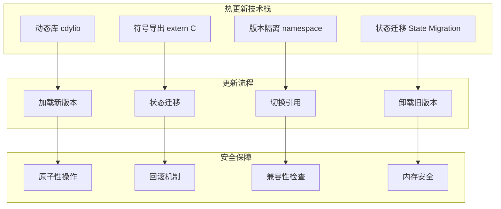

# 插件热更新与版本管理系统设计

> **文档版本**: v1.0  
> **创建日期**: 2025-07-18  
> **设计理念**: 基于Rust动态库的安全热更新机制  
> **目标**: 实现生产环境下的无停机插件更新和版本管理

## 1. 热更新技术方案

### 1.1 Rust热更新技术选择



### 1.2 插件动态库结构

```rust
// 插件动态库导出接口标准
// 位置：plugin_interface/src/lib.rs

use std::ffi::{CStr, CString};
use std::os::raw::c_char;

/// 插件工厂函数 - 动态库主入口
#[no_mangle]
pub extern "C" fn create_plugin(
    config_json: *const c_char,
    api_version: u32
) -> *mut dyn Plugin {
    // 版本兼容性检查
    if api_version != CURRENT_API_VERSION {
        return std::ptr::null_mut();
    }
    
    // 解析配置
    let config_str = unsafe {
        CStr::from_ptr(config_json).to_str().unwrap_or("")
    };
    
    let plugin_config: PluginConfig = match serde_json::from_str(config_str) {
        Ok(config) => config,
        Err(_) => return std::ptr::null_mut(),
    };
    
    // 创建插件实例
    let plugin = Box::new(MyStrategyPlugin::new(plugin_config));
    Box::into_raw(plugin) as *mut dyn Plugin
}

/// 销毁插件函数
#[no_mangle]
pub extern "C" fn destroy_plugin(plugin: *mut dyn Plugin) {
    if !plugin.is_null() {
        unsafe {
            let _ = Box::from_raw(plugin);
        }
    }
}

/// 获取插件元信息
#[no_mangle]
pub extern "C" fn get_plugin_metadata() -> *mut c_char {
    let metadata = PluginMetadata {
        id: PluginId::new("my_strategy_v2"),
        name: "My Strategy Plugin".to_string(),
        version: semver::Version::new(2, 1, 0),
        plugin_type: PluginType::Strategy,
        api_version: CURRENT_API_VERSION,
        dependencies: vec![
            PluginDependency {
                plugin_id: PluginId::new("risk_model"),
                version_requirement: semver::VersionReq::parse(">=1.0.0").unwrap(),
                dependency_type: DependencyType::Required,
            }
        ],
        migration_support: MigrationSupport {
            from_versions: vec![
                semver::Version::new(1, 0, 0),
                semver::Version::new(2, 0, 0),
            ],
            state_migration_required: true,
            config_migration_required: false,
        },
        ..Default::default()
    };
    
    let json = serde_json::to_string(&metadata).unwrap();
    CString::new(json).unwrap().into_raw()
}

/// 状态迁移函数
#[no_mangle]
pub extern "C" fn migrate_state(
    old_state_json: *const c_char,
    from_version: *const c_char,
    to_version: *const c_char
) -> *mut c_char {
    // 实现版本间的状态迁移逻辑
    let old_state_str = unsafe { CStr::from_ptr(old_state_json).to_str().unwrap_or("") };
    let from_ver_str = unsafe { CStr::from_ptr(from_version).to_str().unwrap_or("") };
    let to_ver_str = unsafe { CStr::from_ptr(to_version).to_str().unwrap_or("") };
    
    let migrated_state = perform_state_migration(old_state_str, from_ver_str, to_ver_str);
    
    match migrated_state {
        Ok(new_state) => {
            let json = serde_json::to_string(&new_state).unwrap();
            CString::new(json).unwrap().into_raw()
        }
        Err(_) => std::ptr::null_mut(),
    }
}

/// API版本常量
pub const CURRENT_API_VERSION: u32 = 1;
```

## 2. 热更新管理器设计

### 2.1 核心热更新管理器

```rust
/// 热更新管理器 - 统筹插件的动态更新
pub struct HotUpdateManager {
    // 插件加载器
    plugin_loader: Arc<DynamicPluginLoader>,
    
    // 版本管理器
    version_manager: Arc<VersionManager>,
    
    // 更新调度器
    update_scheduler: Arc<UpdateScheduler>,
    
    // 状态迁移器
    state_migrator: Arc<StateMigrator>,
    
    // 回滚管理器
    rollback_manager: Arc<RollbackManager>,
    
    // 更新锁 - 确保同时只有一个更新
    update_mutex: Arc<Mutex<()>>,
    
    // 更新历史
    update_history: Arc<RwLock<Vec<UpdateRecord>>>,
    
    config: HotUpdateConfig,
}

impl HotUpdateManager {
    /// 执行插件热更新 - 主要入口
    pub async fn update_plugin(
        &self,
        plugin_id: &PluginId,
        new_version: &semver::Version,
        update_options: UpdateOptions
    ) -> Result<UpdateResult> {
        // 获取更新锁，确保原子性
        let _update_lock = self.update_mutex.lock().await;
        
        info!("Starting hot update for plugin {} to version {}", plugin_id, new_version);
        
        // 阶段1：预检查
        let pre_check_result = self.pre_update_checks(plugin_id, new_version).await?;
        if !pre_check_result.can_proceed {
            return Err(CzscError::UpdatePreCheckFailed(pre_check_result.reasons));
        }
        
        // 阶段2：准备新版本
        let new_plugin_info = self.prepare_new_version(plugin_id, new_version).await?;
        
        // 阶段3：创建回滚点
        let rollback_point = self.create_rollback_point(plugin_id).await?;
        
        // 阶段4：执行更新
        match self.execute_update(plugin_id, new_plugin_info, &update_options).await {
            Ok(result) => {
                // 更新成功，清理旧版本
                self.cleanup_old_version(plugin_id, &rollback_point).await?;
                
                // 记录更新历史
                self.record_update_success(plugin_id, new_version, &result).await;
                
                info!("Plugin {} successfully updated to version {}", plugin_id, new_version);
                Ok(result)
            }
            Err(e) => {
                // 更新失败，执行回滚
                warn!("Plugin update failed, initiating rollback: {}", e);
                self.rollback_to_point(plugin_id, rollback_point).await?;
                
                // 记录失败历史
                self.record_update_failure(plugin_id, new_version, &e).await;
                
                Err(e)
            }
        }
    }
    
    /// 预更新检查
    async fn pre_update_checks(
        &self,
        plugin_id: &PluginId,
        new_version: &semver::Version
    ) -> Result<PreCheckResult> {
        let mut reasons = Vec::new();
        
        // 1. 检查插件是否存在
        if !self.plugin_loader.is_plugin_loaded(plugin_id).await {
            reasons.push("Plugin not currently loaded".to_string());
        }
        
        // 2. 检查版本兼容性
        let current_version = self.version_manager.get_current_version(plugin_id).await?;
        if !self.version_manager.is_update_valid(&current_version, new_version).await? {
            reasons.push(format!("Invalid version transition: {} -> {}", current_version, new_version));
        }
        
        // 3. 检查依赖兼容性
        let dependency_check = self.version_manager
            .check_dependency_compatibility(plugin_id, new_version).await?;
        if !dependency_check.compatible {
            reasons.extend(dependency_check.conflicts);
        }
        
        // 4. 检查系统资源
        let resource_check = self.check_system_resources(plugin_id, new_version).await?;
        if !resource_check.sufficient {
            reasons.push(format!("Insufficient system resources: {}", resource_check.details));
        }
        
        // 5. 检查更新策略
        if !self.can_update_now(plugin_id).await? {
            reasons.push("Update not allowed at current time due to policy".to_string());
        }
        
        Ok(PreCheckResult {
            can_proceed: reasons.is_empty(),
            reasons,
        })
    }
    
    /// 执行更新核心逻辑
    async fn execute_update(
        &self,
        plugin_id: &PluginId,
        new_plugin_info: NewPluginInfo,
        options: &UpdateOptions
    ) -> Result<UpdateResult> {
        let update_start = Instant::now();
        
        // 步骤1：加载新版本插件
        let new_plugin = self.plugin_loader
            .load_plugin_from_path(&new_plugin_info.library_path).await?;
        
        // 步骤2：验证新插件
        self.validate_new_plugin(&new_plugin, &new_plugin_info.expected_metadata).await?;
        
        // 步骤3：准备状态迁移
        let current_state = self.extract_current_state(plugin_id).await?;
        let migrated_state = self.state_migrator
            .migrate_state(current_state, &new_plugin_info.migration_spec).await?;
        
        // 步骤4：停止旧插件 (优雅停止)
        self.graceful_stop_plugin(plugin_id, options.stop_timeout).await?;
        
        // 步骤5：原子性切换
        let switch_result = self.atomic_plugin_switch(
            plugin_id,
            new_plugin,
            migrated_state
        ).await?;
        
        // 步骤6：启动新插件
        self.start_new_plugin(plugin_id, &switch_result.new_plugin_instance).await?;
        
        // 步骤7：验证更新成功
        self.verify_update_success(plugin_id, &new_plugin_info.expected_metadata).await?;
        
        Ok(UpdateResult {
            plugin_id: plugin_id.clone(),
            old_version: switch_result.old_version,
            new_version: new_plugin_info.expected_metadata.version,
            update_duration: update_start.elapsed(),
            state_migrated: migrated_state.is_some(),
            rollback_point_id: switch_result.rollback_point_id,
        })
    }
}

/// 更新选项
#[derive(Debug, Clone)]
pub struct UpdateOptions {
    pub stop_timeout: Duration,           // 停止旧插件的超时时间
    pub force_update: bool,               // 是否强制更新
    pub migrate_state: bool,              // 是否迁移状态
    pub backup_old_version: bool,         // 是否备份旧版本
    pub validation_timeout: Duration,     // 验证超时时间
    pub update_strategy: UpdateStrategy,  // 更新策略
}

#[derive(Debug, Clone)]
pub enum UpdateStrategy {
    /// 立即更新
    Immediate,
    /// 等待空闲时更新
    WhenIdle,
    /// 定时更新
    Scheduled(chrono::DateTime<chrono::Utc>),
    /// 蓝绿部署
    BlueGreen,
}
```

### 2.2 动态插件加载器

```rust
/// 动态插件加载器 - 处理动态库的加载和卸载
pub struct DynamicPluginLoader {
    // 已加载的动态库
    loaded_libraries: Arc<RwLock<HashMap<PluginId, LoadedLibrary>>>,
    
    // 库搜索路径
    search_paths: Vec<PathBuf>,
    
    // 符号缓存
    symbol_cache: Arc<DashMap<String, usize>>,
    
    // 加载统计
    load_stats: Arc<RwLock<LoadStatistics>>,
}

/// 已加载的库信息
struct LoadedLibrary {
    library: libloading::Library,
    plugin_instance: Box<dyn Plugin>,
    metadata: PluginMetadata,
    load_time: Instant,
    reference_count: AtomicUsize,
}

impl DynamicPluginLoader {
    /// 从文件路径加载插件
    pub async fn load_plugin_from_path(&self, library_path: &Path) -> Result<Box<dyn Plugin>> {
        // 安全检查：验证库文件签名
        self.verify_library_signature(library_path).await?;
        
        // 加载动态库
        let library = unsafe {
            libloading::Library::new(library_path)
                .map_err(|e| CzscError::PluginLoadError(format!("Failed to load library: {}", e)))?
        };
        
        // 获取插件元信息
        let metadata = self.extract_plugin_metadata(&library)?;
        
        // 验证API版本兼容性
        self.verify_api_compatibility(&metadata)?;
        
        // 创建插件实例
        let plugin = self.create_plugin_instance(&library, &metadata).await?;
        
        // 缓存加载的库
        let loaded_lib = LoadedLibrary {
            library,
            plugin_instance: plugin.clone(),
            metadata: metadata.clone(),
            load_time: Instant::now(),
            reference_count: AtomicUsize::new(1),
        };
        
        self.loaded_libraries.write().await.insert(metadata.id.clone(), loaded_lib);
        
        // 更新统计
        self.load_stats.write().await.successful_loads += 1;
        
        Ok(plugin)
    }
    
    /// 创建插件实例
    async fn create_plugin_instance(
        &self,
        library: &libloading::Library,
        metadata: &PluginMetadata
    ) -> Result<Box<dyn Plugin>> {
        // 获取工厂函数
        let create_plugin: libloading::Symbol<unsafe extern "C" fn(*const c_char, u32) -> *mut dyn Plugin> = 
            unsafe {
                library.get(b"create_plugin")
                    .map_err(|e| CzscError::PluginLoadError(format!("Missing create_plugin function: {}", e)))?
            };
        
        // 序列化配置
        let config_json = serde_json::to_string(&metadata.default_config)?;
        let config_cstring = CString::new(config_json)?;
        
        // 调用工厂函数
        let plugin_ptr = unsafe {
            create_plugin(config_cstring.as_ptr(), CURRENT_API_VERSION)
        };
        
        if plugin_ptr.is_null() {
            return Err(CzscError::PluginLoadError("Plugin creation failed".to_string()));
        }
        
        // 包装为Box
        let plugin = unsafe { Box::from_raw(plugin_ptr) };
        
        Ok(plugin)
    }
    
    /// 安全卸载插件
    pub async fn unload_plugin(&self, plugin_id: &PluginId) -> Result<()> {
        let mut loaded_libs = self.loaded_libraries.write().await;
        
        if let Some(mut loaded_lib) = loaded_libs.remove(plugin_id) {
            // 减少引用计数
            let ref_count = loaded_lib.reference_count.fetch_sub(1, Ordering::Relaxed);
            
            if ref_count == 1 {
                // 引用计数为0，安全卸载
                
                // 1. 销毁插件实例
                if let Some(destroy_fn) = self.get_destroy_function(&loaded_lib.library)? {
                    let plugin_ptr = Box::into_raw(loaded_lib.plugin_instance) as *mut dyn Plugin;
                    unsafe {
                        destroy_fn(plugin_ptr);
                    }
                }
                
                // 2. 等待一段时间确保所有引用都已释放
                tokio::time::sleep(Duration::from_millis(100)).await;
                
                // 3. 卸载动态库
                drop(loaded_lib.library);
                
                info!("Plugin {} unloaded successfully", plugin_id);
            } else {
                // 还有其他引用，重新插入
                loaded_libs.insert(plugin_id.clone(), loaded_lib);
            }
        }
        
        Ok(())
    }
    
    /// 获取销毁函数
    fn get_destroy_function(
        &self,
        library: &libloading::Library
    ) -> Result<Option<unsafe extern "C" fn(*mut dyn Plugin)>> {
        match unsafe { library.get(b"destroy_plugin") } {
            Ok(destroy_fn) => Ok(Some(destroy_fn)),
            Err(_) => Ok(None), // 销毁函数是可选的
        }
    }
}
```

## 3. 版本管理系统

### 3.1 语义化版本管理

```rust
/// 版本管理器 - 处理插件版本和兼容性
pub struct VersionManager {
    // 版本注册表
    version_registry: Arc<RwLock<HashMap<PluginId, VersionInfo>>>,
    
    // 兼容性规则
    compatibility_rules: Arc<RwLock<Vec<CompatibilityRule>>>,
    
    // 版本历史
    version_history: Arc<RwLock<HashMap<PluginId, Vec<VersionRecord>>>>,
    
    // 依赖解析器
    dependency_resolver: Arc<DependencyResolver>,
}

/// 版本信息
#[derive(Debug, Clone)]
pub struct VersionInfo {
    pub plugin_id: PluginId,
    pub current_version: semver::Version,
    pub available_versions: Vec<semver::Version>,
    pub update_channel: UpdateChannel,
    pub api_version: u32,
    pub min_framework_version: semver::Version,
    pub max_framework_version: Option<semver::Version>,
}

#[derive(Debug, Clone)]
pub enum UpdateChannel {
    Stable,
    Beta, 
    Alpha,
    Dev,
}

/// 兼容性规则
#[derive(Debug, Clone)]
pub struct CompatibilityRule {
    pub rule_id: String,
    pub plugin_pattern: String,          // 插件ID模式匹配
    pub version_constraint: VersionConstraint,
    pub compatibility_check: CompatibilityCheck,
}

#[derive(Debug, Clone)]
pub enum VersionConstraint {
    /// 只允许补丁版本更新 (1.0.x)
    PatchOnly,
    /// 允许次版本更新 (1.x.x)
    MinorAllowed,
    /// 允许主版本更新 (x.x.x)
    MajorAllowed,
    /// 自定义版本需求
    Custom(semver::VersionReq),
}

impl VersionManager {
    /// 检查版本更新是否有效
    pub async fn is_update_valid(
        &self,
        from_version: &semver::Version,
        to_version: &semver::Version
    ) -> Result<bool> {
        // 1. 基本有效性检查
        if to_version <= from_version {
            return Ok(false);
        }
        
        // 2. 检查是否为有效的语义化版本升级
        let version_diff = VersionDiff::new(from_version, to_version);
        
        match version_diff {
            VersionDiff::Patch => Ok(true),  // 补丁更新总是安全的
            VersionDiff::Minor => {
                // 次版本更新：检查是否破坏向后兼容性
                self.check_backward_compatibility(from_version, to_version).await
            }
            VersionDiff::Major => {
                // 主版本更新：可能包含破坏性变更，需要特殊处理
                self.check_major_version_update(from_version, to_version).await
            }
            VersionDiff::Invalid => Ok(false),
        }
    }
    
    /// 检查依赖兼容性
    pub async fn check_dependency_compatibility(
        &self,
        plugin_id: &PluginId,
        new_version: &semver::Version
    ) -> Result<DependencyCompatibilityResult> {
        let mut conflicts = Vec::new();
        let mut warnings = Vec::new();
        
        // 获取新版本的依赖需求
        let new_dependencies = self.get_plugin_dependencies(plugin_id, new_version).await?;
        
        // 检查每个依赖
        for dependency in &new_dependencies {
            let current_dep_version = self.get_current_version(&dependency.plugin_id).await?;
            
            if !dependency.version_requirement.matches(&current_dep_version) {
                // 依赖版本不兼容
                conflicts.push(DependencyConflict {
                    dependency_id: dependency.plugin_id.clone(),
                    required_version: dependency.version_requirement.clone(),
                    current_version: current_dep_version,
                    conflict_type: ConflictType::VersionMismatch,
                });
            }
        }
        
        // 检查是否有其他插件依赖当前插件的特定版本
        let dependents = self.find_plugin_dependents(plugin_id).await?;
        for dependent in dependents {
            let dependent_info = self.get_version_info(&dependent).await?;
            
            // 检查dependent是否能接受新版本
            if let Some(dependency) = self.find_dependency(&dependent_info, plugin_id).await? {
                if !dependency.version_requirement.matches(new_version) {
                    conflicts.push(DependencyConflict {
                        dependency_id: dependent,
                        required_version: dependency.version_requirement,
                        current_version: new_version.clone(),
                        conflict_type: ConflictType::DependentIncompatible,
                    });
                }
            }
        }
        
        Ok(DependencyCompatibilityResult {
            compatible: conflicts.is_empty(),
            conflicts,
            warnings,
        })
    }
    
    /// 解析版本升级路径
    pub async fn resolve_upgrade_path(
        &self,
        plugin_id: &PluginId,
        target_version: &semver::Version
    ) -> Result<UpgradePath> {
        let current_version = self.get_current_version(plugin_id).await?;
        let available_versions = self.get_available_versions(plugin_id).await?;
        
        // 使用Dijkstra算法找到最优升级路径
        let upgrade_graph = self.build_upgrade_graph(plugin_id, &available_versions).await?;
        let path = upgrade_graph.shortest_path(&current_version, target_version)?;
        
        // 验证路径的每一步都是安全的
        let mut validated_steps = Vec::new();
        for i in 0..path.len() - 1 {
            let from = &path[i];
            let to = &path[i + 1];
            
            let step_valid = self.is_update_valid(from, to).await?;
            if !step_valid {
                return Err(CzscError::InvalidUpgradePath(
                    format!("Invalid step: {} -> {}", from, to)
                ));
            }
            
            validated_steps.push(UpgradeStep {
                from_version: from.clone(),
                to_version: to.clone(),
                migration_required: self.is_migration_required(plugin_id, from, to).await?,
                estimated_duration: self.estimate_upgrade_duration(plugin_id, from, to).await?,
                risk_level: self.assess_upgrade_risk(plugin_id, from, to).await?,
            });
        }
        
        Ok(UpgradePath {
            plugin_id: plugin_id.clone(),
            current_version,
            target_version: target_version.clone(),
            steps: validated_steps,
            total_estimated_duration: validated_steps.iter()
                .map(|s| s.estimated_duration)
                .sum(),
        })
    }
}

/// 版本差异类型
#[derive(Debug, Clone, PartialEq)]
pub enum VersionDiff {
    Patch,   // 0.0.1
    Minor,   // 0.1.0
    Major,   // 1.0.0
    Invalid,
}

impl VersionDiff {
    pub fn new(from: &semver::Version, to: &semver::Version) -> Self {
        if to <= from {
            return Self::Invalid;
        }
        
        if to.major > from.major {
            Self::Major
        } else if to.minor > from.minor {
            Self::Minor
        } else if to.patch > from.patch {
            Self::Patch
        } else {
            Self::Invalid
        }
    }
}
```

## 4. 状态迁移系统

### 4.1 状态迁移引擎

```rust
/// 状态迁移器 - 处理插件版本间的状态迁移
pub struct StateMigrator {
    // 迁移规则注册表
    migration_rules: Arc<RwLock<HashMap<MigrationKey, Box<dyn MigrationRule>>>>,
    
    // 状态序列化器
    state_serializer: Arc<dyn StateSerializer>,
    
    // 迁移历史
    migration_history: Arc<RwLock<Vec<MigrationRecord>>>,
    
    // 迁移验证器
    migration_validator: Arc<MigrationValidator>,
}

/// 迁移规则特征
#[async_trait]
pub trait MigrationRule: Send + Sync {
    /// 检查是否可以处理此迁移
    fn can_migrate(&self, from: &semver::Version, to: &semver::Version) -> bool;
    
    /// 执行状态迁移
    async fn migrate(
        &self,
        old_state: &PluginState,
        from_version: &semver::Version,
        to_version: &semver::Version
    ) -> Result<PluginState>;
    
    /// 验证迁移结果
    async fn validate_migration(
        &self,
        old_state: &PluginState,
        new_state: &PluginState
    ) -> Result<ValidationResult>;
    
    /// 获取迁移元信息
    fn migration_info(&self) -> MigrationInfo;
}

/// 插件状态定义
#[derive(Debug, Clone, Serialize, Deserialize)]
pub struct PluginState {
    pub plugin_id: PluginId,
    pub version: semver::Version,
    pub state_data: serde_json::Value,
    pub state_schema_version: u32,
    pub created_at: i64,
    pub checksum: String,
}

impl StateMigrator {
    /// 执行状态迁移
    pub async fn migrate_state(
        &self,
        old_state: PluginState,
        migration_spec: &MigrationSpec
    ) -> Result<Option<PluginState>> {
        if !migration_spec.state_migration_required {
            return Ok(None);
        }
        
        let migration_key = MigrationKey {
            plugin_id: old_state.plugin_id.clone(),
            from_version: old_state.version.clone(),
            to_version: migration_spec.target_version.clone(),
        };
        
        // 查找合适的迁移规则
        let migration_rule = self.find_migration_rule(&migration_key).await?;
        
        // 验证旧状态
        self.validate_old_state(&old_state).await?;
        
        // 执行迁移
        let migration_start = Instant::now();
        let new_state = migration_rule.migrate(
            &old_state,
            &old_state.version,
            &migration_spec.target_version
        ).await?;
        
        // 验证新状态
        let validation_result = migration_rule.validate_migration(&old_state, &new_state).await?;
        if !validation_result.is_valid {
            return Err(CzscError::MigrationValidationFailed(validation_result.errors));
        }
        
        // 记录迁移历史
        self.record_migration(&old_state, &new_state, migration_start.elapsed()).await;
        
        Ok(Some(new_state))
    }
    
    /// 查找迁移规则
    async fn find_migration_rule(&self, key: &MigrationKey) -> Result<&dyn MigrationRule> {
        let rules = self.migration_rules.read().await;
        
        // 1. 首先查找精确匹配的规则
        if let Some(rule) = rules.get(key) {
            return Ok(rule.as_ref());
        }
        
        // 2. 查找通用迁移规则
        let generic_key = MigrationKey {
            plugin_id: key.plugin_id.clone(),
            from_version: semver::Version::new(0, 0, 0), // 通配符
            to_version: key.to_version.clone(),
        };
        
        if let Some(rule) = rules.get(&generic_key) {
            if rule.can_migrate(&key.from_version, &key.to_version) {
                return Ok(rule.as_ref());
            }
        }
        
        // 3. 使用默认迁移规则
        self.get_default_migration_rule().await
    }
    
    /// 注册迁移规则
    pub async fn register_migration_rule(
        &self,
        key: MigrationKey,
        rule: Box<dyn MigrationRule>
    ) -> Result<()> {
        let mut rules = self.migration_rules.write().await;
        rules.insert(key, rule);
        Ok(())
    }
}

/// 具体迁移规则示例
pub struct StrategyParameterMigrationRule;

#[async_trait]
impl MigrationRule for StrategyParameterMigrationRule {
    fn can_migrate(&self, from: &semver::Version, to: &semver::Version) -> bool {
        // 支持从1.x.x到2.x.x的迁移
        from.major == 1 && to.major == 2
    }
    
    async fn migrate(
        &self,
        old_state: &PluginState,
        from_version: &semver::Version,
        to_version: &semver::Version
    ) -> Result<PluginState> {
        let mut new_state_data = old_state.state_data.clone();
        
        // 具体的迁移逻辑：重命名参数
        if let Some(obj) = new_state_data.as_object_mut() {
            // 从1.x版本迁移到2.x版本
            if from_version.major == 1 && to_version.major == 2 {
                // 重命名参数：fast_ma_period -> fast_period
                if let Some(fast_ma) = obj.remove("fast_ma_period") {
                    obj.insert("fast_period".to_string(), fast_ma);
                }
                
                // 重命名参数：slow_ma_period -> slow_period
                if let Some(slow_ma) = obj.remove("slow_ma_period") {
                    obj.insert("slow_period".to_string(), slow_ma);
                }
                
                // 添加新参数：signal_threshold（默认值）
                if !obj.contains_key("signal_threshold") {
                    obj.insert("signal_threshold".to_string(), json!(0.01));
                }
            }
        }
        
        // 创建新状态
        let new_state = PluginState {
            plugin_id: old_state.plugin_id.clone(),
            version: to_version.clone(),
            state_data: new_state_data,
            state_schema_version: 2, // 新的状态模式版本
            created_at: chrono::Utc::now().timestamp(),
            checksum: self.calculate_checksum(&new_state_data)?,
        };
        
        Ok(new_state)
    }
    
    async fn validate_migration(
        &self,
        old_state: &PluginState,
        new_state: &PluginState
    ) -> Result<ValidationResult> {
        let mut errors = Vec::new();
        
        // 验证必需字段存在
        if let Some(obj) = new_state.state_data.as_object() {
            let required_fields = ["fast_period", "slow_period", "signal_threshold"];
            for field in &required_fields {
                if !obj.contains_key(*field) {
                    errors.push(format!("Missing required field: {}", field));
                }
            }
        }
        
        Ok(ValidationResult {
            is_valid: errors.is_empty(),
            errors,
            warnings: vec![],
        })
    }
    
    fn migration_info(&self) -> MigrationInfo {
        MigrationInfo {
            rule_name: "StrategyParameterMigration".to_string(),
            description: "Migrates strategy parameters from v1 to v2 format".to_string(),
            supported_versions: vec![
                (semver::Version::new(1, 0, 0), semver::Version::new(2, 0, 0)),
            ],
            migration_type: MigrationType::ParameterRename,
            estimated_duration: Duration::from_millis(100),
        }
    }
}
```

## 5. 回滚机制

### 5.1 回滚管理器

```rust
/// 回滚管理器 - 处理更新失败时的安全回滚
pub struct RollbackManager {
    // 回滚点存储
    rollback_points: Arc<RwLock<HashMap<RollbackPointId, RollbackPoint>>>,
    
    // 备份存储
    backup_storage: Arc<dyn BackupStorage>,
    
    // 回滚策略
    rollback_strategies: HashMap<PluginType, Box<dyn RollbackStrategy>>,
    
    // 回滚历史
    rollback_history: Arc<RwLock<Vec<RollbackRecord>>>,
}

/// 回滚点定义
#[derive(Debug, Clone)]
pub struct RollbackPoint {
    pub id: RollbackPointId,
    pub plugin_id: PluginId,
    pub version: semver::Version,
    pub state_backup: PluginStateBackup,
    pub library_backup: LibraryBackup,
    pub dependencies_snapshot: Vec<DependencySnapshot>,
    pub created_at: i64,
    pub expires_at: i64,
}

/// 回滚策略特征
#[async_trait]
pub trait RollbackStrategy: Send + Sync {
    /// 检查是否可以回滚
    async fn can_rollback(&self, rollback_point: &RollbackPoint) -> Result<bool>;
    
    /// 执行回滚
    async fn execute_rollback(&self, rollback_point: &RollbackPoint) -> Result<RollbackResult>;
    
    /// 验证回滚成功
    async fn verify_rollback(&self, rollback_point: &RollbackPoint) -> Result<bool>;
    
    /// 清理回滚资源
    async fn cleanup_rollback(&self, rollback_point: &RollbackPoint) -> Result<()>;
}

impl RollbackManager {
    /// 创建回滚点
    pub async fn create_rollback_point(&self, plugin_id: &PluginId) -> Result<RollbackPointId> {
        let rollback_id = RollbackPointId::new();
        
        // 获取当前插件状态
        let current_version = self.get_current_plugin_version(plugin_id).await?;
        let current_state = self.extract_plugin_state(plugin_id).await?;
        let current_library = self.backup_plugin_library(plugin_id).await?;
        let dependencies = self.snapshot_dependencies(plugin_id).await?;
        
        let rollback_point = RollbackPoint {
            id: rollback_id.clone(),
            plugin_id: plugin_id.clone(),
            version: current_version,
            state_backup: current_state,
            library_backup: current_library,
            dependencies_snapshot: dependencies,
            created_at: chrono::Utc::now().timestamp(),
            expires_at: chrono::Utc::now().timestamp() + 7 * 24 * 3600, // 7天后过期
        };
        
        // 存储回滚点
        self.rollback_points.write().await.insert(rollback_id.clone(), rollback_point);
        
        info!("Created rollback point {} for plugin {}", rollback_id, plugin_id);
        Ok(rollback_id)
    }
    
    /// 执行回滚
    pub async fn rollback_to_point(
        &self,
        plugin_id: &PluginId,
        rollback_point_id: RollbackPointId
    ) -> Result<RollbackResult> {
        let rollback_point = {
            let points = self.rollback_points.read().await;
            points.get(&rollback_point_id)
                .ok_or_else(|| CzscError::RollbackPointNotFound(rollback_point_id.clone()))?
                .clone()
        };
        
        // 检查回滚点是否有效
        if rollback_point.plugin_id != *plugin_id {
            return Err(CzscError::RollbackPointMismatch);
        }
        
        if chrono::Utc::now().timestamp() > rollback_point.expires_at {
            return Err(CzscError::RollbackPointExpired);
        }
        
        // 获取回滚策略
        let plugin_type = self.get_plugin_type(plugin_id).await?;
        let strategy = self.rollback_strategies.get(&plugin_type)
            .ok_or_else(|| CzscError::NoRollbackStrategy(plugin_type))?;
        
        // 检查是否可以回滚
        if !strategy.can_rollback(&rollback_point).await? {
            return Err(CzscError::RollbackNotPossible);
        }
        
        // 执行回滚
        let rollback_start = Instant::now();
        let result = strategy.execute_rollback(&rollback_point).await?;
        
        // 验证回滚成功
        if !strategy.verify_rollback(&rollback_point).await? {
            return Err(CzscError::RollbackVerificationFailed);
        }
        
        // 记录回滚历史
        self.record_rollback(&rollback_point, &result, rollback_start.elapsed()).await;
        
        info!("Successfully rolled back plugin {} to version {}", 
              plugin_id, rollback_point.version);
        
        Ok(result)
    }
    
    /// 清理过期的回滚点
    pub async fn cleanup_expired_rollback_points(&self) -> Result<usize> {
        let current_time = chrono::Utc::now().timestamp();
        let mut points = self.rollback_points.write().await;
        
        let mut expired_points = Vec::new();
        points.retain(|id, point| {
            if point.expires_at <= current_time {
                expired_points.push(id.clone());
                false
            } else {
                true
            }
        });
        
        // 清理备份存储
        for point_id in &expired_points {
            if let Err(e) = self.backup_storage.delete_backup(point_id).await {
                warn!("Failed to delete backup for rollback point {}: {}", point_id, e);
            }
        }
        
        let cleaned_count = expired_points.len();
        info!("Cleaned up {} expired rollback points", cleaned_count);
        
        Ok(cleaned_count)
    }
}

/// 默认回滚策略
pub struct DefaultRollbackStrategy;

#[async_trait]
impl RollbackStrategy for DefaultRollbackStrategy {
    async fn can_rollback(&self, rollback_point: &RollbackPoint) -> Result<bool> {
        // 检查回滚点完整性
        if rollback_point.state_backup.is_empty() {
            return Ok(false);
        }
        
        // 检查库文件是否还存在
        if !rollback_point.library_backup.is_valid() {
            return Ok(false);
        }
        
        Ok(true)
    }
    
    async fn execute_rollback(&self, rollback_point: &RollbackPoint) -> Result<RollbackResult> {
        // 1. 停止当前插件
        self.stop_current_plugin(&rollback_point.plugin_id).await?;
        
        // 2. 恢复库文件
        self.restore_library(&rollback_point.library_backup).await?;
        
        // 3. 恢复插件状态
        self.restore_plugin_state(&rollback_point.state_backup).await?;
        
        // 4. 恢复依赖关系
        self.restore_dependencies(&rollback_point.dependencies_snapshot).await?;
        
        // 5. 重新启动插件
        self.restart_plugin(&rollback_point.plugin_id).await?;
        
        Ok(RollbackResult {
            plugin_id: rollback_point.plugin_id.clone(),
            rolled_back_to_version: rollback_point.version.clone(),
            rollback_duration: std::time::Duration::from_secs(0), // 实际计时
        })
    }
    
    async fn verify_rollback(&self, rollback_point: &RollbackPoint) -> Result<bool> {
        // 验证插件版本
        let current_version = self.get_current_version(&rollback_point.plugin_id).await?;
        if current_version != rollback_point.version {
            return Ok(false);
        }
        
        // 验证插件状态
        let current_state = self.get_current_state(&rollback_point.plugin_id).await?;
        if !self.states_match(&current_state, &rollback_point.state_backup).await? {
            return Ok(false);
        }
        
        // 验证插件健康状态
        let health_status = self.check_plugin_health(&rollback_point.plugin_id).await?;
        if health_status != PluginHealth::Healthy {
            return Ok(false);
        }
        
        Ok(true)
    }
    
    async fn cleanup_rollback(&self, rollback_point: &RollbackPoint) -> Result<()> {
        // 清理临时文件和资源
        Ok(())
    }
}
```

## 6. 总结

这个插件热更新与版本管理系统提供了：

### 6.1 核心特性

| 特性 | 实现方式 | 优势 |
|-----|---------|------|
| **热更新** | 动态库加载 + 原子切换 | 无停机更新 |
| **版本管理** | 语义化版本 + 兼容性检查 | 安全升级 |
| **状态迁移** | 可插拔迁移规则 | 数据完整性 |
| **回滚机制** | 快照备份 + 自动恢复 | 故障容错 |
| **依赖解析** | 图算法 + 约束求解 | 依赖安全 |

### 6.2 安全保障

1. **原子性操作** - 更新要么成功要么完全回滚
2. **兼容性验证** - 多层次的兼容性检查
3. **状态一致性** - 自动状态迁移和验证
4. **内存安全** - 基于Rust的内存管理
5. **故障恢复** - 完善的回滚和恢复机制

### 6.3 性能优化

1. **最小停机时间** - 原子切换减少服务中断
2. **增量更新** - 只更新变化的部分
3. **并行处理** - 支持独立插件的并行更新
4. **资源复用** - 智能的依赖共享和缓存

这个设计在Rust的约束下实现了安全、高效的插件热更新，为生产环境的持续部署提供了坚实基础。