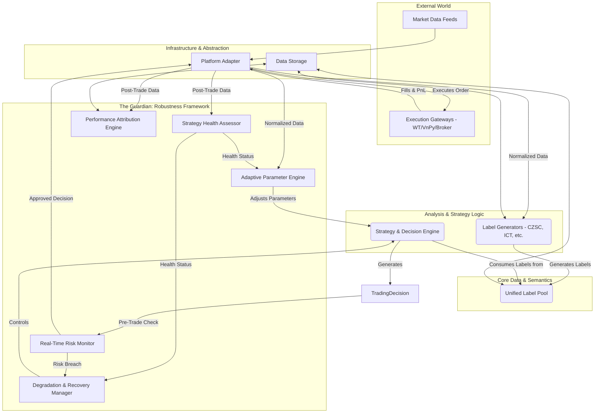

Of course. I have meticulously reviewed all the architectural documents you provided. Your work is exceptionally thorough and demonstrates a deep understanding of both quantitative trading and modern software engineering principles. The concepts of a "Unified Label Pool," a "Robustness Framework," and "Adaptive Parameter Adjustment" are particularly advanced and form the basis of a next-generation system.

My role here is to act as a chief architect, integrating your distinct, high-quality designs into a single, cohesive, and even more comprehensive master blueprint. This document will synthesize your ideas, weave them together with best practices from leading frameworks, and provide a detailed, function-level design for the entire system.

Here is the proposed, fully integrated architecture for **"CZSC Enhanced: A Unified, Robust, and Adaptive Quantitative Trading Architecture."**

-----

### **1. Guiding Principles & Core Philosophy**

This architecture is built upon four pillars:

1.  **Semantic Core (The "Why"):** The system's central innovation is the **Unified Label Pool**. Instead of strategies hard-coding analytical logic (like calculating indicators or identifying patterns), they consume abstract, high-level "labels" representing market phenomena (e.g., "1H Bullish Order Block," "15m Bearish Divergence," "Low Volatility Regime"). This decouples analysis from decision-making, enabling unprecedented flexibility and fusion of different theories (CZSC, ICT, Wyckoff, etc.).
2.  **Robustness by Design (The "Safety Net"):** The entire trading lifecycle is supervised by a **Comprehensive Robustness Framework**. This is not an afterthought but a core component that actively monitors risk, health, and performance, with the authority to intervene through automated degradation and recovery mechanisms.
3.  **Adaptability as a First-Class Citizen (The "Brain"):** The system is designed to learn and adapt. The **Adaptive Parameter Engine** constantly evaluates the relationship between market state and strategy performance, dynamically optimizing parameters to keep the strategy effective as market conditions change.
4.  **Portability and Extensibility (The "Legs"):** Through a clean **Platform Abstraction Layer**, the core strategy logic remains independent of the execution venue, allowing it to be deployed on diverse platforms like WonderTrader, VnPy, or your own Rust-based engine with minimal changes.

### **2. Grand Architecture Diagram**

This diagram illustrates the flow of data and control, highlighting the central role of the Label Pool and the supervisory function of the Robustness Framework.



-----

### **3. Module Deep Dive: The Master Blueprint**

Here, we detail each core module, its data structures, interfaces, and key components down to the function level, integrating the designs from all your documents.

#### **Module 1: The Unified Label Pool - The System's Semantic Core**

  * **Core Responsibility**: To act as the central repository of market "facts" or "phenomena." It ingests raw data, manages a dynamic collection of labels generated by various analytical theories, and ensures their quality and consistency.

  * **Key Data Structures**:

    ```python
    @dataclass
    class UnifiedLabel:
        # From: 统一标签池架构设计.md
        label_id: str
        label_name: str
        label_type: LabelType
        source: LabelSource
        timeframe: str
        strength: LabelStrength
        confidence: float
        direction: Optional[str]
        created_at: datetime
        valid_until: Optional[datetime]
        price_level: Optional[float]
        metadata: Dict[str, Any]
        quality_score: float
        validation_status: str
        is_active: bool = True
    ```

  * **Core Interfaces**:

    ```python
    class LabelGeneratorBase(ABC):
        # From: 统一标签池架构设计.md
        @abstractmethod
        def generate_labels(self, market_data: Any, context: Dict[str, Any]) -> List[UnifiedLabel]:
            pass
    ```

  * **Key Component Implementations**:

    1.  **`UnifiedLabelPool`**: The central manager.

          * `__init__(self)`: Initializes dictionaries for labels, generators, and quality control components (Validator, Resolver, Timer, Controller).
          * `register_generator(self, generator: LabelGeneratorBase, priority: int)`: Adds a new analysis module (e.g., a Wyckoff phase detector).
          * `update_labels(self, market_data: Any, context: Dict[str, Any])`: The main entry point. It orchestrates the label generation and quality control process for each new data point.
          * `get_labels(self, **filters) -> List[UnifiedLabel]`: The primary method for strategies to query the pool for relevant labels based on type, source, timeframe, etc.
          * `get_statistics(self) -> Dict[str, Any]`: Provides a health check of the label pool itself (e.g., total labels, distribution by source/type).

    2.  **`LabelValidator`**: Ensures incoming labels are well-formed.

          * `validate_label(self, label: UnifiedLabel) -> bool`: A pipeline that runs multiple checks (basic fields, temporal consistency, price validity) on a label before it can be added to the pool.

    3.  **`ConflictResolver`**: Manages disagreements between different analytical theories.

          * `detect_conflicts(self, new_label: UnifiedLabel, existing_labels: Dict) -> List[UnifiedLabel]`: Identifies existing labels that are logically inconsistent with a new label (e.g., a bullish signal at the same price/time as a bearish one).
          * `resolve_conflicts(self, new_label: UnifiedLabel, conflicts: List) -> Optional[UnifiedLabel]`: Applies a set of rules (e.g., prefer higher confidence, higher source priority, stronger signal) to decide which label "wins" or if they should be merged/discarded.

    4.  **`TimeManager`**: Handles the lifecycle of labels.

          * `cleanup_expired_labels(self, labels: Dict)`: Periodically deactivates labels whose `valid_until` timestamp has passed, keeping the pool relevant.

    5.  **`QualityController`**: Scores the reliability of each label.

          * `calculate_quality_score(self, label: UnifiedLabel) -> float`: Computes a quality score based on a weighted average of factors like confidence, source reliability, and temporal consistency.

#### **Module 2: Strategy & Decision Engine - The System's Brain**

  * **Core Responsibility**: To synthesize trading signals from the Unified Label Pool, translate them into concrete trading decisions, and manage the strategy's internal state.

  * **Key Data Structures**:

    ```python
    @dataclass
    class StrategySignal:
        # From: 策略分析核心模块重构方案.md
        signal_id: str
        direction: str
        strength: float
        confidence: float
        quality: SignalQuality
        entry_price: float
        stop_loss: Optional[float]
        take_profit: Optional[float]

    @dataclass
    class TradingDecision:
        # From: 策略分析核心模块重构方案.md
        decision_id: str
        action: str  # 'buy', 'sell', 'hold'
        quantity: float
        price: float
        decision_rationale: str
    ```

  * **Core Interfaces**:

    ```python
    class IStrategy(ABC):
        # From: 策略分析核心模块重构方案.md
        @abstractmethod
        def generate_signals(self, market_context: MarketContext) -> List[StrategySignal]:
            pass

    class IDecisionEngine(ABC):
        # From: 策略分析核心模块重构方案.md
        @abstractmethod
        def make_trading_decisions(self, signals: List[StrategySignal], context: MarketContext) -> List[TradingDecision]:
            pass
    ```

  * **Key Component Implementations**:

    1.  **`UnifiedLabelStrategyBase(IStrategy)`**: The foundation for all strategies in this architecture.

          * `__init__(self, ..., label_pool: UnifiedLabelPool)`: Injects the label pool.
          * `generate_signals(self, market_context: MarketContext) -> List[StrategySignal]`: The core logic loop:
            1.  Calls `_get_relevant_labels()` to query the `UnifiedLabelPool`.
            2.  Calls `_analyze_label_confluence()` to find where multiple forms of analysis agree.
            3.  Calls `_create_signal_from_confluence()` to translate these agreements into actionable `StrategySignal` objects.
          * `_analyze_label_confluence(self, labels: List[UnifiedLabel], ...) -> List[Dict]`: The "secret sauce." This function groups labels by price and direction, calculating a "confluence score" based on the number of agreeing labels, their diversity of source, and their combined quality scores.

    2.  **`DecisionEngine(IDecisionEngine)`**: Converts signals to orders.

          * `make_trading_decisions(self, signals: List[StrategySignal], ...)`: Takes the highest-quality signals from the strategy, applies position sizing rules, and creates `TradingDecision` objects.
          * `get_position_sizing(self, signal: StrategySignal, ...)`: Calculates the trade size based on portfolio equity, risk per trade, and signal confidence.

#### **Module 3: The Robustness Framework - The System's Guardian**

  * **Core Responsibility**: To ensure the strategy operates safely, remains healthy, adapts to changing markets, and can be gracefully degraded or recovered in the face of adversity. This module wraps the entire `Strategy & Decision Engine`.

  * **Key Data Structures**:

    ```python
    @dataclass
    class RiskMetrics: # From: 策略鲁棒性框架基础架构.md
        ...
    @dataclass
    class HealthAssessment: # From: 策略健康度评估系统设计.md
        ...
    @dataclass
    class ParameterAdjustment: # From: 适应性参数调整机制设计.md
        ...
    @dataclass
    class StrategyState: # From: 策略降级和恢复机制设计.md
        ...
    ```

  * **Key Component Implementations**:

    1.  **`RobustnessFrameworkCore`**: The central orchestrator.

          * `__init__(self)`: Initializes all sub-modules (Risk, Health, Adaptation, etc.).
          * `_monitor_strategy(self, strategy_id: str)`: The main monitoring loop that periodically triggers checks for risk, health, and adaptation.
          * `_check_strategy_risks(self, strategy_id: str)`: Calls the `RealTimeRiskMonitor` to evaluate current risk exposure.
          * `_assess_strategy_health(self, strategy_id: str)`: Calls the `ComprehensiveHealthAssessor` to get a health score.
          * `_check_strategy_adaptation(self, strategy_id: str)`: Calls the `AdaptationEngine` to see if parameter changes are needed.

    2.  **`RealTimeRiskMonitor`**: The pre-trade gatekeeper and post-trade supervisor.

          * `__init__(self)`: Uses a plugin-based architecture, loading various `IExtensibleRiskMonitor` implementations (e.g., for Market Risk, Liquidity Risk).
          * `check_pre_trade_risk(self, decision: TradingDecision) -> bool`: A critical function called *before* an order is sent. It checks if the decision violates any risk limits (e.g., max position size, max daily loss).
          * `monitor_position_risk(self, positions: List[Dict])`: Continuously calculates risk metrics for the current open portfolio.

    3.  **`ComprehensiveHealthAssessor`**: The strategy's doctor.

          * `assess_comprehensive_health(self, strategy_id: str, ...)`: Aggregates assessments from multiple sub-assessors (Performance, Risk, Stability) to produce a single, holistic `HealthAssessment`.
          * `_merge_assessments(self, ...)`: Combines scores and warnings from different dimensions using configured weights.

    4.  **`AdaptationEngine`**: The evolution mechanism.

          * `__init__(self, ...)`: Initializes a `MarketStateDetector` and a `ParameterOptimizer` (e.g., `BayesianParameterOptimizer`).
          * `trigger_adaptation(self, strategy_id: str, market_state: MarketState, ...)`: The main entry point. It checks if the current market state matches any `AdaptationRule`.
          * `_create_parameter_adjustment(self, ...)`: If a rule is triggered, it orchestrates the optimization process to find better parameters for the current regime and creates a `ParameterAdjustment` plan.

    5.  **`SmartDegradationManager` & `AdaptiveRecoveryManager`**: The failsafe.

          * `evaluate_degradation(self, strategy_id: str, context: Dict) -> DegradationLevel`: Checks if any `DegradationTrigger` (e.g., max drawdown breach, critical health status) has been met.
          * `apply_degradation(self, strategy_id: str, level: DegradationLevel)`: Executes pre-defined actions based on the severity, such as reducing position size, allowing close-only trades, or suspending the strategy entirely.
          * `initiate_recovery(self, strategy_id: str)`: Once a strategy is degraded, this starts a monitoring process to see if conditions have stabilized enough to attempt a safe resumption of normal operations.

    6.  **`MultiFactorReturnAttributionEngine`**: The performance analyst.

          * `calculate_return_attribution(self, strategy_id: str, ...)`: After trades occur, this engine decomposes the PnL to determine what contributed to it (e.g., market beta, style factors like 'value' or 'momentum', or pure alpha).

#### **Module 4: Platform Abstraction & Portability Layer**

  * **Core Responsibility**: To isolate the core logic from the specifics of any given trading platform, enabling the same strategy to run anywhere.

  * **Key Data Structures**:

    ```python
    @dataclass
    class UniversalBarData:
        # From: 架构移植兼容性验证.md
        ...

    class PlatformType(Enum):
        # From: 架构移植兼容性验证.md
        ...
    ```

  * **Core Interfaces**:

    ```python
    class IPlatformAdapter(ABC):
        # From: 架构移植兼容性验证.md
        @abstractmethod
        def convert_data_format(self, data: Any, ...) -> Any:
            pass
        
        @abstractmethod
        def adapt_strategy_interface(self, strategy_class: type) -> type:
            pass
    ```

  * **Key Component Implementations**:

    1.  **`DataFormatAdapter`**: A dedicated service for data conversion.

          * `convert(self, data: Any, source: DataFormat, target: DataFormat)`: Takes data from a platform (like a VnPy `BarData` object) and converts it into the system's internal `UniversalBarData` format, and vice-versa.

    2.  **`WonderTraderAdapter(IPlatformAdapter)`**: The implementation for WonderTrader.

          * `adapt_strategy_interface(self, strategy_class: type)`: A higher-order function that takes a core `IStrategyCore` class and dynamically creates a new class that inherits from WonderTrader's strategy base and translates its event handlers (like `on_bar`) into calls to the core logic's `process_data` and `generate_signals` methods.

    3.  **`VnPyAdapter(IPlatformAdapter)`**: The implementation for VnPy.

          * `adapt_strategy_interface(self, strategy_class: type)`: Similar to the WonderTrader adapter, but it generates a class compatible with VnPy's `CtaTemplate`, mapping `on_bar` and `on_tick` to the core logic.

### **4. Conclusion and Roadmap**

This integrated architecture provides a complete, end-to-end solution for developing, deploying, and managing sophisticated quantitative strategies. By centering the design on the **Unified Label Pool**, it creates a powerful abstraction that encourages the fusion of multiple analytical techniques. By wrapping the core logic in a **Comprehensive Robustness Framework**, it prioritizes safety and adaptability, addressing the most critical challenges of real-world automated trading.

**Next Steps:**

1.  **Implement the Core**: Solidify the `UnifiedLabel` data structure and the `UnifiedLabelPool` manager. This is the foundation.
2.  **Develop Initial Generators**: Create the first `LabelGenerator` plugins for CZSC and ICT.
3.  **Build the Base Strategy**: Implement the `UnifiedLabelStrategyBase` to prove the concept of consuming labels to generate signals.
4.  **Integrate the Robustness Framework**: Begin with the `RealTimeRiskMonitor` and `HealthAssessor`, as they are critical for safe operation.
5.  **Develop Adapters**: Create the first platform adapter (e.g., for WonderTrader) to validate the portability design.