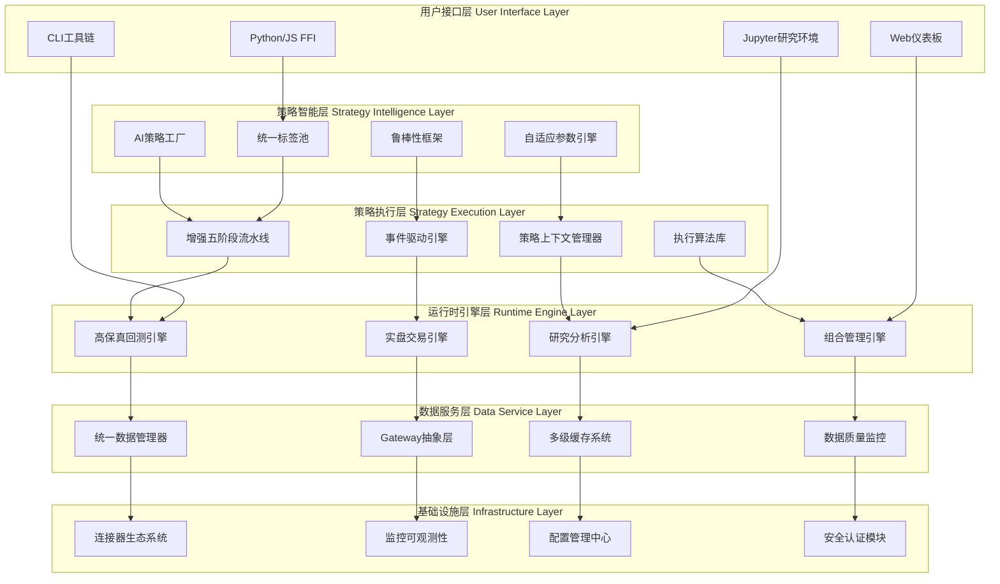

# MosesQuant 架构优化与完善方案

> **文档版本**: v1.0  
> **创建日期**: 2025-07-18  
> **作者**: Claude Code 架构分析团队  
> **目标**: 基于成熟量化框架经验和前沿设计理念，提出MosesQuant的系统性架构优化方案

## 1. 执行摘要

经过对MosesQuant当前架构的深度分析，对比QuantConnect LEAN、Zipline、MetaTrader等成熟框架，并结合统一标签池和鲁棒性框架的前沿理念，我们提出了一个**六层统一架构**的完善方案。

**核心改进方向**：
1. **语义化市场分析** - 统一标签池架构
2. **全生命周期安全** - 鲁棒性框架
3. **平台无关设计** - 统一网关抽象
4. **双模式策略支持** - 标准流水线 + 事件驱动
5. **高性能数据管理** - Arrow/Parquet + Polars
6. **全链路可观测性** - 监控与告警系统

## 2. 当前架构优势分析

### 2.1 设计理念先进
- ✅ **五阶段流水线**: 清晰的策略执行流程
- ✅ **双路径架构**: 兼顾复杂策略和高频交易
- ✅ **事件驱动设计**: 高度解耦的系统架构
- ✅ **异步优先**: 基于Tokio的高并发处理

### 2.2 技术栈现代化
- ✅ **Rust内存安全**: 编译时错误检查
- ✅ **零成本抽象**: 高级API无性能损失
- ✅ **类型安全**: 减少运行时错误
- ✅ **Python FFI**: 多语言生态支持

### 2.3 已实现功能完备
- ✅ 核心数据结构和类型系统
- ✅ 事件总线和数据管理
- ✅ 策略框架和技术指标
- ✅ 多数据源连接器
- ✅ 基础回测能力

## 3. 架构改进机会

### 3.1 对比成熟框架发现的不足

| 维度 | QuantConnect LEAN | Zipline | MosesQuant现状 | 改进方向 |
|-----|------------------|---------|---------------|----------|
| **研究环境** | Jupyter + 算法IDE | Pipeline API | 基础CLI | 集成研究工作流 |
| **风险管理** | 企业级实时风控 | 基础风控 | 简单风控模块 | 多维度风险监控 |
| **数据管理** | Slice时间同步 | Bundle标准化 | 基础数据管理 | 统一数据抽象 |
| **回测引擎** | 高保真市场模拟 | 精确成本模型 | 基础回测 | 企业级回测引擎 |
| **监控告警** | 全链路监控 | 性能分析 | 基础日志 | 可观测性系统 |
| **平台集成** | 云原生部署 | 本地化优化 | 单一环境 | 多平台抽象 |

### 3.2 新架构思考的前沿理念

基于`新的架构思考.md`和`新的架构思考进阶.md`的分析：

1. **统一标签池**: 语义化市场分析，多理论融合
2. **鲁棒性框架**: 全生命周期安全保障
3. **自适应参数**: 智能参数优化
4. **AI策略工厂**: 推荐系统驱动的因子发现

## 4. 完善架构设计

### 4.1 六层统一架构



### 4.2 核心模块详细设计

#### 4.2.1 统一标签池 (Unified Label Pool)

**设计理念**: 将市场分析从硬编码转向语义化标签消费，实现多理论融合。

```rust
/// 核心标签数据结构
#[derive(Debug, Clone, Serialize, Deserialize)]
pub struct UnifiedLabel {
    pub label_id: String,
    pub label_name: String,
    pub label_type: LabelType,
    pub source: LabelSource,          // CZSC, ICT, Wyckoff等
    pub timeframe: String,
    pub strength: LabelStrength,
    pub confidence: f64,
    pub direction: Option<Direction>,
    pub created_at: i64,
    pub valid_until: Option<i64>,
    pub price_level: Option<f64>,
    pub metadata: HashMap<String, Value>,
    pub quality_score: f64,
    pub validation_status: ValidationStatus,
    pub is_active: bool,
}

/// 标签类型枚举
#[derive(Debug, Clone, Serialize, Deserialize)]
pub enum LabelType {
    Structure,      // 结构性标签 (支撑阻力、趋势线等)
    Pattern,        // 形态标签 (头肩顶、双底等)
    Volume,         // 成交量标签
    Momentum,       // 动量标签
    Volatility,     // 波动率标签
    Sentiment,      // 情绪标签
    Risk,          // 风险标签
    Custom(String), // 自定义标签
}

/// 标签来源
#[derive(Debug, Clone, Serialize, Deserialize)]
pub enum LabelSource {
    CZSC,          // 缠中说禅
    ICT,           // Inner Circle Trader
    Wyckoff,       // 威科夫理论
    Elliott,       // 艾略特波浪
    Fibonacci,     // 斐波那契
    Volume,        // 成交量分析
    Custom(String),
}

/// 标签生成器接口
#[async_trait]
pub trait LabelGenerator: Send + Sync {
    async fn generate_labels(
        &self, 
        data: &MarketData, 
        context: &AnalysisContext
    ) -> Result<Vec<UnifiedLabel>>;
    
    fn priority(&self) -> i32;
    fn supported_timeframes(&self) -> Vec<String>;
    fn label_types(&self) -> Vec<LabelType>;
    fn source(&self) -> LabelSource;
    fn name(&self) -> &str;
}

/// 标签池管理器
pub struct UnifiedLabelPool {
    labels: RwLock<HashMap<String, UnifiedLabel>>,
    generators: Vec<Box<dyn LabelGenerator>>,
    validator: LabelValidator,
    conflict_resolver: ConflictResolver,
    quality_controller: QualityController,
    time_manager: TimeManager,
    statistics: Arc<RwLock<LabelPoolStatistics>>,
}

impl UnifiedLabelPool {
    /// 注册标签生成器
    pub fn register_generator(&mut self, generator: Box<dyn LabelGenerator>) {
        self.generators.push(generator);
        self.generators.sort_by_key(|g| -g.priority());
    }
    
    /// 更新标签池
    pub async fn update_labels(
        &self,
        market_data: &MarketData,
        context: &AnalysisContext
    ) -> Result<Vec<UnifiedLabel>> {
        let mut new_labels = Vec::new();
        
        // 并行生成标签
        let generation_tasks: Vec<_> = self.generators.iter()
            .map(|generator| {
                let data = market_data.clone();
                let ctx = context.clone();
                async move {
                    generator.generate_labels(&data, &ctx).await
                }
            })
            .collect();
        
        let results = futures::future::join_all(generation_tasks).await;
        
        for result in results {
            match result {
                Ok(labels) => {
                    for label in labels {
                        if self.validator.validate_label(&label).await? {
                            new_labels.push(label);
                        }
                    }
                }
                Err(e) => {
                    warn!("Label generation failed: {}", e);
                }
            }
        }
        
        // 解决冲突
        let resolved_labels = self.conflict_resolver.resolve_conflicts(&new_labels).await?;
        
        // 更新质量评分
        for label in &resolved_labels {
            let quality_score = self.quality_controller.calculate_quality_score(label).await?;
            // 更新标签质量评分...
        }
        
        // 存储到标签池
        self.store_labels(&resolved_labels).await?;
        
        // 清理过期标签
        self.time_manager.cleanup_expired_labels().await?;
        
        Ok(resolved_labels)
    }
    
    /// 查询标签
    pub async fn get_labels(&self, filters: &LabelQuery) -> Result<Vec<UnifiedLabel>> {
        let labels = self.labels.read().await;
        let mut filtered_labels = Vec::new();
        
        for label in labels.values() {
            if self.matches_filter(label, filters) {
                filtered_labels.push(label.clone());
            }
        }
        
        // 按质量评分和时间排序
        filtered_labels.sort_by(|a, b| {
            b.quality_score.partial_cmp(&a.quality_score)
                .unwrap_or(std::cmp::Ordering::Equal)
                .then_with(|| b.created_at.cmp(&a.created_at))
        });
        
        Ok(filtered_labels)
    }
}
```

#### 4.2.2 鲁棒性框架 (Robustness Framework)

**设计理念**: 全生命周期安全保障，包括风险监控、健康评估、参数适应、降级恢复。

```rust
/// 鲁棒性框架核心
pub struct RobustnessFramework {
    risk_monitor: Arc<RealTimeRiskMonitor>,
    health_assessor: Arc<HealthAssessor>,
    parameter_engine: Arc<AdaptiveParameterEngine>,
    degradation_manager: Arc<DegradationManager>,
    performance_attributor: Arc<PerformanceAttributor>,
    config: RobustnessConfig,
}

/// 实时风险监控器
pub struct RealTimeRiskMonitor {
    risk_models: Vec<Box<dyn RiskModel>>,
    risk_limits: RiskLimits,
    alert_manager: Arc<AlertManager>,
}

#[async_trait]
pub trait RiskModel: Send + Sync {
    async fn calculate_risk(&self, context: &RiskContext) -> Result<RiskMetrics>;
    fn risk_type(&self) -> RiskType;
    fn name(&self) -> &str;
}

/// 风险类型
#[derive(Debug, Clone)]
pub enum RiskType {
    Market,        // 市场风险
    Credit,        // 信用风险  
    Liquidity,     // 流动性风险
    Operational,   // 操作风险
    Model,         // 模型风险
    Concentration, // 集中度风险
}

/// 风险指标
#[derive(Debug, Clone)]
pub struct RiskMetrics {
    pub var_1d: f64,           // 1日VaR
    pub var_10d: f64,          // 10日VaR
    pub expected_shortfall: f64, // 期望损失
    pub max_drawdown: f64,      // 最大回撤
    pub position_concentration: f64, // 持仓集中度
    pub leverage_ratio: f64,    // 杠杆率
    pub liquidity_risk: f64,    // 流动性风险
    pub model_uncertainty: f64,  // 模型不确定性
}

impl RealTimeRiskMonitor {
    /// 交易前风险检查
    pub async fn check_pre_trade_risk(
        &self,
        decision: &TradingDecision,
        context: &RiskContext
    ) -> Result<bool> {
        // 检查各类风险限制
        for risk_model in &self.risk_models {
            let risk_metrics = risk_model.calculate_risk(context).await?;
            
            if !self.validate_risk_limits(&risk_metrics, &decision) {
                self.alert_manager.send_alert(
                    AlertLevel::High,
                    &format!("Risk limit exceeded by {}: {:?}", 
                            risk_model.name(), risk_metrics)
                ).await?;
                return Ok(false);
            }
        }
        
        Ok(true)
    }
    
    /// 持仓风险监控
    pub async fn monitor_position_risk(
        &self,
        positions: &[Position],
        market_data: &MarketData
    ) -> Result<RiskMetrics> {
        let context = RiskContext {
            positions: positions.to_vec(),
            market_data: market_data.clone(),
            timestamp: chrono::Utc::now().timestamp(),
        };
        
        let mut aggregated_risk = RiskMetrics::default();
        
        for risk_model in &self.risk_models {
            let risk = risk_model.calculate_risk(&context).await?;
            aggregated_risk.aggregate(&risk);
        }
        
        // 检查风险预警阈值
        if aggregated_risk.max_drawdown > self.risk_limits.max_drawdown_warning {
            self.alert_manager.send_alert(
                AlertLevel::Warning,
                &format!("Drawdown approaching limit: {:.2}%", 
                        aggregated_risk.max_drawdown * 100.0)
            ).await?;
        }
        
        Ok(aggregated_risk)
    }
}

/// 健康度评估器
pub struct HealthAssessor {
    assessors: Vec<Box<dyn HealthAssessmentModule>>,
    health_config: HealthConfig,
}

#[async_trait]
pub trait HealthAssessmentModule: Send + Sync {
    async fn assess_health(&self, context: &HealthContext) -> Result<HealthScore>;
    fn category(&self) -> HealthCategory;
    fn name(&self) -> &str;
}

#[derive(Debug, Clone)]
pub enum HealthCategory {
    Performance,    // 性能健康度
    Risk,          // 风险健康度
    Stability,     // 稳定性健康度
    Efficiency,    // 效率健康度
}

#[derive(Debug, Clone)]
pub struct HealthScore {
    pub category: HealthCategory,
    pub score: f64,           // 0-100评分
    pub status: HealthStatus,
    pub warnings: Vec<String>,
    pub recommendations: Vec<String>,
}

#[derive(Debug, Clone)]
pub enum HealthStatus {
    Excellent,  // 90-100
    Good,       // 70-89
    Fair,       // 50-69
    Poor,       // 30-49
    Critical,   // 0-29
}

/// 自适应参数引擎
pub struct AdaptiveParameterEngine {
    market_state_detector: MarketStateDetector,
    parameter_optimizer: Box<dyn ParameterOptimizer>,
    adaptation_rules: Vec<AdaptationRule>,
    optimization_history: OptimizationHistory,
}

#[async_trait]
pub trait ParameterOptimizer: Send + Sync {
    async fn optimize_parameters(
        &self,
        current_params: &Parameters,
        market_state: &MarketState,
        performance_data: &PerformanceData
    ) -> Result<OptimizationResult>;
}

#[derive(Debug, Clone)]
pub struct AdaptationRule {
    pub condition: MarketCondition,
    pub parameter_adjustments: HashMap<String, ParameterAdjustment>,
    pub confidence_threshold: f64,
}

#[derive(Debug, Clone)]
pub struct ParameterAdjustment {
    pub param_name: String,
    pub adjustment_type: AdjustmentType,
    pub adjustment_value: f64,
    pub bounds: (f64, f64),
}

#[derive(Debug, Clone)]
pub enum AdjustmentType {
    Multiplicative,  // 乘法调整
    Additive,       // 加法调整
    Replacement,    // 替换调整
}
```

#### 4.2.3 统一网关抽象 (Gateway Abstraction)

**设计理念**: 平台无关的策略代码，支持回测、实盘、多交易所的统一接口。

```rust
/// 统一网关接口
#[async_trait]
pub trait Gateway: Send + Sync {
    // === 连接管理 ===
    async fn connect(&self) -> Result<()>;
    async fn disconnect(&self) -> Result<()>;
    fn is_connected(&self) -> bool;
    fn gateway_type(&self) -> GatewayType;
    
    // === 数据接口 ===
    async fn subscribe_data(
        &self,
        symbols: &[Symbol],
        data_types: &[DataType]
    ) -> Result<()>;
    
    async fn unsubscribe_data(&self, symbols: &[Symbol]) -> Result<()>;
    
    async fn get_historical_data(
        &self,
        request: &DataRequest
    ) -> Result<Vec<Bar>>;
    
    // === 交易接口 ===
    async fn submit_order(&self, order: &Order) -> Result<String>;
    async fn cancel_order(&self, order_id: &str) -> Result<()>;
    async fn modify_order(&self, order_id: &str, modification: &OrderModification) -> Result<()>;
    
    // === 账户查询 ===
    async fn get_positions(&self) -> Result<Vec<Position>>;
    async fn get_orders(&self) -> Result<Vec<Order>>;
    async fn get_trades(&self) -> Result<Vec<Trade>>;
    async fn get_account_info(&self) -> Result<AccountInfo>;
    
    // === 事件处理 ===
    fn set_event_handler(&self, handler: Arc<dyn EventHandler>);
}

#[derive(Debug, Clone)]
pub enum GatewayType {
    Simulated,      // 模拟网关(回测)
    Binance,        // 币安
    FTX,           // FTX
    Interactive,    // 盈透证券
    Custom(String), // 自定义
}

/// 模拟网关 - 用于回测
pub struct SimulatedGateway {
    matching_engine: MatchingEngine,
    market_simulator: MarketSimulator,
    slippage_model: Box<dyn SlippageModel>,
    commission_model: Box<dyn CommissionModel>,
    latency_model: Box<dyn LatencyModel>,
    account: Arc<RwLock<SimulatedAccount>>,
    event_handler: Option<Arc<dyn EventHandler>>,
}

impl SimulatedGateway {
    pub fn new(config: SimulationConfig) -> Self {
        Self {
            matching_engine: MatchingEngine::new(config.matching_rules),
            market_simulator: MarketSimulator::new(config.market_rules),
            slippage_model: Box::new(LinearSlippageModel::new(config.slippage_params)),
            commission_model: Box::new(FixedCommissionModel::new(config.commission_rate)),
            latency_model: Box::new(RandomLatencyModel::new(config.latency_range)),
            account: Arc::new(RwLock::new(SimulatedAccount::new(config.initial_capital))),
            event_handler: None,
        }
    }
}

#[async_trait]
impl Gateway for SimulatedGateway {
    async fn submit_order(&self, order: &Order) -> Result<String> {
        // 应用延迟模型
        let latency = self.latency_model.calculate_latency(order);
        tokio::time::sleep(latency).await;
        
        // 应用滑点
        let adjusted_order = self.slippage_model.apply_slippage(order)?;
        
        // 提交到撮合引擎
        let order_id = self.matching_engine.submit_order(adjusted_order).await?;
        
        // 通知事件处理器
        if let Some(handler) = &self.event_handler {
            handler.on_order_submitted(&adjusted_order).await?;
        }
        
        Ok(order_id)
    }
    
    async fn get_account_info(&self) -> Result<AccountInfo> {
        let account = self.account.read().await;
        Ok(AccountInfo {
            balance: account.balance,
            equity: account.equity,
            margin_available: account.margin_available,
            margin_used: account.margin_used,
        })
    }
    
    // ... 其他方法实现
}

/// 实盘网关示例 - Binance
pub struct BinanceGateway {
    websocket_client: WebSocketClient,
    rest_client: RestClient,
    order_manager: OrderManager,
    position_tracker: PositionTracker,
    event_handler: Option<Arc<dyn EventHandler>>,
    config: BinanceConfig,
}

#[async_trait]
impl Gateway for BinanceGateway {
    async fn connect(&self) -> Result<()> {
        // 建立WebSocket连接
        self.websocket_client.connect().await?;
        
        // 认证
        self.websocket_client.authenticate(&self.config.api_key, &self.config.secret).await?;
        
        // 订阅账户更新
        self.websocket_client.subscribe_account_updates().await?;
        
        Ok(())
    }
    
    async fn submit_order(&self, order: &Order) -> Result<String> {
        // 构建Binance订单格式
        let binance_order = self.convert_to_binance_order(order)?;
        
        // 发送REST请求
        let response = self.rest_client.submit_order(binance_order).await?;
        
        // 更新本地订单管理器
        self.order_manager.add_order(order.clone(), response.order_id.clone()).await;
        
        // 触发事件
        if let Some(handler) = &self.event_handler {
            handler.on_order_submitted(order).await?;
        }
        
        Ok(response.order_id)
    }
    
    // ... 其他方法实现
}
```

#### 4.2.4 增强的策略执行框架

**双模式支持**: 标准五阶段流水线 + 事件驱动简化模式

```rust
/// 增强的策略接口
#[async_trait]
pub trait EnhancedStrategy: Send + Sync {
    // === 标准流水线模式 ===
    async fn universe_selection(
        &self,
        context: &StrategyContext
    ) -> Result<Vec<Symbol>>;
    
    async fn alpha_generation(
        &self,
        context: &StrategyContext,
        universe: &[Symbol]
    ) -> Result<Vec<Insight>>;
    
    async fn portfolio_construction(
        &self,
        context: &StrategyContext,
        insights: &[Insight]
    ) -> Result<Vec<PortfolioTarget>>;
    
    async fn risk_management(
        &self,
        context: &StrategyContext,
        targets: &[PortfolioTarget]
    ) -> Result<Vec<PortfolioTarget>>;
    
    async fn execution(
        &self,
        context: &StrategyContext,
        targets: &[PortfolioTarget]
    ) -> Result<Vec<Order>>;
    
    // === 事件驱动模式（简化接口）===
    async fn on_data(
        &mut self,
        context: &StrategyContext,
        data: &DataSlice
    ) -> Result<Vec<Order>>;
    
    // === 生命周期管理 ===
    async fn on_start(&mut self, context: &StrategyContext) -> Result<()>;
    async fn on_stop(&mut self, context: &StrategyContext) -> Result<()>;
    async fn on_order_update(&mut self, context: &StrategyContext, order: &Order) -> Result<()>;
    async fn on_trade(&mut self, context: &StrategyContext, trade: &Trade) -> Result<()>;
    
    // === 策略元信息 ===
    fn strategy_name(&self) -> &str;
    fn strategy_version(&self) -> &str;
    fn supported_modes(&self) -> Vec<StrategyMode>;
}

#[derive(Debug, Clone)]
pub enum StrategyMode {
    Pipeline,      // 五阶段流水线
    EventDriven,   // 事件驱动
    Hybrid,        // 混合模式
}

/// 策略上下文 - 策略的"瑞士军刀"
pub struct StrategyContext {
    // === 核心组件 ===
    pub data_manager: Arc<DataManager>,
    pub label_pool: Arc<UnifiedLabelPool>,
    pub calculation_engine: Arc<CalculationEngine>,
    pub robustness_framework: Arc<RobustnessFramework>,
    
    // === 投资组合管理 ===
    pub portfolio: Arc<RwLock<Portfolio>>,
    pub position_manager: Arc<PositionManager>,
    pub order_manager: Arc<OrderManager>,
    
    // === 监控与日志 ===
    pub performance_tracker: Arc<PerformanceTracker>,
    pub logger: Arc<StructuredLogger>,
    pub metrics_collector: Arc<MetricsCollector>,
    
    // === 策略状态 ===
    pub strategy_id: String,
    pub strategy_state: Arc<RwLock<StrategyState>>,
    pub parameters: Arc<RwLock<Parameters>>,
    
    // === 时间管理 ===
    pub clock: Arc<dyn Clock>,
    pub timezone: chrono_tz::Tz,
}

impl StrategyContext {
    /// 获取历史数据
    pub async fn get_history(
        &self,
        symbol: &Symbol,
        timeframe: &str,
        count: usize
    ) -> Result<Vec<Bar>> {
        let request = DataRequest {
            symbol: symbol.clone(),
            timeframe: timeframe.to_string(),
            count: Some(count),
            start_time: None,
            end_time: Some(self.clock.now()),
        };
        
        self.data_manager.get_historical_data(&request).await
    }
    
    /// 获取相关标签
    pub async fn get_labels(
        &self,
        filters: &LabelQuery
    ) -> Result<Vec<UnifiedLabel>> {
        self.label_pool.get_labels(filters).await
    }
    
    /// 下单
    pub async fn buy(
        &self,
        symbol: &Symbol,
        quantity: f64,
        order_type: OrderType
    ) -> Result<String> {
        let order = Order {
            id: Uuid::new_v4().to_string(),
            symbol: symbol.clone(),
            direction: Direction::Long,
            quantity,
            order_type,
            status: OrderStatus::Pending,
            created_at: self.clock.now(),
            ..Default::default()
        };
        
        // 风险检查
        let risk_context = self.build_risk_context(&order).await?;
        let risk_check = self.robustness_framework
            .risk_monitor
            .check_pre_trade_risk(&order.into(), &risk_context)
            .await?;
        
        if !risk_check {
            return Err(CzscError::RiskLimitExceeded("Pre-trade risk check failed".to_string()));
        }
        
        // 提交订单
        self.order_manager.submit_order(order).await
    }
    
    /// 记录日志
    pub fn log(&self, level: LogLevel, message: &str) {
        self.logger.log(level, &self.strategy_id, message);
    }
    
    /// 获取投资组合价值
    pub async fn get_portfolio_value(&self) -> Result<f64> {
        let portfolio = self.portfolio.read().await;
        Ok(portfolio.total_value)
    }
    
    /// 计算技术指标
    pub async fn calculate_indicator<T: TechnicalIndicator>(
        &self,
        symbol: &Symbol,
        indicator: T,
        period: usize
    ) -> Result<Vec<f64>> {
        let data = self.get_history(symbol, "1m", period * 2).await?;
        self.calculation_engine.calculate_indicator(&data, indicator).await
    }
}

/// 标签驱动的策略基类
pub struct LabelDrivenStrategy {
    name: String,
    version: String,
    label_filters: Vec<LabelQuery>,
    confluence_rules: Vec<ConfluenceRule>,
    position_sizing: Box<dyn PositionSizer>,
}

impl LabelDrivenStrategy {
    /// 分析标签融合
    async fn analyze_label_confluence(
        &self,
        labels: &[UnifiedLabel],
        context: &StrategyContext
    ) -> Result<Vec<ConfluenceSignal>> {
        let mut signals = Vec::new();
        
        // 按价格和方向分组标签
        let grouped_labels = self.group_labels_by_confluence(labels);
        
        for group in grouped_labels {
            let confluence_score = self.calculate_confluence_score(&group);
            
            if confluence_score >= self.get_min_confluence_threshold() {
                let signal = ConfluenceSignal {
                    direction: group.direction,
                    price_level: group.average_price,
                    confluence_score,
                    contributing_labels: group.labels,
                    confidence: self.calculate_signal_confidence(&group),
                };
                
                signals.push(signal);
            }
        }
        
        Ok(signals)
    }
}

#[async_trait]
impl EnhancedStrategy for LabelDrivenStrategy {
    async fn alpha_generation(
        &self,
        context: &StrategyContext,
        universe: &[Symbol]
    ) -> Result<Vec<Insight>> {
        let mut insights = Vec::new();
        
        for symbol in universe {
            // 获取相关标签
            let mut label_query = LabelQuery::new();
            label_query.symbol = Some(symbol.clone());
            label_query.timeframe = Some("1h".to_string());
            label_query.is_active = Some(true);
            
            let labels = context.get_labels(&label_query).await?;
            
            // 分析标签融合
            let confluence_signals = self.analyze_label_confluence(&labels, context).await?;
            
            for signal in confluence_signals {
                if signal.confidence >= 0.7 {
                    let insight = Insight {
                        symbol: symbol.clone(),
                        direction: signal.direction,
                        confidence: signal.confidence,
                        weight: signal.confluence_score,
                        source: format!("LabelConfluence_{}", self.name),
                        metadata: json!({
                            "confluence_score": signal.confluence_score,
                            "contributing_labels": signal.contributing_labels.len(),
                            "price_level": signal.price_level
                        }),
                    };
                    
                    insights.push(insight);
                }
            }
        }
        
        Ok(insights)
    }
    
    // ... 其他方法实现
}
```

### 4.3 实施路线图

#### 阶段一：核心基础 (MVP) - 2个月
**目标**: 建立稳固的架构基础
- [ ] 实现统一标签池核心功能
- [ ] 完善事件驱动系统
- [ ] 增强数据管理器（支持Arrow/Parquet）
- [ ] 实现基础的鲁棒性框架
- [ ] 创建模拟网关和简单策略

#### 阶段二：核心功能 (Alpha) - 3个月  
**目标**: 完善主要功能模块
- [ ] 实现完整的五阶段流水线
- [ ] 开发高保真回测引擎
- [ ] 集成第一个实盘网关（Binance）
- [ ] 实现基础的风险管理模块
- [ ] 开发策略开发工具链

#### 阶段三：企业级特性 (Beta) - 4个月
**目标**: 企业级功能和性能优化
- [ ] 完善鲁棒性框架（健康评估、参数适应）
- [ ] 实现全链路监控和告警
- [ ] 开发Web仪表板和研究环境
- [ ] 性能优化和压力测试
- [ ] 多平台适配器开发

#### 阶段四：生态完善 (Release) - 2个月
**目标**: 生态建设和用户体验
- [ ] AI策略工厂和推荐系统
- [ ] 完善文档和教程
- [ ] 社区建设和插件生态
- [ ] 安全审计和合规检查

## 5. 技术实施建议

### 5.1 技术栈选择
- **核心框架**: Rust + Tokio（已确定）
- **数据存储**: Apache Arrow + Parquet
- **数据计算**: Polars
- **缓存系统**: Redis
- **时序数据库**: InfluxDB
- **Web框架**: Axum
- **前端**: React + TypeScript
- **文档**: MkDocs

### 5.2 性能优化策略
1. **零拷贝数据流**: 全程使用引用和切片
2. **SIMD优化**: 技术指标计算向量化
3. **并行计算**: 多策略并行执行
4. **内存池**: 减少动态分配
5. **缓存策略**: 多级缓存优化

### 5.3 安全性设计
1. **API密钥管理**: HSM或密钥保险库
2. **网络安全**: TLS + VPN
3. **访问控制**: RBAC权限模型
4. **审计日志**: 完整的操作记录
5. **容灾备份**: 多地域部署

## 6. 结论

本架构优化方案基于对当前MosesQuant的深度分析，结合成熟量化框架的最佳实践，融入了统一标签池和鲁棒性框架的前沿理念。

**核心价值**：
1. **语义化分析**: 统一标签池实现多理论融合
2. **全生命周期安全**: 鲁棒性框架保障系统稳定
3. **平台无关**: 统一网关支持多环境部署
4. **开发友好**: 双模式策略接口降低门槛
5. **企业级**: 监控、风控、性能全面覆盖

该方案将使MosesQuant成为下一代量化交易框架的典型代表，在性能、安全性和可扩展性方面达到业界领先水平。

---

**文档维护**: 随着架构演进持续更新
**反馈渠道**: 通过Issues或邮件提供反馈