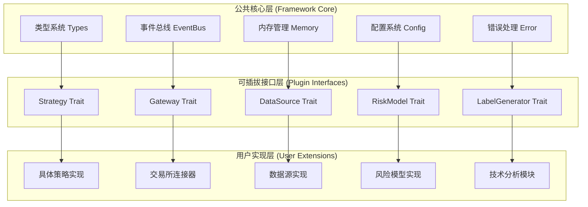

# MosesQuant框架公共组件与可插拔组件设计

> **文档版本**: v1.0  
> **创建日期**: 2025-07-18  
> **设计目标**: 明确区分框架核心与用户扩展边界，确保架构的稳定性和可扩展性

## 1. 设计理念：清晰的边界划分

### 1.1 核心设计原则



**核心原则**：
1. **公共核心稳定不变** - 提供基础设施，确保版本兼容性
2. **插拔接口标准化** - 通过Rust trait定义清晰的扩展点
3. **用户实现自由** - 在标准接口约束下，用户可完全自定义实现
4. **零运行时开销** - 使用编译时多态，避免动态分发性能损失

## 2. 公共核心组件（Framework Core）

### 2.1 核心类型系统

```rust
// ================================
// 公共核心：基础数据结构
// 位置：src/types.rs
// 特点：框架基础，用户不可修改，只能使用
// ================================

/// 核心价格类型 - 保证精度和一致性
pub type Price = rust_decimal::Decimal;
pub type Quantity = rust_decimal::Decimal;
pub type TimestampNs = i64;

/// 基础市场数据 - 所有数据源必须转换为此格式
#[derive(Debug, Clone, PartialEq)]
pub struct Bar {
    pub symbol: Symbol,
    pub timestamp: TimestampNs,
    pub open: Price,
    pub high: Price,
    pub low: Price,
    pub close: Price,
    pub volume: Quantity,
    pub turnover: Option<Price>,
    pub trade_count: Option<u32>,
}

#[derive(Debug, Clone, PartialEq)]
pub struct Tick {
    pub symbol: Symbol,
    pub timestamp: TimestampNs,
    pub price: Price,
    pub size: Quantity,
    pub side: Side,
    pub trade_id: Option<String>,
}

/// 订单核心结构 - 统一的订单表示
#[derive(Debug, Clone, PartialEq)]
pub struct Order {
    pub id: OrderId,
    pub symbol: Symbol,
    pub side: Side,
    pub order_type: OrderType,
    pub quantity: Quantity,
    pub price: Option<Price>,
    pub status: OrderStatus,
    pub created_at: TimestampNs,
    pub updated_at: TimestampNs,
    pub filled_quantity: Quantity,
    pub average_fill_price: Option<Price>,
    pub commission: Price,
    pub metadata: HashMap<String, Value>,
}

/// 持仓核心结构
#[derive(Debug, Clone, PartialEq)]
pub struct Position {
    pub symbol: Symbol,
    pub quantity: Quantity,  // 正数为多头，负数为空头
    pub average_price: Price,
    pub market_value: Price,
    pub unrealized_pnl: Price,
    pub realized_pnl: Price,
    pub last_updated: TimestampNs,
}

/// 核心枚举 - 框架标准，不可变更
#[derive(Debug, Clone, Copy, PartialEq, Eq, Hash)]
pub enum Side {
    Buy,
    Sell,
}

#[derive(Debug, Clone, Copy, PartialEq, Eq, Hash)]
pub enum OrderType {
    Market,
    Limit,
    Stop,
    StopLimit,
    TrailingStop,
}

#[derive(Debug, Clone, Copy, PartialEq, Eq)]
pub enum OrderStatus {
    Pending,
    Submitted,
    PartiallyFilled,
    Filled,
    Cancelled,
    Rejected,
    Expired,
}

/// 统一结果类型 - 框架级错误处理
pub type Result<T> = std::result::Result<T, CzscError>;
```

### 2.2 事件系统核心

```rust
// ================================
// 公共核心：事件总线系统
// 位置：src/events.rs
// 特点：提供统一的事件调度基础设施
// ================================

/// 事件总线 - 框架核心，用户不可替换
pub struct EventBus {
    // 使用channel实现高性能异步事件传递
    event_sender: tokio::sync::mpsc::UnboundedSender<BoxedEvent>,
    event_receiver: Arc<Mutex<tokio::sync::mpsc::UnboundedReceiver<BoxedEvent>>>,
    
    // 事件处理器注册表
    handlers: Arc<RwLock<HashMap<TypeId, Vec<BoxedEventHandler>>>>,
    
    // 路由策略（公共配置）
    routing_strategy: EventRoutingStrategy,
    
    // 性能统计（公共监控）
    stats: Arc<RwLock<EventBusStatistics>>,
}

/// 事件特征 - 用户可实现，但必须遵循此接口
pub trait Event: Send + Sync + Debug + 'static {
    fn event_type(&self) -> &'static str;
    fn timestamp(&self) -> TimestampNs;
    fn priority(&self) -> EventPriority;
    fn source(&self) -> &str;
}

/// 事件处理器特征 - 用户可插拔实现点
#[async_trait]
pub trait EventHandler<T: Event>: Send + Sync {
    async fn handle(&self, event: &T) -> Result<()>;
    fn handler_id(&self) -> &str;
    fn can_handle_parallel(&self) -> bool { true }
}

/// 事件优先级 - 框架级别定义
#[derive(Debug, Clone, Copy, PartialEq, Eq, PartialOrd, Ord)]
pub enum EventPriority {
    Critical = 0,    // 订单执行、风险控制
    High = 1,        // 市场数据更新
    Normal = 2,      // 策略信号
    Low = 3,         // 日志、统计
}

impl EventBus {
    /// 注册事件处理器 - 用户扩展点
    pub fn register_handler<T: Event>(
        &mut self,
        handler: Box<dyn EventHandler<T>>
    ) -> Result<()> {
        let type_id = TypeId::of::<T>();
        let boxed_handler = Box::new(move |event: &dyn Event| {
            if let Some(typed_event) = event.downcast_ref::<T>() {
                handler.handle(typed_event)
            } else {
                Box::pin(async { Ok(()) })
            }
        });
        
        let mut handlers = self.handlers.write().await;
        handlers.entry(type_id).or_insert_with(Vec::new).push(boxed_handler);
        
        Ok(())
    }
    
    /// 发布事件 - 公共API，性能优化
    pub async fn publish<T: Event>(&self, event: T) -> Result<()> {
        // 性能优化：避免不必要的序列化
        let boxed_event = Box::new(event) as BoxedEvent;
        
        // 异步发送，避免阻塞
        self.event_sender.send(boxed_event)
            .map_err(|_| CzscError::EventBusError("Failed to send event".to_string()))?;
        
        // 更新统计
        self.stats.write().await.events_published += 1;
        
        Ok(())
    }
}
```

### 2.3 内存管理核心

```rust
// ================================
// 公共核心：内存管理系统
// 位置：src/memory.rs
// 特点：零成本抽象，高性能内存池
// ================================

/// 对象池 - 减少动态分配，提升性能
pub struct ObjectPool<T> {
    pool: Arc<Mutex<Vec<T>>>,
    factory: fn() -> T,
    max_size: usize,
    created_count: AtomicUsize,
    recycled_count: AtomicUsize,
}

impl<T> ObjectPool<T> {
    pub fn new(factory: fn() -> T, max_size: usize) -> Self {
        Self {
            pool: Arc::new(Mutex::new(Vec::with_capacity(max_size))),
            factory,
            max_size,
            created_count: AtomicUsize::new(0),
            recycled_count: AtomicUsize::new(0),
        }
    }
    
    /// 获取对象 - 自动管理生命周期
    pub fn acquire(&self) -> PooledObject<T> {
        let object = {
            let mut pool = self.pool.lock().unwrap();
            if let Some(obj) = pool.pop() {
                self.recycled_count.fetch_add(1, Ordering::Relaxed);
                obj
            } else {
                self.created_count.fetch_add(1, Ordering::Relaxed);
                (self.factory)()
            }
        };
        
        PooledObject {
            object: Some(object),
            pool: Arc::clone(&self.pool),
            max_size: self.max_size,
        }
    }
}

/// 池化对象 - RAII自动归还
pub struct PooledObject<T> {
    object: Option<T>,
    pool: Arc<Mutex<Vec<T>>>,
    max_size: usize,
}

impl<T> Drop for PooledObject<T> {
    fn drop(&mut self) {
        if let Some(object) = self.object.take() {
            let mut pool = self.pool.lock().unwrap();
            if pool.len() < self.max_size {
                pool.push(object);
            }
        }
    }
}

/// 全局内存池管理器
pub struct MemoryManager {
    order_pool: ObjectPool<Order>,
    bar_pool: ObjectPool<Bar>,
    tick_pool: ObjectPool<Tick>,
    position_pool: ObjectPool<Position>,
}

// 全局单例，框架级别管理
lazy_static! {
    pub static ref MEMORY_MANAGER: MemoryManager = MemoryManager::new();
}
```

### 2.4 配置系统核心

```rust
// ================================
// 公共核心：配置管理系统
// 位置：src/config.rs
// 特点：类型安全的配置解析和验证
// ================================

/// 框架配置 - 核心框架行为配置
#[derive(Debug, Clone, Serialize, Deserialize)]
pub struct FrameworkConfig {
    pub name: String,
    pub version: String,
    pub timezone: String,
    pub initial_capital: Price,
    
    // 事件系统配置
    pub event_bus: EventBusConfig,
    
    // 内存管理配置
    pub memory: MemoryConfig,
    
    // 日志配置
    pub logging: LoggingConfig,
    
    // 性能监控配置
    pub monitoring: MonitoringConfig,
}

#[derive(Debug, Clone, Serialize, Deserialize)]
pub struct EventBusConfig {
    pub buffer_size: usize,
    pub max_parallel_handlers: usize,
    pub routing_strategy: EventRoutingStrategy,
}

/// 配置加载器 - 支持多种配置源
pub struct ConfigLoader {
    config_paths: Vec<PathBuf>,
    environment_prefix: String,
    validation_rules: Vec<Box<dyn ConfigValidator>>,
}

impl ConfigLoader {
    /// 加载和验证配置
    pub fn load<T: DeserializeOwned + ConfigValidate>(&self) -> Result<T> {
        // 1. 从文件加载基础配置
        let mut config_value = self.load_from_files()?;
        
        // 2. 环境变量覆盖
        self.apply_environment_variables(&mut config_value)?;
        
        // 3. 反序列化为强类型
        let config: T = serde_yaml::from_value(config_value)?;
        
        // 4. 配置验证
        config.validate()?;
        
        Ok(config)
    }
}

/// 配置验证特征 - 编译时类型安全
pub trait ConfigValidate {
    fn validate(&self) -> Result<()>;
}
```

## 3. 可插拔接口层（Plugin Interfaces）

### 3.1 策略接口

```rust
// ================================
// 可插拔接口：策略系统
// 位置：src/strategy/traits.rs
// 特点：用户必须实现，框架提供默认实现
// ================================

/// 策略特征 - 用户主要扩展点
#[async_trait]
pub trait Strategy: Send + Sync {
    // === 必须实现的核心方法 ===
    async fn on_start(&mut self, context: &StrategyContext) -> Result<()>;
    async fn on_data(&mut self, context: &StrategyContext, data: &MarketData) -> Result<Vec<Order>>;
    async fn on_order(&mut self, context: &StrategyContext, order: &Order) -> Result<()>;
    async fn on_trade(&mut self, context: &StrategyContext, trade: &Trade) -> Result<()>;
    async fn on_stop(&mut self, context: &StrategyContext) -> Result<()>;
    
    // === 元信息方法（必须实现）===
    fn strategy_id(&self) -> &str;
    fn strategy_name(&self) -> &str;
    fn version(&self) -> &str;
    
    // === 可选实现的高级方法 ===
    async fn on_timer(&mut self, _context: &StrategyContext, _timer_id: &str) -> Result<()> {
        Ok(()) // 默认空实现
    }
    
    async fn on_error(&mut self, _context: &StrategyContext, _error: &CzscError) -> Result<()> {
        Ok(()) // 默认空实现
    }
    
    fn supported_symbols(&self) -> Vec<Symbol> {
        vec![] // 默认支持所有
    }
    
    fn required_data_types(&self) -> Vec<DataType> {
        vec![DataType::Bar] // 默认需要Bar数据
    }
}

/// 五阶段策略特征 - 可选的高级接口
#[async_trait]
pub trait PipelineStrategy: Strategy {
    async fn universe_selection(&self, context: &StrategyContext) -> Result<Vec<Symbol>>;
    async fn alpha_generation(&self, context: &StrategyContext, universe: &[Symbol]) -> Result<Vec<Insight>>;
    async fn portfolio_construction(&self, context: &StrategyContext, insights: &[Insight]) -> Result<Vec<PortfolioTarget>>;
    async fn risk_management(&self, context: &StrategyContext, targets: &[PortfolioTarget]) -> Result<Vec<PortfolioTarget>>;
    async fn execution(&self, context: &StrategyContext, targets: &[PortfolioTarget]) -> Result<Vec<Order>>;
}

/// 策略上下文 - 框架提供，用户消费
pub struct StrategyContext {
    // 框架核心服务（只读访问）
    pub strategy_id: String,
    pub current_time: TimestampNs,
    pub portfolio: Arc<RwLock<Portfolio>>,
    pub data_manager: Arc<dyn DataManager>,
    pub order_manager: Arc<dyn OrderManager>,
    pub risk_manager: Arc<dyn RiskManager>,
    
    // 用户可访问的工具
    pub logger: Arc<dyn Logger>,
    pub metrics: Arc<dyn MetricsCollector>,
    pub cache: Arc<dyn Cache>,
}

impl StrategyContext {
    /// 获取历史数据 - 统一API
    pub async fn get_bars(&self, symbol: &Symbol, count: usize) -> Result<Vec<Bar>> {
        self.data_manager.get_bars(symbol, count).await
    }
    
    /// 提交订单 - 统一API
    pub async fn submit_order(&self, order: Order) -> Result<OrderId> {
        self.order_manager.submit_order(order).await
    }
    
    /// 记录日志 - 统一API
    pub fn log(&self, level: LogLevel, message: &str) {
        self.logger.log(level, &self.strategy_id, message);
    }
}
```

### 3.2 数据源接口

```rust
// ================================
// 可插拔接口：数据源系统
// 位置：src/data/traits.rs
// 特点：用户实现具体数据源，框架提供调度
// ================================

/// 数据源特征 - 用户扩展点
#[async_trait]
pub trait DataSource: Send + Sync {
    // === 必须实现的核心方法 ===
    async fn connect(&mut self) -> Result<()>;
    async fn disconnect(&mut self) -> Result<()>;
    async fn subscribe(&mut self, symbols: Vec<Symbol>, data_types: Vec<DataType>) -> Result<()>;
    async fn get_historical_data(&self, request: DataRequest) -> Result<Vec<Bar>>;
    
    // === 元信息方法 ===
    fn source_id(&self) -> &str;
    fn source_type(&self) -> DataSourceType;
    fn supported_symbols(&self) -> Vec<Symbol>;
    fn supported_data_types(&self) -> Vec<DataType>;
    
    // === 可选方法 ===
    async fn unsubscribe(&mut self, _symbols: Vec<Symbol>) -> Result<()> {
        Ok(()) // 默认空实现
    }
    
    fn is_real_time(&self) -> bool { true }
    fn latency_estimate(&self) -> Duration { Duration::from_millis(100) }
    
    // === 健康检查 ===
    async fn health_check(&self) -> Result<DataSourceHealth> {
        Ok(DataSourceHealth::Healthy) // 默认健康
    }
}

/// 数据源类型枚举 - 框架定义
#[derive(Debug, Clone, PartialEq)]
pub enum DataSourceType {
    RealTime,      // 实时数据源
    Historical,    // 历史数据源
    Simulated,     // 模拟数据源
    Hybrid,        // 混合数据源
}

/// 数据请求 - 统一的数据查询格式
#[derive(Debug, Clone)]
pub struct DataRequest {
    pub symbol: Symbol,
    pub data_type: DataType,
    pub start_time: Option<TimestampNs>,
    pub end_time: Option<TimestampNs>,
    pub limit: Option<usize>,
    pub resolution: Option<Duration>,
}

/// 数据管理器特征 - 框架提供的数据服务接口
#[async_trait]
pub trait DataManager: Send + Sync {
    // 用户通过策略上下文调用这些方法
    async fn get_bars(&self, symbol: &Symbol, count: usize) -> Result<Vec<Bar>>;
    async fn get_ticks(&self, symbol: &Symbol, count: usize) -> Result<Vec<Tick>>;
    async fn get_latest_price(&self, symbol: &Symbol) -> Result<Price>;
    
    // 数据源管理（内部方法）
    async fn register_data_source(&mut self, source: Box<dyn DataSource>) -> Result<()>;
    async fn start_data_feeds(&mut self) -> Result<()>;
    async fn stop_data_feeds(&mut self) -> Result<()>;
}
```

### 3.3 网关接口

```rust
// ================================
// 可插拔接口：交易网关系统
// 位置：src/gateway/traits.rs
// 特点：用户实现具体交易所接口
// ================================

/// 交易网关特征 - 用户扩展点
#[async_trait]
pub trait Gateway: Send + Sync {
    // === 连接管理 ===
    async fn connect(&mut self) -> Result<()>;
    async fn disconnect(&mut self) -> Result<()>;
    fn is_connected(&self) -> bool;
    
    // === 订单管理 ===
    async fn submit_order(&mut self, order: Order) -> Result<OrderResponse>;
    async fn cancel_order(&mut self, order_id: &OrderId) -> Result<()>;
    async fn get_order_status(&self, order_id: &OrderId) -> Result<OrderStatus>;
    
    // === 账户查询 ===
    async fn get_account_info(&self) -> Result<AccountInfo>;
    async fn get_positions(&self) -> Result<Vec<Position>>;
    async fn get_balance(&self) -> Result<Balance>;
    
    // === 元信息 ===
    fn gateway_id(&self) -> &str;
    fn gateway_type(&self) -> GatewayType;
    fn supported_order_types(&self) -> Vec<OrderType>;
    fn fee_structure(&self) -> FeeStructure;
    
    // === 可选功能 ===
    async fn modify_order(&mut self, _order_id: &OrderId, _modification: OrderModification) -> Result<()> {
        Err(CzscError::NotSupported("Order modification not supported".to_string()))
    }
    
    async fn batch_submit_orders(&mut self, orders: Vec<Order>) -> Result<Vec<OrderResponse>> {
        // 默认实现：逐个提交
        let mut responses = Vec::new();
        for order in orders {
            responses.push(self.submit_order(order).await?);
        }
        Ok(responses)
    }
}

/// 网关类型 - 框架预定义 + 用户扩展
#[derive(Debug, Clone, PartialEq)]
pub enum GatewayType {
    // 框架预定义
    Simulated,
    
    // 用户可添加新类型
    Binance,
    Coinbase,
    InteractiveBrokers,
    
    // 自定义网关
    Custom(String),
}

/// 网关管理器 - 框架提供
pub struct GatewayManager {
    gateways: HashMap<String, Box<dyn Gateway>>,
    active_gateway: Option<String>,
    gateway_stats: HashMap<String, GatewayStatistics>,
}

impl GatewayManager {
    /// 注册网关 - 用户扩展点
    pub async fn register_gateway(&mut self, gateway: Box<dyn Gateway>) -> Result<()> {
        let gateway_id = gateway.gateway_id().to_string();
        self.gateways.insert(gateway_id, gateway);
        Ok(())
    }
    
    /// 设置活动网关
    pub fn set_active_gateway(&mut self, gateway_id: &str) -> Result<()> {
        if self.gateways.contains_key(gateway_id) {
            self.active_gateway = Some(gateway_id.to_string());
            Ok(())
        } else {
            Err(CzscError::GatewayNotFound(gateway_id.to_string()))
        }
    }
}
```

### 3.4 风险模型接口

```rust
// ================================
// 可插拔接口：风险管理系统
// 位置：src/risk/traits.rs
// 特点：用户实现自定义风险模型
// ================================

/// 风险模型特征 - 用户扩展点
#[async_trait]
pub trait RiskModel: Send + Sync {
    // === 核心风险检查 ===
    async fn check_order_risk(&self, order: &Order, context: &RiskContext) -> Result<RiskCheckResult>;
    async fn check_portfolio_risk(&self, portfolio: &Portfolio, context: &RiskContext) -> Result<RiskAssessment>;
    
    // === 元信息 ===
    fn model_id(&self) -> &str;
    fn model_type(&self) -> RiskModelType;
    fn risk_categories(&self) -> Vec<RiskCategory>;
    
    // === 配置管理 ===
    fn get_limits(&self) -> RiskLimits;
    fn set_limits(&mut self, limits: RiskLimits) -> Result<()>;
    
    // === 可选方法 ===
    async fn calculate_var(&self, _portfolio: &Portfolio, _confidence: f64) -> Result<Price> {
        Err(CzscError::NotSupported("VaR calculation not supported".to_string()))
    }
    
    async fn stress_test(&self, _portfolio: &Portfolio, _scenarios: &[StressScenario]) -> Result<StressTestResult> {
        Err(CzscError::NotSupported("Stress testing not supported".to_string()))
    }
}

/// 风险检查结果
#[derive(Debug, Clone)]
pub struct RiskCheckResult {
    pub approved: bool,
    pub risk_score: f64,
    pub violated_limits: Vec<RiskLimitViolation>,
    pub warnings: Vec<String>,
    pub recommendations: Vec<String>,
}

/// 风险上下文 - 框架提供
pub struct RiskContext {
    pub current_time: TimestampNs,
    pub market_data: HashMap<Symbol, Bar>,
    pub open_orders: Vec<Order>,
    pub account_info: AccountInfo,
    pub market_conditions: MarketConditions,
}

/// 风险管理器 - 框架实现，组合多个风险模型
pub struct RiskManager {
    models: Vec<Box<dyn RiskModel>>,
    evaluation_strategy: RiskEvaluationStrategy,
    emergency_stops: Vec<EmergencyStop>,
}

impl RiskManager {
    /// 注册风险模型 - 用户扩展点
    pub fn register_model(&mut self, model: Box<dyn RiskModel>) {
        self.models.push(model);
    }
    
    /// 综合风险评估
    pub async fn evaluate_order_risk(&self, order: &Order, context: &RiskContext) -> Result<RiskCheckResult> {
        let mut results = Vec::new();
        
        // 并行评估所有风险模型
        for model in &self.models {
            let result = model.check_order_risk(order, context).await?;
            results.push(result);
        }
        
        // 根据策略合并结果
        self.evaluation_strategy.combine_results(results)
    }
}
```

## 4. 用户实现指南

### 4.1 实现自定义策略

```rust
// ================================
// 用户实现示例：自定义策略
// 位置：用户代码目录
// 特点：用户完全控制策略逻辑
// ================================

use moses_quant::strategy::Strategy;
use moses_quant::types::*;

/// 用户自定义策略示例
pub struct MyCustomStrategy {
    strategy_id: String,
    parameters: MyStrategyParams,
    state: MyStrategyState,
}

#[derive(Debug, Clone)]
struct MyStrategyParams {
    fast_period: usize,
    slow_period: usize,
    signal_threshold: f64,
}

#[derive(Debug, Default)]
struct MyStrategyState {
    fast_ema: f64,
    slow_ema: f64,
    last_signal: Option<Signal>,
}

#[async_trait]
impl Strategy for MyCustomStrategy {
    async fn on_start(&mut self, context: &StrategyContext) -> Result<()> {
        context.log(LogLevel::Info, "My custom strategy started");
        // 初始化策略状态
        self.initialize_indicators(context).await?;
        Ok(())
    }
    
    async fn on_data(&mut self, context: &StrategyContext, data: &MarketData) -> Result<Vec<Order>> {
        let mut orders = Vec::new();
        
        if let MarketData::Bar(bar) = data {
            // 更新技术指标
            self.update_indicators(bar);
            
            // 生成交易信号
            if let Some(signal) = self.generate_signal() {
                if let Some(order) = self.create_order_from_signal(&signal, bar, context).await? {
                    orders.push(order);
                }
            }
        }
        
        Ok(orders)
    }
    
    async fn on_order(&mut self, context: &StrategyContext, order: &Order) -> Result<()> {
        context.log(LogLevel::Info, &format!("Order update: {:?}", order.status));
        Ok(())
    }
    
    async fn on_trade(&mut self, context: &StrategyContext, trade: &Trade) -> Result<()> {
        context.log(LogLevel::Info, &format!("Trade executed: {}", trade.quantity));
        Ok(())
    }
    
    async fn on_stop(&mut self, context: &StrategyContext) -> Result<()> {
        context.log(LogLevel::Info, "Strategy stopped");
        Ok(())
    }
    
    fn strategy_id(&self) -> &str { &self.strategy_id }
    fn strategy_name(&self) -> &str { "MyCustomStrategy" }
    fn version(&self) -> &str { "1.0.0" }
}

impl MyCustomStrategy {
    pub fn new(strategy_id: String, params: MyStrategyParams) -> Self {
        Self {
            strategy_id,
            parameters: params,
            state: MyStrategyState::default(),
        }
    }
    
    // 用户完全控制的私有方法
    fn update_indicators(&mut self, bar: &Bar) {
        let price = bar.close.to_f64().unwrap();
        let alpha_fast = 2.0 / (self.parameters.fast_period as f64 + 1.0);
        let alpha_slow = 2.0 / (self.parameters.slow_period as f64 + 1.0);
        
        self.state.fast_ema = alpha_fast * price + (1.0 - alpha_fast) * self.state.fast_ema;
        self.state.slow_ema = alpha_slow * price + (1.0 - alpha_slow) * self.state.slow_ema;
    }
    
    fn generate_signal(&mut self) -> Option<Signal> {
        let diff = self.state.fast_ema - self.state.slow_ema;
        
        if diff > self.parameters.signal_threshold {
            Some(Signal::Buy)
        } else if diff < -self.parameters.signal_threshold {
            Some(Signal::Sell)
        } else {
            None
        }
    }
}
```

### 4.2 实现自定义数据源

```rust
// ================================
// 用户实现示例：自定义数据源
// 位置：用户代码目录
// 特点：用户实现具体数据获取逻辑
// ================================

use moses_quant::data::DataSource;
use moses_quant::types::*;

/// 用户自定义数据源
pub struct MyDataProvider {
    source_id: String,
    api_client: MyAPIClient,
    subscriptions: HashSet<Symbol>,
    connection_state: ConnectionState,
}

#[async_trait]
impl DataSource for MyDataProvider {
    async fn connect(&mut self) -> Result<()> {
        self.api_client.connect().await?;
        self.connection_state = ConnectionState::Connected;
        Ok(())
    }
    
    async fn disconnect(&mut self) -> Result<()> {
        self.api_client.disconnect().await?;
        self.connection_state = ConnectionState::Disconnected;
        Ok(())
    }
    
    async fn subscribe(&mut self, symbols: Vec<Symbol>, data_types: Vec<DataType>) -> Result<()> {
        for symbol in symbols {
            // 用户自定义的订阅逻辑
            self.api_client.subscribe_symbol(&symbol).await?;
            self.subscriptions.insert(symbol);
        }
        Ok(())
    }
    
    async fn get_historical_data(&self, request: DataRequest) -> Result<Vec<Bar>> {
        // 用户自定义的历史数据获取逻辑
        let raw_data = self.api_client.fetch_historical_data(&request).await?;
        
        // 转换为框架标准格式
        let bars = raw_data.into_iter()
            .map(|raw_bar| self.convert_to_standard_bar(raw_bar))
            .collect::<Result<Vec<_>>>()?;
        
        Ok(bars)
    }
    
    fn source_id(&self) -> &str { &self.source_id }
    fn source_type(&self) -> DataSourceType { DataSourceType::RealTime }
    
    fn supported_symbols(&self) -> Vec<Symbol> {
        // 返回支持的交易对
        vec![
            Symbol::new("BTC/USDT"),
            Symbol::new("ETH/USDT"),
            // ... 更多交易对
        ]
    }
    
    fn supported_data_types(&self) -> Vec<DataType> {
        vec![DataType::Bar, DataType::Tick]
    }
}

impl MyDataProvider {
    pub fn new(source_id: String, api_config: MyAPIConfig) -> Self {
        Self {
            source_id,
            api_client: MyAPIClient::new(api_config),
            subscriptions: HashSet::new(),
            connection_state: ConnectionState::Disconnected,
        }
    }
    
    // 用户自定义的数据转换逻辑
    fn convert_to_standard_bar(&self, raw_bar: MyRawBar) -> Result<Bar> {
        Ok(Bar {
            symbol: Symbol::new(&raw_bar.symbol),
            timestamp: raw_bar.timestamp,
            open: Price::from_str(&raw_bar.open)?,
            high: Price::from_str(&raw_bar.high)?,
            low: Price::from_str(&raw_bar.low)?,
            close: Price::from_str(&raw_bar.close)?,
            volume: Quantity::from_str(&raw_bar.volume)?,
            turnover: raw_bar.turnover.map(|t| Price::from_str(&t)).transpose()?,
            trade_count: raw_bar.trade_count,
        })
    }
}
```

## 5. 插件注册和配置

### 5.1 插件注册系统

```rust
// ================================
// 框架提供：插件注册系统
// 位置：src/plugin/registry.rs
// 特点：类型安全的插件管理
// ================================

/// 插件注册表 - 框架核心组件
pub struct PluginRegistry {
    strategies: HashMap<String, Box<dyn Strategy>>,
    data_sources: HashMap<String, Box<dyn DataSource>>,
    gateways: HashMap<String, Box<dyn Gateway>>,
    risk_models: HashMap<String, Box<dyn RiskModel>>,
}

impl PluginRegistry {
    /// 注册策略插件
    pub fn register_strategy<T: Strategy + 'static>(&mut self, strategy: T) -> Result<()> {
        let strategy_id = strategy.strategy_id().to_string();
        if self.strategies.contains_key(&strategy_id) {
            return Err(CzscError::PluginAlreadyRegistered(strategy_id));
        }
        
        self.strategies.insert(strategy_id, Box::new(strategy));
        Ok(())
    }
    
    /// 注册数据源插件
    pub fn register_data_source<T: DataSource + 'static>(&mut self, data_source: T) -> Result<()> {
        let source_id = data_source.source_id().to_string();
        if self.data_sources.contains_key(&source_id) {
            return Err(CzscError::PluginAlreadyRegistered(source_id));
        }
        
        self.data_sources.insert(source_id, Box::new(data_source));
        Ok(())
    }
    
    /// 从配置创建策略实例
    pub fn create_strategy_from_config(&self, config: &StrategyConfig) -> Result<Box<dyn Strategy>> {
        match config.strategy_type.as_str() {
            "MyCustomStrategy" => {
                // 用户需要提供工厂函数
                let params = serde_yaml::from_value(config.parameters.clone())?;
                Ok(Box::new(MyCustomStrategy::new(config.id.clone(), params)))
            }
            _ => Err(CzscError::UnknownStrategyType(config.strategy_type.clone()))
        }
    }
}

/// 全局插件注册宏
#[macro_export]
macro_rules! register_plugin {
    (strategy: $strategy_type:ty) => {
        #[no_mangle]
        pub extern "C" fn register_strategy_plugin() -> Box<dyn Strategy> {
            Box::new(<$strategy_type>::default())
        }
    };
    
    (data_source: $data_source_type:ty) => {
        #[no_mangle]
        pub extern "C" fn register_data_source_plugin() -> Box<dyn DataSource> {
            Box::new(<$data_source_type>::default())
        }
    };
}
```

### 5.2 配置驱动的插件加载

```yaml
# ================================
# 用户配置文件示例
# 位置：config/strategy.yaml
# 特点：声明式配置，框架自动实例化
# ================================

framework:
  name: "MosesQuant"
  version: "0.1.0"
  initial_capital: 100000.0

# 数据源配置 - 用户插件
data_sources:
  - id: "my_data_provider"
    type: "MyDataProvider"
    enabled: true
    config:
      api_key: "${MY_API_KEY}"
      api_secret: "${MY_API_SECRET}"
      base_url: "https://api.example.com"

# 网关配置 - 用户插件
gateways:
  - id: "my_trading_gateway"
    type: "MyTradingGateway"
    enabled: true
    config:
      trading_mode: "paper"
      commission_rate: 0.001

# 策略配置 - 用户插件
strategies:
  - id: "my_custom_strategy"
    type: "MyCustomStrategy"
    enabled: true
    symbols: ["BTC/USDT", "ETH/USDT"]
    parameters:
      fast_period: 12
      slow_period: 26
      signal_threshold: 0.01

# 风险管理配置 - 用户插件
risk_management:
  models:
    - id: "position_size_risk"
      type: "PositionSizeRiskModel"
      config:
        max_position_size: 0.1
        max_total_exposure: 0.8
```

## 6. 总结

### 6.1 清晰的边界划分

| 组件类别 | 责任范围 | 用户可修改性 | 性能特征 |
|---------|---------|-------------|---------|
| **公共核心** | 基础设施、类型系统、事件总线 | ❌ 不可修改 | 🚀 零成本抽象 |
| **可插拔接口** | 标准化的扩展点 | ⚡ 接口固定，实现自由 | 🎯 编译时多态 |
| **用户实现** | 具体业务逻辑 | ✅ 完全控制 | 📊 性能取决于实现质量 |

### 6.2 优势特性

1. **类型安全** - Rust编译器保证接口契约
2. **零运行时开销** - 编译时确定所有调用
3. **内存安全** - 借用检查器防止数据竞争
4. **渐进式复杂度** - 简单接口开始，需要时扩展
5. **配置驱动** - 声明式配置，框架自动装配

这种设计确保了框架核心的稳定性，同时为用户提供了最大的扩展自由度和性能保证。