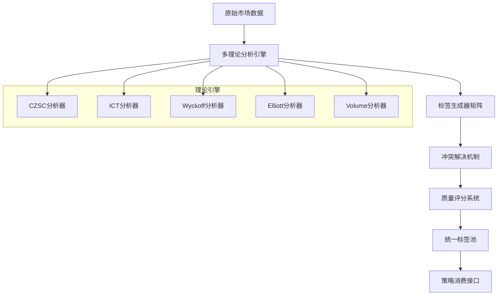

# 统一标签池深度设计文档

> **文档版本**: v1.0  
> **创建日期**: 2025-07-18  
> **模块**: 统一标签池 (Unified Label Pool)  
> **目标**: 实现语义化市场分析的核心组件，支持多理论融合和智能冲突解决

## 1. 设计概览

统一标签池是MosesQuant架构中的核心创新，它将传统的硬编码技术分析转变为语义化的标签消费模式。通过抽象市场现象为标准化标签，实现CZSC、ICT、Wyckoff等多种理论的无缝融合。

### 1.1 核心设计理念



### 1.2 核心价值主张

1. **理论无关性**: 策略不需要了解具体的技术分析理论，只消费语义化标签
2. **多理论融合**: 同时集成多种分析理论，提高信号可靠性
3. **智能冲突解决**: 自动处理不同理论之间的分歧
4. **动态质量评估**: 实时评估标签质量和有效性
5. **可扩展架构**: 轻松添加新的分析理论和标签类型

## 2. 核心数据结构设计

### 2.1 统一标签数据结构

```rust
/// 统一标签 - 系统的核心数据结构
#[derive(Debug, Clone, Serialize, Deserialize, PartialEq)]
pub struct UnifiedLabel {
    // === 基础标识 ===
    pub label_id: String,              // 唯一标识
    pub label_name: String,            // 人类可读名称
    pub label_type: LabelType,         // 标签类型
    pub source: LabelSource,           // 来源理论
    
    // === 时空属性 ===
    pub symbol: Symbol,                // 标的符号
    pub timeframe: String,             // 时间周期
    pub created_at: i64,               // 创建时间戳
    pub valid_until: Option<i64>,      // 有效期
    pub price_level: Option<f64>,      // 关联价格水平
    pub price_range: Option<(f64, f64)>, // 价格区间
    
    // === 信号属性 ===
    pub direction: Option<Direction>,   // 方向性
    pub strength: LabelStrength,       // 信号强度
    pub confidence: f64,               // 置信度 [0.0, 1.0]
    pub quality_score: f64,            // 质量评分 [0.0, 1.0]
    
    // === 状态管理 ===
    pub validation_status: ValidationStatus,
    pub is_active: bool,
    pub trigger_count: u32,            // 触发次数
    pub success_rate: Option<f64>,     // 历史成功率
    
    // === 扩展信息 ===
    pub metadata: HashMap<String, Value>, // 理论特定元数据
    pub dependencies: Vec<String>,     // 依赖的其他标签
    pub related_labels: Vec<String>,   // 相关标签
    
    // === 性能统计 ===
    pub performance_stats: Option<LabelPerformanceStats>,
}

/// 标签类型 - 细分的市场现象分类
#[derive(Debug, Clone, Serialize, Deserialize, PartialEq)]
pub enum LabelType {
    // === 结构性标签 ===
    Structure {
        sub_type: StructureType,
    },
    
    // === 形态标签 ===
    Pattern {
        sub_type: PatternType,
        completion_level: f64,         // 形态完成度
    },
    
    // === 量能标签 ===
    Volume {
        sub_type: VolumeType,
        volume_ratio: f64,             // 相对成交量比率
    },
    
    // === 动量标签 ===
    Momentum {
        sub_type: MomentumType,
        momentum_value: f64,           // 动量数值
    },
    
    // === 波动率标签 ===
    Volatility {
        sub_type: VolatilityType,
        volatility_percentile: f64,    // 波动率百分位
    },
    
    // === 情绪标签 ===
    Sentiment {
        sub_type: SentimentType,
        sentiment_score: f64,          // 情绪评分
    },
    
    // === 风险标签 ===
    Risk {
        sub_type: RiskType,
        risk_level: RiskLevel,
    },
    
    // === 周期标签 ===
    Cycle {
        sub_type: CycleType,
        cycle_position: f64,           // 周期位置 [0.0, 1.0]
    },
    
    // === 自定义标签 ===
    Custom {
        category: String,
        attributes: HashMap<String, Value>,
    },
}

/// 结构性标签细分
#[derive(Debug, Clone, Serialize, Deserialize, PartialEq)]
pub enum StructureType {
    // CZSC相关
    Bi,                    // 笔
    Duan,                  // 段
    ZhongShu,              // 中枢
    TrendLine,             // 趋势线
    
    // ICT相关
    OrderBlock,            // 订单区块
    FairValueGap,          // 公允价值缺口
    LiquidityVoid,         // 流动性空白
    BreakOfStructure,      // 结构突破
    
    // Wyckoff相关
    AccumulationPhase,     // 吸筹阶段
    DistributionPhase,     // 派发阶段
    MarkupPhase,           // 上涨阶段
    MarkdownPhase,         // 下跌阶段
    
    // 通用结构
    Support,               // 支撑
    Resistance,            // 阻力
    TrendChannel,          // 趋势通道
    PivotPoint,            // 枢轴点
}

/// 标签来源 - 扩展的理论体系
#[derive(Debug, Clone, Serialize, Deserialize, PartialEq)]
pub enum LabelSource {
    // === 技术分析理论 ===
    CZSC {
        level: u8,                     // 级别 (1分钟=1, 5分钟=2, ...)
        recursion_depth: u8,           // 递归深度
    },
    ICT {
        session: TradingSession,       // 交易时段
        market_structure: MarketStructure,
    },
    Wyckoff {
        phase: WyckoffPhase,           // 威科夫阶段
        volume_analysis: bool,         // 是否包含成交量分析
    },
    Elliott {
        wave_degree: WaveDegree,       // 波浪级别
        wave_type: WaveType,           // 波浪类型
    },
    
    // === 量化指标 ===
    TechnicalIndicator {
        indicator_name: String,
        parameters: HashMap<String, f64>,
    },
    
    // === 机器学习模型 ===
    MLModel {
        model_name: String,
        model_version: String,
        training_data_period: String,
    },
    
    // === 市场微观结构 ===
    MarketMicrostructure {
        data_type: MicrostructureDataType,
        aggregation_method: String,
    },
    
    // === 基本面分析 ===
    Fundamental {
        metric_category: FundamentalCategory,
        data_provider: String,
    },
    
    // === 自定义来源 ===
    Custom {
        source_name: String,
        version: String,
    },
}

/// 标签强度枚举
#[derive(Debug, Clone, Serialize, Deserialize, PartialEq, PartialOrd)]
pub enum LabelStrength {
    VeryWeak = 1,
    Weak = 2,
    Moderate = 3,
    Strong = 4,
    VeryStrong = 5,
}

/// 标签性能统计
#[derive(Debug, Clone, Serialize, Deserialize)]
pub struct LabelPerformanceStats {
    pub total_triggers: u32,           // 总触发次数
    pub successful_predictions: u32,   // 成功预测次数
    pub false_positives: u32,          // 假阳性
    pub false_negatives: u32,          // 假阴性
    pub average_hold_time: f64,        // 平均持有时间(秒)
    pub average_return: f64,           // 平均收益率
    pub sharpe_ratio: Option<f64>,     // 夏普比率
    pub max_favorable_excursion: f64,  // 最大有利偏移
    pub max_adverse_excursion: f64,    // 最大不利偏移
    pub last_updated: i64,             // 最后更新时间
}
```

### 2.2 标签查询系统

```rust
/// 标签查询构建器 - 支持复杂查询条件
#[derive(Debug, Clone, Default)]
pub struct LabelQuery {
    // === 基础过滤 ===
    pub symbols: Option<Vec<Symbol>>,
    pub timeframes: Option<Vec<String>>,
    pub label_types: Option<Vec<LabelType>>,
    pub sources: Option<Vec<LabelSource>>,
    
    // === 时间过滤 ===
    pub created_after: Option<i64>,
    pub created_before: Option<i64>,
    pub valid_at: Option<i64>,
    pub still_active: Option<bool>,
    
    // === 质量过滤 ===
    pub min_confidence: Option<f64>,
    pub min_quality_score: Option<f64>,
    pub min_strength: Option<LabelStrength>,
    pub validation_status: Option<Vec<ValidationStatus>>,
    
    // === 性能过滤 ===
    pub min_success_rate: Option<f64>,
    pub min_trigger_count: Option<u32>,
    pub min_sharpe_ratio: Option<f64>,
    
    // === 空间过滤 ===
    pub price_range: Option<(f64, f64)>,
    pub direction: Option<Direction>,
    
    // === 关系过滤 ===
    pub has_dependencies: Option<bool>,
    pub related_to: Option<Vec<String>>,
    
    // === 聚合选项 ===
    pub group_by: Option<GroupByOption>,
    pub sort_by: Option<SortByOption>,
    pub limit: Option<usize>,
    pub offset: Option<usize>,
}

#[derive(Debug, Clone)]
pub enum GroupByOption {
    Symbol,
    Timeframe,
    LabelType,
    Source,
    PriceLevel,
    TimeWindow(i64), // 按时间窗口分组
}

#[derive(Debug, Clone)]
pub enum SortByOption {
    CreatedAt(SortOrder),
    QualityScore(SortOrder),
    Confidence(SortOrder),
    Strength(SortOrder),
    SuccessRate(SortOrder),
}

impl LabelQuery {
    pub fn new() -> Self {
        Self::default()
    }
    
    /// 构建器模式的链式调用
    pub fn for_symbol(mut self, symbol: Symbol) -> Self {
        self.symbols = Some(vec![symbol]);
        self
    }
    
    pub fn with_timeframe(mut self, timeframe: &str) -> Self {
        self.timeframes = Some(vec![timeframe.to_string()]);
        self
    }
    
    pub fn with_min_confidence(mut self, confidence: f64) -> Self {
        self.min_confidence = Some(confidence);
        self
    }
    
    pub fn active_only(mut self) -> Self {
        self.still_active = Some(true);
        self
    }
    
    pub fn high_quality_only(mut self) -> Self {
        self.min_quality_score = Some(0.7);
        self.min_confidence = Some(0.8);
        self
    }
    
    pub fn sort_by_quality(mut self) -> Self {
        self.sort_by = Some(SortByOption::QualityScore(SortOrder::Descending));
        self
    }
    
    pub fn limit(mut self, limit: usize) -> Self {
        self.limit = Some(limit);
        self
    }
}
```

## 3. 标签生成器架构

### 3.1 标签生成器接口设计

```rust
/// 标签生成器特征 - 所有分析理论的统一接口
#[async_trait]
pub trait LabelGenerator: Send + Sync {
    // === 核心功能 ===
    async fn generate_labels(
        &self,
        data: &MarketData,
        context: &AnalysisContext
    ) -> Result<Vec<UnifiedLabel>>;
    
    // === 元信息 ===
    fn name(&self) -> &str;
    fn version(&self) -> &str;
    fn source(&self) -> LabelSource;
    fn supported_timeframes(&self) -> Vec<String>;
    fn supported_symbols(&self) -> Vec<Symbol>;
    fn label_types(&self) -> Vec<LabelType>;
    
    // === 配置管理 ===
    fn priority(&self) -> i32;
    fn dependencies(&self) -> Vec<String>;
    fn parameters(&self) -> HashMap<String, ParameterDefinition>;
    fn set_parameters(&mut self, params: HashMap<String, Value>) -> Result<()>;
    
    // === 性能属性 ===
    fn expected_latency(&self) -> Duration;
    fn memory_usage_estimate(&self) -> usize;
    fn cpu_intensive(&self) -> bool;
    
    // === 质量控制 ===
    async fn validate_input(&self, data: &MarketData) -> Result<()>;
    async fn self_test(&self) -> Result<SelfTestResult>;
    
    // === 生命周期管理 ===
    async fn initialize(&mut self, config: &GeneratorConfig) -> Result<()>;
    async fn shutdown(&mut self) -> Result<()>;
    
    // === 状态管理 ===
    fn is_healthy(&self) -> bool;
    fn get_statistics(&self) -> GeneratorStatistics;
    
    // === 可选的批量处理 ===
    async fn generate_labels_batch(
        &self,
        data_batch: &[MarketData],
        context: &AnalysisContext
    ) -> Result<Vec<Vec<UnifiedLabel>>> {
        // 默认实现：逐个处理
        let mut results = Vec::new();
        for data in data_batch {
            let labels = self.generate_labels(data, context).await?;
            results.push(labels);
        }
        Ok(results)
    }
}

/// 分析上下文 - 为生成器提供环境信息
#[derive(Debug, Clone)]
pub struct AnalysisContext {
    pub current_time: i64,
    pub market_session: TradingSession,
    pub market_conditions: MarketConditions,
    pub historical_labels: HashMap<String, Vec<UnifiedLabel>>,
    pub active_positions: Vec<Position>,
    pub risk_metrics: RiskMetrics,
    pub volatility_regime: VolatilityRegime,
    pub trend_direction: TrendDirection,
    pub liquidity_state: LiquidityState,
}

/// 生成器统计信息
#[derive(Debug, Clone, Serialize)]
pub struct GeneratorStatistics {
    pub total_calls: u64,
    pub total_labels_generated: u64,
    pub average_generation_time: f64,
    pub error_count: u32,
    pub last_error: Option<String>,
    pub health_score: f64,
    pub memory_usage: usize,
    pub cpu_usage_percent: f64,
}
```

### 3.2 具体生成器实现示例

#### 3.2.1 CZSC标签生成器

```rust
/// CZSC理论标签生成器
pub struct CzscLabelGenerator {
    config: CzscConfig,
    level: u8,
    cache: LRUCache<String, Vec<UnifiedLabel>>,
    statistics: GeneratorStatistics,
    feature_calculator: FeatureCalculator,
}

#[derive(Debug, Clone)]
pub struct CzscConfig {
    pub min_k_count: usize,           // 最小K线数量
    pub bi_threshold: f64,            // 笔的最小幅度
    pub duan_threshold: f64,          // 段的最小幅度
    pub zhongshu_min_overlap: f64,    // 中枢最小重叠度
    pub trend_strength_threshold: f64, // 趋势强度阈值
    pub enable_recursive_analysis: bool, // 是否启用递归分析
}

#[async_trait]
impl LabelGenerator for CzscLabelGenerator {
    async fn generate_labels(
        &self,
        data: &MarketData,
        context: &AnalysisContext
    ) -> Result<Vec<UnifiedLabel>> {
        let start_time = Instant::now();
        let mut labels = Vec::new();
        
        // 数据预处理
        let klines = self.preprocess_klines(&data.bars)?;
        
        // 1. 分型识别
        let fenxing_points = self.identify_fenxing(&klines)?;
        if !fenxing_points.is_empty() {
            labels.extend(self.create_fenxing_labels(&fenxing_points, &context)?);
        }
        
        // 2. 笔识别
        let bi_segments = self.identify_bi(&fenxing_points)?;
        if !bi_segments.is_empty() {
            labels.extend(self.create_bi_labels(&bi_segments, &context)?);
        }
        
        // 3. 段识别
        let duan_segments = self.identify_duan(&bi_segments)?;
        if !duan_segments.is_empty() {
            labels.extend(self.create_duan_labels(&duan_segments, &context)?);
        }
        
        // 4. 中枢识别
        let zhongshu_centers = self.identify_zhongshu(&duan_segments)?;
        if !zhongshu_centers.is_empty() {
            labels.extend(self.create_zhongshu_labels(&zhongshu_centers, &context)?);
        }
        
        // 5. 趋势识别
        let trend_info = self.identify_trend(&duan_segments, &zhongshu_centers)?;
        labels.extend(self.create_trend_labels(&trend_info, &context)?);
        
        // 6. 背驰识别
        let beichi_signals = self.identify_beichi(&bi_segments, &data.bars)?;
        if !beichi_signals.is_empty() {
            labels.extend(self.create_beichi_labels(&beichi_signals, &context)?);
        }
        
        // 更新统计信息
        self.update_statistics(start_time, labels.len());
        
        Ok(labels)
    }
    
    fn name(&self) -> &str { "CZSC" }
    fn version(&self) -> &str { "1.0.0" }
    fn source(&self) -> LabelSource { 
        LabelSource::CZSC { 
            level: self.level, 
            recursion_depth: 1 
        } 
    }
    
    fn label_types(&self) -> Vec<LabelType> {
        vec![
            LabelType::Structure { sub_type: StructureType::Bi },
            LabelType::Structure { sub_type: StructureType::Duan },
            LabelType::Structure { sub_type: StructureType::ZhongShu },
            LabelType::Pattern { 
                sub_type: PatternType::Divergence,
                completion_level: 1.0 
            },
        ]
    }
}

impl CzscLabelGenerator {
    /// 创建笔标签
    fn create_bi_labels(
        &self,
        bi_segments: &[BiSegment],
        context: &AnalysisContext
    ) -> Result<Vec<UnifiedLabel>> {
        let mut labels = Vec::new();
        
        for (i, bi) in bi_segments.iter().enumerate() {
            let confidence = self.calculate_bi_confidence(bi, bi_segments, i);
            let quality_score = self.calculate_bi_quality(bi, context);
            
            let label = UnifiedLabel {
                label_id: format!("czsc_bi_{}_{}", bi.start_time, bi.end_time),
                label_name: format!("CZSC笔-{}", if bi.direction == Direction::Long { "上" } else { "下" }),
                label_type: LabelType::Structure { 
                    sub_type: StructureType::Bi 
                },
                source: self.source(),
                symbol: context.symbol.clone(),
                timeframe: self.get_timeframe(),
                created_at: context.current_time,
                valid_until: Some(bi.end_time + Duration::hours(24).num_milliseconds()),
                price_level: Some(bi.end_price),
                price_range: Some((bi.start_price.min(bi.end_price), bi.start_price.max(bi.end_price))),
                direction: Some(bi.direction.clone()),
                strength: self.calculate_bi_strength(bi),
                confidence,
                quality_score,
                validation_status: ValidationStatus::Validated,
                is_active: true,
                trigger_count: 0,
                success_rate: None,
                metadata: json!({
                    "start_time": bi.start_time,
                    "end_time": bi.end_time,
                    "start_price": bi.start_price,
                    "end_price": bi.end_price,
                    "amplitude": bi.amplitude(),
                    "duration": bi.duration(),
                    "k_count": bi.k_count,
                    "level": self.level
                }).as_object().unwrap().clone(),
                dependencies: vec![],
                related_labels: vec![],
                performance_stats: None,
            };
            
            labels.push(label);
        }
        
        Ok(labels)
    }
    
    /// 识别背驰信号
    fn identify_beichi(
        &self,
        bi_segments: &[BiSegment],
        bars: &[Bar]
    ) -> Result<Vec<BeichiSignal>> {
        let mut beichi_signals = Vec::new();
        
        if bi_segments.len() < 3 {
            return Ok(beichi_signals);
        }
        
        // 寻找三段式结构 A-B-C
        for i in 2..bi_segments.len() {
            let seg_a = &bi_segments[i-2];
            let seg_b = &bi_segments[i-1];
            let seg_c = &bi_segments[i];
            
            // 检查方向一致性
            if seg_a.direction != seg_c.direction {
                continue;
            }
            
            // 价格背驰检查
            let price_divergence = self.check_price_divergence(seg_a, seg_c);
            
            // 动量背驰检查
            let momentum_divergence = self.check_momentum_divergence(seg_a, seg_c, bars)?;
            
            if price_divergence && momentum_divergence {
                let signal = BeichiSignal {
                    signal_type: BeichiType::Standard,
                    direction: seg_c.direction.opposite(),
                    confidence: self.calculate_beichi_confidence(seg_a, seg_b, seg_c),
                    price_level: seg_c.end_price,
                    time: seg_c.end_time,
                    segments: vec![seg_a.clone(), seg_b.clone(), seg_c.clone()],
                };
                
                beichi_signals.push(signal);
            }
        }
        
        Ok(beichi_signals)
    }
}
```

#### 3.2.2 ICT标签生成器

```rust
/// ICT (Inner Circle Trader) 理论标签生成器
pub struct IctLabelGenerator {
    config: IctConfig,
    session_analyzer: SessionAnalyzer,
    liquidity_tracker: LiquidityTracker,
    statistics: GeneratorStatistics,
}

#[derive(Debug, Clone)]
pub struct IctConfig {
    pub order_block_min_size: f64,     // 订单区块最小尺寸
    pub fvg_min_gap: f64,              // FVG最小缺口
    pub liquidity_threshold: f64,       // 流动性阈值
    pub sessions: Vec<TradingSession>,  // 关注的交易时段
    pub enable_htf_bias: bool,          // 启用高时间框架偏向
}

#[async_trait]
impl LabelGenerator for IctLabelGenerator {
    async fn generate_labels(
        &self,
        data: &MarketData,
        context: &AnalysisContext
    ) -> Result<Vec<UnifiedLabel>> {
        let mut labels = Vec::new();
        
        // 1. 识别订单区块 (Order Blocks)
        let order_blocks = self.identify_order_blocks(&data.bars)?;
        labels.extend(self.create_order_block_labels(&order_blocks, context)?);
        
        // 2. 识别公允价值缺口 (Fair Value Gaps)
        let fair_value_gaps = self.identify_fair_value_gaps(&data.bars)?;
        labels.extend(self.create_fvg_labels(&fair_value_gaps, context)?);
        
        // 3. 识别流动性扫除 (Liquidity Sweeps)
        let liquidity_sweeps = self.identify_liquidity_sweeps(&data.bars, &data.ticks)?;
        labels.extend(self.create_liquidity_labels(&liquidity_sweeps, context)?);
        
        // 4. 识别结构突破 (Break of Structure)
        let structure_breaks = self.identify_structure_breaks(&data.bars)?;
        labels.extend(self.create_structure_break_labels(&structure_breaks, context)?);
        
        // 5. 识别市场结构转变 (Market Structure Shift)
        let structure_shifts = self.identify_market_structure_shifts(&data.bars)?;
        labels.extend(self.create_structure_shift_labels(&structure_shifts, context)?);
        
        Ok(labels)
    }
    
    fn name(&self) -> &str { "ICT" }
    fn source(&self) -> LabelSource { 
        LabelSource::ICT { 
            session: self.session_analyzer.current_session(),
            market_structure: self.analyze_current_structure()
        } 
    }
}

impl IctLabelGenerator {
    /// 识别订单区块
    fn identify_order_blocks(&self, bars: &[Bar]) -> Result<Vec<OrderBlock>> {
        let mut order_blocks = Vec::new();
        
        for i in 3..bars.len() {
            // 寻找强势推进后的回调形成的订单区块
            let current = &bars[i];
            let prev1 = &bars[i-1];
            let prev2 = &bars[i-2];
            let prev3 = &bars[i-3];
            
            // 检查是否形成看涨订单区块
            if self.is_bullish_order_block(prev3, prev2, prev1, current) {
                let ob = OrderBlock {
                    block_type: OrderBlockType::Bullish,
                    high: prev2.high.max(prev1.high),
                    low: prev2.low.min(prev1.low),
                    formed_at: prev1.timestamp,
                    strength: self.calculate_order_block_strength(prev3, prev2, prev1, current),
                    volume_confirmation: self.check_volume_confirmation(&bars[i-3..=i]),
                };
                
                if ob.strength >= self.config.order_block_min_size {
                    order_blocks.push(ob);
                }
            }
            
            // 检查是否形成看跌订单区块
            if self.is_bearish_order_block(prev3, prev2, prev1, current) {
                let ob = OrderBlock {
                    block_type: OrderBlockType::Bearish,
                    high: prev2.high.max(prev1.high),
                    low: prev2.low.min(prev1.low),
                    formed_at: prev1.timestamp,
                    strength: self.calculate_order_block_strength(prev3, prev2, prev1, current),
                    volume_confirmation: self.check_volume_confirmation(&bars[i-3..=i]),
                };
                
                if ob.strength >= self.config.order_block_min_size {
                    order_blocks.push(ob);
                }
            }
        }
        
        Ok(order_blocks)
    }
    
    /// 识别公允价值缺口
    fn identify_fair_value_gaps(&self, bars: &[Bar]) -> Result<Vec<FairValueGap>> {
        let mut fvgs = Vec::new();
        
        for i in 2..bars.len() {
            let prev2 = &bars[i-2];
            let prev1 = &bars[i-1];
            let current = &bars[i];
            
            // 检查看涨FVG：prev2.high < current.low
            if prev2.high < current.low && (current.low - prev2.high) >= self.config.fvg_min_gap {
                let fvg = FairValueGap {
                    gap_type: FvgType::Bullish,
                    upper_bound: current.low,
                    lower_bound: prev2.high,
                    formed_at: current.timestamp,
                    gap_size: current.low - prev2.high,
                    is_filled: false,
                    fill_time: None,
                };
                
                fvgs.push(fvg);
            }
            
            // 检查看跌FVG：prev2.low > current.high
            if prev2.low > current.high && (prev2.low - current.high) >= self.config.fvg_min_gap {
                let fvg = FairValueGap {
                    gap_type: FvgType::Bearish,
                    upper_bound: prev2.low,
                    lower_bound: current.high,
                    formed_at: current.timestamp,
                    gap_size: prev2.low - current.high,
                    is_filled: false,
                    fill_time: None,
                };
                
                fvgs.push(fvg);
            }
        }
        
        Ok(fvgs)
    }
}
```

## 4. 冲突解决机制

### 4.1 冲突检测算法

```rust
/// 冲突解决器 - 处理不同理论之间的标签冲突
pub struct ConflictResolver {
    resolution_rules: Vec<Box<dyn ConflictResolutionRule>>,
    conflict_history: ConflictHistory,
    statistics: ConflictStatistics,
}

/// 冲突类型定义
#[derive(Debug, Clone, PartialEq)]
pub enum ConflictType {
    // === 方向性冲突 ===
    DirectionalConflict {
        conflicting_directions: Vec<Direction>,
        strength_difference: f64,
    },
    
    // === 价格水平冲突 ===
    PriceLevelConflict {
        price_ranges: Vec<(f64, f64)>,
        overlap_percentage: f64,
    },
    
    // === 时间冲突 ===
    TemporalConflict {
        time_overlap: i64,
        duration_difference: i64,
    },
    
    // === 强度冲突 ===
    StrengthConflict {
        strength_variance: f64,
        confidence_difference: f64,
    },
    
    // === 理论冲突 ===
    TheoryConflict {
        conflicting_sources: Vec<LabelSource>,
        conflict_severity: ConflictSeverity,
    },
    
    // === 逻辑冲突 ===
    LogicalConflict {
        contradiction_type: ContradictionType,
        logical_distance: f64,
    },
}

#[derive(Debug, Clone, PartialEq)]
pub enum ConflictSeverity {
    Low,      // 可以共存，仅记录
    Medium,   // 需要权重调整
    High,     // 需要选择保留
    Critical, // 严重逻辑错误，需要调查
}

/// 冲突解决规则接口
#[async_trait]
pub trait ConflictResolutionRule: Send + Sync {
    async fn can_resolve(&self, conflict: &Conflict) -> bool;
    async fn resolve_conflict(&self, conflict: &Conflict) -> Result<ResolutionAction>;
    fn priority(&self) -> i32;
    fn rule_name(&self) -> &str;
}

/// 解决方案动作
#[derive(Debug, Clone)]
pub enum ResolutionAction {
    KeepAll {
        adjustments: Vec<LabelAdjustment>,
    },
    KeepBest {
        selected_label: String,
        rejection_reason: String,
    },
    Merge {
        merged_label: UnifiedLabel,
        source_labels: Vec<String>,
    },
    Split {
        split_labels: Vec<UnifiedLabel>,
        original_label: String,
    },
    Defer {
        reason: String,
        retry_after: Duration,
    },
    Escalate {
        escalation_reason: String,
        suggested_investigation: String,
    },
}

impl ConflictResolver {
    /// 检测标签间的冲突
    pub async fn detect_conflicts(
        &self,
        new_labels: &[UnifiedLabel],
        existing_labels: &[UnifiedLabel]
    ) -> Result<Vec<Conflict>> {
        let mut conflicts = Vec::new();
        
        // 1. 新标签之间的冲突
        conflicts.extend(self.detect_internal_conflicts(new_labels).await?);
        
        // 2. 新标签与现有标签的冲突
        conflicts.extend(self.detect_external_conflicts(new_labels, existing_labels).await?);
        
        // 3. 按严重程度排序
        conflicts.sort_by_key(|c| match c.conflict_type {
            ConflictType::LogicalConflict { .. } => 0,
            ConflictType::DirectionalConflict { .. } => 1,
            ConflictType::TheoryConflict { .. } => 2,
            ConflictType::StrengthConflict { .. } => 3,
            ConflictType::PriceLevelConflict { .. } => 4,
            ConflictType::TemporalConflict { .. } => 5,
        });
        
        Ok(conflicts)
    }
    
    /// 解决检测到的冲突
    pub async fn resolve_conflicts(
        &self,
        conflicts: &[Conflict]
    ) -> Result<Vec<ResolutionAction>> {
        let mut actions = Vec::new();
        
        for conflict in conflicts {
            // 寻找合适的解决规则
            let mut resolved = false;
            
            for rule in &self.resolution_rules {
                if rule.can_resolve(conflict).await {
                    match rule.resolve_conflict(conflict).await {
                        Ok(action) => {
                            actions.push(action);
                            resolved = true;
                            break;
                        }
                        Err(e) => {
                            warn!("Resolution rule {} failed: {}", rule.rule_name(), e);
                        }
                    }
                }
            }
            
            if !resolved {
                // 无法解决的冲突，记录并推迟
                actions.push(ResolutionAction::Escalate {
                    escalation_reason: format!("No rule can resolve conflict: {:?}", conflict.conflict_type),
                    suggested_investigation: "Review conflict resolution rules".to_string(),
                });
            }
        }
        
        Ok(actions)
    }
    
    /// 检测内部冲突（新标签之间）
    async fn detect_internal_conflicts(
        &self,
        labels: &[UnifiedLabel]
    ) -> Result<Vec<Conflict>> {
        let mut conflicts = Vec::new();
        
        for i in 0..labels.len() {
            for j in (i+1)..labels.len() {
                let label1 = &labels[i];
                let label2 = &labels[j];
                
                // 只检查相同符号和时间框架的标签
                if label1.symbol != label2.symbol || label1.timeframe != label2.timeframe {
                    continue;
                }
                
                // 检查各种类型的冲突
                if let Some(conflict) = self.check_directional_conflict(label1, label2).await? {
                    conflicts.push(conflict);
                }
                
                if let Some(conflict) = self.check_price_level_conflict(label1, label2).await? {
                    conflicts.push(conflict);
                }
                
                if let Some(conflict) = self.check_logical_conflict(label1, label2).await? {
                    conflicts.push(conflict);
                }
            }
        }
        
        Ok(conflicts)
    }
    
    /// 检查方向性冲突
    async fn check_directional_conflict(
        &self,
        label1: &UnifiedLabel,
        label2: &UnifiedLabel
    ) -> Result<Option<Conflict>> {
        // 只有当两个标签都有方向性时才检查
        if let (Some(dir1), Some(dir2)) = (&label1.direction, &label2.direction) {
            if dir1 != dir2 {
                // 检查时间和价格的重叠度
                let time_overlap = self.calculate_time_overlap(label1, label2);
                let price_overlap = self.calculate_price_overlap(label1, label2);
                
                if time_overlap > 0.5 && price_overlap > 0.3 {
                    let strength_diff = (label1.strength as i32 - label2.strength as i32).abs() as f64;
                    
                    return Ok(Some(Conflict {
                        conflict_id: format!("dir_conflict_{}_{}", label1.label_id, label2.label_id),
                        conflict_type: ConflictType::DirectionalConflict {
                            conflicting_directions: vec![dir1.clone(), dir2.clone()],
                            strength_difference: strength_diff,
                        },
                        involved_labels: vec![label1.label_id.clone(), label2.label_id.clone()],
                        severity: if strength_diff <= 1.0 { 
                            ConflictSeverity::High 
                        } else { 
                            ConflictSeverity::Medium 
                        },
                        detected_at: chrono::Utc::now().timestamp(),
                        resolution_attempts: 0,
                        metadata: json!({
                            "time_overlap": time_overlap,
                            "price_overlap": price_overlap,
                            "label1_confidence": label1.confidence,
                            "label2_confidence": label2.confidence
                        }).as_object().unwrap().clone(),
                    }));
                }
            }
        }
        
        Ok(None)
    }
}
```

### 4.2 具体解决规则实现

```rust
/// 基于置信度的冲突解决规则
pub struct ConfidenceBasedResolutionRule {
    min_confidence_difference: f64,
}

#[async_trait]
impl ConflictResolutionRule for ConfidenceBasedResolutionRule {
    async fn can_resolve(&self, conflict: &Conflict) -> bool {
        matches!(conflict.conflict_type, 
                ConflictType::DirectionalConflict { .. } | 
                ConflictType::StrengthConflict { .. })
    }
    
    async fn resolve_conflict(&self, conflict: &Conflict) -> Result<ResolutionAction> {
        // 获取冲突标签的置信度
        let labels = self.get_conflict_labels(conflict).await?;
        
        if labels.len() != 2 {
            return Err(CzscError::InvalidInput("Expected exactly 2 labels for confidence-based resolution".to_string()));
        }
        
        let label1 = &labels[0];
        let label2 = &labels[1];
        let confidence_diff = (label1.confidence - label2.confidence).abs();
        
        if confidence_diff >= self.min_confidence_difference {
            // 置信度差异足够大，选择置信度更高的标签
            let (selected, rejected) = if label1.confidence > label2.confidence {
                (label1, label2)
            } else {
                (label2, label1)
            };
            
            Ok(ResolutionAction::KeepBest {
                selected_label: selected.label_id.clone(),
                rejection_reason: format!(
                    "Lower confidence: {:.3} < {:.3} (diff: {:.3})",
                    rejected.confidence,
                    selected.confidence,
                    confidence_diff
                ),
            })
        } else {
            // 置信度差异不大，保留两个标签但调整权重
            let total_confidence = label1.confidence + label2.confidence;
            let weight1 = label1.confidence / total_confidence;
            let weight2 = label2.confidence / total_confidence;
            
            Ok(ResolutionAction::KeepAll {
                adjustments: vec![
                    LabelAdjustment {
                        label_id: label1.label_id.clone(),
                        adjustment_type: AdjustmentType::WeightAdjustment,
                        new_weight: weight1,
                        reason: "Confidence-based weight adjustment".to_string(),
                    },
                    LabelAdjustment {
                        label_id: label2.label_id.clone(),
                        adjustment_type: AdjustmentType::WeightAdjustment,
                        new_weight: weight2,
                        reason: "Confidence-based weight adjustment".to_string(),
                    },
                ],
            })
        }
    }
    
    fn priority(&self) -> i32 { 80 }
    fn rule_name(&self) -> &str { "ConfidenceBasedResolution" }
}

/// 基于来源优先级的冲突解决规则
pub struct SourcePriorityResolutionRule {
    source_priorities: HashMap<LabelSource, i32>,
}

#[async_trait]
impl ConflictResolutionRule for SourcePriorityResolutionRule {
    async fn can_resolve(&self, conflict: &Conflict) -> bool {
        matches!(conflict.conflict_type, ConflictType::TheoryConflict { .. })
    }
    
    async fn resolve_conflict(&self, conflict: &Conflict) -> Result<ResolutionAction> {
        let labels = self.get_conflict_labels(conflict).await?;
        
        // 根据来源优先级排序
        let mut sorted_labels = labels.clone();
        sorted_labels.sort_by_key(|label| {
            -self.source_priorities.get(&label.source).unwrap_or(&0)
        });
        
        // 如果最高优先级标签的优先级明显高于其他标签
        let highest_priority = self.source_priorities.get(&sorted_labels[0].source).unwrap_or(&0);
        let second_priority = if sorted_labels.len() > 1 {
            self.source_priorities.get(&sorted_labels[1].source).unwrap_or(&0)
        } else {
            &0
        };
        
        if highest_priority - second_priority >= 2 {
            Ok(ResolutionAction::KeepBest {
                selected_label: sorted_labels[0].label_id.clone(),
                rejection_reason: format!(
                    "Lower source priority: {} < {}",
                    second_priority,
                    highest_priority
                ),
            })
        } else {
            // 优先级差异不大，尝试合并
            self.attempt_merge(&sorted_labels).await
        }
    }
    
    fn priority(&self) -> i32 { 70 }
    fn rule_name(&self) -> &str { "SourcePriorityResolution" }
}

/// 融合冲突解决规则 - 尝试将冲突标签合并
pub struct FusionResolutionRule {
    fusion_strategies: Vec<Box<dyn FusionStrategy>>,
}

#[async_trait]
impl ConflictResolutionRule for FusionResolutionRule {
    async fn can_resolve(&self, conflict: &Conflict) -> bool {
        // 可以尝试解决任何类型的冲突
        true
    }
    
    async fn resolve_conflict(&self, conflict: &Conflict) -> Result<ResolutionAction> {
        let labels = self.get_conflict_labels(conflict).await?;
        
        // 尝试不同的融合策略
        for strategy in &self.fusion_strategies {
            if strategy.can_fuse(&labels).await? {
                if let Some(fused_label) = strategy.fuse_labels(&labels).await? {
                    return Ok(ResolutionAction::Merge {
                        merged_label: fused_label,
                        source_labels: labels.iter().map(|l| l.label_id.clone()).collect(),
                    });
                }
            }
        }
        
        // 无法融合，推迟解决
        Ok(ResolutionAction::Defer {
            reason: "No suitable fusion strategy found".to_string(),
            retry_after: Duration::minutes(5),
        })
    }
    
    fn priority(&self) -> i32 { 60 }
    fn rule_name(&self) -> &str { "FusionResolution" }
}
```

<function_calls>
<invoke name="TodoWrite">
<parameter name="todos">[{"id": "1", "content": "\u6df1\u5316\u7edf\u4e00\u6807\u7b7e\u6c60\u7684\u5177\u4f53\u5b9e\u73b0\u7ec6\u8282\uff0c\u5305\u62ec\u6807\u7b7e\u751f\u6210\u5668\u548c\u51b2\u7a81\u89e3\u51b3\u673a\u5236", "status": "completed", "priority": "high"}, {"id": "2", "content": "\u8bbe\u8ba1\u9c81\u68d2\u6027\u6846\u67b6\u7684\u76d1\u63a7\u6307\u6807\u4f53\u7cfb\u548c\u964d\u7ea7\u7b56\u7565", "status": "in_progress", "priority": "high"}, {"id": "3", "content": "\u5b8c\u5584Gateway\u62bd\u8c61\u5c42\u7684\u8fde\u63a5\u5668\u5b9e\u73b0\u548c\u6570\u636e\u540c\u6b65\u673a\u5236", "status": "pending", "priority": "high"}, {"id": "4", "content": "\u8bbe\u8ba1AI\u7b56\u7565\u5de5\u5382\u7684\u63a8\u8350\u7b97\u6cd5\u548c\u81ea\u52a8\u4f18\u5316\u6d41\u7a0b", "status": "pending", "priority": "medium"}, {"id": "5", "content": "\u5236\u5b9a\u8be6\u7ec6\u7684\u6027\u80fd\u57fa\u51c6\u6d4b\u8bd5\u548c\u4f18\u5316\u65b9\u6848", "status": "pending", "priority": "medium"}]