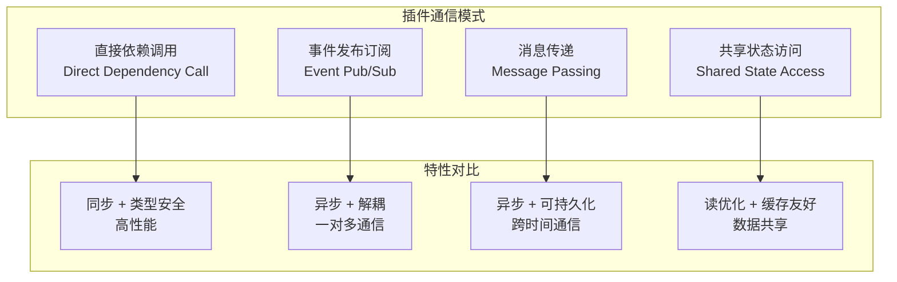

# 跨插件通信与依赖管理机制设计

> **文档版本**: v1.0  
> **创建日期**: 2025-07-18  
> **设计理念**: 基于Rust类型系统的零成本插件间通信  
> **目标**: 实现高效、安全、可扩展的插件协作机制

## 1. 通信模式设计概览

### 1.1 四种通信模式



### 1.2 通信模式选择矩阵

| 场景 | 同步性 | 耦合度 | 数据量 | 推荐模式 |
|-----|-------|-------|--------|---------|
| 策略调用风险检查 | 同步 | 紧耦合 | 小 | 直接依赖调用 |
| 市场数据分发 | 异步 | 松耦合 | 大 | 事件发布订阅 |
| 策略间协调 | 异步 | 松耦合 | 中 | 消息传递 |
| 访问配置信息 | 同步 | 松耦合 | 小 | 共享状态访问 |

## 2. 直接依赖调用机制

### 2.1 类型安全的依赖注入

```rust
/// 依赖注入容器 - 编译时类型安全
pub struct DependencyContainer {
    plugins: HashMap<TypeId, Box<dyn Any + Send + Sync>>,
    plugin_map: HashMap<PluginId, TypeId>,
}

impl DependencyContainer {
    /// 注册插件实例
    pub fn register<T: Plugin + 'static>(&mut self, plugin: Arc<T>) -> Result<()> {
        let type_id = TypeId::of::<T>();
        let plugin_id = plugin.plugin_id().clone();
        
        self.plugins.insert(type_id, Box::new(plugin));
        self.plugin_map.insert(plugin_id, type_id);
        
        Ok(())
    }
    
    /// 获取插件依赖 - 零成本抽象
    pub fn get<T: Plugin + 'static>(&self) -> Result<Arc<T>> {
        let type_id = TypeId::of::<T>();
        
        self.plugins.get(&type_id)
            .ok_or_else(|| CzscError::DependencyNotFound(type_name::<T>().to_string()))?
            .downcast_ref::<Arc<T>>()
            .ok_or_else(|| CzscError::TypeMismatch)?
            .clone()
            .pipe(Ok)
    }
    
    /// 按ID获取插件
    pub fn get_by_id<T: Plugin + 'static>(&self, plugin_id: &PluginId) -> Result<Arc<T>> {
        let type_id = self.plugin_map.get(plugin_id)
            .ok_or_else(|| CzscError::PluginNotFound(plugin_id.to_string()))?;
        
        self.plugins.get(type_id)
            .ok_or_else(|| CzscError::DependencyNotFound(plugin_id.to_string()))?
            .downcast_ref::<Arc<T>>()
            .ok_or_else(|| CzscError::TypeMismatch)?
            .clone()
            .pipe(Ok)
    }
}

/// 依赖访问特征 - 为插件提供依赖访问能力
#[async_trait]
pub trait DependencyAccess {
    /// 获取强类型依赖
    async fn get_dependency<T: Plugin + 'static>(&self) -> Result<Arc<T>>;
    
    /// 检查依赖是否可用
    async fn has_dependency<T: Plugin + 'static>(&self) -> bool;
    
    /// 等待依赖可用
    async fn wait_for_dependency<T: Plugin + 'static>(&self, timeout: Duration) -> Result<Arc<T>>;
}

/// 策略插件依赖使用示例
impl MyTradingStrategy {
    /// 使用风险模型进行风险检查
    async fn check_order_risk(&self, order: &Order) -> Result<bool> {
        // 直接获取风险模型依赖 - 编译时类型安全
        let risk_model = self.get_dependency::<MyRiskModel>().await?;
        
        let risk_context = self.build_risk_context().await?;
        let result = risk_model.check_order_risk(order, &risk_context).await?;
        
        Ok(result.approved)
    }
    
    /// 使用数据源获取历史数据
    async fn get_market_data(&self, symbol: &Symbol) -> Result<Vec<Bar>> {
        let data_source = self.get_dependency::<BinanceDataSource>().await?;
        
        let request = DataRequest {
            symbol: symbol.clone(),
            data_type: DataType::Bar,
            count: Some(100),
            ..Default::default()
        };
        
        data_source.get_historical_data(request).await
    }
}
```

### 2.2 依赖代理模式

```rust
/// 依赖代理 - 延迟解析和缓存优化
pub struct DependencyProxy<T: Plugin> {
    dependency: OnceCell<Arc<T>>,
    container: Arc<DependencyContainer>,
    plugin_id: Option<PluginId>,
}

impl<T: Plugin + 'static> DependencyProxy<T> {
    pub fn new(container: Arc<DependencyContainer>) -> Self {
        Self {
            dependency: OnceCell::new(),
            container,
            plugin_id: None,
        }
    }
    
    pub fn new_with_id(container: Arc<DependencyContainer>, plugin_id: PluginId) -> Self {
        Self {
            dependency: OnceCell::new(),
            container,
            plugin_id: Some(plugin_id),
        }
    }
    
    /// 获取依赖 - 延迟初始化 + 缓存
    pub async fn get(&self) -> Result<Arc<T>> {
        // 如果已缓存，直接返回
        if let Some(dep) = self.dependency.get() {
            return Ok(Arc::clone(dep));
        }
        
        // 延迟解析依赖
        let dependency = if let Some(ref plugin_id) = self.plugin_id {
            self.container.get_by_id::<T>(plugin_id)?
        } else {
            self.container.get::<T>()?
        };
        
        // 缓存解析结果
        let _ = self.dependency.set(Arc::clone(&dependency));
        
        Ok(dependency)
    }
    
    /// 检查依赖是否已解析
    pub fn is_resolved(&self) -> bool {
        self.dependency.get().is_some()
    }
}

/// 依赖代理的使用示例
pub struct MyStrategy {
    risk_model: DependencyProxy<dyn RiskModelPlugin>,
    data_source: DependencyProxy<dyn DataSourcePlugin>,
    gateway: DependencyProxy<dyn GatewayPlugin>,
}

impl MyStrategy {
    pub fn new(container: Arc<DependencyContainer>) -> Self {
        Self {
            risk_model: DependencyProxy::new(Arc::clone(&container)),
            data_source: DependencyProxy::new_with_id(
                Arc::clone(&container), 
                PluginId::new("binance_data")
            ),
            gateway: DependencyProxy::new_with_id(
                container, 
                PluginId::new("binance_gateway")
            ),
        }
    }
    
    async fn execute_trade(&self, signal: &TradingSignal) -> Result<()> {
        // 1. 风险检查 - 直接依赖调用
        let risk_check = self.risk_model.get().await?
            .check_order_risk(&signal.to_order(), &self.build_risk_context().await?)
            .await?;
        
        if !risk_check.approved {
            return Err(CzscError::RiskCheckFailed(risk_check.violated_limits));
        }
        
        // 2. 执行订单
        let order_response = self.gateway.get().await?
            .submit_order(signal.to_order())
            .await?;
        
        info!("Order submitted: {:?}", order_response);
        Ok(())
    }
}
```

## 3. 事件发布订阅机制

### 3.3 类型安全的事件系统

```rust
/// 事件发布订阅总线 - 类型安全 + 高性能
pub struct EventBus {
    // 使用TypeId作为键，实现编译时类型安全
    subscribers: Arc<RwLock<HashMap<TypeId, Vec<BoxedEventHandler>>>>,
    
    // 事件队列 - 不同优先级的队列
    event_queues: [Arc<AsyncQueue<BoxedEvent>>; 4], // Critical, High, Normal, Low
    
    // 性能统计
    stats: Arc<RwLock<EventBusStatistics>>,
    
    // 配置
    config: EventBusConfig,
}

/// 强类型事件处理器
#[async_trait]
pub trait TypedEventHandler<T: Event>: Send + Sync {
    async fn handle(&self, event: &T) -> Result<()>;
    fn handler_id(&self) -> &str;
    fn can_handle_parallel(&self) -> bool { true }
}

/// 事件处理器包装器 - 实现类型擦除
struct EventHandlerWrapper<T: Event> {
    handler: Box<dyn TypedEventHandler<T>>,
}

#[async_trait]
impl<T: Event + 'static> EventHandler for EventHandlerWrapper<T> {
    async fn handle(&self, event: &dyn Event) -> Result<()> {
        if let Some(typed_event) = event.as_any().downcast_ref::<T>() {
            self.handler.handle(typed_event).await
        } else {
            Err(CzscError::TypeMismatch)
        }
    }
}

impl EventBus {
    /// 订阅特定类型的事件 - 编译时类型安全
    pub async fn subscribe<T: Event + 'static>(
        &self,
        handler: Box<dyn TypedEventHandler<T>>
    ) -> Result<SubscriptionHandle> {
        let type_id = TypeId::of::<T>();
        let wrapped_handler = Box::new(EventHandlerWrapper { handler });
        
        let mut subscribers = self.subscribers.write().await;
        subscribers.entry(type_id)
            .or_insert_with(Vec::new)
            .push(wrapped_handler);
        
        let handle = SubscriptionHandle::new(type_id, wrapped_handler.handler_id().to_string());
        Ok(handle)
    }
    
    /// 发布事件 - 零拷贝优化
    pub async fn publish<T: Event + 'static>(&self, event: T) -> Result<()> {
        let priority = event.priority();
        let boxed_event = Box::new(event) as BoxedEvent;
        
        // 根据优先级选择队列
        let queue_index = match priority {
            EventPriority::Critical => 0,
            EventPriority::High => 1,
            EventPriority::Normal => 2,
            EventPriority::Low => 3,
        };
        
        self.event_queues[queue_index].push(boxed_event).await?;
        
        // 更新统计
        self.stats.write().await.events_published += 1;
        
        Ok(())
    }
    
    /// 批量发布事件 - 性能优化
    pub async fn publish_batch<T: Event + 'static>(&self, events: Vec<T>) -> Result<()> {
        if events.is_empty() {
            return Ok(());
        }
        
        // 按优先级分组
        let mut grouped_events: [Vec<BoxedEvent>; 4] = Default::default();
        
        for event in events {
            let queue_index = match event.priority() {
                EventPriority::Critical => 0,
                EventPriority::High => 1,
                EventPriority::Normal => 2,
                EventPriority::Low => 3,
            };
            
            grouped_events[queue_index].push(Box::new(event));
        }
        
        // 批量推送到对应队列
        for (i, events) in grouped_events.into_iter().enumerate() {
            if !events.is_empty() {
                self.event_queues[i].push_batch(events).await?;
            }
        }
        
        Ok(())
    }
}

/// 市场数据事件示例
#[derive(Debug, Clone)]
pub struct MarketDataEvent {
    pub symbol: Symbol,
    pub data: MarketDataPayload,
    pub timestamp: i64,
    pub source: String,
}

impl Event for MarketDataEvent {
    fn event_type(&self) -> &'static str { "MarketData" }
    fn timestamp(&self) -> i64 { self.timestamp }
    fn priority(&self) -> EventPriority { EventPriority::High }
    fn source(&self) -> &str { &self.source }
}

/// 策略插件订阅市场数据
impl MyTradingStrategy {
    pub async fn setup_event_subscriptions(&self, event_bus: &EventBus) -> Result<()> {
        // 订阅市场数据事件
        let market_data_handler = MarketDataHandler::new(self.clone());
        event_bus.subscribe::<MarketDataEvent>(Box::new(market_data_handler)).await?;
        
        // 订阅交易事件
        let trade_handler = TradeEventHandler::new(self.clone());
        event_bus.subscribe::<TradeExecutedEvent>(Box::new(trade_handler)).await?;
        
        Ok(())
    }
}

/// 市场数据事件处理器
pub struct MarketDataHandler {
    strategy: Arc<MyTradingStrategy>,
}

#[async_trait]
impl TypedEventHandler<MarketDataEvent> for MarketDataHandler {
    async fn handle(&self, event: &MarketDataEvent) -> Result<()> {
        // 类型安全的事件处理
        if let MarketDataPayload::Bar(ref bar) = event.data {
            self.strategy.on_bar_received(bar).await?;
        }
        
        Ok(())
    }
    
    fn handler_id(&self) -> &str { "market_data_handler" }
    fn can_handle_parallel(&self) -> bool { false } // 策略需要顺序处理
}
```

## 4. 消息传递机制

### 4.1 异步消息传递系统

```rust
/// 插件间消息总线
pub struct PluginMessageBus {
    // 消息路由表
    routes: Arc<RwLock<HashMap<PluginId, MessageChannel>>>,
    
    // 消息队列
    message_queues: Arc<DashMap<PluginId, Arc<AsyncQueue<PluginMessage>>>>,
    
    // 消息处理器注册表
    handlers: Arc<RwLock<HashMap<PluginId, Vec<BoxedMessageHandler>>>>,
    
    // 消息统计
    stats: Arc<RwLock<MessageBusStatistics>>,
    
    // 持久化支持
    persistence: Option<Arc<dyn MessagePersistence>>,
}

/// 插件消息定义
#[derive(Debug, Clone, Serialize, Deserialize)]
pub struct PluginMessage {
    pub id: MessageId,
    pub from: PluginId,
    pub to: PluginId,
    pub message_type: String,
    pub payload: serde_json::Value,
    pub timestamp: i64,
    pub priority: MessagePriority,
    pub reply_to: Option<MessageId>,
    pub expires_at: Option<i64>,
    pub retry_count: u32,
    pub max_retries: u32,
}

#[derive(Debug, Clone, Copy, PartialEq, Eq, PartialOrd, Ord)]
pub enum MessagePriority {
    Critical = 0,
    High = 1,
    Normal = 2,
    Low = 3,
}

/// 强类型消息接口
pub trait TypedMessage: Serialize + DeserializeOwned + Send + Sync + 'static {
    fn message_type() -> &'static str;
    fn priority() -> MessagePriority { MessagePriority::Normal }
    fn max_retries() -> u32 { 3 }
    fn expires_after() -> Option<Duration> { None }
}

/// 消息处理器接口
#[async_trait]
pub trait MessageHandler<T: TypedMessage>: Send + Sync {
    async fn handle(&self, message: &T, context: &MessageContext) -> Result<()>;
    fn handler_id(&self) -> &str;
}

impl PluginMessageBus {
    /// 发送强类型消息
    pub async fn send_typed_message<T: TypedMessage>(
        &self,
        from: PluginId,
        to: PluginId,
        message: T
    ) -> Result<MessageId> {
        let message_id = MessageId::new();
        let timestamp = chrono::Utc::now().timestamp();
        
        let plugin_message = PluginMessage {
            id: message_id.clone(),
            from,
            to: to.clone(),
            message_type: T::message_type().to_string(),
            payload: serde_json::to_value(message)?,
            timestamp,
            priority: T::priority(),
            reply_to: None,
            expires_at: T::expires_after().map(|d| timestamp + d.as_secs() as i64),
            retry_count: 0,
            max_retries: T::max_retries(),
        };
        
        self.route_message(plugin_message).await?;
        Ok(message_id)
    }
    
    /// 发送请求-响应消息
    pub async fn send_request<Req: TypedMessage, Resp: TypedMessage>(
        &self,
        from: PluginId,
        to: PluginId,
        request: Req,
        timeout: Duration
    ) -> Result<Resp> {
        let message_id = self.send_typed_message(from.clone(), to, request).await?;
        
        // 等待响应
        let response = self.wait_for_response::<Resp>(&message_id, timeout).await?;
        Ok(response)
    }
    
    /// 注册消息处理器
    pub async fn register_handler<T: TypedMessage>(
        &self,
        plugin_id: PluginId,
        handler: Box<dyn MessageHandler<T>>
    ) -> Result<()> {
        let wrapped_handler = Box::new(TypedMessageHandlerWrapper {
            handler,
            message_type: T::message_type().to_string(),
        });
        
        let mut handlers = self.handlers.write().await;
        handlers.entry(plugin_id)
            .or_insert_with(Vec::new)
            .push(wrapped_handler);
        
        Ok(())
    }
}

/// 策略协调消息示例
#[derive(Debug, Clone, Serialize, Deserialize)]
pub struct StrategyCoordinationMessage {
    pub action: CoordinationAction,
    pub symbol: Symbol,
    pub quantity: f64,
    pub price: Option<f64>,
    pub metadata: HashMap<String, Value>,
}

impl TypedMessage for StrategyCoordinationMessage {
    fn message_type() -> &'static str { "strategy_coordination" }
    fn priority() -> MessagePriority { MessagePriority::High }
    fn max_retries() -> u32 { 1 } // 协调消息重试次数少
    fn expires_after() -> Option<Duration> { Some(Duration::from_secs(30)) }
}

#[derive(Debug, Clone, Serialize, Deserialize)]
pub enum CoordinationAction {
    RequestPosition,
    ReleasePosition,
    ShareSignal,
    SyncState,
}

/// 策略协调处理器
pub struct StrategyCoordinationHandler {
    strategy: Arc<MyTradingStrategy>,
}

#[async_trait]
impl MessageHandler<StrategyCoordinationMessage> for StrategyCoordinationHandler {
    async fn handle(&self, message: &StrategyCoordinationMessage, context: &MessageContext) -> Result<()> {
        match message.action {
            CoordinationAction::RequestPosition => {
                self.handle_position_request(message, context).await?;
            }
            CoordinationAction::ShareSignal => {
                self.handle_signal_sharing(message, context).await?;
            }
            _ => {
                debug!("Unhandled coordination action: {:?}", message.action);
            }
        }
        
        Ok(())
    }
    
    fn handler_id(&self) -> &str { "strategy_coordination_handler" }
}
```

## 5. 共享状态访问机制

### 5.1 读优化的共享状态

```rust
/// 共享状态管理器 - 读优化
pub struct SharedStateManager {
    // 配置状态 - 读频繁，写很少
    config_state: Arc<RwLock<ConfigState>>,
    
    // 市场状态 - 读频繁，写中等
    market_state: Arc<RwLock<MarketState>>,
    
    // 投资组合状态 - 读写都频繁
    portfolio_state: Arc<RwLock<PortfolioState>>,
    
    // 缓存层 - 进一步优化读性能
    cache: Arc<StateCache>,
    
    // 变更通知
    change_notifier: Arc<StateChangeNotifier>,
}

/// 配置状态 - 几乎只读
#[derive(Debug, Clone)]
pub struct ConfigState {
    pub framework_config: FrameworkConfig,
    pub plugin_configs: HashMap<PluginId, PluginConfig>,
    pub risk_limits: RiskLimits,
    pub trading_params: TradingParameters,
}

/// 市场状态 - 频繁更新
#[derive(Debug, Clone)]
pub struct MarketState {
    pub latest_prices: HashMap<Symbol, Price>,
    pub market_hours: MarketHours,
    pub volatility_regime: VolatilityRegime,
    pub liquidity_conditions: LiquidityConditions,
    pub last_updated: i64,
}

/// 投资组合状态 - 读写频繁
#[derive(Debug, Clone)]
pub struct PortfolioState {
    pub positions: HashMap<Symbol, Position>,
    pub cash_balance: Price,
    pub total_value: Price,
    pub unrealized_pnl: Price,
    pub realized_pnl: Price,
    pub last_updated: i64,
}

impl SharedStateManager {
    /// 获取配置状态 - 缓存优化
    pub async fn get_config(&self) -> Arc<ConfigState> {
        // 检查缓存
        if let Some(cached_config) = self.cache.get_config().await {
            return cached_config;
        }
        
        // 读取最新配置
        let config = self.config_state.read().await;
        let config_arc = Arc::new(config.clone());
        
        // 更新缓存
        self.cache.set_config(Arc::clone(&config_arc)).await;
        
        config_arc
    }
    
    /// 获取市场状态快照
    pub async fn get_market_snapshot(&self) -> MarketState {
        self.market_state.read().await.clone()
    }
    
    /// 原子更新市场价格
    pub async fn update_price(&self, symbol: Symbol, price: Price) -> Result<()> {
        let mut market_state = self.market_state.write().await;
        market_state.latest_prices.insert(symbol.clone(), price);
        market_state.last_updated = chrono::Utc::now().timestamp();
        
        // 通知变更
        self.change_notifier.notify_price_change(symbol, price).await;
        
        Ok(())
    }
    
    /// 批量更新价格 - 减少锁争用
    pub async fn update_prices_batch(&self, price_updates: Vec<(Symbol, Price)>) -> Result<()> {
        if price_updates.is_empty() {
            return Ok(());
        }
        
        let timestamp = chrono::Utc::now().timestamp();
        
        {
            let mut market_state = self.market_state.write().await;
            for (symbol, price) in &price_updates {
                market_state.latest_prices.insert(symbol.clone(), *price);
            }
            market_state.last_updated = timestamp;
        }
        
        // 批量通知变更
        self.change_notifier.notify_price_changes_batch(price_updates).await;
        
        Ok(())
    }
}

/// 状态缓存 - 进一步优化读性能
pub struct StateCache {
    config_cache: Arc<ArcSwap<Option<Arc<ConfigState>>>>,
    market_cache: Arc<ArcSwap<Option<Arc<MarketState>>>>,
    price_cache: Arc<DashMap<Symbol, (Price, i64)>>, // (价格, 缓存时间)
    
    cache_ttl: Duration,
}

impl StateCache {
    /// 获取缓存的配置
    pub async fn get_config(&self) -> Option<Arc<ConfigState>> {
        self.config_cache.load().as_ref().clone()
    }
    
    /// 缓存配置
    pub async fn set_config(&self, config: Arc<ConfigState>) {
        self.config_cache.store(Arc::new(Some(config)));
    }
    
    /// 获取缓存的价格
    pub fn get_price(&self, symbol: &Symbol) -> Option<Price> {
        if let Some((price, cached_at)) = self.price_cache.get(symbol) {
            let now = chrono::Utc::now().timestamp();
            if now - *cached_at < self.cache_ttl.as_secs() as i64 {
                return Some(*price);
            }
        }
        None
    }
    
    /// 缓存价格
    pub fn set_price(&self, symbol: Symbol, price: Price) {
        let now = chrono::Utc::now().timestamp();
        self.price_cache.insert(symbol, (price, now));
    }
}

/// 状态访问代理 - 为插件提供便捷访问
pub struct StateAccessProxy {
    state_manager: Arc<SharedStateManager>,
    plugin_id: PluginId,
}

impl StateAccessProxy {
    /// 获取最新价格 - 缓存优化
    pub async fn get_latest_price(&self, symbol: &Symbol) -> Result<Price> {
        // 先检查缓存
        if let Some(price) = self.state_manager.cache.get_price(symbol) {
            return Ok(price);
        }
        
        // 从共享状态读取
        let market_state = self.state_manager.market_state.read().await;
        let price = market_state.latest_prices.get(symbol)
            .copied()
            .ok_or_else(|| CzscError::PriceNotFound(symbol.clone()))?;
        
        // 更新缓存
        self.state_manager.cache.set_price(symbol.clone(), price);
        
        Ok(price)
    }
    
    /// 获取配置参数
    pub async fn get_config_value<T: DeserializeOwned>(&self, key: &str) -> Result<T> {
        let config = self.state_manager.get_config().await;
        
        if let Some(plugin_config) = config.plugin_configs.get(&self.plugin_id) {
            if let Some(value) = plugin_config.parameters.get(key) {
                return Ok(serde_json::from_value(value.clone())?);
            }
        }
        
        Err(CzscError::ConfigNotFound(key.to_string()))
    }
    
    /// 获取投资组合信息
    pub async fn get_portfolio_value(&self) -> Result<Price> {
        let portfolio = self.state_manager.portfolio_state.read().await;
        Ok(portfolio.total_value)
    }
}
```

## 6. 性能监控和调试

### 6.1 通信性能监控

```rust
/// 跨插件通信性能监控器
pub struct CommunicationMonitor {
    // 调用统计
    call_stats: Arc<DashMap<(PluginId, PluginId), CallStatistics>>,
    
    // 事件统计
    event_stats: Arc<DashMap<String, EventStatistics>>, // event_type -> stats
    
    // 消息统计
    message_stats: Arc<DashMap<String, MessageStatistics>>, // message_type -> stats
    
    // 共享状态访问统计
    state_access_stats: Arc<DashMap<String, StateAccessStatistics>>,
}

#[derive(Debug, Clone)]
pub struct CallStatistics {
    pub total_calls: u64,
    pub successful_calls: u64,
    pub failed_calls: u64,
    pub average_latency: Duration,
    pub max_latency: Duration,
    pub last_call_time: i64,
}

#[derive(Debug, Clone)]
pub struct EventStatistics {
    pub events_published: u64,
    pub events_handled: u64,
    pub average_handling_time: Duration,
    pub failed_handling_count: u64,
    pub last_event_time: i64,
}

impl CommunicationMonitor {
    /// 记录插件调用
    pub fn record_plugin_call(
        &self,
        from: &PluginId,
        to: &PluginId,
        latency: Duration,
        success: bool
    ) {
        let key = (from.clone(), to.clone());
        
        self.call_stats.entry(key).and_modify(|stats| {
            stats.total_calls += 1;
            if success {
                stats.successful_calls += 1;
            } else {
                stats.failed_calls += 1;
            }
            
            // 更新延迟统计
            let total_latency = stats.average_latency * stats.total_calls as u32 + latency;
            stats.average_latency = total_latency / stats.total_calls as u32;
            stats.max_latency = stats.max_latency.max(latency);
            stats.last_call_time = chrono::Utc::now().timestamp();
        }).or_insert_with(|| CallStatistics {
            total_calls: 1,
            successful_calls: if success { 1 } else { 0 },
            failed_calls: if success { 0 } else { 1 },
            average_latency: latency,
            max_latency: latency,
            last_call_time: chrono::Utc::now().timestamp(),
        });
    }
    
    /// 生成通信性能报告
    pub fn generate_performance_report(&self) -> CommunicationPerformanceReport {
        let call_stats = self.call_stats.iter()
            .map(|entry| (entry.key().clone(), entry.value().clone()))
            .collect();
        
        let event_stats = self.event_stats.iter()
            .map(|entry| (entry.key().clone(), entry.value().clone()))
            .collect();
        
        let message_stats = self.message_stats.iter()
            .map(|entry| (entry.key().clone(), entry.value().clone()))
            .collect();
        
        CommunicationPerformanceReport {
            call_statistics: call_stats,
            event_statistics: event_stats,
            message_statistics: message_stats,
            generated_at: chrono::Utc::now().timestamp(),
        }
    }
}
```

## 7. 总结

这个跨插件通信与依赖管理机制提供了：

### 7.1 四种通信模式对比

| 通信模式 | 类型安全 | 性能 | 解耦度 | 适用场景 |
|---------|---------|------|--------|---------|
| **直接依赖调用** | ✅ 编译时 | 🚀 最高 | ⚠️ 紧耦合 | 同步操作、关键路径 |
| **事件发布订阅** | ✅ 编译时 | ⚡ 高 | ✅ 松耦合 | 异步通知、一对多 |
| **消息传递** | ⚠️ 运行时 | 📊 中等 | ✅ 松耦合 | 跨时间协调、持久化 |
| **共享状态访问** | ✅ 编译时 | 🚀 读优化 | ⚠️ 中等耦合 | 频繁读取、缓存友好 |

### 7.2 核心优势

1. **零成本抽象** - 编译时多态，运行时无额外开销
2. **类型安全** - 大部分通信在编译时保证类型正确
3. **性能优化** - 针对不同场景的性能优化策略
4. **解耦设计** - 支持松耦合的插件协作
5. **监控友好** - 全面的性能监控和调试支持

这样设计既保证了Rust的零成本抽象优势，又为插件间的各种协作场景提供了合适的通信机制。