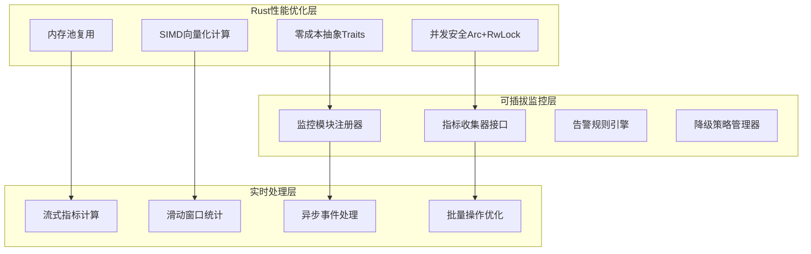

# 鲁棒性框架监控体系设计

> **文档版本**: v1.0  
> **创建日期**: 2025-07-18  
> **设计理念**: 可插拔监控模块 + Rust零成本抽象 + 实时性能优化  
> **目标**: 构建高性能、可扩展的策略健康监控和自动降级系统

## 1. 设计理念与架构原则

### 1.1 核心设计理念



### 1.2 架构设计原则

1. **零成本抽象**: 编译时确定的trait objects，运行时无虚函数开销
2. **内存安全**: 借用检查器确保并发安全，无数据竞争
3. **可插拔设计**: 通过trait system实现模块化扩展
4. **高性能并发**: 基于Tokio的异步处理和Arc<RwLock<T>>共享状态
5. **类型安全**: 编译时类型检查，避免运行时错误

## 2. 核心监控架构

### 2.1 监控框架主体设计

```rust
/// 鲁棒性监控框架 - 零成本抽象的可插拔设计
pub struct RobustnessMonitoringFramework {
    // 使用Arc<RwLock<T>>确保并发安全
    monitors: Arc<RwLock<HashMap<MonitorId, Box<dyn Monitor + Send + Sync>>>>,
    metrics_aggregator: Arc<MetricsAggregator>,
    alert_manager: Arc<AlertManager>,
    degradation_controller: Arc<DegradationController>,
    
    // 性能优化组件
    memory_pool: Arc<MemoryPool>,
    event_bus: Arc<EventBus>,
    config: MonitoringConfig,
    
    // 统计信息
    framework_stats: Arc<RwLock<FrameworkStatistics>>,
}

/// 监控器特征 - 可插拔的核心接口
#[async_trait]
pub trait Monitor: Send + Sync {
    // === 核心监控功能 ===
    async fn collect_metrics(&self, context: &MonitoringContext) -> Result<Vec<Metric>>;
    async fn evaluate_health(&self, metrics: &[Metric]) -> Result<HealthAssessment>;
    async fn check_alerts(&self, assessment: &HealthAssessment) -> Result<Vec<Alert>>;
    
    // === 元信息接口 ===
    fn monitor_id(&self) -> MonitorId;
    fn monitor_type(&self) -> MonitorType;
    fn supported_strategies(&self) -> Vec<StrategyType>;
    fn collection_interval(&self) -> Duration;
    fn priority(&self) -> MonitorPriority;
    
    // === 配置管理 ===
    fn configure(&mut self, config: MonitorConfig) -> Result<()>;
    fn get_parameters(&self) -> HashMap<String, Parameter>;
    
    // === 性能接口 ===
    fn memory_usage_estimate(&self) -> usize;
    fn cpu_cost_estimate(&self) -> CpuCost;
    fn is_realtime_capable(&self) -> bool;
    
    // === 生命周期管理 ===
    async fn initialize(&mut self) -> Result<()>;
    async fn shutdown(&mut self) -> Result<()>;
    fn is_healthy(&self) -> bool;
    
    // === 可选的批量处理优化 ===
    async fn collect_metrics_batch(
        &self,
        contexts: &[MonitoringContext]
    ) -> Result<Vec<Vec<Metric>>> {
        // 默认实现：逐个处理
        let mut results = Vec::with_capacity(contexts.len());
        for context in contexts {
            results.push(self.collect_metrics(context).await?);
        }
        Ok(results)
    }
}

/// 监控器类型 - 支持编译时特化
#[derive(Debug, Clone, Hash, Eq, PartialEq)]
pub enum MonitorType {
    Performance,        // 性能监控
    Risk,              // 风险监控
    Health,            // 健康监控
    Behavior,          // 行为监控
    System,            // 系统监控
    Custom(String),    // 自定义监控
}

/// 监控优先级 - 影响调度顺序
#[derive(Debug, Clone, Copy, PartialEq, Eq, PartialOrd, Ord)]
pub enum MonitorPriority {
    Critical = 0,   // 关键监控，最高优先级
    High = 1,       // 高优先级
    Normal = 2,     // 正常优先级
    Low = 3,        // 低优先级
    Background = 4, // 后台监控，最低优先级
}

/// 监控上下文 - 零拷贝的数据传递
#[derive(Debug, Clone)]
pub struct MonitoringContext {
    pub strategy_id: StrategyId,
    pub timestamp: i64,
    pub market_data: Arc<MarketDataSlice>,      // 使用Arc避免数据拷贝
    pub positions: Arc<Vec<Position>>,
    pub orders: Arc<Vec<Order>>,
    pub trades: Arc<Vec<Trade>>,
    pub portfolio_state: Arc<PortfolioState>,
    pub risk_state: Arc<RiskState>,
    
    // 性能相关的上下文
    pub memory_usage: usize,
    pub cpu_usage: f64,
    pub latency_stats: LatencyStats,
    
    // 可扩展的元数据
    pub metadata: HashMap<String, Value>,
}
```

### 2.2 高性能指标系统

```rust
/// 指标数据结构 - 内存对齐优化
#[repr(C)]
#[derive(Debug, Clone)]
pub struct Metric {
    pub metric_id: MetricId,
    pub metric_type: MetricType,
    pub value: MetricValue,
    pub timestamp: i64,
    pub tags: SmallVec<[Tag; 4]>,        // 小向量优化，避免堆分配
    pub quality: MetricQuality,
}

/// 指标值类型 - 使用union优化内存布局
#[derive(Debug, Clone)]
pub enum MetricValue {
    Counter(u64),
    Gauge(f64),
    Histogram(HistogramData),
    Distribution(DistributionData),
    Text(String),
    Binary(Vec<u8>),
}

/// 指标类型 - 支持编译时优化
#[derive(Debug, Clone, Hash, Eq, PartialEq)]
pub enum MetricType {
    // === 性能指标 ===
    Latency,
    Throughput,
    MemoryUsage,
    CpuUsage,
    
    // === 交易指标 ===
    PnL,
    Drawdown,
    Sharpe,
    WinRate,
    AverageHold,
    
    // === 风险指标 ===
    VaR,
    ExpectedShortfall,
    PositionSize,
    Leverage,
    Correlation,
    
    // === 行为指标 ===
    OrderRate,
    CancelRate,
    SlippageRate,
    FillRate,
    
    // === 系统指标 ===
    ErrorRate,
    ConnectionStatus,
    DataQuality,
    SystemHealth,
    
    // === 自定义指标 ===
    Custom {
        category: String,
        sub_type: String,
    },
}

/// 高性能指标聚合器
pub struct MetricsAggregator {
    // 使用无锁数据结构提升并发性能
    metric_storage: Arc<DashMap<MetricId, MetricTimeSeries>>,
    
    // 内存池，避免频繁分配
    buffer_pool: Arc<BufferPool<Metric>>,
    
    // 滑动窗口计算器
    window_calculator: Arc<SlidingWindowCalculator>,
    
    // 统计计算引擎
    stats_engine: Arc<StatisticsEngine>,
    
    config: AggregatorConfig,
}

impl MetricsAggregator {
    /// 批量添加指标 - 优化并发性能
    pub async fn add_metrics_batch(&self, metrics: Vec<Metric>) -> Result<()> {
        if metrics.is_empty() {
            return Ok(());
        }
        
        // 按metric_id分组，减少锁竞争
        let mut grouped_metrics: HashMap<MetricId, Vec<Metric>> = HashMap::new();
        for metric in metrics {
            grouped_metrics.entry(metric.metric_id.clone())
                .or_insert_with(Vec::new)
                .push(metric);
        }
        
        // 并行处理不同的metric_id
        let tasks: Vec<_> = grouped_metrics.into_iter()
            .map(|(metric_id, metric_group)| {
                let storage = Arc::clone(&self.metric_storage);
                tokio::spawn(async move {
                    if let Some(mut time_series) = storage.get_mut(&metric_id) {
                        time_series.add_batch(metric_group).await?;
                    } else {
                        let mut new_series = MetricTimeSeries::new(metric_id.clone());
                        new_series.add_batch(metric_group).await?;
                        storage.insert(metric_id, new_series);
                    }
                    Ok::<(), CzscError>(())
                })
            })
            .collect();
        
        // 等待所有任务完成
        futures::future::try_join_all(tasks).await?;
        
        Ok(())
    }
    
    /// 实时计算聚合指标 - SIMD优化
    pub async fn calculate_aggregated_metrics(
        &self,
        metric_ids: &[MetricId],
        window: TimeWindow,
        aggregation_type: AggregationType
    ) -> Result<HashMap<MetricId, AggregatedMetric>> {
        use rayon::prelude::*;
        
        // 使用rayon并行计算
        let results: Result<Vec<_>, _> = metric_ids
            .par_iter()
            .map(|metric_id| {
                let time_series = self.metric_storage.get(metric_id)
                    .ok_or_else(|| CzscError::MetricNotFound(metric_id.clone()))?;
                
                let values = time_series.get_values_in_window(window)?;
                let aggregated = match aggregation_type {
                    AggregationType::Mean => self.calculate_mean_simd(&values),
                    AggregationType::Sum => self.calculate_sum_simd(&values),
                    AggregationType::Max => values.iter().fold(f64::NEG_INFINITY, |a, &b| a.max(b)),
                    AggregationType::Min => values.iter().fold(f64::INFINITY, |a, &b| a.min(b)),
                    AggregationType::Percentile(p) => self.calculate_percentile(&values, p),
                    AggregationType::StdDev => self.calculate_stddev_simd(&values),
                    AggregationType::Custom(ref func) => func(&values),
                };
                
                Ok((metric_id.clone(), AggregatedMetric {
                    value: aggregated,
                    count: values.len(),
                    window,
                    calculated_at: chrono::Utc::now().timestamp(),
                }))
            })
            .collect();
        
        results.map(|vec| vec.into_iter().collect())
    }
    
    /// SIMD优化的均值计算
    #[cfg(target_arch = "x86_64")]
    fn calculate_mean_simd(&self, values: &[f64]) -> f64 {
        use std::arch::x86_64::*;
        
        if values.len() < 4 {
            return values.iter().sum::<f64>() / values.len() as f64;
        }
        
        unsafe {
            let mut sum = _mm256_setzero_pd();
            let chunks = values.chunks_exact(4);
            let remainder = chunks.remainder();
            
            for chunk in chunks {
                let vals = _mm256_loadu_pd(chunk.as_ptr());
                sum = _mm256_add_pd(sum, vals);
            }
            
            // 处理剩余元素
            let mut final_sum: f64 = 0.0;
            let sum_array: [f64; 4] = std::mem::transmute(sum);
            final_sum += sum_array.iter().sum::<f64>();
            final_sum += remainder.iter().sum::<f64>();
            
            final_sum / values.len() as f64
        }
    }
    
    /// 非SIMD平台的回退实现
    #[cfg(not(target_arch = "x86_64"))]
    fn calculate_mean_simd(&self, values: &[f64]) -> f64 {
        values.iter().sum::<f64>() / values.len() as f64
    }
}
```

### 2.3 可插拔的监控模块实现

```rust
/// 性能监控器 - 专注于执行性能
pub struct PerformanceMonitor {
    config: PerformanceConfig,
    latency_tracker: LatencyTracker,
    throughput_calculator: ThroughputCalculator,
    memory_profiler: MemoryProfiler,
    statistics: Arc<RwLock<PerformanceStatistics>>,
}

#[async_trait]
impl Monitor for PerformanceMonitor {
    async fn collect_metrics(&self, context: &MonitoringContext) -> Result<Vec<Metric>> {
        let mut metrics = Vec::with_capacity(8);
        let timestamp = context.timestamp;
        
        // 延迟指标
        if let Some(latency) = self.latency_tracker.current_latency() {
            metrics.push(Metric {
                metric_id: MetricId::new("performance.latency"),
                metric_type: MetricType::Latency,
                value: MetricValue::Gauge(latency.as_secs_f64() * 1000.0), // 毫秒
                timestamp,
                tags: smallvec![Tag::new("strategy", &context.strategy_id)],
                quality: MetricQuality::High,
            });
        }
        
        // 吞吐量指标
        let throughput = self.throughput_calculator.calculate_current_throughput()?;
        metrics.push(Metric {
            metric_id: MetricId::new("performance.throughput"),
            metric_type: MetricType::Throughput,
            value: MetricValue::Gauge(throughput),
            timestamp,
            tags: smallvec![Tag::new("strategy", &context.strategy_id)],
            quality: MetricQuality::High,
        });
        
        // 内存使用指标
        let memory_usage = self.memory_profiler.current_usage();
        metrics.push(Metric {
            metric_id: MetricId::new("performance.memory"),
            metric_type: MetricType::MemoryUsage,
            value: MetricValue::Gauge(memory_usage as f64),
            timestamp,
            tags: smallvec![Tag::new("strategy", &context.strategy_id)],
            quality: MetricQuality::High,
        });
        
        // CPU使用率
        metrics.push(Metric {
            metric_id: MetricId::new("performance.cpu"),
            metric_type: MetricType::CpuUsage,
            value: MetricValue::Gauge(context.cpu_usage),
            timestamp,
            tags: smallvec![Tag::new("strategy", &context.strategy_id)],
            quality: MetricQuality::High,
        });
        
        Ok(metrics)
    }
    
    async fn evaluate_health(&self, metrics: &[Metric]) -> Result<HealthAssessment> {
        let mut health_score = 100.0;
        let mut warnings = Vec::new();
        let mut critical_issues = Vec::new();
        
        for metric in metrics {
            match metric.metric_type {
                MetricType::Latency => {
                    if let MetricValue::Gauge(latency_ms) = metric.value {
                        if latency_ms > self.config.latency_warning_threshold {
                            warnings.push(format!("High latency: {:.2}ms", latency_ms));
                            health_score -= 10.0;
                        }
                        if latency_ms > self.config.latency_critical_threshold {
                            critical_issues.push(format!("Critical latency: {:.2}ms", latency_ms));
                            health_score -= 30.0;
                        }
                    }
                }
                MetricType::MemoryUsage => {
                    if let MetricValue::Gauge(memory_mb) = metric.value {
                        let memory_usage_percent = (memory_mb / self.config.max_memory_mb) * 100.0;
                        if memory_usage_percent > 80.0 {
                            warnings.push(format!("High memory usage: {:.1}%", memory_usage_percent));
                            health_score -= 15.0;
                        }
                        if memory_usage_percent > 95.0 {
                            critical_issues.push(format!("Critical memory usage: {:.1}%", memory_usage_percent));
                            health_score -= 40.0;
                        }
                    }
                }
                MetricType::CpuUsage => {
                    if let MetricValue::Gauge(cpu_percent) = metric.value {
                        if cpu_percent > 80.0 {
                            warnings.push(format!("High CPU usage: {:.1}%", cpu_percent));
                            health_score -= 10.0;
                        }
                        if cpu_percent > 95.0 {
                            critical_issues.push(format!("Critical CPU usage: {:.1}%", cpu_percent));
                            health_score -= 25.0;
                        }
                    }
                }
                _ => {}
            }
        }
        
        let status = if health_score >= 90.0 {
            HealthStatus::Excellent
        } else if health_score >= 70.0 {
            HealthStatus::Good
        } else if health_score >= 50.0 {
            HealthStatus::Fair
        } else if health_score >= 30.0 {
            HealthStatus::Poor
        } else {
            HealthStatus::Critical
        };
        
        Ok(HealthAssessment {
            monitor_type: self.monitor_type(),
            health_score: health_score.max(0.0),
            status,
            warnings,
            critical_issues,
            recommendations: self.generate_recommendations(&warnings, &critical_issues),
            assessed_at: chrono::Utc::now().timestamp(),
        })
    }
    
    fn monitor_id(&self) -> MonitorId {
        MonitorId::new("performance_monitor")
    }
    
    fn monitor_type(&self) -> MonitorType {
        MonitorType::Performance
    }
    
    fn collection_interval(&self) -> Duration {
        Duration::from_secs(1)  // 1秒采集一次
    }
    
    fn priority(&self) -> MonitorPriority {
        MonitorPriority::High
    }
    
    fn memory_usage_estimate(&self) -> usize {
        std::mem::size_of::<Self>() + 
        self.latency_tracker.memory_usage() +
        self.throughput_calculator.memory_usage() +
        self.memory_profiler.memory_usage()
    }
    
    fn cpu_cost_estimate(&self) -> CpuCost {
        CpuCost::Low  // 性能监控本身应该是轻量级的
    }
    
    fn is_realtime_capable(&self) -> bool {
        true
    }
}

/// 风险监控器 - 专注于风险控制
pub struct RiskMonitor {
    config: RiskConfig,
    var_calculator: VaRCalculator,
    drawdown_tracker: DrawdownTracker,
    position_analyzer: PositionAnalyzer,
    correlation_matrix: Arc<RwLock<CorrelationMatrix>>,
}

#[async_trait]
impl Monitor for RiskMonitor {
    async fn collect_metrics(&self, context: &MonitoringContext) -> Result<Vec<Metric>> {
        let mut metrics = Vec::with_capacity(6);
        let timestamp = context.timestamp;
        
        // VaR计算
        let current_var = self.var_calculator.calculate_var(
            &context.positions,
            &context.portfolio_state,
            0.05  // 5% VaR
        ).await?;
        
        metrics.push(Metric {
            metric_id: MetricId::new("risk.var_5pct"),
            metric_type: MetricType::VaR,
            value: MetricValue::Gauge(current_var),
            timestamp,
            tags: smallvec![Tag::new("strategy", &context.strategy_id)],
            quality: MetricQuality::High,
        });
        
        // 回撤计算
        let current_drawdown = self.drawdown_tracker.current_drawdown(&context.portfolio_state)?;
        metrics.push(Metric {
            metric_id: MetricId::new("risk.drawdown"),
            metric_type: MetricType::Drawdown,
            value: MetricValue::Gauge(current_drawdown),
            timestamp,
            tags: smallvec![Tag::new("strategy", &context.strategy_id)],
            quality: MetricQuality::High,
        });
        
        // 持仓集中度
        let concentration = self.position_analyzer.calculate_concentration(&context.positions)?;
        metrics.push(Metric {
            metric_id: MetricId::new("risk.concentration"),
            metric_type: MetricType::PositionSize,
            value: MetricValue::Gauge(concentration),
            timestamp,
            tags: smallvec![Tag::new("strategy", &context.strategy_id)],
            quality: MetricQuality::High,
        });
        
        // 杠杆率
        let leverage = self.position_analyzer.calculate_leverage(&context.positions, &context.portfolio_state)?;
        metrics.push(Metric {
            metric_id: MetricId::new("risk.leverage"),
            metric_type: MetricType::Leverage,
            value: MetricValue::Gauge(leverage),
            timestamp,
            tags: smallvec![Tag::new("strategy", &context.strategy_id)],
            quality: MetricQuality::High,
        });
        
        Ok(metrics)
    }
    
    async fn check_alerts(&self, assessment: &HealthAssessment) -> Result<Vec<Alert>> {
        let mut alerts = Vec::new();
        
        // 检查关键风险指标
        for issue in &assessment.critical_issues {
            if issue.contains("VaR") || issue.contains("drawdown") || issue.contains("leverage") {
                alerts.push(Alert {
                    alert_id: AlertId::new(),
                    alert_type: AlertType::Risk,
                    severity: AlertSeverity::Critical,
                    message: issue.clone(),
                    strategy_id: None, // 从context中获取
                    triggered_at: chrono::Utc::now().timestamp(),
                    acknowledged: false,
                    auto_action: Some(AutoAction::ReducePositions { percentage: 50.0 }),
                });
            }
        }
        
        Ok(alerts)
    }
    
    fn monitor_id(&self) -> MonitorId {
        MonitorId::new("risk_monitor")
    }
    
    fn monitor_type(&self) -> MonitorType {
        MonitorType::Risk
    }
    
    fn priority(&self) -> MonitorPriority {
        MonitorPriority::Critical  // 风险监控最高优先级
    }
}
```

### 2.4 智能降级系统

```rust
/// 降级控制器 - 智能策略降级和恢复
pub struct DegradationController {
    degradation_rules: Arc<RwLock<HashMap<RuleId, Box<dyn DegradationRule + Send + Sync>>>>,
    strategy_states: Arc<DashMap<StrategyId, StrategyDegradationState>>,
    recovery_manager: Arc<RecoveryManager>,
    action_executor: Arc<ActionExecutor>,
}

/// 降级规则特征 - 可插拔的降级逻辑
#[async_trait]
pub trait DegradationRule: Send + Sync {
    async fn should_trigger(
        &self,
        health_assessment: &HealthAssessment,
        current_state: &StrategyDegradationState
    ) -> Result<bool>;
    
    async fn get_degradation_action(
        &self,
        health_assessment: &HealthAssessment,
        current_state: &StrategyDegradationState
    ) -> Result<DegradationAction>;
    
    fn rule_id(&self) -> RuleId;
    fn rule_name(&self) -> &str;
    fn priority(&self) -> i32;
    fn can_auto_recover(&self) -> bool;
}

/// 降级动作类型
#[derive(Debug, Clone)]
pub enum DegradationAction {
    /// 减少仓位
    ReducePosition {
        target_percentage: f64,
        max_reduction_per_step: f64,
        priority_symbols: Vec<Symbol>,
    },
    
    /// 限制订单类型
    LimitOrderTypes {
        allowed_types: Vec<OrderType>,
        max_order_size: Option<f64>,
    },
    
    /// 降低执行频率
    ReduceFrequency {
        new_interval: Duration,
        batch_orders: bool,
    },
    
    /// 启用保守模式
    EnableConservativeMode {
        reduce_risk_limits: f64,
        increase_stop_loss: f64,
        disable_leverage: bool,
    },
    
    /// 暂停策略
    PauseStrategy {
        close_existing_positions: bool,
        allow_manual_override: bool,
        auto_resume_conditions: Vec<ResumeCondition>,
    },
    
    /// 完全停止
    StopStrategy {
        emergency_liquidation: bool,
        notify_admin: bool,
        require_manual_restart: bool,
    },
    
    /// 自定义动作
    Custom {
        action_name: String,
        parameters: HashMap<String, Value>,
    },
}

/// 策略降级状态
#[derive(Debug, Clone)]
pub struct StrategyDegradationState {
    pub strategy_id: StrategyId,
    pub current_level: DegradationLevel,
    pub active_restrictions: Vec<RestrictionType>,
    pub degradation_history: Vec<DegradationEvent>,
    pub last_health_score: f64,
    pub consecutive_poor_health_count: u32,
    pub recovery_attempts: u32,
    pub can_auto_recover: bool,
    pub manual_override_active: bool,
    pub state_updated_at: i64,
}

#[derive(Debug, Clone, PartialEq, PartialOrd)]
pub enum DegradationLevel {
    Normal = 0,
    LowRisk = 1,
    ConservativeMode = 2,
    LimitedOperation = 3,
    SafeMode = 4,
    Suspended = 5,
    Stopped = 6,
}

impl DegradationController {
    /// 评估并执行降级动作
    pub async fn evaluate_and_execute(
        &self,
        strategy_id: &StrategyId,
        health_assessment: &HealthAssessment
    ) -> Result<Option<DegradationAction>> {
        let current_state = self.strategy_states
            .get(strategy_id)
            .map(|entry| entry.value().clone())
            .unwrap_or_else(|| StrategyDegradationState::new(strategy_id.clone()));
        
        // 按优先级排序降级规则
        let rules = self.degradation_rules.read().await;
        let mut sorted_rules: Vec<_> = rules.values().collect();
        sorted_rules.sort_by_key(|rule| -rule.priority());
        
        // 找到第一个应该触发的规则
        for rule in sorted_rules {
            if rule.should_trigger(health_assessment, &current_state).await? {
                let action = rule.get_degradation_action(health_assessment, &current_state).await?;
                
                // 执行降级动作
                self.execute_degradation_action(strategy_id, &action, &current_state).await?;
                
                // 更新策略状态
                self.update_strategy_state(strategy_id, &action, health_assessment).await?;
                
                return Ok(Some(action));
            }
        }
        
        // 检查是否可以恢复
        if current_state.current_level > DegradationLevel::Normal {
            if let Some(recovery_action) = self.recovery_manager
                .evaluate_recovery(strategy_id, health_assessment, &current_state).await? {
                self.execute_recovery_action(strategy_id, &recovery_action).await?;
                return Ok(Some(DegradationAction::Custom {
                    action_name: "Recovery".to_string(),
                    parameters: HashMap::new(),
                }));
            }
        }
        
        Ok(None)
    }
    
    /// 执行降级动作
    async fn execute_degradation_action(
        &self,
        strategy_id: &StrategyId,
        action: &DegradationAction,
        current_state: &StrategyDegradationState
    ) -> Result<()> {
        match action {
            DegradationAction::ReducePosition { target_percentage, max_reduction_per_step, priority_symbols } => {
                self.action_executor.reduce_positions(
                    strategy_id,
                    *target_percentage,
                    *max_reduction_per_step,
                    priority_symbols
                ).await?;
            }
            
            DegradationAction::LimitOrderTypes { allowed_types, max_order_size } => {
                self.action_executor.apply_order_restrictions(
                    strategy_id,
                    allowed_types.clone(),
                    *max_order_size
                ).await?;
            }
            
            DegradationAction::PauseStrategy { close_existing_positions, allow_manual_override, auto_resume_conditions } => {
                self.action_executor.pause_strategy(
                    strategy_id,
                    *close_existing_positions,
                    *allow_manual_override,
                    auto_resume_conditions.clone()
                ).await?;
            }
            
            DegradationAction::StopStrategy { emergency_liquidation, notify_admin, require_manual_restart } => {
                self.action_executor.stop_strategy(
                    strategy_id,
                    *emergency_liquidation,
                    *notify_admin,
                    *require_manual_restart
                ).await?;
            }
            
            _ => {
                // 其他动作的处理逻辑
                warn!("Unhandled degradation action: {:?}", action);
            }
        }
        
        Ok(())
    }
}

/// 具体的降级规则实现示例
pub struct DrawdownDegradationRule {
    config: DrawdownRuleConfig,
}

#[derive(Debug, Clone)]
pub struct DrawdownRuleConfig {
    pub warning_threshold: f64,      // 5%
    pub degradation_threshold: f64,  // 10%
    pub critical_threshold: f64,     // 20%
    pub emergency_threshold: f64,    // 30%
}

#[async_trait]
impl DegradationRule for DrawdownDegradationRule {
    async fn should_trigger(
        &self,
        health_assessment: &HealthAssessment,
        current_state: &StrategyDegradationState
    ) -> Result<bool> {
        // 查找回撤相关的关键问题
        for issue in &health_assessment.critical_issues {
            if issue.contains("drawdown") {
                // 解析回撤百分比
                if let Some(drawdown_str) = issue.split_whitespace().last() {
                    if let Ok(drawdown_pct) = drawdown_str.trim_end_matches('%').parse::<f64>() {
                        return Ok(drawdown_pct >= self.config.degradation_threshold * 100.0);
                    }
                }
            }
        }
        
        Ok(false)
    }
    
    async fn get_degradation_action(
        &self,
        health_assessment: &HealthAssessment,
        current_state: &StrategyDegradationState
    ) -> Result<DegradationAction> {
        // 根据回撤程度确定降级动作
        for issue in &health_assessment.critical_issues {
            if issue.contains("drawdown") {
                if let Some(drawdown_str) = issue.split_whitespace().last() {
                    if let Ok(drawdown_pct) = drawdown_str.trim_end_matches('%').parse::<f64>() {
                        let drawdown_ratio = drawdown_pct / 100.0;
                        
                        if drawdown_ratio >= self.config.emergency_threshold {
                            return Ok(DegradationAction::StopStrategy {
                                emergency_liquidation: true,
                                notify_admin: true,
                                require_manual_restart: true,
                            });
                        } else if drawdown_ratio >= self.config.critical_threshold {
                            return Ok(DegradationAction::PauseStrategy {
                                close_existing_positions: true,
                                allow_manual_override: true,
                                auto_resume_conditions: vec![
                                    ResumeCondition::HealthScoreAbove(70.0),
                                    ResumeCondition::DrawdownBelow(self.config.warning_threshold),
                                ],
                            });
                        } else {
                            return Ok(DegradationAction::ReducePosition {
                                target_percentage: 50.0,
                                max_reduction_per_step: 25.0,
                                priority_symbols: vec![], // 减少所有持仓
                            });
                        }
                    }
                }
            }
        }
        
        Ok(DegradationAction::EnableConservativeMode {
            reduce_risk_limits: 0.5,
            increase_stop_loss: 1.5,
            disable_leverage: true,
        })
    }
    
    fn rule_id(&self) -> RuleId { RuleId::new("drawdown_degradation") }
    fn rule_name(&self) -> &str { "DrawdownDegradationRule" }
    fn priority(&self) -> i32 { 90 }
    fn can_auto_recover(&self) -> bool { true }
}
```

## 3. 性能优化总结

### 3.1 零成本抽象实现

1. **Trait Objects**: 编译时确定，运行时无虚函数调用开销
2. **Generic Programming**: 单态化实现，性能等同手写代码
3. **内存布局优化**: `#[repr(C)]`确保结构体内存对齐

### 3.2 并发安全保证

1. **Arc<RwLock<T>>**: 共享可变状态的安全访问
2. **DashMap**: 无锁并发HashMap，高性能并发访问
3. **Async/Await**: 基于Tokio的异步处理，避免线程阻塞

### 3.3 内存效率优化

1. **SmallVec**: 小向量优化，避免堆分配
2. **Buffer Pool**: 内存池复用，减少分配开销
3. **Zero-Copy**: 使用Arc共享数据，避免不必要的拷贝

这个设计充分体现了Rust的性能优势，同时保持了高度的可扩展性和用户友好性。